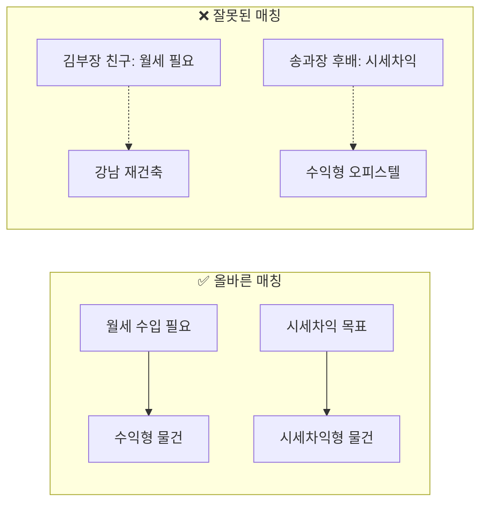
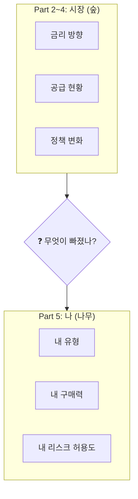
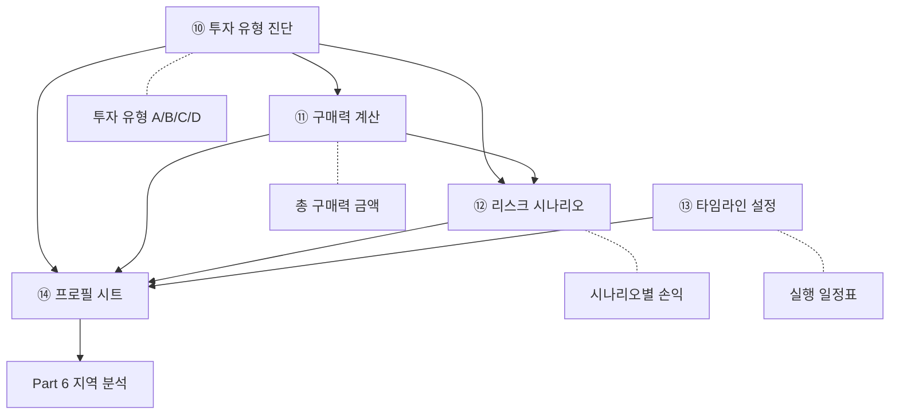
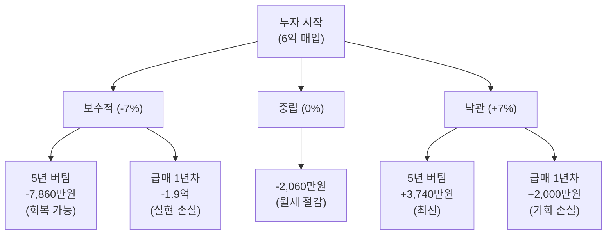
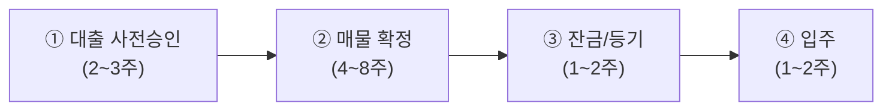
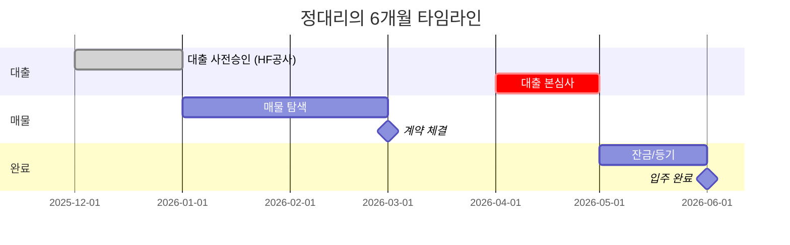

# Part 5: 나에게 맞는 투자 전략 찾기

> **Part 5 핵심 메시지**: 시장을 아무리 잘 분석해도, '나'를 모르면 투자는 실패한다.

---

## 착각 1: "시장 분석 끝났으니 바로 사면 돼"

토요일 오후, 강남의 한 카페.

세 사람이 노트북을 펼치고 앉아 있었습니다. 정대리, 송과장, 그리고 김부장.

정대리가 의기양양하게 노트북을 닫으며 말했습니다.

"송과장님, 저 이제 시장 분석 다 했어요! Part 2부터 4까지 열심히 따라왔거든요."

송과장이 커피를 내려놓으며 물었습니다.

"그래? 뭘 알게 됐는데?"

정대리가 손가락을 꼽았습니다.

"금리 내려가고 있고요, 공급도 부족하고요, 정책도 완화되는 분위기잖아요. **지금이 사야 할 타이밍 아니에요?**"

정대리는 속으로 계산을 해봤습니다.
'금리가 3.5%까지 떨어졌다고 했으니... 1년 전 5%일 때보다 이자 부담이 30%나 줄었잖아? 공급도 앞으로 3년간 부족하다고 했고. 지금 안 사면 진짜 놓치는 거 아냐?'

김부장이 옆에서 끼어들었습니다.

"나도 뉴스에서 봤어. 강남이 또 올랐다더라, GTX 뚫린다고 동탄이 불타고 있다더라..."

정대리 눈이 반짝였습니다.

"맞아요! 그래서 저도 **동탄** 알아보려고요. 지금 안 사면 또 놓칠 것 같아서..."

송과장이 피식 웃었습니다.

"잠깐. 정대리, 동탄역 앞 신축 84㎡가 지금 얼마인지 알아?"

---

### 반전: "15억이야"

"한 8억? 9억?"

정대리가 자신 있게 대답했습니다.

송과장이 스마트폰을 꺼내 화면을 보여줬습니다.

"**15억 2천.**"

정대리의 얼굴이 굳었습니다.

"...네?"

"동탄역 롯데캐슬, 전용 84. 최근 실거래가야. 정대리 현금이 얼마라고 했지?"

"본인 저축 3천에 배우자 2천, 부모님 지원 2억 해서 총 2.5억이요."

정대리의 머릿속이 복잡해졌습니다.
'15억이라고? 내 예상보다 2배나 높잖아... 2.5억으로 15억짜리를 살 수 있는 건가?'

송과장이 냅킨을 꺼내 펜으로 계산하기 시작했습니다.

"2025년 10월 15일 대책 이후 LTV 40%야. 15억짜리 집 사려면..."

**동탄역 롯데캐슬 84㎡ 구매 시뮬레이션**

| 항목 | 금액 |
|------|------|
| 집값 | 15억 |
| 대출 한도 | 15억 × 40% = 6억 |
| 정대리 현금 | 2.5억 |
| **총 가용액** | 6억 + 2.5억 = **8.5억** |
| **부족 금액** | 15억 - 8.5억 = ❌ **6.5억 부족** |

정대리가 멍하니 물었습니다.

"그러면... 동탄은 못 사는 거예요?"

김부장이 어깨를 토닥였습니다.

"나도 똑같은 실수 했어. 강남 재건축이 좋다길래 알아봤더니, 내 현금 5억으론 어림도 없더라고."

---

### 💡 왜 이런 일이 생길까?

**핵심 문제**: 시장 분석(Part 2~4)은 "어디가 좋은가"를 알려주지만, "내가 살 수 있는가"는 알려주지 않습니다.

| 분석 유형 | 알려주는 것 | 알려주지 않는 것 |
|----------|------------|----------------|
| **시장 분석** (Part 2~4) | 금리 방향, 공급 현황, 정책 변화 | 내 대출 한도, 내 구매력 |
| **자기 분석** (Part 5) | 내 투자 유형, 내 구매력, 내 리스크 허용도 | - |

동탄이 아무리 좋아도, **내가 살 수 없으면 의미가 없습니다.**

많은 초보 투자자들이 이 순서를 뒤바꿉니다:
- ❌ 잘못된 순서: 좋은 지역 찾기 → 내가 살 수 있나 확인
- ✅ 올바른 순서: 내가 살 수 있는 범위 확인 → 그 안에서 좋은 지역 찾기

---

## 착각 2: "그럼 싼 데 찾으면 되지"

정대리가 고개를 들었습니다.

"그럼 싼 데 찾으면 되는 거 아니에요? 제 예산에 맞는 곳이요."

송과장이 고개를 저었습니다.

"그게 두 번째 착각이야."

김부장이 손을 들었습니다.

"잠깐, 내 친구 얘기 해도 돼?"

---

### 김부장 친구의 실패담: "목적과 물건의 불일치"

김부장이 한숨을 쉬며 말했습니다.

"내 친구가 나처럼 퇴직했거든. 월세 받아서 생활비 충당하려고 투자할 곳을 찾았어."

정대리가 물었습니다.

"어디 샀어요?"

"'강남 재건축이 대박'이라는 말에 혹해서 **전 재산을 집어넣었어**. 잠실 재건축 조합원 입주권."

송과장이 고개를 끄덕였습니다.

"시세차익은 기대할 수 있겠네요."

김부장이 쓴웃음을 지었습니다.

"그게 문제야. 매달 **이자만 150만원**씩 나가. 월세? **0원**. 전세 세입자가 살고 있거든."

김부장의 표정이 어두워졌습니다.

---

**[2년 전, 김부장 친구의 집]**

"야, 나 이번에 잠실 재건축 샀어!"

김부장 친구는 의기양양했습니다. 뉴스에서 '강남권 재건축 대박'이라는 말이 매일 나오던 시절이었죠.

"좋은 거 아니야? 잠실이면 무조건 오르잖아."

"그치? 퇴직금 4억에 대출 8억 받아서 12억에 계약했어."

하지만 6개월 후...

"야, 요즘 어때?"

"...이자가 150만원이야. 월세는 0원이고."

"뭐? 전세 놔서 월세가 없다고?"

"세입자가 전세 살고 있으니까... 그리고 이자가 생각보다 너무 많이 나가."

1년 후, 그 친구는 결국 급매로 팔았습니다. 시세보다 1억 싸게.

---

정대리가 깜짝 놀랐습니다.

"5년 뒤에 오르면 대박이겠지만..."

"그 5년을 어떻게 버텨? 퇴직자가 매달 150만원씩 **마이너스**인데."

송과장이 냅킨에 표를 그렸습니다.

| 항목 | 김부장 친구 상황 | 현실 |
|------|-----------------|------|
| **투자 목적** | 은퇴 후 **월세 수입** | 필요: 월 200만원 |
| **산 물건** | 강남 재건축 (시세차익형) | 월세: **0원** |
| **현금흐름** | 매달 **-150만원** | 적자 상태 |
| **버틸 수 있는 기간** | 2년 | 퇴직금 고갈 |
| **결과** | 급매로 손절 | **계획 실패** |

"이 친구가 놓친 게 뭐야?"

김부장이 대답했습니다.

"자기한테 맞는 물건을 안 샀네... **시세차익형** 물건을 샀는데, 정작 필요한 건 **월세**였으니까."

---

### 핵심 교훈: 투자 목적과 물건 유형의 일치

**투자 목적 ↔ 물건 유형 매칭**



| 투자 목적 | 맞는 물건 | 잘못된 선택 예시 |
|----------|----------|-----------------|
| 월세 수입 필요 | 수익형 (오피스텔, 상가) | 김부장 친구 → 강남 재건축 ❌ |
| 시세차익 목표 | 시세차익형 (재건축, 입지) | 송과장 후배 → 수익형 오피스텔 ❌ |

---

### 송과장 후배의 실패담: "반대로 잘못 산 케이스"

정대리가 조심스럽게 물었습니다.

"반대 케이스도 있어요?"

송과장이 고개를 끄덕였습니다.

"내 후배 중에 **시세차익을 노리는 애**가 있었어. 5년 안에 자산 2배 만들겠다고."

"뭘 샀어요?"

"'월세 나오니까 안전하다'면서 **수익형 오피스텔**을 샀어."

송과장이 잠시 말을 멈추고 커피를 마셨습니다.

---

**[3년 전, 송과장 후배의 투자]**

"과장님, 저 이번에 오피스텔 샀어요!"

"오? 뭐 목표로?"

"5년 안에 자산 2배요! 근데 월세도 나오니까 안전하잖아요."

송과장은 뭔가 잘못됐다는 걸 느꼈습니다.

'시세차익이 목표인데 오피스텔을...?'

3년 후, 그 후배가 말했습니다.

"과장님, 저 3년 동안 주변 아파트는 다 올랐는데... 제 오피스텔만 제자리예요."

"그래서 내가 그때 말했잖아. 오피스텔은 시세차익 잘 안 난다고."

"아... 그때 그 말이 이 뜻이었군요."

---

정대리가 고개를 갸웃거렸습니다.

"그것도 나쁘진 않잖아요? 월세 받으면서 기다리는 거..."

송과장이 한숨을 쉬었습니다.

"3년 동안 상승장이었어. **주변 아파트는 다 올랐는데**, 그 오피스텔만 **제자리**야."

| 항목 | 송과장 후배 상황 | 현실 |
|------|-----------------|------|
| **투자 목적** | 3년 내 **시세차익** | 자산 2배 목표 |
| **산 물건** | 수익형 오피스텔 | 월세 100만원 |
| **시세 변동** | 3년간 **0%** | 주변 아파트 +30% |
| **기회비용** | 아파트 샀으면 +30% | **1.5억 손해** |
| **결과** | 자산 증식 실패 | 상승장 놓침 |

정대리가 이해한 표정으로 말했습니다.

"아... **목표에 맞는 물건**을 사야 하는 거군요."

송과장이 손가락을 세웠습니다.

"정확해. **김부장 친구**: 월세가 필요한데 시세차익형 샀다가 실패. **내 후배**: 시세차익이 목표인데 수익형 샀다가 상승장 놓침."

김부장이 고개를 끄덕였습니다.

"**투자 유형과 물건이 안 맞으면** 시장이 좋아도 망하는 거구나."

---

### 💡 두 실패 사례의 공통점

| 구분 | 김부장 친구 | 송과장 후배 |
|------|-----------|-----------|
| **실제 목적** | 월세 현금흐름 | 시세차익 |
| **산 물건** | 시세차익형 (재건축) | 수익형 (오피스텔) |
| **결과** | 현금흐름 적자 | 상승장 놓침 |
| **핵심 실수** | 목적 ≠ 물건 | 목적 ≠ 물건 |

**공통 교훈**: "좋은 물건"은 없습니다. **"나에게 맞는 물건"**만 있을 뿐입니다.

---

## 해결: Part 5에서 '나'를 분석한다

### 숲(시장)과 나무(나)

송과장이 정리했습니다.

**투자 분석의 두 축**



"Part 2부터 4까지는 **숲**을 봤어. 금리, 공급, 정책... 큰 그림이지. 근데 정대리가 빠뜨린 게 있어."

정대리가 물었습니다.

"뭔데요?"

"**아무리 시장이 좋아도, 내가 살 수 있는 범위를 모르면 의미 없어.**"

김부장이 끼어들었습니다.

"그래서 내 친구가 망한 거구나. 시장은 좋았는데, 자기한테 안 맞는 물건을 샀으니까."

송과장이 고개를 끄덕였습니다.

"정대리가 지금 알아야 할 건 '동탄이 오를까?'가 아니야."

정대리가 물었습니다.

"그럼 뭘 알아야 해요?"

---

### 4가지 핵심 질문

송과장이 손가락을 꼽았습니다.

"**첫째**, 나는 어떤 투자자인가?"

김부장이 대답했습니다.

"나는 월세 받는 유형이겠네."

김부장은 속으로 생각했습니다.
'퇴직 후에 매달 들어오는 돈이 필요해. 5년 뒤 시세차익은 의미 없어. 지금 당장 현금흐름이 중요하지.'

"**둘째**, 나는 얼마까지 살 수 있는가?"

정대리가 고개를 숙였습니다.

"그걸 몰라서 동탄 15억 들이댔죠..."

정대리는 창피한 기분이 들었습니다.
'LTV가 40%인 줄도 몰랐어. 대출이 6억밖에 안 나오는데 15억짜리를 알아보다니...'

"**셋째**, 어떤 리스크를 감당할 수 있는가?"

김부장이 말했습니다.

"나는 퇴직자라 리스크 못 져. 안정적인 게 좋아."

"**넷째**, 언제까지 결정해야 하는가?"

정대리가 손을 들었습니다.

"저는 6개월이요! 결혼식 전에 신혼집 구해야 해요."

송과장이 정리했습니다.

"이 4가지 질문에 답하면, 비로소 **내가 볼 지역**이 보이기 시작해."

---

### 💡 잠깐, 퀴즈 하나!

**Q. 정대리(맞벌이 연소득 1.15억, 현금 2.5억)의 최대 구매력은?**

- A) 2.5억 (현금만)
- B) 4억
- C) 6억
- D) 6.5억 이상

대부분 **C나 D**를 고릅니다.

하지만 정답은 **상황에 따라 다릅니다**.

**같은 현금 2.5억인데, 조건에 따라 구매력이 달라집니다**

| 조건 | 대출 한도 | 총 구매력 |
|------|----------|----------|
| **조건 1**: 규제지역 2주택자 | 0원 (대출 불가) | 2.5억 → 정답 A |
| **조건 2**: 무주택 + 일반 주담대 | 약 1.7억 (LTV 40% 역산) | 약 4.2억 → 정답 B |
| **조건 3**: 무주택 + 생애최초 (혼인신고 전 보금자리론) | 4.2억 (LTV 70%, 주택가격 6억 한도) | 6억 → 정답 C |
| **조건 4**: 무주택 + 은행 생애최초 (혼인신고 후) | 약 4억 (LTV 70%, DSR 40% 제약) | 약 6~6.5억 → 정답 D |

**이 차이를 만드는 게 Part 5입니다.**

같은 현금 2.5억인데, 내 조건에 따라 구매력이 **2.5억~6.5억**까지 달라집니다.

정대리가 깜짝 놀랐습니다.

"와... 4억이나 차이가 나네요? 같은 돈인데?"

송과장이 고개를 끄덕였습니다.

"그래서 **'나'를 아는 것**이 중요해. Part 5에서 이걸 계산할 거야."

---

## 세 명의 러닝메이트

송과장이 노트를 꺼냈습니다.

"Part 5는 세 명이 함께 진행할 거야. 각자 다른 상황, 다른 목표를 가진 사람들이지."

---

### 김부장 (53세, A유형 - 안정형 수익 추구)

김부장이 먼저 말했습니다.

"나는 대기업에서 30년 다니다 **명퇴**했어요."

정대리가 물었습니다.

"자산은요?"

"송파구에 15억짜리 집 있고, **퇴직금 5억**이 있습니다."

김부장은 퇴직 후의 현실을 설명했습니다.

"퇴직하니까 달라진 게 뭔지 알아? **매달 들어오던 월급이 0원**이 됐어. 30년 동안 매달 500만원씩 들어오던 게 갑자기 사라지니까... 무섭더라고."

송과장이 물었습니다.

"투자 목표는요?"

김부장이 손을 모았습니다.

"매달 **월 200만원** 현금흐름이 목표예요. 대출 없이, 안정적으로. 퇴직자라 리스크는 못 져요."

정대리가 고개를 끄덕였습니다.

'아, 김부장님은 시세차익보다 **지금 당장 현금이 필요**한 거구나.'

> **김부장 프로필**
> - **나이**: 53세 (퇴직 예정)
> - **보유 자산**: 송파구 아파트 15억 + 퇴직금 5억
> - **투자 목표**: 월 200만원 현금흐름
> - **리스크 허용도**: 매우 낮음 (대출 불가)
> - **키워드**: 월세 수입, 임대수익률 5%↑, 공실률↓, 안정성

---

### 송과장 (38세, B유형 - 레버리지 성장형)

송과장이 자기 차례를 받았습니다.

"저는 IT 기업 8년차 개발자예요."

김부장이 물었습니다.

"자산 상황은?"

"마포에 **실거주 12억**, 광명에 **투자용 7억** 해서 2채 있어요."

정대리가 물었습니다.

"목표가 뭐예요?"

"**3호기**로 시세차익 노리고 있어요. 5년 내 자산 2배가 목표인데..."

송과장이 한숨을 쉬었습니다.

"**2주택자라 대출이 막혀서** 고민이에요."

정대리가 놀랐습니다.

"대출이 안 나와요?"

"규제지역 다주택자는 LTV 0%야. 현금 4억으로만 승부해야 해."

송과장은 속으로 계산했습니다.
'대출 없이 4억으로 살 수 있는 곳... 비규제지역이거나, 전세 끼고 갭투자하거나. 선택지가 제한적이네.'

> **송과장 프로필**
> - **나이**: 38세 (대기업 과장)
> - **보유 자산**: 마포 12억 + 광명 7억 (2채)
> - **투자 목표**: 5년 내 자산 2배 (시세차익)
> - **리스크 허용도**: 높음 (레버리지 적극 활용)
> - **제약 조건**: 다주택자 규제 (LTV 0%)
> - **키워드**: 시세차익, 전세가율↑, 개발호재, 레버리지 최대화

---

### 정대리 (31세, C유형 - 실거주 + 자산화형)

정대리가 손을 들었습니다.

"저는 31세, **무주택**이에요."

송과장이 물었습니다.

"재정 상황은?"

"현금 2.5억에 부모님 지원 1.3억, 맞벌이 연소득 1.15억이에요."

김부장이 물었습니다.

"목표는?"

"**6개월 안에 신혼집** 구해야 해요. 근데 집값도 오르면 좋겠고..."

정대리는 복잡한 심경을 털어놓았습니다.

"사실 제일 어려운 게 **실거주와 투자 사이**에서 고민하는 거예요. 살 집이 필요하긴 한데, 그냥 사기엔 너무 비싸고... 그렇다고 싼 데 가자니 출퇴근이 2시간이고..."

송과장이 웃었습니다.

"그게 C유형이야. 실거주가 우선인데, 자산 증식도 챙기는 거지."

> **정대리 프로필**
> - **나이**: 31세 (신혼 예정)
> - **보유 자산**: 현금 2.5억 (본인 0.3억 + 배우자 0.2억 + 부모님 2억)
> - **연소득**: 1.15억 (맞벌이, 부부합산)
> - **투자 목표**: 6개월 내 신혼집 + 장기 자산 증식
> - **리스크 허용도**: 중간 (안정적 상환 우선)
> - **키워드**: 실거주, 학군, 교통, 장기 자산 증식

---

### 3인 비교표: 같은 "투자"인데 이렇게 다르다

| 항목 | 김부장 (A유형) | 송과장 (B유형) | 정대리 (C유형) |
|------|--------------|--------------|--------------|
| **나이** | 53세 | 38세 | 31세 |
| **보유 주택** | 1채 | 2채 | 0채 |
| **현금** | 5억 | 4억 | 2.5억 |
| **연소득** | 3,500만 (배우자) | 8,500만 | 1.15억 (부부합산) |
| **투자 목표** | 월세 200만원 | 자산 2배 | 신혼집 + 자산 |
| **시간 제약** | 1년 | 6개월 | **3개월** |
| **리스크 허용** | 매우 낮음 | 높음 | 중간 |
| **대출 가능** | ✅ (1주택자) | ❌ (다주택 규제) | ✅ (생애최초) |

송과장이 말했습니다.

"모든 실습에서 세 명 결과를 비교할 거야. **같은 프롬프트인데 결과가 다 달라.** 그게 '나를 아는 것'의 힘이야."

---

## Part 5 워크플로우

정대리가 물었습니다.

"5개 실습이 서로 연결돼 있다고 했는데, 어떻게요?"

송과장이 다이어그램을 그렸습니다.

**Part 5 워크플로우**



| 실습 | 내용 | 산출물 |
|------|------|--------|
| **⑩** | 투자 유형, 재무 정보, 리스크 허용도 분석 | 투자 유형 (A/B/C/D) |
| **⑪** | 대출 한도, 총 자금력 계산 | 총 구매력 금액 |
| **⑫** | 낙관/중립/보수 시나리오 | 시나리오별 손익 + 대응전략 |
| **⑬** | 투자 일정 수립 | 실행 일정표 |
| **⑭** | 모든 결과 종합 | Part 6 지역 분석의 입력값 |

"실습 ⑩에서 나온 재무 정보가 ⑪의 입력값이 돼. ⑪에서 나온 구매력이 ⑫의 입력값이 되고. 그래서 **순서대로 해야 해**. 건너뛰면 다음 실습이 제대로 안 돌아가."

정대리가 물었습니다.

"왜 순서대로 해야 해요? 구매력부터 계산하면 안 돼요?"

송과장이 고개를 저었습니다.

"투자 유형을 모르면 구매력 계산이 달라져. 예를 들어 김부장님은 대출 안 쓰려고 하잖아. 그러면 구매력 계산 자체가 달라지거든."

---

### 페르소나별 예상 결과

| 실습 | 질문 | 김부장 예상 | 송과장 예상 | 정대리 예상 |
|------|------|-----------|-----------|-----------|
| ⑩ 투자유형 | 어떤 투자 스타일? | **A유형** (안정) | **B유형** (레버리지) | **C유형** (실거주) |
| ⑪ 구매력 | 얼마까지 가능? | **5억** (현금 Only) | **4억** (규제) | **6~6.5억** (생애최초) |
| ⑫ 리스크 | 최악의 시나리오? | -10% 하락 감당 | -20% 하락 위험 | 전세가 하락 위험 |
| ⑬ 타임라인 | 언제까지? | 1년 내 | 6개월 내 | **3개월 내** |
| ⑭ 프로필 시트 | 종합 정리 | 수익형 물건 탐색 | 시세차익형 물건 탐색 | 실거주+자산화 물건 |

김부장이 물었습니다.

"Part 5를 다 하면 뭘 알 수 있어?"

송과장이 대답했습니다.

"**Part 6에서 볼 지역의 기준**이 생겨요. 예를 들어 정대리가 구매력 6.5억이라는 걸 알면, 15억짜리 동탄은 처음부터 제외되죠. 대신 **6억대에서 살 수 있는 지역**을 찾게 돼요."

정대리가 이해한 표정으로 말했습니다.

"아... 그래서 시장 분석 전에 **나를 먼저 분석**해야 하는 거군요."

"정확해. Part 5가 끝나면 정대리는 이런 문장을 말할 수 있을 거야."

송과장이 적었습니다.

> **Part 5 완료 후 정대리가 말할 수 있는 문장**
>
> *"나는 C유형(실거주+자산화형)이고,*
> *총 구매력 6.5억이며,*
> *보수적 시나리오에서도 월 상환 180만원을 감당할 수 있고,*
> *6개월 내 매수가 목표다.*
>
> *따라서 6억대 초반에서 신축 30평대를 찾아야 한다."*

정대리 눈이 반짝였습니다.

"저렇게 구체적으로 나와요?"

"응. 실습을 하나씩 따라가면 자연스럽게 나와."

---

## 준비 체크

송과장이 세 사람을 둘러봤습니다.

"Part 5 시작하기 전에 확인할 게 있어."

| 확인 항목 | 김부장 | 송과장 | 정대리 |
|----------|--------|--------|--------|
| 대략적인 연소득 | 배우자 3,500만 | 8,500만 | 1.15억 (맞벌이) |
| 투자 가용 현금 | 5억 | 4억 | 2.5억 (지원 포함) |
| 보유 주택 수 | 1채 | 2채 | 0채 |
| 기존 대출 | 없음 | 3억 | 없음 |
| 목표 기한 | 1년 | 6개월 | 3개월 |

김부장이 물었습니다.

"정확한 숫자 몰라도 돼?"

송과장이 고개를 끄덕였습니다.

"**'대략 이 정도'면 충분해.** 프롬프트에 넣으면 AI가 범위로 계산해줘."

---

### ✅ Part 5 시작 전 체크리스트

다음 항목을 알고 있으면 Part 5를 시작할 준비가 된 것입니다:

- [ ] 대략적인 연소득 (본인 + 배우자)
- [ ] 투자에 쓸 수 있는 현금 (부모님 지원 포함)
- [ ] 현재 보유 주택 수
- [ ] 기존 대출 잔액 (있다면)
- [ ] 언제까지 결정해야 하는지 (목표 기한)

**하나라도 모르겠다면?** 걱정하지 마세요. 실습 ⑩에서 AI와 대화하며 정리할 수 있습니다.

---

정대리가 주먹을 쥐며 말했습니다.

"저 준비됐어요!"

김부장도 고개를 끄덕였습니다.

"나도. 월세 현금흐름 만들어야지."

송과장이 일어서며 말했습니다.

"좋아. 그럼 **실습 ⑩: 투자 유형 진단**부터 시작하자."

---

## Part 5 핵심 정리

> **Part 5 목표**: '시장'이 아닌 **'나'**를 분석해서, Part 6 지역 분석의 기준을 만든다.

| 질문 | 실습 | 결과물 |
|------|------|--------|
| 나는 어떤 투자자인가? | ⑩ 투자 유형 진단 | 투자 유형 (A/B/C/D) |
| 나는 얼마까지 살 수 있는가? | ⑪ 구매력 계산 | 총 구매력 금액 |
| 어떤 리스크를 감당할 수 있는가? | ⑫ 리스크 시나리오 | 3가지 시나리오별 손익 |
| 언제까지 결정해야 하는가? | ⑬ 타임라인 설정 | 월별 실행 일정표 |
| 종합 정리 | ⑭ 투자 프로필 시트 | 1페이지 요약 |

---

### 💡 Part 5를 마치면 달라지는 것

| Before (Part 5 전) | After (Part 5 후) |
|-------------------|------------------|
| "동탄이 좋대요!" | "내 구매력은 6.5억이니까 동탄은 안 돼" |
| "강남 재건축 사고 싶어요" | "A유형이라 월세 나오는 물건이 필요해" |
| "언제 사야 하죠?" | "3개월 내로 결정해야 하니까 빠르게 움직여야 해" |
| "리스크가 걱정돼요" | "최악의 경우 -20%까지 감당 가능" |


---


# 실습 ⑩: 나의 투자 유형 진단

---

## 왜 필요한가?

### 세 사람의 서로 다른 "정답"

"부동산 투자 잘 하는 법이 뭐예요?"

토요일 오후, 강남의 한 카페에서 정대리가 기대감 가득한 표정으로 물었습니다. 3개월 뒤 결혼을 앞둔 31세, 무주택자. 신혼집이 절실했습니다.

송과장이 커피를 한 모금 마시며 자신 있게 대답했습니다.

"전세가율 높은 데서 갭투자하는 거지. 대출 끼고 레버리지 극대화."

송과장은 IT 기업 8년차 개발자로, 이미 2채를 보유한 투자 경험자였습니다. 연봉 8,500만원의 안정적인 월급이 있으니 공격적인 투자가 가능했죠.

김부장이 고개를 저었습니다.

"아니야. 나는 월세 잘 나오는 수익형 물건이 좋더라고. 매달 현금 들어와야 생활이 되니까."

대기업에서 30년 근무하다 명퇴한 김부장. 53세. 더 이상 월급은 없지만 퇴직금 5억원이 있었습니다. 그에게 필요한 건 **매달 들어오는 현금**이었습니다.

정대리가 혼란스러운 표정으로 두 사람을 번갈아 봤습니다.

"두 분 말이 완전히 다른데... 누가 맞는 거예요?"

정대리는 속으로 생각했습니다.
'유튜브에서는 다들 자기 방법이 최고라고 하던데... 송과장님 방법? 김부장님 방법? 도대체 누구 말이 맞는 거야?'

송과장이 웃으며 대답했습니다.

"**둘 다 맞아.**"

---

## 착각: "부동산 투자 정답은 하나다"

정대리가 당황한 표정으로 되물었습니다.

"둘 다 맞다니요? 유튜브에서는 다들 자기 방법이 최고라고 하던데요."

김부장이 손을 저었습니다.

"그게 바로 초보자들이 가장 많이 하는 착각이야. **'부동산 투자 정답은 하나다'**라는 생각."

송과장이 덧붙였습니다.

"유튜브 보면 어떤 사람은 '갭투자가 최고'라고 하고, 어떤 사람은 '수익형이 최고'라고 하잖아. 근데 왜 둘 다 성공한 투자자일까?"

정대리가 고개를 갸웃했습니다.

"그러게요... 왜죠?"

"**각자 상황이 다르기 때문이야.** 그 사람한테 맞는 방법이 나한테도 맞을 거란 보장이 없어."

---

### 💡 왜 "정답은 하나다"가 착각인가?

부동산 투자에서 "정답"이 하나라면, 모든 투자자가 같은 물건을 사야 합니다. 하지만 현실은 다릅니다.

**같은 10억짜리 물건을 봐도...**

> **김부장** (퇴직자, 월세 필요)
> "월세가 200만원 나오면 좋겠는데... 전세가 껴있네? 탈락."

> **송과장** (직장인, 시세차익 목표)
> "전세가율 80%? 내 돈 2억만 있으면 10억 집 살 수 있네! 합격."

> **정대리** (신혼부부, 실거주 목적)
> "학군이 어때? 학원가까지 버스 30분? 음... 애매하네."

**똑같은 물건인데 평가가 다릅니다.** 왜냐하면 각자의 **"필요"가 다르기 때문**입니다.

---

## 반전: "투자법보다 '나'가 먼저다"

김부장이 자기 상황을 이야기했습니다.

"나는 곧 퇴직이야. 월급이 없어지면 매달 들어오는 월세가 생활비거든."

김부장은 30년간 월급에 익숙했습니다. 매달 850만원씩 통장에 들어오던 돈이 0원이 되는 충격. 퇴직 후 처음 3개월은 불안해서 잠도 못 잤다고 합니다.

정대리가 끄덕였습니다.

"아, 그래서 수익형이..."

"맞아. 시세차익? 5년 뒤에 오르든 말든 상관없어. **지금 당장 현금흐름이 필요해.**"

송과장이 따라 말했습니다.

"나는 연봉이 8천5백이야. 월급이 있으니까 당장 월세가 필요 없어."

송과장은 잠시 계산을 했습니다.
'세전 월급이 700만원 가까이니까 실수령은 580만원 정도... 월세 100만원? 200만원? 그게 내 삶을 바꾸진 않아. 하지만 5년 뒤 자산이 2배가 되면? 그건 인생이 바뀌는 거지.'

"대신 3~5년 뒤 **시세차익을 노려서 자산을 불리려는 거지**."

정대리가 깨달은 표정을 지었습니다.

"아... **상황이 다르니까 전략이 다른 거군요.**"

송과장이 고개를 끄덕였습니다.

"그래서 투자법을 배우기 전에 '내가 어떤 투자자인지'부터 알아야 해. 순서가 바뀌면 이런 일이 벌어져."

---

## 자신을 모르고 투자하면: 두 가지 실패 사례

### 실패 사례 1: 김부장 친구의 "강남 재건축 함정"

김부장이 한숨을 쉬었습니다.

"내 친구 이야기 해줄까? 나처럼 은퇴를 앞뒀는데, '강남 재건축이 대박이다'라는 말만 듣고 시세차익형 물건을 샀어."

정대리가 물었습니다.

"결과가 어떻게 됐어요?"

"**매달 적자야.**"

김부장의 표정이 어두워졌습니다.

---

**[2년 전, 김부장 친구 박씨의 투자]**

"야, 나 이번에 잠실 재건축 샀어!"

박씨는 퇴직금 4억원에 대출 8억원을 더해 12억원짜리 재건축 입주권을 샀습니다. 당시 뉴스에선 매일 "강남권 재건축 대박"이라는 기사가 쏟아지던 때였죠.

"우와, 잠실이면 무조건 오르지 않아?"

"그치? 5년 뒤에 2배 될 거야!"

하지만 6개월 후...

"야, 요즘 어때?"

"...이자가 매달 150만원이야. 월세는 0원이고."

"뭐? 전세 세입자가 있어서?"

"응. 그리고 금리가 올라서 이자 부담이 커졌어."

박씨는 매달 150만원씩 적자였습니다. 퇴직금에서 매달 150만원씩 빠져나가는 걸 지켜보는 기분이 어땠을까요?

1년 후, 더 이상 버틸 수 없어서 급매로 팔았습니다. 시세보다 1억 싸게.

---

김부장이 쓴웃음을 지었습니다.

"월세가 필요한 사람이 시세차익형 물건을 사니까, 매달 적자가 나는 거야. 5년 뒤 시세가 올라도 **그 5년을 어떻게 버텨?**"

| 항목 | 박씨의 상황 | 현실 |
|------|-------------|------|
| **실제로 필요한 것** | 은퇴 후 월세 수입 | 매달 200만원 필요 |
| **산 물건** | 강남 재건축 (시세차익형) | 월세 0원 (전세 세입자) |
| **이자 부담** | 대출 8억 × 연 5% | 매달 **330만원** |
| **현금흐름** | 월세 0원 - 이자 330만원 | **-330만원/월** |
| **버틸 수 있는 기간** | 퇴직금 4억 기준 | 약 12개월 |
| **결과** | 1년 만에 급매 | **1억 손실** |

정대리가 충격받은 표정으로 물었습니다.

"1억 손해를 보면서도 팔아야 했어요?"

"**안 팔면 매달 330만원씩 적자가 계속 나니까.** 1년이면 4천만원, 2년이면 8천만원 손해야. 차라리 1억 손해보고 빠져나오는 게 나았던 거지."

---

### 실패 사례 2: 송과장 후배의 "수익형 오피스텔 함정"

정대리가 긴장한 표정으로 물었습니다.

"반대 케이스도 있나요?"

송과장이 대답했습니다.

"내 후배 중에 시세차익을 원하는데 '월세 나오니까 좋다'며 **수익형 오피스텔**을 산 애가 있어."

---

**[3년 전, 송과장 후배 이군의 투자]**

"과장님, 저 이번에 강남 오피스텔 샀어요! 3억짜리요."

"오? 뭐 목표로?"

"5년 안에 자산 2배요! 근데 월세도 100만원 나오니까 안전하잖아요."

송과장은 뭔가 잘못됐다는 걸 느꼈습니다.

'시세차익이 목표인데 오피스텔을...? 오피스텔은 시세차익이 거의 안 나는데...'

하지만 이미 계약한 뒤였습니다.

3년 후, 이군이 한숨을 쉬며 말했습니다.

"과장님, 3년 동안 주변 아파트는 다 올랐는데... 제 오피스텔만 제자리예요."

"그래서 내가 그때 말했잖아. 오피스텔은 시세차익 잘 안 난다고."

"아... 그때 그 말이 이 뜻이었군요."

---

| 항목 | 이군의 상황 | 현실 |
|------|-------------|------|
| **실제로 원한 것** | 5년 내 자산 2배 | 시세차익 목표 |
| **산 물건** | 강남 수익형 오피스텔 | 월세 100만원 |
| **3년간 시세 변동** | 오피스텔: **0%** | 주변 아파트: **+35%** |
| **기회비용** | 3억으로 아파트 샀으면 | 1억 시세차익 가능 |
| **결과** | 목표 달성 실패 | 상승장 놓침 |

"상승장이 왔는데 이 친구 물건만 안 올랐어. **주변 아파트는 다 올랐는데.**"

정대리가 한숨을 쉬었습니다.

"둘 다 **'자기 유형에 안 맞는 물건'**을 산 거군요."

송과장이 손가락을 딱 튕겼습니다.

"정확해. 그래서 투자 전에 **'나는 어떤 유형인가'**부터 알아야 해."

---

### 💡 두 실패 사례의 공통점

| 구분 | 김부장 친구 박씨 | 송과장 후배 이군 |
|------|---------------|----------------|
| **실제 목적** | 월세 현금흐름 | 시세차익 |
| **산 물건** | 시세차익형 (재건축) | 수익형 (오피스텔) |
| **목적 ↔ 물건 일치** | ❌ 불일치 | ❌ 불일치 |
| **결과** | 현금흐름 적자 → 급매 | 상승장 놓침 → 기회비용 손실 |

**핵심 교훈**: "좋은 물건"은 없습니다. **"나에게 맞는 물건"**만 있을 뿐입니다.

**투자 목적 ↔ 물건 유형 매칭 원칙**

✅ **올바른 매칭**
- 월세 현금흐름 필요 → 수익형 물건 (오피스텔, 원룸, 상가)
- 시세차익 목표 → 시세차익형 물건 (아파트, 재건축, 입지)
- 실거주 + 자산화 → 실거주형 물건 (학군, 교통, 인프라)

❌ **잘못된 매칭**
- 월세 필요한데 재건축 사기 (김부장 친구)
- 시세차익 원하는데 오피스텔 사기 (송과장 후배)

---

## 해결: AI로 투자 유형 진단하기

정대리가 불안한 표정으로 물었습니다.

"저는 어떤 유형인지 어떻게 알 수 있어요?"

송과장이 스마트폰을 꺼냈습니다.

"지금부터 **AI한테 진단받아보자**. 5가지 질문에 답하면 네 유형이 나와."

정대리가 눈을 동그랗게 떴습니다.

"AI가 그런 것도 해줘요?"

"당연하지. 일단 4가지 유형부터 알아두자."

---

### 4가지 투자 유형 상세 설명

송과장이 테이블에 펜으로 표를 그렸습니다.

| 유형 | 명칭 | 핵심 목표 | 적합한 사람 | 주요 지표 |
|------|------|----------|------------|----------|
| **A** | 안정형 수익 추구 | 월세 현금흐름 | 퇴직자, 현금흐름 필요 | 임대수익률 5%↑ |
| **B** | 레버리지 성장형 | 시세차익 극대화 | 직장인, 자산 증식 목표 | 전세가율 70%↑ |
| **C** | 실거주 + 자산화형 | 거주 + 장기 증식 | 무주택자, 신혼부부 | 학군, 교통 |
| **D** | 포트폴리오 분산형 | 리스크 분산 | 다주택자, 분산 투자 | 지역/유형 다각화 |

김부장이 자신을 가리켰습니다.

"나는 **A 유형**이야. 월세 현금흐름이 생명이거든."

김부장은 속으로 계산했습니다.
'월 200만원이 필요해. 퇴직금 5억으로 수익률 5%짜리 물건을 사면... 5억 × 5% = 연 2,500만원, 월 208만원. 딱 맞네.'

송과장이 따라했습니다.

"나는 **B 유형**. 레버리지로 자산을 불리는 게 목표야."

송과장도 계산했습니다.
'현금 4억인데, 전세가율 80%면 4억으로 20억짜리 집을 살 수 있어. 5년 뒤 30% 오르면 6억 시세차익. 이게 레버리지의 힘이지.'

정대리가 조심스럽게 말했습니다.

"저는... 아직 모르겠어요. 실거주가 목적인데, 집값도 오르면 좋겠고..."

송과장이 웃었습니다.

"그게 **C 유형** 특징이야. 자, 직접 진단받아보자."

---

### 각 유형별 상세 특성

#### A유형: 안정형 수익 추구

**📌 핵심 목표**: 매달 현금흐름 확보

**✅ 적합한 사람**
- 퇴직자/은퇴 예정자
- 월급 외 추가 수입 필요
- 대출 부담 싫어함

**🎯 주요 지표**
- 임대수익률: 5% 이상 (수도권 평균 3.5%, KB부동산 2025.12)
- 공실률: 5% 미만 (전국 평균 8.2%, 한국부동산원 2025.11)
- 월세 안정성: 역세권, 대학가, 오피스 밀집 지역

**⚠️ 주의사항**
- 시세차익 기대 낮음
- 공실 리스크 관리 필수
- 세금(임대소득세) 고려

**💡 대표 물건**: 원룸, 오피스텔, 소형 아파트, 상가

#### B유형: 레버리지 성장형

**📌 핵심 목표**: 시세차익으로 자산 극대화

**✅ 적합한 사람**
- 안정적 월급 있는 직장인
- 3~5년 보유 가능
- 리스크 감수 가능

**🎯 주요 지표**
- 전세가율: 70% 이상 (갭투자 유효 기준)
- 개발호재: GTX, 신도시 등 착공~개통 2~3년 내
- 입지: 역세권, 재건축/재개발 예정

**⚠️ 주의사항**
- 역전세 리스크
- 금리 상승 시 이자 부담
- 다주택자 규제 (LTV 0%)

**💡 대표 물건**: 아파트, 재건축/재개발, 분양권

#### C유형: 실거주 + 자산화형

**📌 핵심 목표**: 살면서 자산도 증식

**✅ 적합한 사람**
- 무주택 신혼부부
- 자녀 교육 예정
- 5년 이상 장기 거주 계획

**🎯 주요 지표**
- 학군: 중위권 이상 (학업성취도 기준)
- 교통: 역세권 도보 10분 이내 (800m)
- 생활 인프라: 마트, 병원, 공원 도보권

**⚠️ 주의사항**
- 단기 시세차익 기대 낮음
- 이사 시 거래비용 발생
- 생애최초/보금자리론 조건 확인

**💡 대표 물건**: 중대형 아파트, 신축 브랜드 아파트

---

## 용어 정리: 이것만 알면 된다

정대리가 손을 들었습니다.

"잠깐요. 현금흐름, 레버리지... 이런 용어가 정확히 뭐예요?"

송과장이 하나씩 설명했습니다.

| 용어 | 뜻 | 예시 | 왜 중요한가? |
|------|-----|------|-------------|
| **현금흐름** | 매달 들어오는 실제 수입 | 월세 150만원 - 이자 50만원 = **100만원** | 퇴직자에게 생존 자금 |
| **시세차익** | 매수가와 매도가 차이 | 5억에 사서 7억에 팔면 **2억** | 자산 증식의 핵심 |
| **레버리지** | 대출을 활용한 투자 확대 | 내 돈 2억 + 대출 3억 = 5억 투자 | 수익률 극대화 |
| **리스크 허용도** | 원금 손실 감내 범위 | "10%까지 괜찮다" = 5억 중 5천만원 | 투자 유형 결정 기준 |
| **전세가율** | 매매가 대비 전세가 비율 | 매매 5억, 전세 3.5억 = **70%** | 갭투자 가능 여부 판단 |

---

### 💡 전세가율 쉽게 이해하기

정대리가 물었습니다.

"전세가율이 높으면 왜 좋은 거예요?"

송과장이 냅킨에 그림을 그렸습니다.

**전세가율에 따른 갭투자 레버리지 비교 (매매가 5억 기준)**

| 구분 | 전세가율 80% | 전세가율 60% |
|------|-------------|-------------|
| **전세금 (세입자 돈)** | 4억 (80%) | 3억 (60%) |
| **갭 (내 돈)** | **1억** (20%) | **2억** (40%) |
| **레버리지** | **5배** | **2.5배** |

> **핵심**: 전세가율이 20%p만 낮아져도 내 돈이 **2배** 더 필요합니다.
> B유형(레버리지형)이 전세가율을 중요하게 보는 이유입니다.

"전세가율이 20%p만 낮아져도 내 돈이 **2배** 더 필요해져. 그래서 B유형(레버리지형)은 전세가율을 중요하게 봐."

정대리가 고개를 끄덕였습니다.

"이제 이해됐어요. AI한테 물어보러 가요!"

---

## 투자 유형 진단 5가지 핵심 질문

> **이 질문들에 답하면 당신의 투자 유형이 결정됩니다.**

| # | 질문 | 유형 결정 영향 |
|---|------|---------------|
| 1 | 현재 보유 부동산이 있으신가요? | 무주택 → C형 가능성↑, 다주택 → B/D형 가능성↑ |
| 2 | 투자 가용 현금은 얼마인가요? | 5억+ 현금 Only → A형 가능성↑ |
| 3 | 월세 vs 시세차익 선호? | 월세 → **A형**, 시세차익 → **B형** |
| 4 | 원금 손실 감내 범위는? | 낮음(0-10%) → A/C형, 높음(20%+) → B형 |
| 5 | 예상 보유 기간은? | 단기(1-2년) → B형, 장기(5년+) → A/C형 |

---

## 💡 5분 자가 진단: 나의 투자 유형은?

> AI에게 질문하기 전에 먼저 스스로 점검해보세요.

| # | 질문 | 나의 답변 |
|---|------|----------|
| 1 | 매달 현금흐름(월세)이 꼭 필요하다 | □ 예 → A형 / □ 아니오 |
| 2 | 대출을 적극적으로 활용할 의향이 있다 | □ 예 → B형 / □ 아니오 |
| 3 | 내가 살 집이 필요하다 | □ 예 → C형 / □ 아니오 |
| 4 | 여러 유형의 물건에 분산 투자하고 싶다 | □ 예 → D형 / □ 아니오 |

**결과 해석**:
- 1번만 예 → **A형** (안정형 수익 추구)
- 2번만 예 → **B형** (레버리지 성장형)
- 3번만 예 → **C형** (실거주 + 자산화형)
- 4번 예 또는 2개 이상 예 → **D형** (포트폴리오 분산형)

---

## 준비물 체크리스트

송과장이 정대리에게 물었습니다.

"프롬프트 입력하기 전에 이 정보들 대략 떠올려봐. **정확한 숫자 아니어도 돼.**"

- [ ] **보유 부동산 현황**: 몇 채? 실거주/투자 용도? (없으면 "없음")
- [ ] **투자 가용 현금**: 본인 + 배우자 + 양가 지원금 포함
- [ ] **연소득**: 대략적인 금액 (정확하지 않아도 됨)
- [ ] **선호 수익 방식**: 월세 vs 시세차익
- [ ] **손실 감내 범위**: 원금의 몇 %까지?
- [ ] **예상 보유 기간**: 단기(1~2년) / 중기(3~5년) / 장기(5년↑)

정대리가 눈을 감고 잠시 생각했습니다.

'음... 부동산 없고, 현금은 2.5억 정도, 맞벌이 연소득 1.15억, 실거주인데 시세차익도 원하고...'

"좋아. 대략 정리됐으면 AI한테 물어보자."

---

## Step 1: AI 앱 열기

송과장이 정대리의 스마트폰을 가리켰습니다.

"평소 쓰는 AI 앱 열어봐. ChatGPT든 Claude든 Gemini든 상관없어."

정대리가 ChatGPT를 열었습니다.

"저는 ChatGPT 쓸게요. 그 다음엔요?"

"이 프롬프트를 그대로 복사해서 붙여넣어."

---

## Step 2: 프롬프트 입력하기

> 📋 **프롬프트**: 바로 아래 코드 블록 전체를 복사하세요.

```
당신은 **15년 경력의 부동산 투자 컨설턴트**입니다.

저의 투자 유형을 진단해주세요. 아래 5가지 질문을 **한 번에 하나씩** 순서대로 해주시고, 제 답변을 바탕으로 투자 유형을 분류해주세요.

---

## Phase 1: 정보 수집 (한 번에 하나씩 질문)

**질문 목록** (순서대로 하나씩):
1. "현재 보유 부동산이 있으신가요? 있다면 몇 채이고, 용도(실거주/투자)는 무엇인가요?"
2. "투자에 사용 가능한 현금은 대략 어느 정도이신가요?"
3. "월 현금흐름(월세 수입)과 시세차익 중 어느 쪽을 더 선호하시나요?"
4. "원금의 몇 %까지 손실을 감내하실 수 있으신가요? (예: 10%, 20%, 손실 불가)"
5. "투자 후 예상 보유 기간은 어느 정도이신가요? (단기 1~2년 / 중기 3~5년 / 장기 5년 이상)"

---

## Phase 2: 진단 유형

모든 답변을 수집한 후, 아래 4가지 유형 중 가장 적합한 유형을 진단해주세요:

| 유형 | 특징 | 핵심 지표 |
|------|------|----------|
| **A. 안정형 수익 추구** | 현금흐름 중시, 월세 수입 목표 | 임대수익률 5% 이상, 공실률 낮은 지역 |
| **B. 레버리지 성장형** | 시세차익 중시, 대출 활용 공격적 | 전세가율 70% 이상, 개발호재 |
| **C. 실거주 + 자산화형** | 거주 목적 + 장기 자산 증식 | 학군, 교통, 생활 인프라 |
| **D. 포트폴리오 분산형** | 여러 유형 분산 투자 | 지역/유형 다각화 |

---

## Phase 3: 출력 형식

모든 질문이 끝난 후 아래 형식으로 결과를 정리해주세요:

### 진단 결과

**투자 유형**: [A/B/C/D 중 하나]
**유형명**: [안정형 수익 추구 / 레버리지 성장형 / 실거주+자산화형 / 포트폴리오 분산형]

### 고객 프로필 요약
| 항목 | 답변 내용 |
|------|----------|
| 보유 부동산 | [수집 내용] |
| 투자 가용 현금 | [수집 내용] |
| 선호 수익 방식 | [수집 내용] |
| 리스크 허용도 | [수집 내용] |
| 예상 보유 기간 | [수집 내용] |

### 진단 근거
[왜 이 유형으로 진단했는지 2-3문장으로 설명]

### 추천 전략 방향
[이 유형에 적합한 투자 전략 방향 2-3가지]

### 주의사항
[이 유형의 주요 리스크와 주의점]

---

첫 번째 질문부터 시작해주세요.
```

---

### 💡 프롬프트 구조 이해하기

정대리가 물었습니다.

"근데 이 프롬프트 왜 이렇게 길어요?"

송과장이 하나씩 설명했습니다.

| 구성요소 | 역할 | 없으면 어떻게 되나? |
|----------|------|-------------------|
| **'15년 경력 컨설턴트'** | AI에게 전문가 관점 부여 | 일반적이고 피상적인 답변 |
| **'한 번에 하나씩'** | 대화형 진행 지시 | 5개 질문 한꺼번에 던짐 → 대화 단절 |
| **'Phase 2 표'** | 분류 기준 사전 제공 | AI가 임의로 분류 → 일관성 없음 |
| **'Phase 3 출력 형식'** | 결과 정리 포맷 지정 | 정리 안 된 산만한 답변 |

정대리가 감탄했습니다.

"와... 프롬프트 하나에 이렇게 많은 게 들어가는군요."

"**좋은 프롬프트는 AI가 뭘 해야 하는지 명확히 알려주는 거야.** 자, 이제 입력해봐."

---

## Step 3: AI와 대화하며 진단받기

### 정대리의 진단 과정 (C유형)

정대리가 프롬프트를 입력하자 AI가 응답했습니다.

```
AI: 안녕하세요! 투자 유형 진단을 시작하겠습니다.
    첫 번째 질문입니다. 현재 보유 부동산이 있으신가요?

정대리: 없어요. 무주택자입니다.

AI: 네, 무주택자시군요. 두 번째 질문입니다.
    투자에 사용 가능한 현금은 대략 어느 정도이신가요?

정대리: 본인 저축 3천, 배우자 저축 2천, 부모님 지원 2억 해서 약 2.5억 정도요.

AI: 총 2.5억원이시군요. 세 번째 질문입니다.
    월 현금흐름과 시세차익 중 어느 쪽을 더 선호하시나요?

정대리: 일단은 실거주가 목적이고, 시세차익도 기대하고 싶어요.

AI: 실거주가 우선이시면서 시세차익도 원하시는군요. 네 번째 질문입니다.
    원금의 몇 %까지 손실을 감내하실 수 있나요?

정대리: 10% 정도까지는 괜찮을 것 같아요.

AI: 10%까지 감내 가능하시군요. 마지막 질문입니다.
    투자 후 예상 보유 기간은 어느 정도이신가요?

정대리: 5년 이상 생각하고 있어요. 아이 키울 때까지요.
```

---

### 김부장의 진단 과정 (A유형)

김부장도 같은 프롬프트로 진단받았습니다.

```
AI: 첫 번째 질문입니다. 현재 보유 부동산이 있으신가요?

김부장: 1채 있어요. 송파구에 실거주 목적으로 15억짜리 아파트.

AI: 두 번째 질문입니다. 투자 가용 현금은요?

김부장: 퇴직금 5억이요. 대출은 안 쓸 생각입니다.

AI: 세 번째 질문입니다. 월세와 시세차익 중 선호는요?

김부장: 월세요. 퇴직했으니까 **매달 들어오는 돈이 필요해요**.

AI: 네 번째 질문입니다. 손실 감내 범위는요?

김부장: 손실? **안 돼요**. 은퇴 자금이라서요.

AI: 마지막 질문입니다. 예상 보유 기간은요?

김부장: 평생 보유할 생각이에요. 월세 받으면서요.
```

**김부장 진단 결과**: **A. 안정형 수익 추구**

---

### 송과장의 진단 과정 (B유형)

송과장도 진단받았습니다.

```
AI: 첫 번째 질문입니다. 현재 보유 부동산이 있으신가요?

송과장: 2채요. 마포에 실거주 12억, 광명에 투자용 7억.

AI: 두 번째 질문입니다. 투자 가용 현금은요?

송과장: 4억 정도요.

AI: 세 번째 질문입니다. 월세와 시세차익 중 선호는요?

송과장: **시세차익이요**. 3~5년 뒤 자산 증식이 목표예요.

AI: 네 번째 질문입니다. 손실 감내 범위는요?

송과장: 20%까지는 감내할 수 있어요. 월급이 있으니까요.

AI: 마지막 질문입니다. 예상 보유 기간은요?

송과장: 3~5년이요. 시세 상승하면 매도할 수도 있어요.
```

**송과장 진단 결과**: **B. 레버리지 성장형**

---

## Step 4: 진단 결과 확인 및 해석

정대리가 마지막 답변을 입력하자 AI가 진단 결과를 내놓았습니다.

### 정대리의 진단 결과

> **진단 결과**

| 항목 | 내용 |
|------|------|
| **투자 유형** | C |
| **유형명** | 실거주 + 자산화형 |

**고객 프로필 요약**

| 항목 | 내용 |
|------|------|
| 보유 부동산 | 0채 (무주택) |
| 투자 가용 현금 | 2.5억 |
| 선호 수익 방식 | 실거주 + 시세차익 |
| 리스크 허용도 | 10% |
| 예상 보유 기간 | 5년 이상 |

**진단 근거**
> 무주택 신혼부부로 실거주가 1순위이며, 장기 보유를 통한 자산 증식도 원하시므로 C유형(실거주+자산화형)에 해당합니다.

**추천 전략 방향**
1. 학군·교통이 우수한 지역 중심 탐색
2. 생애최초 주담대(LTV 70%) 또는 보금자리론 활용 검토
3. 5년 이상 거주 시 양도세 비과세 혜택 활용

**주의사항**
- 실거주 목적 시 단기 시세차익 기대 낮음
- 이사 시 거래비용(취득세, 중개비) 발생
- 전세가 하락 시 역전세 리스크 (갭투자 시)

---

### 🔍 결과 해석 가이드

정대리가 물었습니다.

"C유형이 저한테 맞다는 건 알겠는데, 이게 뭘 의미하는 거예요?"

송과장이 설명했습니다.

"진단 결과를 이렇게 해석하면 돼."

| 진단 항목 | 정대리 결과 | 의미 |
|----------|------------|------|
| **유형 C** | 실거주 + 자산화형 | 살 집이 필요하면서 자산 증식도 원함 |
| **리스크 10%** | 중간 수준 | 5억 투자 시 5천만원까지 손실 감당 가능 |
| **보유 5년+** | 장기 투자 | 단기 시세 변동에 흔들릴 필요 없음 |
| **무주택** | 생애최초 혜택 가능 | 생애최초 LTV 70%, 취득세 감면 |

"특히 무주택이니까 **생애최초 혜택**을 받을 수 있어. 이게 구매력에 큰 영향을 미치는데, 실습 ⑪에서 자세히 계산해볼 거야."

---

### 러닝메이트 3인 비교

| 항목 | 김부장 (53세) | 송과장 (38세) | 정대리 (31세) |
|------|-------------|-------------|-------------|
| **보유 부동산** | 1채 (송파 15억) | 2채 (마포+광명) | 0채 (무주택) |
| **투자 가용 현금** | 5억 (퇴직금) | 4억 | 2.5억 |
| **연소득** | 0원 (퇴직) | 8,500만원 | 1.15억 (맞벌이) |
| **선호 수익** | **월세** | **시세차익** | **실거주+시세차익** |
| **리스크 허용도** | 0% (손실 불가) | 20% | 10% |
| **보유 기간** | 장기 (평생) | 중기 (3~5년) | 장기 (5년+) |
| **진단 결과** | **A형** (안정형) | **B형** (레버리지형) | **C형** (실거주형) |
| **핵심 지표** | 임대수익률 5%↑ | 전세가율 70%↑ | 학군, 교통 |

---

### 나와 가장 유사한 페르소나는?

송과장이 정리했습니다.

"진단 결과 받은 후에 우리 셋 중 누구랑 가장 비슷한지 찾아봐."

| 당신의 조건 | 유사 페르소나 | 참고 전략 |
|------------|--------------|----------|
| 무주택 + 실거주 목적 + 장기 보유 | **정대리**와 유사 | 학군·교통 중심 |
| 다주택 + 시세차익 목적 + 중기 보유 | **송과장**과 유사 | 전세가율·호재 중심 |
| 은퇴/퇴직 + 현금흐름 필요 + 리스크 회피 | **김부장**과 유사 | 임대수익률 중심 |

정대리가 물었습니다.

"근데 두 유형 사이에서 애매하면요? 저도 실거주가 우선인데 시세차익도 중요하거든요."

송과장이 대답했습니다.

"그럴 땐 **1순위 목표**가 뭔지 명확히 해. 1순위가 실거주면 C 유형, 1순위가 시세차익이면 B 유형이야."

---

## 확장: 투자 유형이 Part 6에서 어떻게 활용되나?

김부장이 물었습니다.

"근데 유형 진단받은 걸로 뭘 하는 거야?"

송과장이 대답했습니다.

"이게 **앞으로 모든 분석의 기준**이 돼."

정대리가 눈을 빛냈습니다.

"예를 들면요?"

"**투자 유형에 따라 보는 지표가 달라져.**"

| 유형 | Part 6에서 보는 지표 | 구체적 예시 |
|------|---------------------|------------|
| **A형(수익형)** | 임대수익률, 공실률 | "이 지역 수익률 5.2%야? 좋네" |
| **B형(레버리지)** | 전세가율, 개발호재 | "GTX 개통 2030년이면 지금 사야 해" |
| **C형(실거주)** | 학군, 교통, 인프라 | "학원가 10분 거리? 괜찮네" |

정대리가 고개를 끄덕였습니다.

"아, 그래서 같은 지역을 봐도 부장님은 월세 수익률을 보고, 과장님은 시세차익 가능성을 보고, 저는 학군을 보는 거군요."

김부장이 웃었습니다.

"정확해. **'좋은 투자'는 사람마다 달라.** 먼저 '나'를 알아야 '좋은 투자'가 보여."

---

## Step 5: 결과 저장하기

송과장이 정대리에게 말했습니다.

"이 결과 메모장이나 노션에 저장해둬. **실습 ⑪~⑭에서 계속 쓸 거야.**"

> **실습 ⑩ 결과 저장 템플릿**

| 항목 | 나의 정보 |
|------|----------|
| **1. 투자 유형** | ___________ (A/B/C/D) |
| **2. 유형명** | ___________ |
| **3-1. 보유 부동산** | ___________ 채 |
| **3-2. 투자 가용 현금** | ___________ 억 |
| **3-3. 연소득** | ___________ 억 |
| **3-4. 선호 수익** | ___________ |
| **3-5. 리스크 허용도** | ___________ % |
| **3-6. 예상 보유 기간** | ___________ |
| **4. 유사 페르소나** | ___________ (김부장/송과장/정대리) |
| **4-1. 유사점** | ___________ |
| **4-2. 차이점** | ___________ |
| **5. 추천 전략 방향** | ① ___________ <br/> ② ___________ |

---

## ⚠️ 자주 하는 실수 TOP 3

정대리가 물었습니다.

"혹시 AI가 이상하게 답하면요?"

송과장이 대표적인 문제 상황을 알려줬습니다.

| 순위 | 실수 유형 | 원인 | 해결법 |
|------|----------|------|--------|
| 1 | AI가 질문을 한꺼번에 던짐 | 프롬프트 미인식 | "질문을 **하나씩** 해주세요"라고 재요청 |
| 2 | 유형이 A/B/C/D로 안 나옴 | 출력 형식 미준수 | "4가지 유형 중 어디에 해당하는지 알려주세요" |
| 3 | 두 유형 사이에서 애매 | 1순위 목표 불명확 | "제 1순위 목표는 [실거주/수익]입니다" 추가 |

---

### 🛠️ AI가 이상한 답을 줄 때 대처법

**문제 1**: AI가 5개 질문을 한꺼번에 던질 때
```
후속 프롬프트: "질문을 한 번에 하나씩만 해주세요. 첫 번째 질문부터 다시 시작해주세요."
```

**문제 2**: 진단 결과가 표 형식이 아닐 때
```
후속 프롬프트: "프로필 요약을 표 형식으로, 진단 근거는 2-3문장으로 정리해주세요."
```

**문제 3**: A와 C 사이에서 애매하다고 할 때
```
후속 프롬프트: "제 1순위 목표는 실거주입니다. 월세 수입은 필요하지 않습니다."
```

---

## ✅ 이것만은 확인하세요

다음 질문에 "예"라고 답할 수 있어야 실습 ⑪로 넘어갈 준비가 된 것입니다:

- [ ] 나의 투자 유형(A/B/C/D)을 알게 되었나요?
- [ ] 왜 그 유형인지 이유를 설명할 수 있나요?
- [ ] 나와 유사한 페르소나(김부장/송과장/정대리)를 찾았나요?
- [ ] 결과를 메모장/노션에 저장했나요?

**하나라도 "아니오"라면**: 해당 부분을 다시 확인한 뒤 넘어가세요.

---

## 결과 활용 가이드

송과장이 마무리했습니다.

"오늘 얻은 결과가 이렇게 활용돼."

| 결과물 | 활용처 | 구체적 용도 |
|--------|--------|------------|
| **투자 유형 (A/B/C/D)** | 실습 ⑫, ⑬, ⑭ | 리스크 프레임, 전략 방향 결정 |
| **연소득, 현금** | 실습 ⑪ | 구매력 계산 입력값 |
| **리스크 허용도** | 실습 ⑫ | 시나리오 분석 기준 |
| **보유 기간** | 실습 ⑬ | 타임라인 설정 |
| **유사 페르소나** | Part 6 | 지역 추천 시 참고 프로필 |

---

## 핵심 정리

김부장이 정리했습니다.

"오늘 배운 거 세 가지로 요약하면 이거야."

**핵심 인사이트 3가지**

> **1. 투자 유형이 전략을 결정한다**
> 같은 지역도 유형에 따라 다르게 보인다.
> 김부장은 월세를 보고, 송과장은 시세차익을 보고, 정대리는 학군을 본다.

> **2. '좋은 투자'는 사람마다 다르다**
> 김부장에게 좋은 물건이 송과장에게는 최악일 수 있다.
> 먼저 "나"를 알아야 "좋은 투자"가 보인다.

> **3. 페르소나 비교로 검증하라**
> 김부장, 송과장, 정대리 중 나와 유사한 사람을 찾으면
> 이후 실습 결과를 예측할 수 있다.

---

## 다음 실습 예고

정대리가 진단 결과를 저장하며 말했습니다.

"저는 C 유형이네요. 실거주+자산화형."

송과장이 고개를 끄덕였습니다.

"이제 네가 어떤 투자자인지 알았으니, 다음 질문은 이거야. **'얼마까지 살 수 있어?'**"

정대리가 기대감 어린 표정으로 대답했습니다.

"구매력 계산이요? 그건 실습 ⑪에서 하는 거죠?"

"정답. 자, 다음 실습으로 가자."

정대리는 설레는 마음으로 노트를 정리했습니다.
'C유형... 실거주+자산화형. 학군과 교통을 보면 되는 거구나. 그리고 내 구매력은... 다음 실습에서 알 수 있겠지!'

---

**실습 ⑩ 완료!**


---


# 실습 ⑪: 구매력 계산 시뮬레이션

---

## 목표: "내 구매력은 얼마인가?"

정대리가 은행 상담을 마치고 사무실로 돌아왔습니다. 흥분한 표정입니다.

"대출 6억 나온대요! 현금 2억 5천에 대출 6억이면... **8억 5천까지 가능한 거 아니에요?**"

송과장이 커피잔을 내려놓으며 물었습니다.

"정대리, **LTV** 계산해봤어?"

"LTV요? 그게 뭔데요?"

김부장이 고개를 저었습니다.

"나도 처음엔 그거 몰랐어. 은행에서 6억 된다고 해서 진짜 6억 빌리는 줄 알았지."

정대리가 불안한 표정으로 물었습니다.

"그게... 뭔가 다른 건가요?"

---

### 반전: "현금이 진짜 상한선이다"

송과장이 계산기를 꺼냈습니다.

"LTV는 담보인정비율이야. 규제지역에서 일반 주담대 LTV는 **40%**야."

정대리가 눈을 깜빡였습니다.

"40%요? 그게 무슨 뜻이에요?"

"집값의 40%만 대출받을 수 있다는 뜻이지. **거꾸로 계산**해볼까?"

송과장이 정리했습니다.

```
집값 = 자기자금 + 대출
집값 = 자기자금 + (집값 × LTV)
집값 = 자기자금 ÷ (1 - LTV)
```

"정대리 현금 2.5억으로 살 수 있는 최대 집값이 얼마인지."

송과장이 계산기를 두드렸습니다.

"현금 2.5억 ÷ 0.6 = **4억 1,700만원**."

정대리의 표정이 굳었습니다.

"...4억 1,700만원이요? 8억 5천이 아니라?"

"**맞아.** 대출이 6억까지 나온다고 해도, 현금이 2.5억뿐이면 **4억 1,700만원이 상한선**이야. 은행에서 말한 '6억 대출 가능'은 의미 없는 숫자였던 거지."

김부장이 쓴웃음을 지었습니다.

"나도 그거 몰라서 한참 헤맸어. **대출 한도가 아니라 현금이 진짜 상한선**이야."

---

## 용어 정리: 대출 규제 4총사

정대리가 손을 들었습니다.

"잠깐요. LTV, DTI, DSR... 이런 용어들 정확히 뭔지 설명해주세요."

송과장이 표로 정리했습니다.

| 용어 | 뜻 | 계산식 | 예시 |
|------|-----|--------|------|
| **LTV** | 담보인정비율 | 대출 ÷ 집값 | 집값 10억 × LTV 40% = 대출 **4억** |
| **DTI** | 총부채상환비율 | 원리금 ÷ 연소득 | 연소득 1억 × DTI 40% = 연 상환 **4천만** |
| **DSR** | 총부채원리금상환비율 | 모든 대출 원리금 ÷ 연소득 | 신용대출 포함 |
| **스트레스 DSR** | 금리 인상 가정 DSR | 기준금리 **+1.5%p** (수도권) | 4.5% → **6.0%**로 계산 |

김부장이 물었습니다.

"4개 다 맞춰야 하는 거야?"

송과장이 고개를 끄덕였습니다.

"**이 4가지 중 가장 낮은 금액이 최종 대출 한도야.** 하나라도 낮으면 그게 상한선이 돼."

정대리가 당황한 표정으로 물었습니다.

"그러면 하나라도 낮으면 다 막히는 거예요?"

"**바로 그거야.** 그래서 4개 다 계산해봐야 해."

---

### 💡 3인 페르소나 내면 독백: "은행 상담 후 각자의 계산"

**정대리 (31세)의 생각**:
*'어... 은행에서 6억 나온다고 했는데... 그럼 나는 현금 2.5억에 대출 6억이면 8억 5천 아닌가? 근데 왜 과장님이 LTV 계산하라고 하지? ...뭔가 내가 놓친 게 있나?'*

**송과장 (38세)의 생각**:
*'정대리 표정 보니까 딱 3년 전 내 모습이네. 나도 2호기 살 때 LTV 0%인 건 알았는데, 막상 은행 가니까 체감이 다르더라. "주담대요? 2주택자분은 안 됩니다." 그 한마디에 현금 4억이 전부라는 걸 뼈저리게 느꼈지. 정대리한테 미리 알려줘야겠어.'*

**김부장 (53세)의 생각**:
*'나는 퇴직금 5억 있으니까 5억까지 가능하겠지. 대출? 난 소득이 없으니까 DSR 계산 자체가 안 될 거야. 그냥 현금으로만 투자하는 수밖에. 월세 받아서 생활비 충당해야 하니까 대출 이자는 부담이야.'*

---

## Step 0: 현금 제약 먼저 확인하기

### 🤔 Why: 왜 대출 계산 전에 현금 제약부터 확인해야 할까?

송과장이 손가락을 들었습니다.

"**잠깐.** Step 1-4 가기 전에 먼저 확인할 게 있어."

정대리가 물었습니다.

"뭔데요?"

"대출이 아무리 많이 나와도, **현금이 없으면 못 사.** 먼저 현금 기준 최대 구매가를 계산해야 해."

김부장이 고개를 끄덕였습니다.

"나도 그거 몰라서 헛다리 짚었어. 대출 5억 나온다길래 신났는데, 알고 보니 내 현금 5억으론 8억 집밖에 못 샀어."

---

#### 📊 Why 상세 설명: "현금이 진짜 상한선인 이유"

대출 규제는 **집값을 기준**으로 계산됩니다. 예를 들어보겠습니다.

```
[잘못된 계산]
"은행에서 6억 대출 나온다고 했으니까,
내 현금 2.5억 + 대출 6억 = 8.5억 집 사자!"

→ ❌ 이렇게 계산하면 실제로는 집을 못 삽니다.
```

왜 그럴까요? LTV는 **"집값의 몇 %를 대출해주는가"**를 의미하기 때문입니다.

```
[올바른 계산]
LTV 40% = 집값의 40%만 대출 가능
→ 나머지 60%는 현금으로 내야 함

집값 10억 기준:
- 대출 가능액: 10억 × 40% = 4억
- 필요 현금: 10억 × 60% = 6억

현금이 2.5억밖에 없다면?
- 최대 집값 = 2.5억 ÷ 0.6 = 4.17억
```

**핵심**: 은행이 "6억까지 대출 가능"이라고 해도, **현금이 부족하면 그 대출을 활용할 수 없습니다.** 마치 신용카드 한도가 1천만원이어도, 실제로는 카드값을 갚을 소득이 없으면 쓸 수 없는 것과 같습니다.

---

### 현금 제약 역산 공식

```
최대 구매 가능 금액 = 보유 현금 ÷ (1 - LTV)
```

---

### 🎨 시각화: 현금 제약 구조

**정대리 사례: 현금 2.5억, LTV 40%**

| 구분 | 올바른 계산 | 잘못된 생각 |
|------|------------|------------|
| **집값 기준** | 4.17억 | 8.5억 |
| **대출 (40%)** | 1.67억 | 3.4억 |
| **현금 필요 (60%)** | **2.5억** ← 상한선! | 5.1억 필요 |
| **실제 보유 현금** | 2.5억 (충분) | 2.5억 (**2.6억 부족!**) |

> **핵심**: "대출 6억 + 현금 2.5억 = 8.5억" 계산은 틀렸습니다.
> LTV 40%는 "집값의 40%만 대출 가능"이므로, 현금이 상한선을 결정합니다.

---

### 3인 비교: 현금 제약

| 페르소나 | 보유 현금 | 적용 LTV | 최대 구매가 | 비고 |
|----------|----------|----------|------------|------|
| **김부장** | 5억 | - | **5억** | 대출 미사용 (퇴직 후 소득 0) |
| **송과장** | 4억 | - | **4억** | 2주택자 주담대 불가 |
| **정대리** | 2.5억 | 40% (일반) | 4.17억 | 일반 주담대 기준 |
| **정대리** | 2.5억 | 70% (생애최초) | **6~6.5억** | *은행 생애최초 + DSR 제약 |

> **인사이트**: 현금이 가장 많은 김부장(5억)의 구매력이 정대리(2.5억)보다 낮을 수 있습니다. **대출 조건이 다르기 때문입니다.**

정대리가 놀란 표정으로 말했습니다.

"제가 김부장님보다 구매력이 높아요?"

송과장이 고개를 끄덕였습니다.

"**무주택 + 정책대출**의 힘이야. 이제 왜 '나를 아는 것'이 중요한지 알겠지?"

---

## 준비물 체크리스트

송과장이 정대리에게 물었습니다.

"프롬프트 입력하기 전에 이 정보들 정리해둬. 실습 ⑩에서 저장한 거 있지?"

- [ ] **연소득** (세전): 본인 _____ 만원 + 배우자 _____ 만원 = 합산 _____ 만원
- [ ] **투자 가용 현금**: _____ 만원
- [ ] **보유 주택 수**: _____ 채
- [ ] **기존 대출 월 상환액**: _____ 만원 (주담대/신용대출 합산)
- [ ] **투자 예정 지역**: 규제지역 / 비규제지역

---

### 3인 재무 정보

| 항목 | 김부장 (53세) | 송과장 (38세) | 정대리 (31세) |
|------|--------------|--------------|--------------|
| **연소득** | 0원 (퇴직) | 8,500만원 | 1.15억 (맞벌이) |
| **단독 소득** | 0원 | 8,500만원 | 6,500만원 |
| **보유 현금** | 5억 | 4억 | 2.5억 |
| **보유 주택** | 1채 | 2채 | 0채 |
| **기존 대출** | 없음 | 3억 (월 150만) | 신용대출 (월 30만) |
| **투자 지역** | 수도권 | 수도권 | 수도권 |

---

## Step 1-4: 4단계 대출 한도 계산

### 🤔 Why: 왜 4가지 규제를 모두 확인해야 할까?

송과장이 설명했습니다.

"자, 대출 한도를 결정하는 4가지 규제가 있어."

김부장이 손을 들었습니다.

"그게 뭔데?"

"LTV, DTI, DSR, 절대한도. **이 중에서 가장 낮은 금액이 최종 한도야.**"

---

#### 📊 Why 상세 설명: "4가지 규제가 동시에 작동하는 이유"

은행은 **4단계로 심사**합니다. **하나라도 걸리면** 대출이 막힙니다.

```
[대출 4단계 심사]

1단계: LTV (담보 가치)
"집값 대비 대출 비율은 적절한가?"
→ 집값의 40%까지만 허용

2단계: DTI (소득 대비 원리금)
"이 사람이 주담대 원리금을 갚을 수 있는가?"
→ 연소득의 40%까지만 허용

3단계: 스트레스 DSR (금리 상승 대비)
"금리가 올라도 갚을 수 있는가?"
→ 금리 +1.5%p 가정하여 재계산

4단계: 절대한도 (정부 상한선)
"집값이 너무 비싸지 않은가?"
→ 15억 이하 6억 / 15~25억 4억 / 25억↑ 2억
```

**왜 4개를 모두 확인해야 할까요?**

예를 들어보겠습니다. 정대리가 6억짜리 집을 사려고 합니다.

```
Step 1 (LTV): 6억 × 40% = 2.4억 → ✅ 통과
Step 2 (DTI): 연소득 1.15억 × 40% = 4,600만원/년
              → 대출 3.2억까지 가능 → ✅ 통과
Step 3 (DSR): 금리 6.0% 기준 재계산
              → 대출 2.8억까지 가능 → ⚠️ 여기서 막힘!
Step 4 (절대한도): 6억 한도 → ✅ 통과

최종 대출 가능액: 2.4억 (가장 낮은 금액)
```

**결론**: 4개 중 하나라도 낮으면 그게 상한선이 됩니다. 마치 4명의 경비가 지키는 문을 지나가려면, **가장 엄격한 경비의 기준을 통과해야** 하는 것과 같습니다.

---

### AI에게 구매력 계산 요청하기

> 📋 **프롬프트**: 바로 아래 코드 블록 전체를 복사하세요.

```
당신은 **대출 규제 전문 부동산 컨설턴트**입니다.

아래 조건에서 제가 구매 가능한 **최대 아파트 가격**을 계산해주세요.

---

## 나의 재무 상황

- 연소득 (세전): [본인 연소득]만원
- 배우자 연소득: [배우자 연소득]만원 (합산 [합산 금액])
- 투자 가용 현금: [현금]만원
- 보유 주택 수: [주택 수]채
- 기존 대출 월 상환액: [월 상환액]만원
- 투자 예정 지역: [지역] (규제지역/비규제지역)

---

## 적용 규제 (2025.10.15 기준)

아래 규제를 **모두** 적용하여 계산해주세요:

| 규제 항목 | 수치 | 비고 |
|----------|------|------|
| LTV | 40% | 규제지역 기준 |
| DTI | 40% | |
| 스트레스 DSR | 기준금리 **+1.5%p** | 수도권 기준 |
| 주담대 한도 | 15억↓ 6억 / 15~25억 4억 / 25억↑ 2억 | |
| 금리 가정 | 4.5% (30년 원리금균등) | |

---

## 출력 형식

### 0. 현금 제약 기반 최대 가격 (LTV 역산)

| 항목 | 계산식 | 결과 |
|------|--------|------|
| 보유 현금 | (고정값) | [현금]만원 |
| LTV 적용 역산 | [현금]만원 ÷ 0.6 | **○○만원** |

### 1. 단계별 대출 한도 계산

| 단계 | 규제 항목 | 계산식 | 대출 한도 |
|------|----------|--------|----------|
| STEP 1 | LTV 한도 | [계산식] | ○○만원 |
| STEP 2 | DTI 한도 (40% 고정) | [계산식] | ○○만원 |
| STEP 3 | 스트레스 DSR 한도 | [계산식] | ○○만원 |
| STEP 4 | 주담대 절대한도 | [기준] | ○○만원 |

### 2. 최종 대출 가능액

**최소값 적용**: STEP 1~4 중 가장 낮은 금액

### 3. 총 구매력

| 항목 | 금액 |
|------|------|
| 보유 현금 | ○○만원 |
| 대출 가능액 | ○○만원 |
| **총 구매력** | **○○만원** |

### 4. 추가 고려사항

- 정책대출 해당 여부 (신혼특례, 생애최초 등)
- 취득세 예상액
- 실제 매입 가능 가격대 추천

---

지금 바로 계산을 시작해주세요.
```

---

### 프롬프트 구조 이해하기

김부장이 물었습니다.

"근데 이 프롬프트 왜 이렇게 길어?"

송과장이 설명했습니다.

| 구성요소 | 해당 부분 | 역할 | 없으면? |
|----------|----------|------|---------|
| **Role** | "대출 규제 전문 컨설턴트" | 전문가 관점 부여 | 일반적 답변 |
| **Context** | "나의 재무 상황" | 입력 데이터 구조화 | 정보 누락 |
| **Rules** | "적용 규제 (2025.10.15)" | 정확한 계산 기준 | 구버전 규제 적용 |
| **Output** | "출력 형식" (0~4단계) | 결과물 형태 지정 | 정리 안 된 답변 |

"**규칙 섹션이 핵심이야.** 이걸 안 넣으면 AI가 옛날 규제로 계산해버려. DTI 60%로 계산하거나 스트레스 DSR을 빼먹기도 하고."

---

## 3인 계산 결과 비교

정대리가 프롬프트를 입력한 후 결과가 나왔습니다.

"저부터 볼게요."

---

### 정대리 (31세) 계산 결과

**입력 조건**:
- 연소득: 6,500만원 (단독) / 합산 1.15억
- 현금: 2.5억
- 보유 주택: 0채 (무주택)
- 기존 대출: 월 30만원

**Step 0: 현금 제약 역산**

| 항목 | 계산식 | 결과 |
|------|--------|------|
| 보유 현금 | (고정값) | 25,000만원 |
| LTV 70% 역산 (생애최초) | 25,000 ÷ 0.3 | **83,333만원** |

**Step 1-4: 4단계 계산** (목표 주택 가격 6억 기준, 은행 생애최초)

| 단계 | 규제 항목 | 계산식 | 대출 한도 |
|------|----------|--------|----------|
| STEP 1 | LTV 한도 | 60,000 × 70% | 42,000만원 |
| STEP 2 | DTI 한도 | (11,500 × 40% - 360) ÷ 연상환 | ~32,000만원 |
| STEP 3 | 스트레스 DSR | 금리 6.0%, 30년 기준 | **~40,000만원** |
| STEP 4 | 절대한도 | 생애최초 | 60,000만원 |

**최종 대출 가능액**: **약 40,000만원** (DSR 제한)

**총 구매력**: 38,000 + 24,000 = **62,000만원**

정대리가 물었습니다.

"근데 저 생애최초 혜택 받을 수 있다고 했잖아요?"

---

### 💡 페르소나 내면 독백: "정대리의 정책대출 발견 순간"

**정대리 (31세)의 생각**:
*'6.2억이라... 생각보다 낮네? 은행에서 6억 나온다고 했는데 실제론 2.4억밖에 못 빌리는 거잖아. 그럼 내가 원하는 신혼집 6억까지는... 어렵나?'*

*'아, 잠깐. 실습 ⑩에서 생애최초 혜택이 있다고 했지? LTV 70%까지 가능하다고 했는데... 근데 보금자리론은 소득요건이 있다며? 우리 부부 합산 1.15억인데...'*

*'송과장님 말대로 은행 생애최초 주담대로 가야 하나? DSR 때문에 한도가 제한될 텐데... 일단 계산해봐야겠어.'*

---

### 정대리 정책대출 적용 시

송과장이 고개를 끄덕였습니다.

"**은행 생애최초 주담대**는 LTV 70%까지 가능해. 다시 계산하면..."

| 조건 | 일반 주담대 | 은행 생애최초 |
|------|-----------|--------------|
| LTV | 40% | **70%** |
| 필요 자기자금 (6억 기준) | 3.6억 | **1.8억** |
| 대출액 | 2.4억 | **4.2억** |
| DSR | 40% | **40% 적용** |
| 절대한도 | 9억 | **6억** |

"근데 DSR 계산이 중요해. 정대리 연소득 1.15억이면 **대출 한도가 약 4억**이야."

정대리가 안도의 한숨을 내쉬었습니다.

""그럼... 현금 2.5억에 대출 4억이면... **6~6.5억까지 가능한 거군요!**"

송과장이 고개를 끄덕였습니다.

"잠깐, 보금자리론 소득요건을 정확히 알아야 해."

송과장이 표를 그렸습니다.

| 구분 | 소득 기준 (부부합산) | 정대리 해당 여부 |
|------|---------------------|-----------------|
| 일반 | 7천만원 이하 | ❌ (1.15억) |
| 신혼부부 | 8,500만원 이하 | ❌ (1.15억) |
| 2자녀 | 9천만원 이하 | ❌ (1.15억) |

정대리가 표를 보더니 물었습니다.

"어... 부부합산이요? 저 혼인신고 안 했는데도요?"

"**그게 포인트야.** 보금자리론은 결혼 예정이면 배우자 소득도 합산해서 본다고. 정대리 합산 1.15억이면 어떤 요건도 충족 못 해."

송과장이 대안을 제시했습니다.

"대신 **은행 생애최초 대출**이 있어. 소득요건이 없고, LTV 70%에 절대한도 6억까지 나와."

| 구분 | 보금자리론 | 은행 생애최초 |
|------|-----------|--------------|
| 소득요건 | 부부합산 7천만원 이하 | **제한 없음** |
| LTV | 70% | 70% |
| 주택가격 한도 | 6억 | 제한 없음 |
| 대출 절대한도 | 4.2억 | **6억** |
| DSR | 면제 | 40% 적용 |
| 금리 | 낮음 (정책금리) | 높음 (시중금리) |

김부장이 정리했습니다.

"정대리는 **은행 생애최초 대출**로 가는 거야. 소득이 높으면 정책대출은 어렵고, 은행 대출로 가야 해."

정대리가 고개를 끄덕였습니다.

"그럼 은행 생애최초로 가면 최대 얼마까지 가능한 거예요?"

송과장이 덧붙였습니다.

"맞아. **근데 현실적으로는** DSR 계산도 해봐야 해. 은행 생애최초로 가면 얼마까지 가능한지."

"정대리 연소득 1.15억이면, DSR 40%로 계산하면 연 원리금 4,600만원까지야. 스트레스 금리 6% 기준 30년 상환이면 대출 한도 약 **4억**이 나와. 현금 2.5억 더하면 **6~6.5억**."

> **핵심 정리**
> - 6억 이하 집 + 혼인신고 전 → **보금자리론** (DSR 면제, 금리 낮음)
> - 6억 초과 집 or 혼인신고 후 → **은행 생애최초** (DSR 40%, 약 6~6.5억)

정대리가 고개를 끄덕이며 물었습니다.

"그럼 6억 집을 보금자리론으로 사면, 월 상환액이 얼마나 돼요?"

송과장이 또 하나 알려줄 게 있다는 표정을 지었습니다.

"그게... 보금자리론은 **상환 방식**도 선택할 수 있어. **체증식**이라는 게 있거든."

"체증식이요?"

김부장이 설명했습니다.

"초반에 적게 내고, 나중에 많이 내는 방식이야. 젊은 사람들 소득이 올라가는 거 반영한 거지. 2022년에 도입됐어."

| 상환 방식 | 초기 월상환 | 10년후 | 20년후 | 총 이자 |
|----------|-----------|--------|--------|---------|
| **원리금균등** | 189만원 | 189만원 | 189만원 | 약 2.4억 |
| **체증식** | **약 110만원** | 160만원 | 210만원 | 약 2.7억 |

*(4억 대출, 30년, 금리 3.5%, 체증률 3% 기준)*

정대리 눈이 반짝였습니다.

"초반에 **월 80만원 가까이** 덜 내도 되잖아요! 신혼 초기에 인테리어도 해야 하고 돈 들 데가 많은데..."

송과장이 고개를 끄덕였습니다.

"맞아. 근데 **조건**이 있어."

> **체증식 상환 조건** (한국주택금융공사)
> - 만 40세 미만 **또는** 혼인신고 7년 이내
> - 대출 만기 40년까지 (50년 불가)
> - 정대리: 31세 → **가능** ✅

"저 해당되네요!"

김부장이 균형 잡힌 시각을 덧붙였습니다.

"근데 **총 이자는 3천만원 정도 더 나와.** 그리고 20년차 넘어가면 원리금균등보다 월 상환액이 더 커져. 소득이 안 오르면 부담되지."

정대리가 생각에 잠겼습니다.

"저랑 배우자 둘 다 직장인이고, 10년 뒤엔 지금보다 연봉 오를 거니까... 체증식이 맞겠죠?"

"그래. 정대리 같은 케이스에 딱 맞는 거야."

송과장이 정리했습니다.

```
[정대리 최적 전략]

6억 이하 집 + 혼인신고 전 + 보금자리론 + 체증식
→ DSR 면제 + 저금리 + 초기 부담 완화

6억 초과 집이 필요하면?
→ 은행 생애최초 (체증식 불가, 시중은행 미제공)
```

| 항목 | 정대리 최적 시나리오 |
|------|---------------------|
| 대출 상품 | 보금자리론 (생애최초) |
| 주택가격 | 6억 이하 |
| 대출액 | 4.2억 (LTV 70%) |
| 금리 | 3.5~4% **고정** |
| 상환 방식 | **체증식** |
| 초기 월상환 | **약 110만원** (체증률 3%) |
| DSR | **면제** |

정대리가 메모하며 말했습니다.

"보금자리론 + 체증식... 신혼부부 전용 세트 같네요."

송과장이 손가락을 세워 보였습니다.

"잠깐, 정대리. 결정하기 전에 **두 가지 옵션을 비교**해봐야 해."

### 정대리의 두 가지 선택지

| 항목 | **옵션 A: 보금자리론** | **옵션 B: 은행 생애최초** |
|------|----------------------|-------------------------|
| 주택가격 한도 | **6억 이하** | 6억 초과 가능 |
| 대출 한도 | 4.2억 (생애최초) | **약 4.5억** (LTV 제약) |
| 총 구매력 | 현금 2.5억 + 대출 4.2억 = **6.7억** | 현금 2.5억 + 대출 4.5억 = **7억** |
| 금리 | **3.5~4% 고정** | 4.5~5.5% (변동/혼합) |
| DSR | **면제** | 40% 적용 |
| 체증식 | **가능** ✅ | **불가** ❌ |
| 초기 월상환 | **약 110만원** | 약 180만원+ |
| 신청 기관 | 한국주택금융공사 | 시중은행 |

정대리가 고개를 갸웃했습니다.

"잠깐요, 보금자리론이 주택가격 6억 제한인데 구매력이 6.7억이라고요?"

김부장이 설명했습니다.

"**집값이 6억 이하**인 집을 사는 거야. 대출 4.2억 + 현금 1.8억 = 6억. 남는 현금 0.7억은 취등록세, 인테리어, 이사비용으로 쓰는 거지."

"아... 집값 한도가 6억이지, 구매력 한도가 아니군요."

송과장이 정리했습니다.

```
[정대리의 선택]

옵션 A: 6억 이하 집 + 보금자리론 + 체증식
→ 초기 월 110만원, DSR 면제, 저금리, 안정적

옵션 B: 6억 초과 집 + 은행 생애최초
→ 더 좋은 입지/평형 가능, 단 월 180만원+, 체증식 불가
```

정대리가 결론 내렸습니다.

"저는 **옵션 A**요. 6억짜리 집에서 시작해서 나중에 갈아타면 되잖아요. 초기 부담이 적은 게 신혼부부한테는 중요해요."

김부장이 고개를 끄덕였습니다.

"현명한 선택이야. **첫 집은 시작점이지 종착점이 아니니까.**"

---

### 김부장 (53세) 계산 결과

김부장이 자기 결과를 봤습니다.

"나는 어떻게 나왔어?"

| 항목 | 결과 | 비고 |
|------|------|------|
| 연소득 | 0원 (퇴직) | 배우자 3,500만원 |
| 보유 현금 | 5억 | |
| **대출 가능액** | **0원** | 소득 0 → 원리금 상환 불가 |
| **총 구매력** | **5억** | 현금 Only |

김부장이 쓴웃음을 지었습니다.

"나는 대출이 안 나오네. 퇴직하니까 소득이 0이라서."

송과장이 설명했습니다.

"DSR은 '상환 능력'을 보거든요. 소득이 0이면 상환 능력도 0으로 계산돼요. **현금 5억이 전부예요.**"

---

### 💡 페르소나 내면 독백: "김부장의 현실 직면"

**김부장 (53세)의 생각**:
*'퇴직금 5억... 은행에서는 아무 의미 없는 숫자구나. 소득이 0이니까 대출 자체가 안 나오는 거지. 나는 현금 5억이 전부야.'*

*'와이프 소득이 3,500만원 있긴 하지만, 그것도 곧 은퇴할 나이니까... 대출받아봤자 이자 갚기 힘들어. 차라리 현금으로만 투자하고, 월세 받아서 생활비 충당하는 게 낫겠어.'*

*'정대리는 6억까지 가능한데 나는 5억... 젊을 때 미리 준비할 걸 그랬나? 아니야, 지금이라도 제대로 해야지. 현금 투자 전략을 세밀하게 짜야 해.'*

---

### 송과장 (38세) 계산 결과

송과장이 자기 결과를 보여줬습니다.

| 항목 | 결과 | 비고 |
|------|------|------|
| 연소득 | 8,500만원 | |
| 보유 현금 | 4억 | |
| 보유 주택 | 2채 | **규제지역 다주택** |
| **주담대 가능액** | **0원** | 2주택자 LTV 0% |
| **총 구매력** | **4억** | 현금 Only |

정대리가 놀랐습니다.

"과장님도 대출이 안 나와요?"

"**규제지역 2주택자는 주담대 LTV가 0%야.** 대출 자체가 안 나와. 그래서 나는 **전세 레버리지**로 투자하는 거지."

---

### 💡 페르소나 내면 독백: "송과장의 전략 전환"

**송과장 (38세)의 생각**:
*'나도 3년 전에는 무주택이었어. 그때는 정대리처럼 생애최초로 첫 집 샀지. 근데 두 번째 집 사고 나니까... 규제가 확 바뀌더라.'*

*'2주택자 LTV 0%... 주담대는 이제 없다고 봐야지. 그래서 전세 레버리지 전략으로 방향을 튼 거야. 전세가율 50~60% 지역에서 현금 4억으로 8~10억짜리 집을 보유하는 구조.'*

*'정대리는 지금이 기회야. 무주택 + 정책대출로 6억까지 가능하니까. 나처럼 2주택 되기 전에 제대로 된 집 하나 사두는 게 중요해.'*

---

### 3인 최종 구매력 비교

| 러닝메이트 | 보유 현금 | 대출 가능액 | 총 구매력 | 제약 요인 |
|-----------|----------|-----------|----------|----------|
| **김부장** (53세) | 5억 | 0원 | **5억** | 소득 0 → 대출 불가 |
| **송과장** (38세) | 4억 | 0원 | **4억** | 2주택자 → 주담대 불가 |
| **정대리** (31세) | 2.5억 | 약 4억* | **6~6.5억** | *은행 생애최초 (DSR 제약) |

> **핵심 인사이트**: 현금이 가장 적은 정대리(2.5억)의 구매력이 가장 높습니다(6~6.5억). **무주택 + 생애최초 혜택**의 힘입니다.

정대리가 감탄했습니다.

"와... 같은 돈인데도 조건에 따라 이렇게 달라요?"

송과장이 고개를 끄덕였습니다.

"그래서 **'나를 아는 것'이 중요한 거야.** 김부장님은 현금 투자, 나는 전세 레버리지, 정대리는 정책대출. **각자 전략이 다른 거지.**"

---

### 🎭 관점 충돌 토론: "3인 페르소나의 투자 전략 논쟁"

회의실로 자리를 옮긴 세 사람. 각자 자신의 계산 결과를 앞에 두고 토론을 시작했습니다.

---

**김부장 (안정형)**: "나는 솔직히 대출 자체가 부담스러워. 소득이 없는데 이자를 어떻게 갚아? **현금 5억으로 확실한 수익을 내는 게 맞다**고 봐. 월세 받으면 월 150만원은 나오잖아."

**정대리 (실거주형)**: "근데 부장님, 5억으로 사면 위치가 애매하지 않아요? 신혼집은 역세권이어야 하는데... **대출 받아서 6억짜리 사는 게 장기적으로 낫지 않을까요?**"

**송과장 (레버리지형)**: "둘 다 일리 있어. 김부장님은 **소득이 없으니까 안정형이 맞고**, 정대리는 **젊으니까 레버리지형이 맞아**. 근데 나는 또 다르거든. 나는 **전세 레버리지로 4억을 8억처럼 쓰는 거야.**"

---

**정대리**: "전세 레버리지요? 그게 어떻게 되는 건데요?"

**송과장**: "8억짜리 집을 사는데, 전세를 4억에 놓는 거지. 그럼 내 현금 4억만 있으면 8억짜리 집을 보유할 수 있어. **주담대 0%지만 전세 레버리지는 가능하거든.**"

**김부장**: "근데 그거 리스크 크지 않아? 전세 안 나가면? 그리고 3주택 되면 세금도 장난 아니잖아."

**송과장**: "세금은... 사실 그게 고민이에요."

> **⚠️ 송과장 3주택 취득 시 세금 부담**
>
> | 항목 | 2주택 | 3주택 | 차이 |
> |------|-------|-------|------|
> | **취득세** (4억 기준) | 3,200만원 (8%) | 4,800만원 (12%) | +1,600만원 |
> | **종부세** (연간) | ~130만원 | ~300만원+ | +170만원+ |
> | **양도세** (2억 차익) | +20%p 중과 | +30%p 중과 | +10%p |
>
> ※ 조정대상지역 기준. 양도세 중과는 **2026.5월까지 유예** 중

**송과장**: "그래서 나는 **비조정지역**에서 찾거나, **아내 명의로 분산**하는 걸 고려 중이에요. 아니면 **양도세 유예 기간(2026.5월까지)** 내에 기존 주택 하나를 정리하든가."

**정대리**: "세금이 그렇게 차이가 나요?"

**김부장**: "다주택 투자는 세금이 핵심이야. 수익률 계산할 때 **세후 수익률**로 봐야 해."

**송과장**: "맞아요. 그래서 **전세 수요가 많은 지역**을 골라야 해요. 신도시 역세권 같은 곳. 나는 세금 리스크와 역전세 리스크, 둘 다 감수하고 수익률을 높이는 거죠."

---

### 🧠 송과장의 내면 독백: "갈아타기를 할까, 3호기를 살까"

> *'솔직히... 요즘 고민이 많아.'*
>
> *'2주택자인 지금도 세금 부담이 만만치 않은데, 3주택 가면 취득세 12%에 종부세도 확 뛴다. 양도세 중과는 2026.5월까지 유예 중이지만... 그 이후엔?'*
>
> *'차라리 **1호기 팔고 더 좋은 곳으로 갈아타기**를 할까? 그러면 2주택 유지하면서 세금 부담 없이 자산 가치를 높일 수 있어.'*
>
> *'근데 1호기는 전세 맞춰놨고, 시세차익도 50% 났어. 이걸 지금 팔면 양도세가... 아, 복잡해.'*
>
> *'아니면 **아내 명의로 분산**해서 각각 1주택씩? 그러면 세금 문제는 해결되는데, 대출은 또 어떻게 되지?'*
>
> *'결국 **세금, 대출, 타이밍** 세 가지를 동시에 봐야 해. 복잡하지만... 이걸 정리 안 하면 3호기 투자에서 삽질하게 될 거야.'*

---

### 📌 다주택자 심화: 3가지 전략 비교

| 전략 | 장점 | 단점 | 적합 대상 |
|------|------|------|----------|
| **3주택 추가 매수** | 자산 규모 확대 | 취득세 12%, 종부세 급증 | 현금 여력 충분한 투자자 |
| **갈아타기 (1주택 매도 후 더 좋은 1주택 매수)** | 세금 부담 유지 | 타이밍 맞추기 어려움 | 시세차익 실현 원하는 투자자 |
| **명의 분산 (배우자 명의)** | 각각 1주택 혜택 | 증여세/대출 제약 | 부부 소득 분리 가능한 경우 |

> **💡 Tip**: 다주택 투자는 "수익률"보다 "세후 수익률"이 핵심입니다.
> 취득세 12%를 내고 시작하면, 최소 15% 이상 시세 상승이 있어야 본전입니다.
> 세무사 상담을 통해 **내 상황에 맞는 최적 구조**를 찾으세요.

---

**정대리**: "그럼 저는요? 저는 6억까지 가능한데, 6억을 다 써야 할까요? 아니면 5억 정도로 여유롭게?"

**김부장**: "**내 경험상 여유자금이 중요해.** 6억까지 가능하다고 6억을 다 쓰면, 나중에 금리 오르거나 예상 밖 지출 생기면 버티기 힘들어."

**송과장**: "그건 동의해요. 근데 정대리는 맞벌이 소득이 1.15억이잖아. **소득이 탄탄하면 대출을 적극적으로 써도 돼.** 나라면 6억 풀로 쓰고, 대신 **DSR 50% 이하로 관리**할 거야."

**정대리**: "음... 두 분 말씀이 다 다르네요."

---

**송과장**: "투자는 **정답이 없어**. 각자 상황에 맞는 게 정답이야."

**김부장**: "맞아. 나는 **안정형**이니까 현금 투자, 송과장은 **레버리지형**이니까 전세 레버리지, 정대리는 **실거주형**이니까 정책대출. **내 유형을 아는 게 먼저야.**"

**정대리**: "그럼 저는 실습 ⑩에서 정리한 제 유형(C유형 실거주형)을 다시 확인하고, 거기에 맞춰서 6억 범위 내에서 전략을 짜면 되는 거네요?"

**송과장**: "정답! 그게 바로 **'나를 아는 것'의 힘이야.**"

---

## 📊 결과 해석 가이드: "AI 출력을 어떻게 읽어야 하는가"

송과장이 표로 정리했습니다.

"자, AI가 준 결과를 제대로 해석하는 법을 알려줄게."

---

### AI 출력 해석 4단계

#### 1단계: "최소값"을 찾아라

```
AI 출력 예시:

| 단계 | 규제 항목 | 대출 한도 |
|------|----------|----------|
| STEP 1 | LTV 한도 | 24,000만원 |
| STEP 2 | DTI 한도 | 32,000만원 |
| STEP 3 | 스트레스 DSR | 28,000만원 |
| STEP 4 | 절대한도 | 60,000만원 |

→ 최종 대출 가능액: 24,000만원
```

**해석 방법**:
- 4개 중 **가장 낮은 금액**이 최종 한도입니다.
- 위 예시에서는 **STEP 1 (LTV 24,000만원)**이 상한선입니다.
- **나머지 3개(DTI, DSR, 절대한도)는 의미가 없습니다.** 이미 LTV에서 막혔기 때문입니다.

---

#### 2단계: "제약 요인"을 파악하라

| 제약 요인 | 의미 | 해결 방법 |
|----------|------|----------|
| **LTV가 최소값** | 현금이 부족함 | 현금을 더 모으거나, 정책대출(LTV 70%)로 전환 |
| **DTI가 최소값** | 소득 대비 대출이 과다함 | 소득을 올리거나, 기존 대출 상환 |
| **DSR이 최소값** | 금리 상승 시 상환 어려움 | 대출액을 줄이거나, 기존 대출 정리 |
| **절대한도가 최소값** | 집값이 너무 비쌈 | 주택 가격을 낮추기 (15억 이하로) |

**정대리 사례 해석**:
- 제약 요인: LTV (24,000만원)
- 의미: **현금이 부족하여 LTV에서 막힘**
- 해결 방법: 은행 생애최초 주담대(LTV 70%)로 전환 → 대출 약 4억 (DSR 제약)

---

#### 3단계: "현금 제약 vs 대출 제약" 비교하라

```
정대리 사례 (은행 생애최초 주담대, LTV 70%):

현금 제약 역산:
- 보유 현금 2.5억 ÷ 0.3 = 약 8.3억 (LTV 70% 기준 이론상 상한선)

대출 제약 계산 (DSR 40% 적용):
- 연소득 1.15억 × DSR 40% = 연 원리금 4,600만원
- 스트레스 금리 6%, 30년 상환 → 대출 한도 약 4억
- 총 구매력: 2.5억 + 4억 = 약 6~6.5억

→ 대출 제약(6~6.5억) < 현금 제약(8.3억)
→ **DSR이 더 낮으므로, DSR이 진짜 상한선**
```

**해석 방법**:
- 두 값을 비교하여 **더 낮은 쪽이 진짜 상한선**입니다.
- 정대리는 현금 기준으로는 8억까지 가능하지만, **DSR 규제 때문에 6~6.5억까지만** 가능합니다.

---

#### 4단계: "정책대출 해당 여부"를 확인하라

AI가 추천한 정책대출을 다시 확인하세요.

| 정책대출 | 조건 | 효과 |
|----------|------|------|
| **은행 생애최초 주담대** | 무주택 + 생애최초 + 소득요건 없음 | LTV 70%, 절대한도 6억, DSR 40% |
| **보금자리론** | 무주택 + 부부합산 7천만원 이하 + 주택가격 6억 이하 | LTV 70%, DSR 면제 |
| **신혼특례대출** | 혼인 7년 이내 + 합산소득 1.3억 이하 + 주택가격 9억 이하 | LTV 80% (생애최초 시) |
| **적격대출** | 주택가격 6억 이하 + 무주택 | LTV 70% |

**정대리 사례 해석**:
- AI 추천: 은행 생애최초 주담대 (부부합산 1.15억 → 보금자리론 소득요건 초과)
- 조건 확인: 무주택 ✅ / 생애최초 ✅ / LTV 70% 적용 ✅
- 효과: 일반 LTV 40% → **생애최초 70%**로 증가
- 최종 대출액: 2.4억 → **4.2억**으로 증가

---

### 📋 결과 해석 체크리스트

AI 출력을 받은 후, 다음 항목을 확인하세요.

- [ ] **최소값 확인**: 4가지 규제 중 가장 낮은 금액이 무엇인가?
- [ ] **제약 요인 파악**: LTV/DTI/DSR/절대한도 중 무엇이 상한선인가?
- [ ] **현금 vs 대출 비교**: 두 값 중 더 낮은 쪽이 진짜 상한선인가?
- [ ] **정책대출 확인**: 내가 해당하는 정책대출이 있는가?
- [ ] **은행 계산기 교차 검증**: AI 결과와 은행 계산기 결과가 10% 이내로 일치하는가?

---

## Step 5: 은행 계산기로 검증하기

### 🤔 Why: 왜 은행 계산기로 교차 검증해야 할까?

김부장이 물었습니다.

"AI가 계산한 거 믿어도 되는 거야?"

송과장이 대답했습니다.

"**교차 검증이 필요해.** 은행 계산기로 확인해봐."

---

#### 📊 Why 상세 설명: "AI는 왜 틀릴 수 있는가"

AI는 강력한 도구지만, 다음과 같은 경우에 오류가 발생할 수 있습니다.

**오류 원인 5가지**:

1. **구버전 규제 적용**: AI는 2024년 이전 데이터로 학습되어, DTI 60%로 계산할 수 있습니다.
2. **스트레스 DSR 누락**: 프롬프트에 명시하지 않으면 스트레스 금리를 빼먹을 수 있습니다.
3. **금리 가정 차이**: AI는 4.5%로 계산했는데, 은행은 5.0%를 적용할 수 있습니다.
4. **정책대출 조건 착오**: 보금자리론과 은행 생애최초 주담대의 조건 차이를 정확히 파악하지 못할 수 있습니다. (보금자리론: 소득요건 있음 / 은행 생애최초: 소득요건 없음, DSR 적용)
5. **반올림 오차**: 복잡한 계산 과정에서 소수점 처리 방식이 다를 수 있습니다.

**결론**: AI 계산은 **1차 시뮬레이션**입니다. 은행 계산기로 **2차 검증**을 거쳐야 합니다.

---

| 계산기 | 특징 | 검색 방법 |
|--------|------|----------|
| **KB부동산** | 주담대 한도 계산 | "KB부동산 대출계산기" 검색 |
| **우리은행** | DSR 시뮬레이션 | "우리은행 DSR 계산기" 검색 |
| **은행연합회** | 총부채 계산기 | "은행연합회 대출계산기" 검색 |

정대리가 검색했습니다.

"KB부동산 계산기 열었어요. 뭘 입력해야 해요?"

"AI한테 입력한 것과 똑같이 넣어. 금리, 기간, 기존 대출액 다 동일하게. **10% 이상 차이나면** 조건이 뭔가 다른 거야."

---

### 흔한 오차 원인

| 원인 | 해결 방법 |
|------|----------|
| 금리 가정 차이 | AI와 계산기 금리를 동일하게 맞춤 |
| DTI 비율 차이 | "DTI 40% 고정으로 계산해줘" 요청 |
| 스트레스 금리 미적용 | "+1.5%p 적용했는지 확인해줘" 요청 |
| 정책대출 미반영 | "생애최초 혜택 적용해줘" 요청 (보금자리론 또는 은행 생애최초 중 자격에 맞는 상품) |

김부장이 덧붙였습니다.

"AI가 가끔 **DTI 60%**로 계산해버려. 옛날 규제거든. 2025년 10월 15일부터 **DTI 40%**로 바뀌었어."

---

## Step 6: 결과 저장하기

송과장이 말했습니다.

"계산 결과 저장해둬. **실습 ⑫~⑭에서 계속 쓸 거야.**"

```
[실습 ⑪ 결과]

1. 총 구매력: _________만원

2. 대출 한도 상세:
   - LTV 한도: _________만원
   - DTI 한도: _________만원
   - DSR 한도: _________만원
   - 절대한도: _________만원
   - 최종 대출 가능액: _________만원 (최소값)

3. 현금 제약 상한선: _________만원 (LTV 역산)

4. 정책대출 해당 여부: 해당 / 비해당
   - 해당 시 대출 종류: _________
   - 활용 시 예상 구매력: _________만원

5. 유사 페르소나: _________ (김부장/송과장/정대리)
   - 유사점: _________
   - 적용 전략: _________
```

---

## ⚠️ 자주 하는 실수 TOP 3 + 해결법

정대리가 물었습니다.

"AI가 이상하게 답하면 어떻게 해요?"

송과장이 손가락 3개를 들었습니다.

"가장 흔한 실수 3가지부터 알려줄게."

---

### 🥇 실수 1위: "대출 한도 = 구매력"으로 착각

**실수 사례**:
```
은행: "6억까지 대출 가능합니다."
정대리: "오! 현금 2.5억 + 대출 6억 = 8.5억 집 사자!"
```

**왜 틀렸나**:
- LTV 40%는 **집값의 40%만 대출 가능**이라는 뜻입니다.
- 현금 2.5억으로는 **4.17억까지만** 살 수 있습니다.

**해결법**:
```
Step 0을 먼저 확인하세요.
- 보유 현금 ÷ (1 - LTV) = 최대 구매가
- 2.5억 ÷ 0.6 = 4.17억

→ 은행이 "6억 가능"이라고 해도, 현금 부족으로 4.17억이 상한선!
```

---

### 🥈 실수 2위: "AI가 구버전 규제로 계산"

**실수 사례**:
```
AI 출력:
- DTI 60% 적용
- 대출 가능액: 4.5억

정대리: "어? 다른 계산기는 3.2억인데?"
```

**왜 틀렸나**:
- AI는 2024년 이전 데이터로 학습되어, **DTI 60%**(구버전)로 계산했습니다.
- 2025.10.15 이후는 **DTI 40%**가 정확합니다.

**해결법**:
```
프롬프트에 다시 입력:

"잠깐, DTI를 60%로 계산했네요.
2025년 10월 15일 대책 이후 DTI는 **40%**입니다.
DTI 40%로 다시 계산해주세요."
```

---

### 🥉 실수 3위: "스트레스 DSR을 빼먹음"

**실수 사례**:
```
AI 출력:
- STEP 1 (LTV): 2.4억
- STEP 2 (DTI): 3.2억
- STEP 4 (절대한도): 6억
- 최종 대출 가능액: 2.4억

정대리: "어? STEP 3 (스트레스 DSR)은 어디 갔어요?"
```

**왜 틀렸나**:
- 프롬프트에 "스트레스 DSR" 명시하지 않으면, AI가 **STEP 3을 건너뛸** 수 있습니다.

**해결법**:
```
프롬프트에 다시 입력:

"STEP 3 (스트레스 DSR)이 누락되었습니다.
수도권 기준 **+1.5%p**를 적용하여 다시 계산해주세요.
금리 4.5% + 1.5%p = 6.0% 기준으로 DSR을 계산하세요."
```

---

### 📋 트러블슈팅 체크리스트

AI 결과가 이상하다면, 다음 항목을 확인하세요.

- [ ] **DTI 비율**: 40%인가? (60%면 구버전 규제)
- [ ] **스트레스 DSR**: +1.5%p 적용했는가?
- [ ] **현금 제약 역산**: Step 0을 먼저 계산했는가?
- [ ] **정책대출 조건**: 내 조건에 맞는 정책대출을 정확히 적용했는가?
- [ ] **은행 계산기 비교**: 10% 이상 차이나는가?

---

## 이런 경우 실패합니다

| 실패 케이스 | 원인 | 해결법 |
|------------|------|--------|
| DTI 60%로 계산됨 | 구버전 규제 적용 | "프롬프트에 명시한 대로 **DTI 40%**로 계산해줘" |
| LTV 역산 누락 | 현금 제약 무시 | "보유 현금 기준 최대 구매 가능 금액을 **먼저** 계산해줘" |
| 스트레스 금리 미적용 | DSR 계산 오류 | "**+1.5%p** 적용했는지 확인해줘" |
| 은행 계산기와 10%↑ 차이 | 조건 불일치 | 금리, 기간, 기존 대출액 동일하게 맞추고 재계산 |

---

## 결과 활용 가이드

송과장이 마무리했습니다.

"오늘 얻은 결과가 이렇게 활용돼."

| 결과물 | 활용처 | 구체적 용도 |
|--------|--------|------------|
| **총 구매력** | Part 6 | 지역 필터링 ("6억 이내 지역만") |
| **대출 구조** | 실습 ⑫ | 현금흐름 시나리오 분석 |
| **정책대출 해당 여부** | 실습 ⑬ | 대출 실행 타임라인 |
| **유사 페르소나** | 실습 ⑭ | 프로필 시트 작성 |

정대리가 고개를 끄덕였습니다.

"Part 6에서 지역 추천받을 때도 이 금액이 기준이 되는 거죠?"

"맞아. **구매력 6억이면 '6억 이내 아파트가 있는 지역'으로 필터링**하는 거지."

---

## 핵심 정리

김부장이 정리했습니다.

"오늘 배운 거 세 가지로 요약하면 이거야."

**핵심 인사이트 3가지**

1. **대출 한도 ≠ 구매력**: 4가지 규제 중 가장 낮은 금액이 실제 한도다. "6억 나온다"고 6억 빌릴 수 있는 게 아니다.

2. **현금이 진짜 상한선**: LTV 역산으로 먼저 현금 제약을 파악해야 한다. 대출 많이 나와도 현금 부족하면 소용없다.

3. **생애최초 혜택이 게임 체인저**: 무주택이라면 생애최초 혜택(보금자리론 또는 은행 생애최초)으로 구매력이 크게 증가할 수 있다. 단, 소득요건(보금자리론: 부부합산 7천만원 이하)과 DSR 제약(은행 생애최초: 40%)을 확인해야 한다.

---

## 다음 실습 예고

정대리가 뿌듯한 표정으로 노트를 덮었습니다.

"나는 약 **6~6.5억**까지 가능하구나. 은행 생애최초 주담대 덕분이네요. 보금자리론은 소득초과로 안 되지만, 이것도 충분해요!"

송과장이 고개를 끄덕였습니다.

"이제 '대출 얼마 나와요?'가 아니라 **'내 구매력은 6억이에요'**라고 말할 수 있게 됐네."

김부장이 물었습니다.

"그런데 구매력이 6억이라고 해서 6억짜리 집을 사는 게 맞는 건가? **이자 감당이 되나?**"

송과장이 손가락을 딱 튕겼습니다.

"좋은 질문이야. 그게 바로 다음 실습이야. **리스크 시나리오 분석.**"

정대리가 기대감 어린 표정으로 물었습니다.

"실습 ⑫요?"

"정답. 자, 다음 실습으로 가자."

---

**실습 ⑪ 완료!**


---


# 실습 ⑫: 리스크 시나리오 분석

---

## 착각: "집값은 계속 오른다"

정대리가 실습 ⑪ 결과를 보며 기뻐했습니다.

"구매력 6억! 이제 진짜 집 살 수 있겠어요!"

**그때, 김부장이 신문을 내려놓으며 입을 열었습니다.**

"정대리, 내가 2008년에 똑같은 생각을 했어."

정대리가 고개를 돌렸습니다.

"2008년이요? 무슨 일이 있었어요?"

김부장이 무거운 표정으로 말했습니다.

"그때도 다들 그랬어. **'서울 아파트는 안 떨어진다.'** 근데 **1년 만에 30%가 빠졌어.** 강남도, 송파도, 다 떨어졌지."

정대리의 표정이 굳었습니다.

"30%요? 6억이면... 1억 8천만원?"

김부장이 고개를 끄덕였습니다.

"맞아. 주변에서 급매 손절한 사람 수두룩했어. 아는 후배는 5천만원 손해 보고 팔았고."

정대리가 불안한 표정으로 물었습니다.

"그때 부장님은 어떻게 하셨어요?"

"**난 버텼어.** '팔지 않으면 손실이 아니다'라는 생각으로. 근데 그게 가능했던 건 **월 상환액을 낼 여력이 있었기 때문이야.**"

송과장이 스마트폰을 꺼내 뉴스 기사를 보여줬습니다.

"2022년도 마찬가지야. 노원구 상계동 아파트가 **18억에서 13억**으로 떨어졌어. **5억이 날아간 거야.** (한국경제, 2023.03 기준)"

정대리가 숫자를 보고 충격받은 표정으로 말했습니다.

"5억이요? 그건... 제 전 재산보다 많은데요."

---

## 반전: "리스크를 모르면 도박이다"

김부장이 진지한 표정으로 말했습니다.

"정대리, 구매력을 알았다고 바로 매수하면 안 돼."

"왜요?"

"**금리가 오르면? 집값이 떨어지면? 전세가 안 나가면?** 이런 질문에 답할 수 있어야 진짜 투자 준비가 된 거야."

송과장이 고개를 끄덕였습니다.

"맞아요. 리스크 분석 없이 투자하면 도박이랑 똑같아요."

김부장이 표를 그렸습니다.

| 상황 | 결과 |
|------|------|
| 금리 1%p 상승 | 월 이자 50만원 증가 (3억 대출 기준) |
| 집값 10% 하락 | 순자산 급감 (레버리지 투자 시 피해 확대) |
| 전세 안 나감 | 수천만원 자금 묶임 |

정대리가 한숨을 쉬었습니다.

"그런 걸 미리 알 수 있어요?"

"**AI한테 시나리오 분석을 시키면 돼.** 보수적, 중립, 낙관 3가지 경우를 다 계산해보는 거지."

---

## 용어 정리

정대리가 손을 들었습니다.

"잠깐요. 시나리오 분석, 스트레스 테스트... 이런 용어 뭐예요?"

김부장이 하나씩 설명했습니다.

"**시나리오 분석**은 여러 가정을 두고 결과를 예측하는 거야. 보수적/중립/낙관 3가지를 보는 거지."

송과장이 덧붙였습니다.

"**스트레스 테스트**는 최악의 상황을 가정하는 거예요. '금리 2%p 오르고 집값 20% 떨어지면 버틸 수 있나?' 이런 질문이죠."

김부장이 이어갔습니다.

"**손익분기점**은 손실과 이익이 같아지는 지점이야. '집값 몇 % 떨어지면 본전인가'를 아는 거지."

정대리가 메모하며 물었습니다.

"**버퍼 자금**은요?"

"비상 상황 대비 여유 자금이야. 보통 6개월치 이자 + 생활비 정도 따로 빼두는 거지."

---

## 3인 3색 리스크

김부장이 정리했습니다.

"같은 '리스크 분석'이라도 **상황에 따라 봐야 할 리스크가 달라.**"

### 김부장의 핵심 리스크

김부장이 자신의 상황을 설명했습니다.

"나는 대출 안 쓸 생각이야. 5억 현금 투자니까. 그러면 **금리 리스크는 없는** 거지?"

송과장이 고개를 끄덕였습니다.

"맞아요. 대신 시장이 떨어지면 자산가치가 줄어들죠. 그리고 월세가 안 나가면? **공실 리스크**도 있고요."

| 김부장 핵심 리스크 | 영향 |
|------------------|------|
| 시장 리스크 (가격 하락) | 자산가치 5,000만원 감소 (10% 하락 시) |
| 공실 리스크 | 월세 수익 0원 (공실 기간) |
| 금리 리스크 | **해당 없음** (대출 0원) |

김부장이 담담하게 말했습니다.

"나는 '월세 수익'이 목표니까 공실이 제일 무서워. 시장이 떨어져도 팔 생각이 없거든."

> **💭 김부장의 내면 독백**
>
> *'2008년 사태 때 대출받은 후배들이 얼마나 힘들어했는지 봤다. 금리 오르니까 월 상환액 감당 못해서 급매 나왔지. 나는 그때 배웠어. 대출 없으면 금리 리스크가 없어. 수익은 적어도 손실도 제한적이니까. 안정이 우선이야.'*

---

### 송과장의 핵심 리스크

송과장이 긴장한 표정으로 고백했습니다.

"솔직히, 나는 리스크가 제일 복잡해."

정대리가 물었습니다.

"왜요?"

"전세 레버리지를 쓰거든. 만약 **전세가가 떨어지면**? 세입자한테 보증금 돌려줄 때 내 돈을 더 넣어야 해. 거기에 **금리까지 오르면**? 월 상환액도 늘어나. 복합 리스크야."

| 송과장 핵심 리스크 | 영향 |
|------------------|------|
| 역전세 리스크 | 보증금 하락분 현금 투입 필요 |
| 금리 리스크 (변동금리) | 월 이자 33만원 증가 (1%p 상승 시) |
| 유동성 리스크 | 매도 지연 시 자금 묶임 |

송과장이 한숨을 쉬었습니다.

"그래서 나는 **여유 현금 1억**을 항상 남겨둬. 역전세 대비용이야."

> **💭 송과장의 내면 독백**
>
> *'사실 나도 불안해. 레버리지가 클수록 수익도 크지만 리스크도 크다는 거 알아. 근데 30대 후반에 현금만 가지고 서울 집 사려면 너무 늦어. 지금이 아니면... 계산기를 두드릴 때마다 가슴이 두근거려. 역전세 리스크 1억, 금리 상승 월 33만원... 버틸 수 있을까? 아니, 버텨야지. 이게 내 유일한 기회야.'*

---

### 정대리의 핵심 리스크

정대리가 걱정스러운 표정으로 물었습니다.

"저는요? 보금자리론에서 고정금리 선택했으니까 금리 리스크는 없는 거죠?"

김부장이 고개를 끄덕였습니다.

"맞아. 고정금리 상품 선택했으니까 금리가 올라도 월 상환액은 그대로야."

송과장이 덧붙였습니다.

"하지만 **대출 비중이 70%**야. 집값이 떨어지면 손실이 확대돼. 레버리지의 양날의 검이지."

| 정대리 핵심 리스크 | 영향 |
|------------------|------|
| 시장 리스크 (가격 하락) | 10% 하락 시 6,000만원 손실 |
| 타이밍 리스크 | 결혼 6개월 내 급매 위험 |
| 금리 리스크 | **해당 없음** (고정금리) |

정대리가 메모하며 말했습니다.

"저는 '시장 하락'이랑 '타이밍'이 핵심이네요. 금리는 신경 안 써도 되고..."

김부장이 고개를 끄덕였습니다.

"그래. 고정금리 선택한 게 잘한 거야. 2008년엔 변동금리 썼다가 고생한 사람 많았거든."

송과장이 덧붙였습니다.

"**2022년도 마찬가지였어요.** 2008년은 먼 얘기 같지만, 2022년은 우리 세대가 직접 겪은 거잖아요."

> **💡 2022년, '영끌'의 교훈**
>
> | 시기 | 기준금리 | 대출 3억 월 이자 (변동) |
> |------|---------|----------------------|
> | 2021.08 | 0.5% | 약 125만원 |
> | 2022.11 | 3.25% | 약 190만원 (+65만원) |
> | 2023.01 | 3.5% | 약 200만원 (+75만원) |
>
> 2015년부터 7년간 집값이 계속 오르니까 **'지금 안 사면 영원히 못 산다'**는 FOMO가 퍼졌습니다.
> 결과는? 2022년 금리가 오르자 '영끌족'들이 줄줄이 무너졌습니다.

정대리가 고개를 끄덕였습니다.

"**월 75만원**이 갑자기 늘어나면... 저도 힘들 것 같아요."

김부장이 정리했습니다.

"2008년은 **시장 폭락**, 2022년은 **금리 폭등**. **둘 다 대비해야 해.** 정대리는 고정금리라서 금리 폭등은 걱정 없지만, 시장 폭락은 여전히 리스크야."

> **💭 정대리의 내면 독백**
>
> *'결혼까지 6개월... 시간이 없어. 집값이 떨어지면? 결혼식 날짜가 다가오는데 못 팔면? 아... 생각만 해도 불안하다. 근데 김부장님 말씀대로, 실거주니까 급하게 팔지만 않으면 되는 건가? 고정금리라서 월 상환액은 확실하니까... 월 190만원. 우리 부부 합치면 550만원. 250만원 생활비 빼면 300만원. 낼 수 있어. 낼 수 있다... 자기 최면을 걸어본다.'*

---

## 🔍 Council 보강: 3인 관점 충돌 토론

김부장이 말했습니다.

"자, 한 가지 상황을 가정해보자. **집값이 1년 만에 10% 떨어졌다.** 우리 셋 각자 어떻게 반응할까?"

송과장이 먼저 입을 열었습니다.

**송과장 (공격형 투자자, 리스크 허용도 20%)**

"나는 **추가 매수**를 고려할 것 같아요. 10% 빠졌다는 건 오히려 저점 매수 기회잖아요. 레버리지가 커서 위험하긴 한데, 장기적으로 보면 회복될 거라고 믿어요. 물론 여유 현금 1억이 있을 때만요."

정대리가 고개를 갸웃했습니다.

**정대리 (중도형 투자자, 리스크 허용도 10%)**

"추가 매수요? 저는 무서워서 못할 것 같은데요. 저는 그냥... **버티겠어요.** 팔지도 않고 사지도 않고. 고정금리라서 월 상환액은 안 변하니까, 계속 살면서 회복될 때까지 기다리는 거죠. 실거주니까 가능한 전략이고요."

김부장이 웃으며 말했습니다.

**김부장 (안정형 투자자, 리스크 허용도 0%)**

"나는 **아무것도 안 해.** 10% 떨어졌다고? 어차피 팔 생각 없으니까 상관없어. 월세 수익만 나오면 돼. 집값이 5억이든 4억 5천이든 나한테는 '숫자놀음'일 뿐이야. 현금흐름이 핵심이지."

**3인의 핵심 차이점 비교**

| 페르소나 | 집값 10% 하락 시 반응 | 근거 | 리스크 허용도 |
|----------|---------------------|------|-------------|
| **송과장** | "추가 매수 고려" | 저점 매수 기회, 장기 회복 기대 | **20%** |
| **정대리** | "버티기" | 실거주라 급매 불필요, 월 상환 가능 | **10%** |
| **김부장** | "무시" | 현금흐름 중심, 매도 계획 없음 | **0%** |

정대리가 깨달은 표정으로 말했습니다.

"아... 같은 '10% 하락'인데 반응이 완전히 다르네요. 제 리스크 허용도가 10%니까, 저는 '버티기' 전략이 맞는 거군요."

김부장이 고개를 끄덕였습니다.

"**정답은 없어. 본인의 상황과 리스크 허용도에 맞는 전략을 찾는 게 핵심이야.** 송과장처럼 공격적으로 가도 되고, 정대리처럼 버텨도 되고, 나처럼 무시해도 돼. 중요한 건 **자기 전략을 지키는 거지.**"

---

## 3가지 시나리오 이해하기

### 💡 Why 레이어: 왜 시나리오 분석이 필요한가?

김부장이 잠시 말을 멈추고 정대리를 바라봤습니다.

"정대리, 왜 우리가 3가지 시나리오를 봐야 하는지 알아?"

정대리가 고개를 갸웃했습니다.

"여러 경우의 수를 보려고요?"

"맞아. 하지만 더 중요한 이유가 있어. **미래는 불확실하기 때문이야.**"

송과장이 덧붙였습니다.

"부동산은 예금이 아니에요. '1년 뒤 확실히 5% 오른다'는 보장이 없죠. 시장이 떨어질 수도, 그대로일 수도, 오를 수도 있어요. **3가지 시나리오는 이 불확실성을 숫자로 보는 거예요.**"

김부장이 신문을 펼쳤습니다.

"2008년 글로벌 금융위기 전에 다들 '낙관 시나리오'만 봤어. '서울 집값은 떨어질 리 없다.' 근데 1년 만에 30% 빠졌지. **낙관만 보고 투자하면 위기 때 멘탈이 무너져.** 보수적 시나리오를 미리 봐두면, 실제로 집값이 떨어져도 '아, 예상했던 범위네' 하고 침착할 수 있어."

정대리가 고개를 끄덕였습니다.

"아... 심리적 준비를 하는 거군요."

"바로 그거야. **시나리오 분석의 진짜 목적은 '예측'이 아니라 '대비'야.** 최악의 경우를 알아야 버틸 수 있거든."

---

송과장이 표를 그렸습니다.

"투자 결과는 시장 상황에 따라 달라져. **한 가지 시나리오만 보면 위험해.**"

| 시나리오 | 가격 변동 | 금리 변동 | 의미 |
|----------|----------|----------|------|
| **보수적** | -5% ~ -10% | +0.5%p | 시장 침체, 금리 상승 |
| **중립** | -5% ~ +5% | 유지 | 현 상태 유지 |
| **낙관** | +5% ~ +10% | -0.25%p | 시장 회복, 금리 하락 |

정대리가 물었습니다.

"어떤 시나리오를 기준으로 해야 해요?"

김부장이 손가락을 세웠습니다.

"**보수적 시나리오에서도 버틸 수 있어야 투자해야 해.** 낙관 시나리오만 보고 투자하면 위험해. 2008년에 그렇게 당한 사람이 수두룩해."

---

## 📊 리스크 시나리오 시각화 (ASCII 다이어그램)

김부장이 설명했습니다.

"리스크 시나리오를 그림으로 보면 이해가 빠를 거야."

**정대리의 리스크 시나리오 트리**



**핵심 분기점: 조기 매도 vs 버티기**

| 구분 | 급매 (1년차 매도) | 버티기 (5년 보유) |
|------|------------------|------------------|
| **장점** | 손실 확정 회피? | 회복 기회 있음 |
| **단점** | 거래비용 손실 | 심리적 압박 |
| **결과** | 실현 손실 큼 | 시간이 해결 |

**리스크 복합 효과**

| 리스크 유형 | 김부장 | 송과장 | 정대리 |
|------------|--------|--------|--------|
| **금리 상승 (+1%p)** | 영향 없음 (대출 0) | 월 +33만원 (변동금리 3.3억) | 영향 없음 (고정금리) |
| **가격 하락 (-10%)** | -5,000만원 (자산가치↓) | -8,000만원 (레버리지 확대) | -6,000만원 (대출 70%) |
| **역전세 (-20%)** | 영향 없음 (월세) | 현금 투입 필요 (치명적) | 영향 없음 (실거주) |

정대리가 다이어그램을 보며 말했습니다.

"오... 그림으로 보니까 확실히 이해가 되네요. 저는 '급매'만 안 하면 되는 구조네요."

김부장이 고개를 끄덕였습니다.

"맞아. **정대리의 핵심 분기점은 '조기 매도 vs 버티기'야.** 보수적 시나리오에서도 5년 버티면 회복 가능성이 있어. 1년 차에 급매하면 손실이 확정되고."

---

## 준비물 체크리스트

김부장이 정대리에게 물었습니다.

"프롬프트 입력하기 전에 실습 ⑩~⑪ 결과 꺼내봐."

- [ ] **투자 유형** (실습 ⑩): A / B / C / D 유형
- [ ] **총 구매력** (실습 ⑪): _____ 억원
- [ ] **대출 예정 금액**: _____ 억원
- [ ] **대출 금리**: _____ % (기본값: 4.5%)
- [ ] **보유 예정 기간**: _____ 년 (기본값: 5년)
- [ ] **월 상환 가능액**: _____ 만원

정대리가 메모를 꺼냈습니다.

"투자 유형 C, 구매력 6억, 보금자리론 4.2억 대출..."

송과장이 물었습니다.

"아직 대상 지역이 없으면요?"

김부장이 대답했습니다.

"실습 ⑫는 '어떤 지역'보다 '얼마짜리 물건'이 중요해. 구매력 범위 내에서 가상의 조건으로 해도 돼."

---

## Step 1: 투자 조건 정리하기

### 💡 Why 레이어: 왜 조건 정리가 먼저인가?

송과장이 설명했습니다.

"정대리, AI한테 분석 시키기 전에 왜 조건을 먼저 정리해야 하는지 알아?"

정대리가 고개를 갸웃했습니다.

"프롬프트에 넣어야 해서요?"

"그것도 맞지만, **더 중요한 이유는 '나 자신을 이해하기 위해서'야.**"

김부장이 덧붙였습니다.

"AI한테 물어보기 전에, **내가 감당할 수 있는 리스크 범위를 먼저 알아야 해.** 대출이 얼마인지, 월 상환액이 얼마인지, 보유 기간이 얼마인지. 이걸 모르고 AI 결과만 보면, 그게 나한테 맞는지 판단을 못 해."

정대리가 고개를 끄덕였습니다.

"아... 조건 정리가 일종의 '나의 기준선'을 만드는 거군요."

"바로 그거야. **조건 정리는 AI 분석의 출발점이자, 나의 투자 전략의 기초야.**"

---

정대리가 노트에 정리했습니다.

"제 조건을 정리하면 이렇게 되네요."

```
투자 유형: 실거주 + 자산화 (C유형)
대상 지역: 경기도 (미정)
예상 매입가: 6억 원 (보금자리론 + 현금)
보유 현금: 2.5억 원
대출 예정: 4.2억 원 (보금자리론 고정금리 3.5%, 30년 체증식)
보유 예정 기간: 5년
월 상환 가능액: 200만원 (맞벌이 기준)
```

김부장이 고개를 끄덕였습니다.

"좋아. 이제 AI한테 리스크 분석을 시키자."

---

## Step 2: AI에게 리스크 분석 요청하기

### 💡 Why 레이어: 왜 AI에게 맡기는가?

정대리가 물었습니다.

"이거 엑셀로 직접 계산하면 안 돼요?"

김부장이 웃었습니다.

"할 수는 있지. 근데 시간이 얼마나 걸릴까? 3가지 시나리오별로 매도가, 대출 잔액, 이자 비용, 세금 다 계산하려면 몇 시간은 걸려."

송과장이 덧붙였습니다.

"**AI는 3분 만에 끝내요.** 거기에 리스크 요소 식별, 대응 전략까지 제시해주죠. 물론 100% 정확하진 않지만, **초안을 빠르게 만들어주는 게 핵심이에요.**"

김부장이 정리했습니다.

"AI 활용의 핵심은 '완벽한 답'이 아니라 **'빠른 초안 + 내가 검증'**이야. 3시간 걸릴 작업을 3분으로 줄이고, 나머지 시간은 검증과 개선에 쓰는 거지."

---

김부장이 프롬프트를 보여줬습니다.

"이 프롬프트에서 `[투자 조건]` 부분만 네 정보로 바꿔서 입력해."

> 📋 **프롬프트**: 바로 아래 코드 블록 전체를 복사하세요.

> 📷 **[이미지]** ChatGPT 대화창 - 프롬프트 입력 화면, "투자 조건" 섹션 노란 하이라이트

```
당신은 **15년 경력 부동산 투자 리스크 분석 전문가**입니다.

아래 **투자 조건**을 바탕으로 다음을 수행하세요:

1. **리스크 요소 식별**: 해당 투자에 영향을 미칠 핵심 리스크 5가지
2. **시나리오 분석**: 보수적/중립/낙관 3가지 시나리오별 예상 수익률 계산
3. **스트레스 테스트**: 최악의 상황(금리 급등, 가격 20% 하락) 시 손실 규모
4. **대응 전략**: 각 리스크별 구체적인 대비책

---

## 투자 조건

투자 유형: [나의 투자 유형]
대상 지역: [미정 또는 관심 지역]
예상 매입가: [금액]억 원
보유 현금: [금액]억 원
대출 예정: [금액]억 원 (금리 [금리]%, 30년 원리금균등)
보유 예정 기간: [기간]년
월 상환 가능액: [금액]만원

---

## 시나리오 기준

| 시나리오 | 가격 변동 | 금리 변동 |
|----------|----------|----------|
| 보수적 | -10% ~ -5% | +0.5%p |
| 중립 | -5% ~ +5% | 유지 |
| 낙관 | +5% ~ +10% | -0.25%p |

---

## 출력 형식

### 1. 핵심 리스크 요약
| 순위 | 리스크 유형 | 위험도 | 발생 확률 | 예상 영향 |

### 2. 시나리오별 수익 분석

⚠️ **반드시 3가지 시나리오 모두 작성해주세요. 하나라도 생략하지 마세요.**

각 시나리오마다 아래 표 형식으로:
| 항목 | 현재 | [보유기간]년 후 | 변동 |
| 매입가 | | | |
| 예상 매도가 | | | |
| 대출 잔액 | | | |
| 총 이자 비용 | | | |
| 취득세/양도세 | | | |
| **순수익** | | | |

### 3. 스트레스 테스트
조건: 가격 -20%, 금리 6.0%

### 4. 리스크별 대응 전략
| 리스크 | 대응 전략 | 실행 시점 |

### 5. 최종 권고
**투자 적합도**: 적합 / 조건부 적합 / 부적합

---

지금 바로 분석을 시작해주세요.
```

정대리가 프롬프트를 입력했습니다.

"입력했어요. 결과 나오면 뭘 봐야 해요?"

김부장이 대답했습니다.

"**3가지 시나리오가 모두 있는지** 먼저 확인해. AI가 가끔 하나만 보여주거든."

---

## Step 3: 시나리오별 결과 확인하기

### 💡 Why 레이어: 왜 3가지를 모두 봐야 하는가?

AI가 분석을 시작하자, 정대리가 물었습니다.

"부장님, 근데 왜 '보수적 하나'만 보면 안 돼요? 최악만 대비하면 되는 거 아닌가요?"

김부장이 고개를 저었습니다.

"보수적만 보면 **지나치게 겁먹어서 투자 기회를 놓칠 수 있어.** 반대로 낙관만 보면 **위기 때 멘탈이 무너지고.** 3가지를 다 봐야 **현실적인 기대치**를 가질 수 있어."

송과장이 예시를 들었습니다.

"보수적 시나리오: '최악의 경우 이 정도 손실이구나. 버틸 수 있나?'
중립 시나리오: '가장 현실적인 결과는 이 정도구나.'
낙관 시나리오: '잘되면 이 정도 수익이 나올 수 있구나.'

**이 3가지를 종합해서 '감당 가능한가?'를 판단하는 거죠.**"

---

AI가 분석 결과를 보여줬습니다.

> 📷 **[이미지]** AI 응답 화면 - "핵심 리스크 요약" 표 전체

### 1. 핵심 리스크 요약

| 순위 | 리스크 유형 | 위험도 | 발생 확률 | 예상 영향 |
|------|------------|--------|----------|----------|
| 1 | 시장 리스크 | 상 | 35% | 자산가치 6,000만원 하락 (6억 × 10%) |
| 2 | 타이밍 리스크 | 상 | 40% | 6개월 내 결혼 일정으로 급매 위험 |
| 3 | 유동성 리스크 | 중 | 25% | 매도 지연 6개월+ |
| 4 | 정책 리스크 | 중 | 20% | 보금자리론 조건 변경 가능성 |
| 5 | 금리 리스크 | 하 | - | **고정금리로 해당 없음** |

### 📖 결과 해석 가이드: 리스크 요약표 읽는 법

김부장이 화면을 가리키며 설명했습니다.

"정대리, 이 표에서 가장 먼저 봐야 할 건 **'위험도 상'인 항목**이야."

정대리가 메모했습니다.

"시장 리스크랑 타이밍 리스크요?"

"맞아. **위험도 상 = 내가 집중 관리해야 할 영역**이야. 그리고 '발생 확률'을 봐. 타이밍 리스크가 40%로 제일 높지?"

송과장이 덧붙였습니다.

"**발생 확률 40% = 10건 중 4건은 이 리스크가 현실화된다는 뜻이에요.** 정대리는 결혼 일정이 6개월 내니까, 타이밍 리스크를 어떻게 관리할지 전략이 필요해요."

김부장이 정리했습니다.

"**핵심 리스크 요약표 해석 3단계**:

1. **위험도 '상'** 항목 찾기 → 집중 관리 대상
2. **발생 확률** 높은 순서로 우선순위 정하기
3. **'해당 없음'** 항목 확인 → 신경 쓸 필요 없는 리스크"

정대리가 화면을 봤습니다.

"금리 리스크가 '해당 없음'이라고 나왔어요!"

김부장이 고개를 끄덕였습니다.

"그래. 고정금리 상품 선택한 게 가장 큰 장점이야. **2008년에 변동금리 쓴 사람들은 금리가 오르니까 월 상환액이 갑자기 50만원 늘어서 난리였거든.** 넌 그 걱정 안 해도 돼."

송과장이 덧붙였습니다.

"대신 **시장 리스크와 타이밍 리스크**가 높게 나왔지? 이 두 가지가 정대리의 핵심 변수야."

---

### 2. 시나리오별 수익 분석

정대리가 긴장한 표정으로 화면을 들여다봤습니다.

**보수적 시나리오** (가격 -7%)

| 항목 | 현재 | 5년 후 | 변동 |
|------|------|--------|------|
| 매입가 | 6억 | - | - |
| 예상 매도가 | - | 5.58억 | -7% |
| 대출 잔액 | 4.2억 | 3.67억 | -0.53억 |
| 총 이자 비용 | - | **6,800만원** | 고정금리 3.5% |
| 취득세 | - | 660만원 | 1.1% |
| 양도세 | - | 0원 | 1주택 비과세 |
| **순수익** | - | **-7,860만원** | - |

### 📖 결과 해석 가이드: 보수적 시나리오 읽는 법

정대리가 당황한 표정으로 말했습니다.

"마... 마이너스 7,800만원이요?"

김부장이 침착하게 설명했습니다.

"정대리, 숫자를 하나씩 뜯어보자.

**매도가 5.58억**: 6억에서 -7% 떨어진 가격이야. 최악의 경우지.
**대출 잔액 3.67억**: 5년 동안 원금을 5,300만원 갚은 거야. (4.2억 → 3.67억)
**총 이자 비용 6,800만원**: 고정금리 3.5%로 5년간 낸 이자야.
**순수익 -7,860만원**: 매도가 - 대출 잔액 - 이자 - 취득세 = 손실"

송과장이 덧붙였습니다.

"**근데 정대리, 이건 '팔았을 때' 얘기야.** 실거주자는 '팔 수 있는가'가 아니라 **'버틸 수 있는가'**가 핵심이에요."

정대리가 안도한 표정으로 말했습니다.

"아... 그러니까 월 상환액 190만원을 계속 낼 수 있으면 괜찮은 거군요."

김부장이 차분하게 말했습니다.

"그래. 보수적 시나리오야. **최악의 경우**지. 다른 시나리오도 봐."

---

**중립 시나리오** (가격 0%)

| 항목 | 현재 | 5년 후 | 변동 |
|------|------|--------|------|
| 매입가 | 6억 | - | - |
| 예상 매도가 | - | 6억 | 0% |
| 대출 잔액 | 4.2억 | 3.67억 | -0.53억 |
| 총 이자 비용 | - | **6,800만원** | 고정금리 3.5% |
| 취득세 | - | 660만원 | - |
| **순수익** | - | **-2,060만원** | - |

### 📖 결과 해석 가이드: 중립 시나리오 읽는 법

정대리가 물었습니다.

"가격이 그대로여도 마이너스예요?"

김부장이 설명했습니다.

"이자랑 취득세 때문이야. **실거주 비용**이라고 생각해. 월세 살면 그것도 비용이잖아."

정대리가 계산기를 두드렸습니다.

"월세 월 100만원이면 5년에 6천만원... 중립 시나리오 손실 2천만원보다 훨씬 크네요?"

송과장이 웃으며 말했습니다.

"그래. **실거주자에게 '손실'은 '월세 대비 절감액'**으로 봐야 해. 그 관점에서는 4천만원 이득인 거지."

김부장이 정리했습니다.

"**중립 시나리오 해석법**:

- **표면 손실**: -2,060만원 (이자 + 취득세)
- **월세 대비 절감**: +4,000만원 (월세 100만원 × 60개월 - 손실 2,060만원)
- **실질 이득**: 약 4,000만원

**실거주자는 '월세 vs 매수' 관점으로 봐야 해.**"

정대리가 이해한 표정으로 말했습니다.

"아... 그렇게 생각하면 월세보다 나을 수도 있겠네요."

---

**낙관 시나리오** (가격 +7%)

| 항목 | 현재 | 5년 후 | 변동 |
|------|------|--------|------|
| 매입가 | 6억 | - | - |
| 예상 매도가 | - | 6.42억 | +7% |
| 대출 잔액 | 4.2억 | 3.67억 | -0.53억 |
| 총 이자 비용 | - | **6,800만원** | 고정금리 3.5% |
| 취득세 | - | 660만원 | - |
| **순수익** | - | **+3,740만원** | - |

### 📖 결과 해석 가이드: 낙관 시나리오 읽는 법

정대리가 밝아진 표정으로 말했습니다.

"7% 오르면 3,700만원 수익이네요!"

김부장이 미소 지으며 말했습니다.

"**거기에 월세 절감액 6천만원까지 합치면 1억 가까운 이득이야.** 낙관 시나리오만 믿으면 안 되지만, 가능성은 있지."

송과장이 정리했습니다.

"**낙관 시나리오 해석법**:

- **매도 차익**: +3,740만원 (6.42억 - 6억 - 이자 - 취득세)
- **월세 절감**: +6,000만원 (월세 100만원 × 60개월)
- **총 이득**: 약 9,740만원

**실거주 + 자산 증식 두 마리 토끼를 잡는 경우야.**"

---

### 3인 비교

송과장이 표를 그렸습니다.

"우리 셋 비교해볼까?"

| 페르소나 | 투자 조건 | 금리 유형 | 보수적 | 중립 | 낙관 | 핵심 리스크 |
|----------|----------|----------|--------|------|------|------------|
| **김부장** | 5억 현금, 대출 0 | - | -3,500만 | 0 | +3,500만 | 시장 하락 |
| **송과장** | 4억 현금, 전세 레버리지 | 변동 | -4,000만 | +500만 | +5,000만 | **역전세 + 금리 상승** |
| **정대리** | 2.5억 + 생애최초 약 4억 | **고정** | -7,860만 | -2,060만 | +3,740만 | 시장 하락 + 타이밍 |

김부장이 표를 보며 말했습니다.

"나는 현금 투자라 변동이 작아. 안정적이지만 수익도 제한적이지. **2008년에 배운 교훈이야. 욕심 부리면 망해.**"

송과장이 한숨을 쉬며 말했습니다.

"나는 레버리지가 커서 등락폭이 제일 커. 대신 낙관 시나리오에서는 수익도 제일 크고. **하이 리스크, 하이 리턴.**"

정대리가 깨달은 표정으로 말했습니다.

"저는 그 중간이네요. 고정금리라 금리 리스크는 없지만, 대출이 커서 시장 하락 리스크가 있고... 근데 **실거주자니까 급하게 팔지만 않으면 버틸 수 있는** 구조예요."

---

## Step 4: 스트레스 테스트

### 💡 Why 레이어: 왜 스트레스 테스트가 필요한가?

김부장이 신중한 표정으로 말했습니다.

"시나리오 분석도 중요하지만, **최악의 최악**을 봐야 해."

정대리가 물었습니다.

"스트레스 테스트요?"

"그래. **시나리오 분석은 '현실적인 범위'를 보는 거야.** 보수적도 -7%잖아. 근데 2022년 노원 상계동은 -28%까지 떨어졌어. **시나리오 범위를 벗어난 극단 상황을 대비하는 게 스트레스 테스트야.**"

송과장이 덧붙였습니다.

"**스트레스 테스트의 목적은 '예측'이 아니라 '한계 파악'이에요.** '내가 감당할 수 있는 최대 손실은 얼마인가?'를 아는 거죠."

김부장이 정리했습니다.

"**스트레스 테스트를 하는 3가지 이유**:

1. **멘탈 준비**: 최악을 미리 보면 실제 상황에서 침착할 수 있어
2. **비상 자금 산정**: 최악 시 필요한 현금을 계산할 수 있어
3. **투자 중단 판단**: 최악 시 손실이 감당 불가능하면 투자 재검토"

---

김부장이 말을 이었습니다.

"가격 20% 떨어지면 어떻게 되는지. 2022년 노원 상계동이 5억 빠진 거 기억하지? **30% 가까이 떨어진 거야.**"

**스트레스 테스트 조건**: 가격 -20%

| 항목 | 정대리 결과 |
|------|------------|
| 예상 매도가 | 4.8억 (6억 × 80%) |
| 대출 잔액 | 3.67억 (5년 후) |
| 총 이자 비용 | 6,800만원 (고정금리 3.5%) |
| 취득세 | 660만원 |
| **총 손실** | **약 1.9억원** |

### 📖 결과 해석 가이드: 스트레스 테스트 읽는 법

정대리가 충격받은 표정으로 말했습니다.

"1억 9천만원 손실이요? 그건 못 버텨요..."

김부장이 끼어들었습니다.

"근데 정대리, 정대리는 **실거주자**잖아. 그러면 굳이 팔아야 해?"

정대리가 고개를 갸웃했습니다.

"...팔아야 하냐고요?"

송과장이 설명했습니다.

"집값이 떨어져도 계속 살면 돼. 5년 후에 못 팔겠으면 10년, 15년 살면 되지. 그러면 스트레스 테스트 손실은 **장부상 손실**일 뿐이야."

김부장이 정리했습니다.

"**스트레스 테스트 해석 2가지 관점**:

**투자자 관점** (매도 목적):
- 손실 1.9억 = 치명적, 투자 부적합

**실거주자 관점** (버티기 가능):
- 핵심 질문: '월 상환액 190만원을 계속 낼 수 있는가?'
- 답이 Yes면 → 버티기 가능, 장부상 손실은 시간이 해결
- 답이 No면 → 급매 위험, 투자 재검토"

정대리가 안도한 표정으로 말했습니다.

"아... 그러니까 핵심은 **'월 상환액을 계속 낼 수 있는가'**군요."

**"바로 그거야." 김부장이 고개를 끄덕였습니다.**

**"2008년에 버텨낸 사람들의 공통점이 그거야. 급매 안 하고, 월 상환액 낼 여력이 있었던 사람들. 10년 지나니까 다 회복됐어."**

---

### 스트레스 테스트 판단 기준

김부장이 표를 그렸습니다.

"스트레스 테스트 결과를 이렇게 해석해."

| 손실 규모 (현금 대비) | 위험 등급 | 권고 |
|---------------------|----------|------|
| **30% 이내** | 안전 | 투자 진행 가능 |
| **30~50%** | 주의 | 보유 기간 연장 각오 필요 |
| **50~100%** | 경고 | 대출 비중 축소 또는 재검토 |
| **100% 초과** | 위험 | 투자 재검토 강력 권장 |

정대리가 계산했습니다.

"제 경우는 손실 1.9억 ÷ 현금 1.8억 = **106%**... 위험 등급이네요."

송과장이 손을 들었습니다.

**"단, 이건 '매도 시 손실'이야. 정대리는 실거주자잖아."**

김부장이 말했습니다.

"맞아. **팔 필요가 없으면** 핵심은 '월 상환액 약 190만원을 계속 낼 수 있는가'지."

정대리가 계산했습니다.

"맞벌이 월 실수령 550만원에서 생활비 250만원 빼면 300만원... **190만원은 낼 수 있어요.**"

김부장이 웃으며 말했습니다.

**"그러면 스트레스 테스트 통과야. 실거주자 특화 해석이지. 투자자였으면 '위험'이지만, 실거주자는 '버틸 수 있으면 OK'야."**

---

## Step 5: 리스크별 대응 전략

### 💡 Why 레이어: 왜 대응 전략이 필요한가?

정대리가 물었습니다.

"리스크를 알았으면 됐지, 대응 전략까지 필요해요?"

김부장이 신문을 가리켰습니다.

"정대리, **'아는 것'과 '대비하는 것'은 달라.** 2022년 금리 인상 때 다들 금리가 오를 거라고 알고 있었어. 근데 변동금리로 대출받은 사람들은 대응 전략이 없었지. 결국 월 상환액 못 감당해서 급매 나왔고."

송과장이 덧붙였습니다.

"**대응 전략의 핵심은 '실행 시점'이에요.** '이 리스크는 매입 전에 대비', '이건 매입 후 모니터링'. 시점을 놓치면 대응이 불가능해요."

---

정대리가 물었습니다.

"그러면 제가 대비해야 할 건 뭐예요?"

김부장이 표를 정리했습니다.

| 리스크 | 대응 전략 | 실행 시점 |
|--------|----------|----------|
| **시장 하락** | 급매 방지용 비상금 6개월치 확보, 거래량 많은 지역 선택 | 매입 전/후 |
| **타이밍 압박** | 결혼 일정 유연성 확보, 전세 대안 마련, 조기 물건 탐색 | 매입 전 |
| **유동성 부족** | 거래량 많은 평형/지역 선택, 전세 세팅 가능성 확보 | 매입 전 |
| **정책 변화** | 보금자리론 조건 변경 모니터링(HF공사 공지), 대안 상품 파악 | 상시 |
| **금리 상승** | 고정금리 선택으로 **대응 불필요** | - |

### 📖 결과 해석 가이드: 대응 전략표 읽는 법

김부장이 설명했습니다.

"**대응 전략표는 '실행 시점'이 핵심이야.**

**매입 전**: 지금 당장 준비해야 할 것들
- 비상금 확보, 거래량 많은 지역 선택, 전세 대안 마련

**매입 후**: 매입 후 모니터링하며 대응
- 시장 동향 체크, 비상금 유지

**상시**: 계속 관심 갖고 확인
- 정책 변화 모니터링, 뉴스 체크"

정대리가 메모했습니다.

"비상금 6개월치랑 거래량 많은 지역... 기억해둘게요."

송과장이 덧붙였습니다.

**"비상금은 '월 상환액 + 생활비' 6개월치야. 정대리 경우 (190만 + 250만) × 6 = 약 2,600만원. 이건 반드시 남겨둬."**

---

## ⚠️ 자주 하는 실수 TOP 3: 리스크 시나리오 분석

### 실수 1: "평균 시나리오"만 분석

**상황**:
정대리가 AI에게 물었습니다.
"금리 올라도 상환 가능한지 계산해줘"

**AI 응답**:
"금리 5%에서 6%로 올라도 월 상환액은 180만원에서 195만원으로 증가합니다."

**문제점**:
평균만 계산. "최악은?" 물어보지 않음.

**해결법**:
```
"3가지 시나리오 각각 계산해줘:
① 금리 5% (낙관)
② 금리 6.5% (기본)
③ 금리 8% (최악 - 2008년 수준)"
```

---

### 실수 2: "스트레스 테스트"를 실제 손실로 착각

**상황**:
송과장이 AI 결과를 보고 당황했습니다.
"집값 30% 떨어지면 1.5억 손실이라고? 못 사겠어!"

**문제점**:
스트레스 테스트는 "최악의 경우"를 가정한 시뮬레이션.
실제 발생 확률은 5~10% 미만.

**해결법**:
"스트레스 테스트 결과와 함께 **발생 확률**도 물어보세요"
```
"이 시나리오가 실제로 발생할 확률은 몇 %야?
과거 20년간 비슷한 사례가 있었어?"
```

---

### 실수 3: 비상금 없이 레버리지 극대화

**상황**:
"대출 90%까지 받아서 최대한 좋은 집 사자!"

**문제점**:
금리 1% 상승 시 → 월 상환액 20만원↑
비상금 없으면 → 급매로 내놓아야 함

**해결법**:
김부장의 조언:
"**최소 6개월 상환액은 비상금으로 확보**해.
금리 변동, 전세 공실 등 예상 못 한 상황에 대비해야 해."

| 대출 비율 | 리스크 | 권장 비상금 |
|----------|--------|------------|
| 70% 이하 | 낮음 | 3개월 상환액 |
| 70~80% | 중간 | 6개월 상환액 |
| 80% 이상 | 높음 | 12개월 상환액 |

---

**김부장이 정리했습니다.**

"**리스크 분석의 함정 3가지**:

1. **평균 함정**: 중립 시나리오만 보면 위기 대응 불가
2. **확률 무시**: 스트레스 테스트를 현실로 착각
3. **비상금 생략**: 여유 자금 없으면 버티기 불가능

**이 3가지만 피해도 투자 성공률이 크게 올라가.**"

---

## Step 6: 결과 저장하기

김부장이 말했습니다.

"분석 결과 저장해둬. 실습 ⑬~⑭에서 계속 쓸 거야."

```
[실습 ⑫ 결과]

1. 핵심 리스크 Top 3:
   - 1순위: ___________ (위험도: 상/중/하)
   - 2순위: ___________ (위험도: 상/중/하)
   - 3순위: ___________ (위험도: 상/중/하)
   - 금리 리스크: ☑ 해당 있음(변동금리) / ☐ 해당 없음(고정금리)

2. 시나리오별 예상 수익:
   - 보수적 시나리오: _________만원 (손실/이익)
   - 중립 시나리오: _________만원 (손실/이익)
   - 낙관 시나리오: _________만원 (손실/이익)

3. 스트레스 테스트 결과:
   - 최악 시나리오 손실: _________만원
   - 보유 현금 대비: _________%
   - 감당 가능 여부: 가능 / 부담 / 불가
   - 실거주자 판단: 월 상환액 지속 가능 여부 ☐ 가능 / ☐ 불가

4. 핵심 대응 전략:
   - 매입 전: ___________
   - 매입 후: ___________

5. 투자 적합도: 적합 / 조건부 적합 / 부적합
```

---

## 이런 경우 실패합니다

정대리가 물었습니다.

"AI가 이상하게 답하면요?"

김부장이 대표적인 문제 상황을 알려줬습니다.

| 문제 | 원인 | 해결 방법 |
|------|------|----------|
| 시나리오가 1~2개만 나옴 | AI가 임의로 생략 | "3가지 시나리오 모두 작성해줘. 생략하지 마" |
| 세금/비용이 빠져있음 | 순수익 개념 오해 | "취득세, 양도세, 이자 비용 모두 포함해서 계산해줘" |
| 스트레스 테스트가 약함 | 조건이 가벼움 | "가격 -20%, 금리 6%로 스트레스 테스트해줘" |
| "확인 필요합니다" 남발 | 데이터 부재 | "합리적인 추정치와 근거를 제시해줘" |

---

## 이미지 가이드

| 순서 | 캡처 대상 | 용도 | 파일명 예시 |
|------|----------|------|------------|
| 1 | 핵심 리스크 요약표 | 리스크 우선순위 확인 | `12_리스크요약.png` |
| 2 | 3시나리오 비교 결과 | 손익 범위 파악 | `12_시나리오비교.png` |
| 3 | 스트레스 테스트 결과 | 최악 상황 대비 | `12_스트레스테스트.png` |
| 4 | 리스크별 대응 전략표 | 실행 계획 참조 | `12_대응전략.png` |

---

## 핵심 정리

김부장이 정리했습니다.

"오늘 배운 거 네 가지로 요약하면 이거야."

**핵심 인사이트 4가지**

1. **3시나리오 필수**: 낙관 시나리오만 보면 위험. 보수적 시나리오에서도 버틸 수 있어야 투자 적합.

2. **손익분기점 파악**: "집값 몇 % 떨어지면 손실인가?"를 숫자로 알아야 침착하게 대응 가능.

3. **고정 vs 변동 금리 리스크**:
   - 변동금리: 금리 상승 → 월 상환액 증가 → 현금흐름 악화
   - 고정금리(생애최초): 금리 리스크 없음. 시장 하락이 유일한 핵심 변수

4. **실거주자 특화 전략**: 급매하지 않으면 "장부상 손실"은 시간이 해결. 핵심은 **월 상환액을 계속 낼 수 있는가**.

---

## 다음 실습 예고

정대리가 뿌듯한 표정으로 결과를 저장했습니다.

"휴... 최악의 경우까지 봤으니까, 이제 뭔가 마음이 편해졌어요."

김부장이 웃으며 말했습니다.

"**그게 리스크 분석의 힘이야. 모르면 무섭고, 알면 대비할 수 있어.** 내가 2008년에 배운 거야."

송과장이 정대리의 어깨를 두드렸습니다.

"자, 이제 리스크를 알았으니까 **언제 점검할지** 정해야지."

정대리가 물었습니다.

"타임라인이요?"

김부장이 고개를 끄덕였습니다.

"맞아. 실습 ⑬에서 투자 타임라인을 세워보자. 언제 뭘 점검할지, 중단 조건은 뭔지. **계획 없는 투자는 도박이야.**"

정대리가 결의에 찬 표정으로 고개를 끄덕였습니다.

"네! 이제 계획 세울 차례네요."

---

**실습 ⑫ 완료!**


---


# 실습 ⑬: 투자 타임라인 설정

---

## "언제까지 집을 사야 하나요?"

정대리가 초조한 표정으로 캘린더를 바라봤습니다.

"구매력 6억, 리스크도 분석했어요. 근데... **지금부터 뭘 해야 하는 거죠?**"

송과장이 물었습니다.

"정대리, 결혼이 언제라고?"

"6월이요. 6개월 남았어요."

**김부장이 여유로운 표정으로 고개를 저었습니다.**

"나는 급할 이유가 없어. 현금 5억이니까 대출도 필요 없고. **천천히 좋은 물건 찾는 게** 더 중요해."

정대리가 부러운 표정으로 말했습니다.

"저는 6개월 안에 신혼집 구해야 해요. 데드라인이 정해져 있어요..."

**송과장이 팔짱을 끼며 말했습니다.**

"나도 급해. **금리가 더 오르기 전에** 3호기를 확보해야 하거든. 6개월이 승부야."

김부장이 고개를 끄덕였습니다.

"그래. 나도 예전에 '언젠가 집 사야지' 하다가 **2년을 날렸어**. 구체적으로 안 정하니까 계속 미루게 되더라고."

정대리가 불안한 표정으로 물었습니다.

"그럼 어떻게 해요?"

---

### 🎭 페르소나 내면 독백: 김부장의 기억

> **김부장의 생각**
>
> '2008년... 그때 나도 저렇게 막연했지. "올해 안에는 사야지"라고만 했어. 그런데 1월에는 "아직 이르다", 3월에는 "더 좋은 게 나올 거야", 6월에는 "하반기에 하지 뭐", 9월에는 "이제 연말까지 기다리자"...'
>
> '결국 2년이 지나고 나서야 깨달았지. **데드라인을 안 정하면 절대 실행 안 된다**는 걸. 지금 정대리는 결혼이라는 명확한 기한이 있으니 오히려 행운이야. 나처럼 2년 날리지 않을 테니까.'

---

### 3인 목표 기간 비교

| 페르소나 | 목표 기간 | 데드라인 | 성격 | 핵심 변수 |
|----------|----------|----------|------|----------|
| **김부장** | 12개월+ | 없음 | 여유형 | 좋은 물건 나올 때 |
| **송과장** | 6개월 | 금리 상승 전 | 타이밍형 | 금리 + 전세가 |
| **정대리** | 6개월 | 결혼식 전 (6월) | **데드라인형** | 결혼 일정 |

💡 **인사이트**: 데드라인이 있는 사람(정대리)은 마일스톤 관리가 **필수**입니다.

---

## "회사 프로젝트처럼 관리하면 됩니다"

송과장이 설명했습니다.

"정대리, **월별로 쪼개.** 회사 프로젝트처럼 **마일스톤**을 정하는 거야."

정대리가 눈을 동그랗게 떴습니다.

"부동산도 프로젝트 관리를 해요?"

"당연하지. '대출 승인 완료', '계약 체결', '잔금 납부'... 이런 식으로 마일스톤을 정하고, 각 단계에서 **Go/No-Go**를 판단하는 거야."

김부장이 물었습니다.

"Go/No-Go가 뭐야?"

**송과장이 손가락을 펴며 설명했습니다.**

"조건이 안 맞으면 멈추고, 맞으면 진행하고. **무리하게 진행하면 더 큰 손해**를 볼 수 있으니까."

정대리가 깨달은 표정으로 말했습니다.

"아... 그러니까 **프로젝트 관리처럼** 부동산도 일정을 짜는 거군요."

**김부장이 고개를 끄덕였습니다.**

**"맞아. 내가 2008년에 '대충 사면 되겠지' 하다가 고생했어. 타이밍 못 맞춰서 급매로 팔 뻔했거든."**

---

### 🎭 페르소나 내면 독백: 송과장의 계산

> **송과장의 생각**
>
> '3월까지 계약... 역산하면 1월부터 움직여야 해. 전세 레버리지 세팅까지 생각하면 12월부터 준비해야 하고.'
>
> '현재 보유 아파트 전세 만기가 3월이니까... 세입자가 나가는 타이밍에 맞춰서 전세금을 회수하고, 그걸로 신규 매물 계약금을 치르고... 이게 맞물려야 해.'
>
> '잘못하면 전세금 묶여 있는 상태에서 새 계약금 못 치를 수도 있어. **현금 흐름 타이밍**이 핵심이야.'

---

## 용어 정리

정대리가 손을 들었습니다.

"잠깐요. 마일스톤, 버퍼 기간... 이런 용어 설명해주세요."

송과장이 하나씩 설명했습니다.

"**마일스톤**은 핵심 단계별 목표 시점이야. 대출 사전승인, 계약, 잔금 같은 거지."

김부장이 덧붙였습니다.

"**버퍼 기간**은 예상보다 지연될 경우를 대비한 여유 기간이야. 잔금 1주 전에 대출 실행하는 식으로."

송과장이 이어갔습니다.

"**Go/No-Go**는 진행/중단 결정 기준이야. '이 조건 못 맞추면 포기'라는 선을 미리 정해두는 거지."

정대리가 메모하며 물었습니다.

"**투자 중단 조건**은요?"

**김부장이 진지한 표정으로 말했습니다.**

**"투자를 완전히 멈추는 기준이야. 나는 2008년에 '금리 7% 넘으면 멈춘다'라고 정해뒀거든. 그게 나를 살렸어."**

---

## 4단계 마일스톤 정의

송과장이 정리했습니다.

"부동산 매수의 핵심 마일스톤은 4단계야."



정대리가 물었습니다.

"대출 사전승인이 제일 먼저예요?"

"맞아. **내가 얼마까지 빌릴 수 있는지** 확정해야 매물을 보지. 순서가 바뀌면 헛다리 짚어."

---

### 💡 Why 레이어: 왜 대출 사전승인이 첫 단계인가?

송과장이 정대리를 바라보며 설명을 이어갔습니다.

"정대리, 왜 대출이 먼저인지 알아?"

정대리가 고개를 갸웃했습니다.

"집을 보고 나서 대출 받으면 안 돼요?"

**김부장이 손사래를 쳤습니다.**

"그게 가장 큰 실수야. 나도 첫 집 살 때 그렇게 했거든."

**송과장이 구체적으로 설명했습니다.**

"대출 사전승인 없이 집을 보면 세 가지 문제가 생겨."

**문제 1: 예산 착각**
- 현금 2억 있으면 "6억까지 볼 수 있겠지?"라고 막연하게 생각함
- 실제로는 DTI/DSR 때문에 대출이 3억밖에 안 나옴
- 6억대 매물 보다가 시간 낭비

**문제 2: 협상력 상실**
- 마음에 드는 집 발견 → 급하게 대출 신청
- 매도자는 "대출 나올 때까지 기다려야 하네?" → 다른 매수자 찾기 시작
- 결국 조건 불리하게 계약하거나 매물 놓침

**문제 3: 심리적 압박**
- "이 집 좋은데 내가 대출 못 받으면 어쩌지?"
- 불안한 상태로 계약 → 냉정한 판단 불가능
- 리스크 분석 건너뛰고 감정적으로 결정

**김부장이 자신의 경험을 털어놨습니다.**

"나는 2003년에 강남 아파트 보고 반했어. 계약금 치르고 나서 대출 신청했는데... DTI 초과로 거절당했지. 계약금 날릴 뻔했어. 결국 부모님께 급하게 빌려서 해결했는데, 그 기억이 아직도 생생해."

정대리가 이해한 표정으로 고개를 끄덕였습니다.

"아... 그래서 **내 한도를 먼저 알고** 그 범위 안에서 집을 보는 게 맞는 거네요."

"정확해. 대출 사전승인은 **투자의 출발선**이야."

---

### 마일스톤 1: 대출 사전승인

**"대출부터 확인하는 거예요?"**

정대리가 의아한 표정으로 물었습니다.

김부장이 고개를 끄덕였습니다.

"당연하지. **빌릴 수 있는 돈을 모르면 예산을 못 정해.** 집부터 보면 '이거 좋다! 근데 대출이 안 나오네?'가 돼."

| 페르소나 | 대출 유형 | 사전승인 필요? | 목표 시점 | 소요 기간 |
|----------|----------|---------------|----------|----------|
| **김부장** | 대출 미사용 | ❌ 불필요 | - | 0주 |
| **송과장** | 전세 레버리지 | ⚠️ 세입자 협의 | 26년 2월 | 2~4주 |
| **정대리** | 보금자리론 (생애최초) | ✅ 필수 | 25년 12월 | **2~3주** |

**송과장이 정대리를 바라보며 말했습니다.**

"정대리는 보금자리론이지? HF공사 사전심사가 필수야. **12월 안에 끝내야 해.**"

정대리가 긴장한 표정으로 물었습니다.

"2~3주요? 그럼 지금 당장 시작해야겠네요..."

김부장이 웃으며 말했습니다.

"나는 현금 투자니까 이 단계는 패스야. 대출 없으면 편해."

💡 **인사이트**: 대출 유형에 따라 준비 기간이 다릅니다.
- 현금 투자(김부장): 즉시 가능
- 전세 레버리지(송과장): 세입자 타이밍 의존
- 보금자리론(정대리): **HF공사 사전심사 2~3주 필수**

---

### 💡 Why 레이어: 왜 매물 탐색에 4~8주나 필요한가?

정대리가 의아한 표정으로 물었습니다.

"직방 앱으로 검색하면 금방 나오잖아요? 왜 한 달이나 걸려요?"

**송과장이 웃으며 대답했습니다.**

"직방에 올라온 매물은 **전체의 30%밖에 안 돼.** 나머지 70%는 중개사무소에 직접 가야 나와."

**김부장이 보충 설명을 했습니다.**

"그리고 매물 하나 보는 데 1~2시간 걸려. 단지 둘러보고, 중개사 이야기 듣고, 주변 상권 확인하고... 주말에 2곳 보면 하루 다 가."

**송과장이 계산기를 꺼냈습니다.**

"주 2회 임장 = 주말 하루 투입. 한 달에 8곳 정도 볼 수 있어. 그런데 8곳 중에 조건 맞는 게 1~2곳이야. 최소 2개월은 봐야 괜찮은 걸 찾지."

**정대리가 깨달은 표정으로 말했습니다.**

"아... 앱에서 보는 것 ≠ 실제 매물이고, 한 곳 제대로 보려면 시간이 꽤 필요하네요."

**김부장이 경고했습니다.**

"급하게 2주 만에 결정하면 나중에 후회해. '왜 이 아파트 샀지?'라는 생각이 5년간 계속되거든."

---

### 🎭 페르소나 내면 독백: 정대리의 불안

> **정대리의 생각**
>
> '결혼까지 6개월... 매물 탐색에만 2개월이 필요하다고?'
>
> '역산하면 이렇게 되네. 6월 입주 → 5월 잔금 → 3월 계약 → 1~2월 매물 탐색 → 12월 대출 사전승인. 지금이 12월인데... **시간이 없잖아?**'
>
> '만약 3월에 적합한 매물을 못 찾으면? 그럼 4월에도 계속 찾아야 하고... 그러면 잔금이 5월 말로 밀리고... 결혼식 2주 전에 잔금? **말도 안 돼.**'
>
> '송과장 말처럼 **버퍼 기간**을 꼭 확보해야겠어. 급할수록 돌아가는 게 맞는 말이구나.'

---

### 마일스톤 2: 매물 확정

**"집 보는 데 얼마나 걸려요?"**

정대리가 물었습니다.

송과장이 현실적인 표정으로 말했습니다.

"**4~8주** 봐야 해. 주 2회 임장해도 한 달에 8곳. 괜찮은 거 찾으려면 최소 1~2개월은 필요해."

김부장이 덧붙였습니다.

"나는 12개월 여유가 있어서 천천히 볼 거야. 급하면 실수해."

| 페르소나 | 탐색 기간 | 임장 빈도 | 후보 매물 | 목표 시점 |
|----------|----------|----------|----------|----------|
| **김부장** | 8~12주 | 주 1회 | 10개+ | 26년 5월 |
| **송과장** | 4~6주 | 주 2회 | 8개 | 26년 3월 |
| **정대리** | 6~8주 | 주 2회 | 5개 | **26년 3월** |

**정대리가 계산하며 말했습니다.**

"1~2월에 매물 보고, 3월에 계약... 빡빡하네요."

**송과장이 고개를 끄덕였습니다.**

"그래서 **동시 진행**이 필요해. 12월에 대출 사전심사하면서 지역 리서치도 같이 해야 해."

💡 **인사이트**: 매물 탐색은 대출 심사와 **병렬 진행**이 효율적입니다.

---

### 💡 Why 레이어: 왜 계약과 잔금 사이에 6~8주가 필요한가?

정대리가 물었습니다.

"계약하면 바로 잔금 치르면 안 돼요? 왜 2개월씩이나 기다려야 해요?"

**송과장이 설명했습니다.**

"계약과 잔금 사이 기간은 **대출 본심사 기간**이야. 사전심사는 '대출 가능성'만 보는 거고, 본심사는 '실제 집'을 심사하는 거야."

**본심사에서 확인하는 것들:**
1. **주택 가격 적정성** - 감정평가사가 현장 방문하여 실제 가치 평가
2. **주택 법적 상태** - 등기부등본, 건축물대장 확인 (위법 건축물 여부)
3. **매도자 채무 관계** - 근저당권, 가압류 등 권리 관계 정리 확인
4. **매수자 재심사** - 계약 후 신용도 변화, 추가 대출 여부 재확인

**김부장이 경고했습니다.**

"나도 첫 집 살 때 이 기간을 몰랐어. 계약하고 2주 후에 잔금 치르기로 했는데, 은행에서 '본심사 최소 4주 걸립니다'라고 하더라고. 결국 매도자한테 빌면서 잔금일 연장했어."

**송과장이 덧붙였습니다.**

"그리고 이 기간에 **매도자가 권리 관계를 정리**해야 해. 근저당권 말소, 세입자 퇴거 확인... 이것도 시간 걸려."

정대리가 메모하며 말했습니다.

"아... 계약 후에도 할 일이 많네요. 그냥 기다리는 게 아니라."

---

### 마일스톤 3: 잔금 및 등기

**"계약 후에는 뭘 해요?"**

정대리가 물었습니다.

송과장이 설명했습니다.

"계약하고 **1~2개월 후에 잔금**을 치러. 그 사이에 대출 본심사가 진행돼."

| 페르소나 | 계약~잔금 기간 | 핵심 활동 | 목표 시점 | 주의점 |
|----------|---------------|----------|----------|--------|
| **김부장** | 4~8주 | 등기 준비 | 26년 7월 | 없음 |
| **송과장** | 4주 | 전세 계약 동시 | 26년 4월 | 역전세 확인 |
| **정대리** | 6~8주 | 보금자리론 본심사 | **26년 5월** | 서류 누락 주의 |

**김부장이 경고했습니다.**

"정대리, 이 구간에서 **대출이 거절되면** 계약금 날릴 수 있어. 사전심사 확실히 받아둬야 해."

정대리가 긴장한 표정으로 물었습니다.

"사전심사 통과하면 본심사도 괜찮은 거 아니에요?"

"보통은 그래. 근데 중간에 **신용도 변화, 소득 감소** 있으면 달라질 수 있어."

💡 **인사이트**: 계약~잔금 사이 **신용카드 연체, 추가 대출 절대 금지**.

---

### 💡 Why 레이어: 왜 입주에도 2주 버퍼가 필요한가?

정대리가 물었습니다.

"잔금 치르면 바로 이사하면 되는 거 아니에요?"

**김부장이 고개를 저었습니다.**

"입주 절차가 생각보다 복잡해. 잔금 → 등기 이전 → 전입신고 → 확정일자 받기... 이게 순서대로 진행돼야 해."

**송과장이 구체적으로 설명했습니다.**

"잔금 치른 날 = 등기 이전 신청일. 등기소에서 실제로 명의 이전되는 건 **3~5일 후**야."

**입주 단계별 소요 시간:**
1. **잔금일** (Day 0)
2. **등기 이전 완료** (Day 3~5) ← 이때부터 내 명의
3. **전입신고** (Day 5~7) ← 등기 완료 후 가능
4. **확정일자** (Day 5~7) ← 전입신고와 동시
5. **실제 이사** (Day 7~10)

**김부장이 경험담을 말했습니다.**

"나는 첫 집 살 때 이걸 몰랐어. 잔금 치르고 바로 이사했는데, **전입신고를 안 했더라고.** 6개월 후에 알았어. 그동안 전세보증금 보호를 못 받은 거야."

정대리가 놀란 표정으로 물었습니다.

"전입신고 안 하면 뭐가 문제예요?"

**송과장이 경고했습니다.**

"전입신고 + 확정일자가 없으면 **대항력**이 없어. 만약 전세 놓았는데 집주인이 파산하면, 세입자가 보증금 못 받아."

**김부장이 덧붙였습니다.**

"그리고 결혼 준비하느라 바빠서 이사 정리 못 하면? 신혼여행 다녀와서 짐 풀어야 하는 거야. **최소 2주는 여유** 둬야 해."

---

### 마일스톤 4: 입주

**"입주는 쉬운 거 아니에요?"**

정대리가 물었습니다.

김부장이 고개를 저었습니다.

"아니야. **전입신고, 확정일자** 잊으면 전세보증금 보호 못 받아. 나도 처음에 깜빡할 뻔했거든."

| 페르소나 | 입주 시점 | 핵심 활동 | 버퍼 필요? |
|----------|----------|----------|----------|
| **김부장** | 26년 8월 | 세입자 퇴거 후 | 여유 |
| **송과장** | 26년 5월 | 전세 세팅 | 2주 |
| **정대리** | **26년 6월** | 이사 + 전입신고 | **2주 (결혼 전)** |

**송과장이 정대리를 바라보며 말했습니다.**

"결혼식이 6월 몇 일이야?"

"6월 첫째 주요."

**"그러면 5월 셋째 주에는 잔금 끝내야 해. 이사하고 정리할 시간 필요하니까."**

정대리가 메모하며 말했습니다.

"5월 셋째 주 잔금, 6월 첫째 주 결혼... 알겠습니다."

💡 **인사이트**: 입주와 중요 일정(결혼 등) 사이에 **최소 2주 버퍼** 확보.

---

### 📊 시각화: 정대리의 6개월 타임라인 다이어그램



| 시점 | 단계 | 주요 활동 | 체크포인트 |
|------|------|----------|-----------|
| 2025.12 | 대출 사전승인 | HF공사 방문, 서류 제출 | ✅ 대출 한도 확정 |
| 2026.01~02 | 매물 탐색 | 후보 5곳, 협상 시작 | 🔍 적합 매물 찾기 |
| 2026.03 | 계약 체결 | 최종 선정, 계약금 6천만원 | 🎯 마일스톤 1 |
| 2026.04 | 대출 본심사 | 감정평가, 승인 대기 | ⏰ 긴장 구간 |
| 2026.05 | 잔금/등기 | 대출 실행, 명의 이전 | ⚠️ 버퍼 2주 |
| 2026.06 | 입주 완료 | 이사, 결혼식 | 🎊 최종 목표 |

**송과장이 다이어그램을 가리키며 말했습니다.**

"이렇게 보니까 **병목 구간**이 보이지? 4월 본심사가 제일 위험해. 여기서 막히면 전체 일정이 밀려."

**정대리가 긴장한 표정으로 물었습니다.**

"그럼 4월에 본심사 거절되면요?"

**김부장이 대답했습니다.**

"그래서 **12월 사전심사가 중요**한 거야. 사전심사 확실히 받아두면 본심사 거절 확률이 5% 미만이거든."

---

## 준비물 체크리스트

김부장이 정대리에게 물었습니다.

"프롬프트 입력하기 전에 실습 ⑩~⑫ 결과 꺼내봐."

- [ ] **투자 유형** (실습 ⑩): A / B / C / D 유형
- [ ] **총 구매력** (실습 ⑪): _____ 억원
- [ ] **리스크 허용도** (실습 ⑫): 적합 / 조건부 / 부적합
- [ ] **목표 기간**: _____ 개월 이내 매수 완료
- [ ] **입주 희망일**: 20__년 __월

정대리가 메모를 꺼냈습니다.

"투자 유형 C, 구매력 6억, 리스크 '조건부 적합'..."

---

## Step 1: 투자 프로필 확인하기

정대리가 노트에 정리했습니다.

"제 조건을 정리하면 이렇게 되네요."

```
투자 유형: 실거주 + 자산화 (C유형)
예산: 6억원 (현금 2.5억 + 보금자리론 4.2억, 고정금리 3.5%)
투자 기간: 6개월 이내 매수 완료 목표
입주 희망일: 2026년 6월 (결혼 일정)
현재 날짜: 2025년 12월
```

**김부장이 자신의 프로필도 정리했습니다.**

```
투자 유형: 안정형 수익 추구 (A유형)
예산: 5억원 (현금 100%)
투자 기간: 12개월+ 여유
입주: 해당 없음 (임대 목적)
현재 날짜: 2025년 12월
```

**송과장도 정리했습니다.**

```
투자 유형: 레버리지 성장형 (B유형)
예산: 9억원 (현금 4억 + 전세 레버리지 5억)
투자 기간: 6개월
핵심 조건: 금리 상승 전 매수
현재 날짜: 2025년 12월
```

송과장이 고개를 끄덕였습니다.

"좋아. 이제 AI한테 타임라인을 짜달라고 하자."

---

## Step 2: AI에게 타임라인 요청하기

송과장이 프롬프트를 보여줬습니다.

"이 프롬프트에서 `[투자 프로필]` 부분만 네 정보로 바꿔서 입력해."

> 📋 **프롬프트**: 바로 아래 코드 블록 전체를 복사하세요.

> 📷 **[이미지]** ChatGPT 대화창 - 프롬프트 입력 화면, "투자 프로필" 섹션 노란 하이라이트

```
당신은 **부동산 투자 일정 관리 전문가**입니다.

아래 투자 프로필을 바탕으로 **월별 투자 실행 타임라인**을 작성해주세요.

---

## 투자 프로필

- 투자 유형: [나의 투자 유형]
- 예산: [총 구매력]억원 (현금 [금액]억 + 대출 [금액]억)
- 투자 기간: [목표 기간] 이내 매수 완료 목표
- 입주 희망일: [날짜] (실거주인 경우)
- 현재 날짜: [오늘 날짜]

---

## 고려할 일정 요소

### 1. 외부 일정 (정책/시장)
- 2025~2026년 금리 전망
- 주요 정책 변화 일정 (스트레스 DSR 등)
- 2026년 공급 물량 일정

### 2. 내부 일정 (개인)
- 대출 사전심사 소요 기간
- 매물 탐색 및 임장 일정
- 계약 후 잔금까지 기간
- 이사/입주 준비 기간

---

## 출력 형식

### 1. 월별 투자 타임라인
| 월 | 주요 활동 | 체크리스트 | 비용 발생 |

### 2. 핵심 마일스톤
| 마일스톤 | 목표일 | 완료 기준 |

### 3. 정책 일정 체크
| 정책 | 시행/변경일 | 영향 | 대응 |

### 4. 리스크 버퍼
| 구간 | 리스크 | 버퍼 기간 | 대안 |

### 5. 비용 타임라인
| 시점 | 항목 | 금액 | 누적 |

---

지금 바로 타임라인을 작성해주세요.
```

정대리가 프롬프트를 입력했습니다.

"입력했어요. 결과 나오면 뭘 봐야 해요?"

송과장이 대답했습니다.

"**월별 일정이 구체적인지** 확인해. '1~2월 매물 탐색'처럼 애매하면 안 되고, '1월 2주차 후보 지역 3곳 확정'처럼 구체적이어야 해."

---

## Step 3: 타임라인 결과 확인하기

AI가 타임라인을 보여줬습니다.

> 📷 **[이미지]** AI 응답 화면 - "월별 투자 타임라인" 표 전체

### 정대리의 월별 투자 타임라인

| 월 | 주요 활동 | 체크리스트 | 비용 발생 |
|----|----------|-----------|----------|
| 25년 12월 | 보금자리론 사전심사 + 지역 리서치 | [ ] HF공사/은행 방문 [ ] 후보 지역 3곳 선정 | 0원 |
| 26년 1월 | 매물 탐색 + 임장 | [ ] 주 2회 임장 [ ] 후보 매물 5개 선정 | 교통비 10만원 |
| 26년 2월 | 매물 탐색 + 임장 (계속) | [ ] 후보 압축 [ ] 협상 시작 | 교통비 10만원 |
| 26년 3월 | 매물 확정 + 계약 | [ ] 최종 1개 선정 [ ] 계약서 작성 | 계약금 6,000만원 |
| 26년 4월 | 보금자리론 본심사 | [ ] 서류 제출 [ ] 심사 완료 | 0원 |
| 26년 5월 | 잔금 + 등기 | [ ] 대출 실행 [ ] 등기 이전 | 잔금 5.4억 + 취득세 660만원 |
| 26년 6월 | 입주 + 전입신고 | [ ] 이사 [ ] 전입신고 | 이사비 100만원 |

**정대리가 안도한 표정으로 말했습니다.**

"와... 이렇게 쪼개니까 **뭘 해야 하는지 보이네요.**"

**송과장이 웃으며 말했습니다.**

"그게 타임라인의 힘이야. **막연한 계획이 구체적인 일정**이 되는 거지."

---

### 📖 결과 해석 가이드: AI 타임라인을 어떻게 읽어야 하는가?

정대리가 표를 보며 물었습니다.

"이 표에서 뭘 제일 먼저 확인해야 해요?"

**송과장이 3단계 해석법을 알려줬습니다.**

**1단계: 병목 구간 찾기**

"먼저 **소요 기간이 긴 구간**을 찾아. 여기가 병목이야."

| 구간 | 소요 기간 | 병목 정도 |
|------|----------|----------|
| 대출 사전심사 | 2~3주 | 🟡 중간 |
| 매물 탐색 | 8주 | 🔴 높음 |
| 계약~잔금 | 6~8주 | 🔴 높음 |
| 입주 | 1~2주 | 🟢 낮음 |

"너의 경우 **매물 탐색 8주**가 제일 길어. 여기서 지연되면 전체가 밀려."

**2단계: 현금 유출 시점 확인**

"두 번째로 **비용 발생 시점**을 봐. 언제 현금이 나가는지."

| 시점 | 금액 | 준비 방법 |
|------|------|----------|
| 25년 12월 | 0원 | - |
| 26년 1~2월 | 20만원 | 생활비에서 |
| 26년 3월 | 6,000만원 | **계좌 이체 준비 (2월 말)** |
| 26년 5월 | 6.0억원 | 대출 + 잔금 |

**김부장이 경고했습니다.**

"3월 계약금 6천만원은 **2월 말에 미리 계좌 이체**해둬야 해. 당일에 하면 이체 한도 걸릴 수 있어."

**3단계: Go/No-Go 시점 표시**

"마지막으로 **의사결정 시점**을 표시해."

| 시점 | 결정 내용 | Go 조건 | No-Go 대응 |
|------|----------|---------|-----------|
| 25년 12월 말 | 대출 진행 여부 | 한도 90% 이상 | 예산 하향 |
| 26년 3월 초 | 계약 여부 | 적합 매물 존재 | 지역 확대 |
| 26년 4월 말 | 본심사 통과 | 승인 완료 | 계약 해지 검토 |

**송과장이 정대리를 바라보며 말했습니다.**

"이 3개 시점이 **의사결정 포인트**야. 여기서 Go를 받아야 다음 단계로 진행하는 거지."

**정대리가 이해한 표정으로 고개를 끄덕였습니다.**

"1. 병목 구간 = 매물 탐색 8주
2. 현금 준비 = 3월 계약금 6천
3. 의사결정 = 12월, 3월, 4월
이 세 가지를 집중 관리하면 되겠네요."

---

### 3인 타임라인 비교

김부장이 표를 그렸습니다.

"우리 셋 비교해볼까?"

| 월 | 김부장 (12개월+) | 송과장 (6개월) | 정대리 (6개월) |
|----|-----------------|---------------|---------------|
| 25년 12월 | 지역 리서치 | 전세 레버리지 세팅 | **대출 사전심사** |
| 26년 1월 | 여유롭게 임장 | 매물 탐색 집중 | 매물 탐색 |
| 26년 2월 | 임장 계속 | 매물 확정 | 매물 탐색 |
| 26년 3월 | 후보 압축 | **계약** | **계약** |
| 26년 4월 | 협상 | 잔금 준비 | 본심사 |
| 26년 5월 | 계약 검토 | **입주** | **잔금** |
| 26년 6월 | - | - | **입주** |

**김부장이 여유로운 표정으로 말했습니다.**

"나는 급할 필요 없어. 좋은 물건 나올 때까지 천천히 볼 거야."

**송과장이 긴장한 표정으로 말했습니다.**

"나는 3월까지 계약해야 해. 금리 더 오르기 전에."

**정대리가 결의에 찬 표정으로 말했습니다.**

"저는 5월에 잔금, 6월에 결혼... **데드라인이 정해져 있어요.**"

💡 **인사이트**: 같은 "6개월"이라도 목적이 다르면 타임라인이 달라집니다.
- 김부장: 여유형 → 좋은 물건 나올 때까지 대기
- 송과장: 타이밍형 → 금리 상승 전 확보
- 정대리: 데드라인형 → 결혼 일정에 맞춰야 함

---

### 💬 관점 충돌 토론: 3인이 정대리 타임라인을 평가한다

정대리가 자신의 타임라인을 보여주자, 김부장과 송과장이 각자 다른 반응을 보였습니다.

**김부장의 의견 (여유형 관점)**

"정대리, 솔직히 말하면 **너무 빡빡해**. 1~2월에 매물 탐색 8주... 이건 이론적으로만 가능한 일정이야."

"내가 첫 집 살 때도 '2개월이면 되겠지' 했는데, 막상 보니까 맘에 드는 게 없더라고. 결국 4개월 걸렸어."

"네 경우는 **버퍼가 0**이야. 매물 탐색이 1주만 늦어져도 전체 일정이 밀려. 차라리 결혼을 한 달 늦추는 게 어때?"

**송과장의 의견 (타이밍형 관점)**

"김부장님 말씀도 맞긴 한데... 정대리는 **데드라인이 있는 사람**이야. 결혼 일정 미룰 수 없잖아."

"대신 정대리, **동시 진행**을 극대화해야 해. 12월에 대출 심사하면서 동시에 지역 리서치 완료. 1월 첫째 주부터 바로 임장 시작."

"그리고 **후보 지역을 3곳으로 압축**해둬. 5곳 보면 시간 낭비야. 1곳에 집중해서 2주에 4곳씩 보는 거지."

**정대리의 반박**

"송과장님 말씀대로 하면... 혹시 그 지역에 적합한 매물이 없으면요?"

**송과장:**

"그래서 **3월 초에 Go/No-Go 판단**을 하는 거야. 3월 2주까지 적합 매물 없으면 → 지역 확대 또는 조건 완화."

**김부장의 재반박**

"그런데 조건 완화하면 나중에 후회하지 않아? '왜 이 집 샀지?'라는 생각이 5년간 계속될 텐데."

**송과장:**

"김부장님, 그건 **여유가 있는 사람의 논리**예요. 정대리는 6월까지 입주해야 하는 사람이에요. 100점짜리 집 찾으려다가 결혼 못 하면 어쩌려고요?"

**정대리의 결론**

"두 분 말씀 다 맞아요. 송과장님 전략으로 일단 진행하되, 3월 초에 김부장님 조언처럼 **냉정하게 판단**할게요."

"만약 3월 2주까지 적합 매물이 없으면, 그때는 결혼 일정 조율도 고려하겠습니다."

---

### 핵심 마일스톤

| 마일스톤 | 김부장 | 송과장 | 정대리 |
|----------|--------|--------|--------|
| 대출 사전승인 | - | 26년 2월 | **25년 12월 말** |
| 매물 확정 | 26년 5월 | 26년 3월 | **26년 3월** |
| 잔금/등기 | 26년 7월 | 26년 4월 | **26년 5월** |
| 입주 | - | 26년 5월 | **26년 6월** |

정대리가 확인했습니다.

"12월에 사전승인, 3월에 계약, 5월에 잔금, 6월에 입주... 명확하네요."

---

## Go/No-Go 체크포인트

송과장이 진지한 표정으로 말했습니다.

"정대리, 타임라인도 중요하지만 **Go/No-Go 기준**도 정해야 해."

정대리가 물었습니다.

"그게 뭐예요?"

**김부장이 끼어들었습니다.**

**"나도 2008년에 '조건이 맞으면 Go, 안 맞으면 No-Go'라는 기준을 정해뒀어. 그게 나를 구했지."**

"각 단계에서 '조건이 맞으면 Go, 안 맞으면 No-Go'라는 기준을 미리 정해두는 거야. **무리하게 진행하면 더 큰 손해**를 볼 수 있으니까."

### Go/No-Go 체크포인트 4개

| 시점 | Go 조건 | No-Go 조건 | No-Go 시 대응 |
|------|---------|-------------|--------------|
| **① 대출 승인 후** | 예상 한도의 90% 이상 | 예상 한도의 70% 미만 | 예산 하향 또는 현금 추가 |
| **② 매물 확정 전** | 예산 내 적합 매물 존재 | 4주 이상 적합 매물 없음 | 지역 확대 또는 기간 연장 |
| **③ 계약 직전** | 리스크 분석 결과 "적합/조건부" | 리스크 분석 결과 "부적합" | 계약 보류, 재검토 |
| **④ 잔금 직전** | 대출 실행 확정 | 대출 거절 또는 조건 변경 | 계약 해지 검토 |

**정대리가 결의에 찬 표정으로 말했습니다.**

"그러니까 각 단계에서 **체크포인트**를 두고, 조건 안 맞으면 멈추는 거죠."

**김부장이 고개를 끄덕였습니다.**

"**멈추는 용기**도 투자 실력이야. 2008년에 버틴 사람들은 다 그랬어."

---

### 💡 Why 레이어: 왜 Go/No-Go가 필요한가?

정대리가 물었습니다.

"일단 시작했으면 끝까지 가는 게 맞지 않나요? 왜 중간에 멈춰요?"

**김부장이 자신의 실패담을 말했습니다.**

"나도 2008년에 그렇게 생각했어. '계약금도 쳤는데 이제 와서 포기하면 돈 날리는 거 아냐?'라고."

**송과장이 설명했습니다.**

"이걸 **매몰 비용의 함정**이라고 해. 이미 쓴 돈(계약금) 때문에, 더 큰 손해(부적합한 매물 매수)를 선택하게 되는 거지."

**실제 사례: 김부장의 2008년**

"나는 강남 아파트 계약금 3천만원 치르고, 대출 본심사 넣었어. 근데 은행에서 '주택 가격이 감정가보다 20% 높습니다. 대출 불가'라고 했지."

"그때 두 가지 선택지가 있었어."

**선택 1 (No-Go): 계약 해지**
- 계약금 3천만원 손실 (매도자가 위약금으로 가져감)
- 하지만 부적합한 매물 회피

**선택 2 (무리하게 Go): 조건 변경하여 진행**
- 계약금 유지
- 대신 현금 1억 추가 투입 (대출 부족분)
- 또는 감정가 맞춰 가격 재협상 (매도자 거부 가능성 높음)

"나는 선택 1을 했어. 3천만원 날렸지만, **더 큰 손해를 막았어.** 그 아파트는 6개월 후에 -15% 떨어졌거든."

**정대리가 깨달은 표정으로 말했습니다.**

"아... 그러니까 Go/No-Go는 **손절매 기준**이네요. 더 큰 손해 막으려고."

**송과장이 고개를 끄덕였습니다.**

"정확해. **계약금 날리는 게 아까운 게 아니라, 부적합한 집 사는 게 더 아까운 거야.**"

---

### 투자 중단 조건

송과장이 덧붙였습니다.

"아예 투자를 중단하는 기준도 정해둬야 해."

| 조건 | 기준 | 대응 |
|--------|------|------|
| **금리 급등** | 대출 금리 5% 돌파 | 월 상환액 재계산, 예산 재조정 |
| **시장 급변** | 타겟 지역 가격 -15% 이상 | 추가 하락 관망, 매수 시점 재조정 |
| **규제 강화** | 보금자리론 조건 변경 발표 | 시행 전 실행 또는 예산 하향 |
| **개인 상황 변화** | 소득 감소, 비용 발생 | 전체 계획 재검토 |

**김부장이 정대리를 바라보며 물었습니다.**

"정대리, 고정금리니까 금리 리스크는 없는 거지?"

정대리가 고개를 끄덕였습니다.

"네, 보금자리론에서 고정금리 선택했으니까요."

**송과장이 경고했습니다.**

"하지만 **보금자리론 조건 변경**은 주의해야 해. HF공사 공지를 수시로 확인해. 정책이 바뀔 수 있으니까."

---

## 리스크 버퍼

김부장이 신중한 표정으로 조언했습니다.

"정대리, 각 단계에 **버퍼 기간**을 둬야 해. 예상보다 늦어질 수 있으니까."

**김부장이 자신의 경험을 말했습니다.**

**"나도 처음 집 살 때 대출이 2주나 지연됐거든. 버퍼 없었으면 큰일날 뻔했어."**

| 구간 | 리스크 | 버퍼 기간 | 대안 |
|------|--------|----------|------|
| 대출 승인 | 서류 미비, 심사 지연 | +2주 | 필요 서류 미리 준비, 복수 은행 동시 진행 |
| 매물 탐색 | 적합 매물 없음 | +4주 | 지역 범위 확대, 조건 일부 완화 |
| 계약~잔금 | 대출 실행 지연 | +1주 | 잔금일 여유 두고 설정, 긴급 자금 확보 |
| 입주 | 이사일 중복, 잔금 지연 | +2주 | 결혼식 일정과 2주 이상 간격 확보 |

**정대리가 고민하는 표정으로 말했습니다.**

"결혼식이 6월 초인데... 잔금은 5월 중순까지 끝내야겠네요."

**송과장이 고개를 끄덕였습니다.**

"맞아. **2주 여유**는 꼭 확보해. 신혼여행 가야 하잖아."

---

## 비용 타임라인

정대리가 물었습니다.

"비용은 언제 얼마씩 필요해요?"

송과장이 표를 보여줬습니다.

| 시점 | 항목 | 금액 | 누적 |
|------|------|------|------|
| 25년 12월 | 사전심사 비용 | 0원 | 0원 |
| 26년 1~2월 | 임장 교통비 | 20만원 | 20만원 |
| 26년 3월 | 계약금 (10%) | 6,000만원 | 6,020만원 |
| 26년 5월 | 잔금 | 5.4억원 | 6.002억원 |
| 26년 5월 | 취득세 (1.1%) | 660만원 | 6.068억원 |
| 26년 5월 | 법무사/등기비 | 100만원 | 6.078억원 |
| 26년 6월 | 이사비 | 100만원 | 6.088억원 |
| **총계** | | | **약 6.1억원** |

**정대리가 기록하며 말했습니다.**

"계약금 6천만원은 **3월에 필요**하고... 미리 현금 준비해야겠어요."

**김부장이 덧붙였습니다.**

"비상금도 남겨둬야 해. **월 상환액 6개월치** 정도는 따로 빼둬."

---

## Step 4: 결과 저장하기

송과장이 말했습니다.

"타임라인 결과 저장해둬. 실습 ⑭에서 전체 프로필 시트로 합칠 거야."

```
[실습 ⑬ 결과]

1. 투자 기간: ___개월

2. 핵심 마일스톤:
   - 대출 사전승인: ___월 ___주
   - 매물 확정: ___월 ___주
   - 잔금 및 등기: ___월 ___주
   - 입주: ___월 ___주

3. 월별 비용 계획:
   - 계약금: ___월, ___만원
   - 잔금 + 취득세: ___월, ___만원
   - 총 비용: ___만원

4. 리스크 버퍼:
   - 대출 승인 버퍼: +___주
   - 매물 탐색 버퍼: +___주
   - 계약~잔금 버퍼: +___주

5. Go/No-Go 체크포인트:
   - 체크포인트 1: ___________ (___월)
   - 체크포인트 2: ___________ (___월)

6. 투자 중단 조건:
   - 조건 1: ___________
   - 조건 2: ___________
```

---

## 이런 경우 실패합니다

정대리가 물었습니다.

"AI가 이상하게 답하면요?"

송과장이 대표적인 문제 상황을 알려줬습니다.

| 문제 | 원인 | 해결 방법 |
|------|------|----------|
| 가상의 정책이 등장 | AI가 패턴 조합 | "이 정책이 실제로 발표된 건지 확인해줘" |
| 일정이 비현실적 | 이론적 최소 기간만 고려 | "각 단계에 버퍼 2주씩 추가해줘" |
| 비용 시점이 불명확 | 세부 비용 생략 | "비용 발생 시점별로 구체적으로 정리해줘" |

---

### ⚠️ 트러블슈팅 확장: 자주 하는 실수 TOP 3

**실수 1: "대출 사전승인 없이 집부터 본다"**

**실제 사례 - 정대리의 친구 사례**

"제 친구가 작년에 이 실수를 했어요. 판교 아파트 보고 반해서 계약금 5천만원 치렀는데, 대출 신청하니까 DTI 초과로 거절당했대요."

"결국 친구는 두 가지 선택지 중 하나를 골라야 했어요."
1. 계약금 포기 (5천만원 손실)
2. 부모님께 1억 빌려서 현금 비중 높이기

"친구는 2번을 택했는데... 부모님께 빌린 돈 갚느라 3년간 고생했대요."

**예방법:**
- 12월에 반드시 대출 사전승인 완료
- 예상 한도의 90% 이상 나올 때까지 집 보지 않기
- 복수 은행 동시 신청 (한도 비교)

---

**실수 2: "버퍼 기간 없이 빡빡하게 일정 잡는다"**

**실제 사례 - 송과장의 경험**

"나도 2호기 살 때 이 실수 했어. '2개월이면 되겠지' 했는데, 막상 보니까 맘에 드는 매물이 없더라고."

"1월에 시작해서 3월 말 계약 목표였는데, 결국 5월까지 걸렸어. 전세 만기 때문에 급하게 조건 타협했지."

**결과:**
- 역세권 3분 → 역세권 10분으로 타협
- 84㎡ → 74㎡로 타협
- "왜 이 집 샀지?"라는 생각이 2년간 계속됨

**예방법:**
- 각 구간에 +2주 버퍼 필수
- "이론적 최소 기간 × 1.5배" 여유 확보
- 3월 초 Go/No-Go 판단 시점에서 지연 시 즉시 일정 재조정

---

**실수 3: "계약금 치른 후 '이 집 맞나?' 고민한다"**

**실제 사례 - 김부장의 실수**

"나는 첫 집 살 때 충동적으로 계약했어. 중개사가 '다른 사람도 보러 온대요. 오늘 계약금 안 치면 날릴 수도 있어요'라고 해서..."

"계약금 치르고 집에 와서 생각해보니까... 리스크 분석을 안 했더라고. 역세권이긴 한데 재개발 예정 지역이었어."

**결과:**
- 계약금 치른 후 3일간 잠 못 잠
- 결국 계약 해지 → 계약금 2천만원 손실
- "왜 급하게 결정했지?"라는 후회

**예방법:**
- 계약 전 반드시 **리스크 분석 완료** (실습 ⑫)
- "오늘 안 치면 날린다" = 전형적인 영업 멘트. 무시하기
- Go/No-Go 체크포인트 3번 (계약 직전) 반드시 확인

**송과장이 정리했습니다.**

"이 3가지 실수만 안 해도 타임라인 성공 확률이 80% → 95%로 올라가."

---

## 이미지 가이드

| 순서 | 캡처 대상 | 용도 | 파일명 예시 |
|------|----------|------|------------|
| 1 | 월별 투자 타임라인 | 전체 일정 한눈에 파악 | `13_월별타임라인.png` |
| 2 | 3인 타임라인 비교표 | 목표 기간별 차이 | `13_3인비교.png` |
| 3 | Go/No-Go 체크포인트 | 진행/중단 기준 | `13_체크포인트.png` |
| 4 | 비용 타임라인 | 자금 준비 계획 | `13_비용계획.png` |

---

## 핵심 정리

김부장이 정리했습니다.

"오늘 배운 거 네 가지로 요약하면 이거야."

**핵심 인사이트 4가지**

1. **구체적 기한의 힘**: "올해 안에"가 아닌 "3월 2주 계약"처럼 구체적 일정이 실행력을 만든다.

2. **4단계 마일스톤**: 대출 사전승인 → 매물 확정 → 잔금/등기 → 입주. 순서 바뀌면 헛다리 짚는다.

3. **Go/No-Go 체크포인트**: 각 단계에서 조건 충족 여부를 판단. 조건 안 맞으면 멈추는 용기.

4. **버퍼 기간 확보**: 모든 단계에 2주 여유를 두면 지연에도 대응 가능. 급할수록 돌아가기.

---

## 다음 실습 예고

정대리가 뿌듯한 표정으로 타임라인을 바라봤습니다.

"12월에 대출 사전승인, 1~2월에 임장, 3월에 계약... **이제 뭘 해야 할지 보여요.**"

송과장이 웃으며 말했습니다.

"좋아. 이제 마지막이야."

정대리가 물었습니다.

"실습 ⑭요?"

"맞아. 지금까지 한 모든 걸 **1페이지로 정리**하는 거야."

**김부장이 고개를 끄덕였습니다.**

"투자 유형, 구매력, 리스크, 타임라인... 이걸 한 장에 정리하면 **투자 프로필 시트**가 완성돼."

**송과장이 덧붙였습니다.**

"그게 Part 6 지역 분석의 입력값이 되는 거지. **나만의 조건표**가 있어야 지역을 고를 수 있어."

정대리가 결의에 찬 표정으로 말했습니다.

"좋아요! Part 5 마무리, 제대로 해볼게요."

---

**실습 ⑬ 완료!**


---


# 실습 ⑭: 투자 프로필 시트 완성

---

## 착각: "결과 기억하면 되지, 굳이 정리해야 해요?"

정대리가 의아한 표정으로 물었습니다.

"송과장님, 저 실습 ⑩~⑬ 다 했어요. **머릿속에 다 있는데** 굳이 한 장에 정리해야 해요?"

송과장이 피식 웃었습니다.

"정대리, Part 6에서 AI한테 지역 추천받을 때 조건 다 입력할 수 있어?"

정대리가 자신 있게 대답했습니다.

"당연하죠. 예산 6억이고... 학군 중요하고... 음... 교통은..."

**송과장이 손을 들었습니다.**

"**잠깐. 교통 조건이 뭐였지?** 강남 몇 분 이내?"

정대리가 멈칫했습니다.

"40분... 이었나? 아, 잠깐만요..."

**김부장이 커피를 내려놓으며 끼어들었습니다.**

"정대리, 내 후배 이야기 해줄까."

---

## 반전: "흩어진 정보는 쓸 수 없습니다"

김부장이 과거를 회상했습니다.

"2020년에 집 사려던 후배가 있었어. 구매력 계산도 했고, 리스크 분석도 했어. 근데 **정리를 안 했어.** 결과가 어땠게?"

정대리가 물었습니다.

"어떻게 됐어요?"

**김부장이 한숨을 쉬었습니다.**

"부동산 가서 '대략 5억 정도'라고 했더니, 중개사가 6억짜리 물건을 보여줬어. '조금만 대출 더 받으면 된다'고. **원래 계획에 없던 대출**을 1억 더 받았지."

송과장이 덧붙였습니다.

"**프로필 시트가 없으면 협상에서 밀려.** 중개사, 은행, 심지어 배우자한테도."

정대리가 고개를 끄덕였습니다.

"알겠어요. **한 장으로 정리**해야 하는 이유가 이거였군요."

---

### 프로필 시트 없을 때 vs 있을 때

송과장이 표를 그렸습니다.

| 상황 | 프로필 시트 없을 때 | 있을 때 |
|------|-------------------|---------|
| Part 6 시작 | "내 예산이 얼마였지?" | 바로 조건 입력 |
| AI에게 지역 추천 요청 | 조건 절반 빠뜨림 | **복사-붙여넣기 끝** |
| 부동산 상담 | 중구난방 설명 | 1페이지로 명확 전달 |
| 배우자 설득 | "아직 정리 중이야..." | **"우리 조건은 이거야"** |

김부장이 확신에 찬 표정으로 말했습니다.

"**서류 하나 없이 큰 결정 하면 안 돼.** 프로필 시트가 그 서류야."

---

## 용어 정리

정대리가 손을 들었습니다.

"잠깐요. 킬러 조건, Nice-to-have... 이런 용어 설명해주세요."

송과장이 하나씩 설명했습니다.

"**투자 프로필**은 투자자의 조건과 성향을 종합한 거야. 유형, 예산, 리스크 허용도 같은 거지."

김부장이 덧붙였습니다.

"**검색 조건**은 Part 6 지역 추천에 사용할 필터야. '예산 5억, 통근 40분, 학군 중요' 이런 식으로."

송과장이 이어갔습니다.

"**킬러 조건**은 반드시 충족해야 하는 조건이야. '강남 40분 필수', '역세권 필수' 같은 거지. 이거 안 맞으면 아예 제외."

정대리가 물었습니다.

"**Nice-to-have**는요?"

"있으면 좋지만 필수는 아닌 조건이야. '신축이면 좋겠다' 정도."

---

## 퍼즐 맞추기: 4개의 조각

송과장이 테이블 위에 네 장의 종이를 펼쳤습니다.

"자, 이게 실습 ⑩ 결과. 이게 ⑪. 이게 ⑫. 이게 ⑬."

정대리가 감탄한 표정으로 바라봤습니다.

"우와... 진짜 체계적이네요."

**김부장도 자신의 종이를 꺼냈습니다.**

"나도 다 있어. 정리만 안 했지."

**송과장이 표를 그렸습니다.**

"실습 ⑩~⑬ 결과를 모으면 이런 구조가 돼."

### 프로필 시트의 6개 섹션

| 섹션 | 내용 | 출처 실습 |
|------|------|----------|
| **1. 기본 프로필** | 투자 유형, 목적 | ⑩ |
| **2. 재무 현황** | 소득, 현금, 대출, 구매력 | ⑪ |
| **3. 투자 조건** | 예산, 지역, 교통, 학군 | ⑩⑪ |
| **4. 리스크 프로필** | 허용도, 손실 감내, 레버리지 | ⑫ |
| **5. 타임라인** | 마일스톤별 목표일 | ⑬ |
| **6. Part 6 연결 조건** | 검색 조건 요약 | 종합 |

정대리가 고개를 끄덕였습니다.

"6개 섹션으로 정리하는 거군요."

---

## 준비물 체크리스트

김부장이 꼼꼼한 표정으로 말했습니다.

"시작하기 전에, 재료부터 모아놔야지."

- [ ] **실습 ⑩ 결과**: 투자 유형 (A/B/C/D)
- [ ] **실습 ⑪ 결과**: 총 구매력 _____ 억원
- [ ] **실습 ⑫ 결과**: 시나리오별 손익, 투자 적합도
- [ ] **실습 ⑬ 결과**: 핵심 마일스톤, Go/No-Go 기준

정대리가 물었습니다.

"결과가 없으면요?"

**송과장이 단호하게 말했습니다.**

"이전 실습을 먼저 진행해. 실습 ⑭는 ⑩~⑬의 결과를 종합하는 단계야. **재료 없이 요리는 불가능해.**"

---

## Step 1: "퍼즐 조각을 맞춰볼까?"

### 왜 이 단계가 필요한가?

송과장이 진지한 표정으로 설명했습니다.

"정대리, **흩어진 정보는 죽은 정보야.** 실습 ⑩에서 투자 유형 찾았지? ⑪에서 구매력 계산했고. ⑫에서 리스크도 점검했어. 근데 이 정보들이 각자 노트북 파일, 메모장, 머릿속에 흩어져 있으면 어떻게 될까?"

김부장이 고개를 끄덕이며 덧붙였습니다.

"내 후배가 그랬어. 계산 결과는 엑셀에, 리스크 분석은 카카오톡 메모에, 타임라인은 수첩에. **부동산 가서 중개사 만났는데 아무것도 설명 못 했지.** 결국 중개사 말만 듣고 결정했어."

정대리가 화들짝 놀랐습니다.

"그럼... 저도 지금 그런 상태잖아요!"

송과장이 손가락으로 테이블을 두드렸습니다.

"맞아. 그래서 **한 장으로 정리**하는 거야. 이 한 장이 Part 6~8 전체의 나침반이 돼. AI한테 조건 입력할 때, 부동산 상담할 때, 배우자 설득할 때, 심지어 6개월 후 조건 바뀌었을 때도 이 시트만 보면 돼."

정대리가 이해한 표정으로 고개를 끄덕였습니다.

"정리하지 않으면 써먹을 수 없다는 거죠."

### 실습 결과 정리 시작

송과장이 테이블 위에 네 장의 종이를 펼쳤습니다.

"자, 이게 네가 지금까지 만든 거야."

정대리가 종이들을 바라보며 물었습니다.

"실습 ⑩ 결과, ⑪ 결과... 이걸 어디다 정리하죠?"

**김부장이 손가락으로 종이들을 가리키며 말했습니다.**

"**이 네 장을 한 장으로 만드는 거야.** 그래야 Part 6에서 바로 쓸 수 있지."

정대리가 노트북을 열었습니다.

"제 결과부터 정리해볼게요."

### 정대리의 실습 결과 정리

| 실습 | 핵심 결과 |
|------|----------|
| ⑩ | C. 실거주 + 자산화형 |
| ⑪ | 총 구매력 6억 원 (보금자리론) |
| ⑫ | 리스크 허용도 중, 최대 손실 10%, 금리 리스크 없음(고정금리) |
| ⑬ | 6개월 타임라인, 26년 6월 입주 |

**김부장도 정리했습니다.**

### 김부장의 실습 결과 정리

| 실습 | 핵심 결과 |
|------|----------|
| ⑩ | A. 안정형 수익 추구 |
| ⑪ | 총 구매력 5억 원 (현금 전액) |
| ⑫ | 리스크 허용도 하, 대출 없음 |
| ⑬ | 12개월 여유 |

**송과장도 정리했습니다.**

### 송과장의 실습 결과 정리

| 실습 | 핵심 결과 |
|------|----------|
| ⑩ | B. 레버리지 성장형 |
| ⑪ | 총 구매력 4억 원 + 전세 레버리지 |
| ⑫ | 리스크 허용도 상, 역전세 감당 가능 |
| ⑬ | 6개월 (금리 상승 전) |

송과장이 확인했습니다.

"좋아. **이제 AI한테 깔끔하게 정리해달라고 하면 돼.**"

---

## Step 2: AI에게 정리 요청하기

### 왜 이 단계가 필요한가?

정대리가 의아한 표정으로 물었습니다.

"송과장님, 제가 직접 표 만들면 안 돼요? 굳이 AI한테 맡겨야 해요?"

송과장이 고개를 저었습니다.

"**할 수는 있어. 근데 3시간 걸려.** 6개 섹션 표 만들고, 실습 결과 전부 옮기고, 조건 간 모순 없는지 확인하고... AI한테 맡기면 3분이면 끝이야."

김부장이 덧붙였습니다.

"그리고 **AI는 놓치는 게 없어.** 내가 직접 정리하면 '어, 금리 유형 빠뜨렸네' 이런 실수 나오거든. AI는 6개 섹션 체크리스트대로 빠짐없이 채워줘."

정대리가 고개를 끄덕였습니다.

"그럼 AI가 정리할 때 제가 뭘 신경 써야 해요?"

송과장이 답했습니다.

"**프롬프트에 실습 결과를 정확히 입력**하는 거. 'Step 1에서 정리한 표'를 그대로 복사해서 프롬프트에 붙여넣으면 돼. 그러면 AI가 6개 섹션으로 자동 변환해줘."

### 프롬프트 입력하기

송과장이 프롬프트를 보여줬습니다.

"이 프롬프트에 네 실습 결과를 채워서 입력해."

> 📋 **프롬프트**: 바로 아래 코드 블록 전체를 복사하세요.

> 📷 **[이미지]** ChatGPT 대화창 - 프롬프트 입력 화면, "지금까지 실습 결과" 섹션 노란 하이라이트

```
당신은 **부동산 투자 전략 수립 전문가**입니다.

아래 실습 결과들을 종합하여 **1페이지 투자 프로필 시트**를 완성해주세요.
이 시트는 Part 6 지역 분석의 입력 조건으로 사용됩니다.

---

## 지금까지 실습 결과 요약

### 실습⑩ 투자 유형 진단 결과
투자 유형: [나의 투자 유형]
특징: [유형 특징]
핵심 지표: [중요시하는 지표들]

### 실습⑪ 구매력 계산 결과
- 연소득: [금액]억 원 (본인/합산)
- 보유 현금: [금액]억 원
- 대출 가능액: [금액]억 원
- 총 구매력: [금액]억 원

### 실습⑫ 리스크 분석 결과
- 리스크 허용도: [상/중/하]
- 최대 손실 감내: [%] ([금액]억 원)
- 주요 리스크: [리스크 1, 2]
- 대응 전략: [전략]

### 실습⑬ 타임라인 결과
- 투자 기간: [N]개월
- 핵심 마일스톤: [계약 시점], [잔금 시점]
- 정책 고려: [고려 사항]

---

## 출력 형식: 투자 프로필 시트 (6개 섹션)

### 1. 기본 프로필
| 항목 | 내용 |
|------|------|
| 투자자명 | |
| 투자 유형 | |
| 투자 목적 | |
| 작성일 | |

### 2. 재무 현황
| 항목 | 금액 | 비고 |
|------|------|------|

### 3. 투자 조건
| 구분 | 조건 | 우선순위 |
|------|------|----------|

### 4. 리스크 프로필
| 항목 | 수준 | 설명 |
|------|------|------|

### 5. 타임라인
| 단계 | 목표일 | 상태 |
|------|--------|------|

### 6. Part 6 연결 조건
검색 조건 요약:
- 예산: [범위]
- 필수 조건: [조건들]
- 우대 조건: [조건들]
- 제외 조건: [조건들]

---

모든 섹션을 마크다운 표 형식으로 작성해주세요.
금액은 **"억 원" 단위**로 통일해주세요.
지금 바로 투자 프로필 시트를 완성해주세요.
```

정대리가 프롬프트를 입력했습니다.

"입력했어요. 결과 나오면 뭘 봐야 해요?"

**김부장이 대답했습니다.**

"**6개 섹션이 모두 있는지** 먼저 확인해. 특히 6번 'Part 6 연결 조건'이 중요해. 이게 없으면 Part 6 프롬프트에 뭘 입력해야 할지 모르거든."

---

## 3인의 프로필 시트 작성 현장

정대리가 호기심 어린 표정으로 물었습니다.

"김부장님, 송과장님 프로필 시트는 어떻게 다르죠?"

송과장이 대답했습니다.

"**같은 양식, 전혀 다른 내용** - 이게 투자 프로필의 핵심이야."

---

### 김부장의 작성 과정

김부장이 실습 결과를 보며 말했습니다.

"나는 간단해. 대출이 없으니까 계산할 것도 없어."

**김부장의 핵심 입력값**:
- 실습⑩: A. 안정형 수익 추구
- 실습⑪: 5억 원 (현금 전액, 대출 0)
- 실습⑫: 리스크 허용도 하 (손실 불가)
- 실습⑬: 12개월 여유 (급할 이유 없음)

김부장이 AI 결과를 확인하며 고개를 끄덕였습니다.

"Part 6 검색 조건이 '수익률 5%+, 역세권, 공실 낮은 곳'으로 나왔네. **월세 200만 원 목표**에 딱 맞아."

### 김부장의 프로필 시트 요약

| 핵심 항목 | 내용 |
|----------|------|
| **투자 유형** | A. 안정형 수익 추구 |
| **총 구매력** | 5억 원 (현금) |
| **금리 유형** | 해당 없음 (무대출) |
| **리스크 허용도** | 하 |
| **목표** | 월세 200만 원 수익 |
| **Part 6 검색 조건** | 수익률 5%+, 역세권, 공실 리스크 낮은 곳 |

**김부장이 담담한 표정으로 말했습니다.**

"난 욕심 없어. **월 200만 원만 들어오면 돼.** 은퇴 후 안정이 목표야."

---

### 송과장의 작성 과정

송과장이 표를 보며 긴장한 표정으로 말했습니다.

"나는 좀 복잡해. 2주택자라 변수가 많아."

**송과장의 핵심 입력값**:
- 실습⑩: B. 레버리지 성장형
- 실습⑪: 4억 원 + 전세 레버리지 (2주택자라 주담대 추가 어려움)
- 실습⑫: 리스크 허용도 상 (역전세 감당 가능)
- 실습⑬: 6개월 (금리 상승 전 확보)

송과장이 AI 결과를 확인했습니다.

"Part 6 검색 조건이 '전세가율 70%+, 갭 1억 내, 상승 잠재력'이네. **2주택자 제약 반영**됐어."

### 송과장의 프로필 시트 요약

| 핵심 항목 | 내용 |
|----------|------|
| **투자 유형** | B. 레버리지 성장형 |
| **총 구매력** | 4억 원 + 전세 레버리지 |
| **금리 유형** | 변동금리 |
| **리스크 허용도** | 상 |
| **목표** | 3년 내 자산 50% 증가 |
| **Part 6 검색 조건** | 전세가율 70%+, 갭 1억 내, 상승 잠재력 |

**송과장이 야심찬 표정으로 말했습니다.**

"3호기로 **이번엔 진짜 대박 나야지.** 하이 리스크, 하이 리턴!"

---

### 정대리의 작성 과정

정대리가 결과를 보며 감동한 표정으로 말했습니다.

"와... **이게 다 한 장에 정리되네요!**"

**정대리의 핵심 입력값**:
- 실습⑩: C. 실거주 + 자산화형
- 실습⑪: 6억 원 (보금자리론 LTV 70%)
- 실습⑫: 리스크 허용도 중 (최대 손실 10%)
- 실습⑬: 6개월 (26년 6월 결혼)

정대리가 Part 6 연결 조건을 읽었습니다.

"예산 6억 이내, 강남 40분, 학군 중위권... **바로 검색 가능하겠네요!**"

### 정대리의 프로필 시트 요약

| 핵심 항목 | 내용 |
|----------|------|
| **투자 유형** | C. 실거주 + 자산화형 |
| **총 구매력** | 6억 원 (보금자리론) |
| **금리 유형** | **고정금리 3.5%** |
| **리스크 허용도** | 중 |
| **목표** | 6개월 내 신혼집 마련 |
| **Part 6 검색 조건** | 학군+교통, 6억 이내, 강남 40분 |

**정대리가 결연한 표정으로 말했습니다.**

"6개월 안에 신혼집 구해야 해요. **이건 협상 불가입니다.**"

---

### 3인 비교 요약

김부장이 정리했습니다.

"우리 셋 비교해볼까?"

| 항목 | 김부장 | 송과장 | 정대리 |
|------|--------|--------|--------|
| **투자 유형** | A. 안정형 | B. 레버리지형 | C. 실거주형 |
| **금리 유형** | - (현금) | 변동금리 | **고정금리 3.5%** |
| **총 구매력** | 5억 원 (현금) | 4억 원 + 전세 | 6억 원 (보금자리론) |
| **리스크 허용도** | 하 | 상 | 중 |
| **목표 기간** | 12개월 | 6개월 | 6개월 |
| **Part 6 검색 조건** | 수익률 5%+, 역세권 | 전세가율 70%+, 갭 1억 내 | 학군+교통, 6억 이내 |

**송과장이 설명했습니다.**

"같은 '부동산 투자'인데 검색 조건이 완전히 다르지? **투자 유형에 따라 찾아야 할 지역이 달라지는 거야.**"

💡 **인사이트**:
- 김부장(수익형): 수익률과 공실 위주 검색
- 송과장(레버리지형): 갭과 상승 잠재력 위주 검색
- 정대리(실거주형): 학군과 교통 위주 검색

---

## Step 3: AI 결과 확인하기

### 왜 이 단계가 필요한가?

송과장이 심각한 표정으로 말했습니다.

"정대리, AI 결과 받았다고 바로 저장하면 안 돼. **검증 없이 받아들이면 쓰레기 입력하면 쓰레기 나오는 거야.**"

김부장이 고개를 끄덕였습니다.

"맞아. AI가 완벽하진 않아. 금액 단위를 '만 원'으로 섞어 쓰거나, 6개 섹션 중 하나를 빠뜨리거나, 실습 ⑪ 결과랑 다른 금액 써놓는 경우도 있어. **이걸 못 잡고 Part 6로 넘어가면?**"

정대리가 상상하며 얼굴이 창백해졌습니다.

"예산 6억인데 AI가 5억으로 잘못 적으면... Part 6에서 5억짜리 지역만 추천받겠네요."

송과장이 손가락으로 테이블을 두드렸습니다.

"**바로 그거야.** 프로필 시트는 Part 6~8 전체의 입력값이야. 여기서 틀리면 뒤에 전부 틀려. 그래서 검증이 필수야."

김부장이 덧붙였습니다.

"검증은 복잡하지 않아. **6개 섹션이 있는지, 금액이 일치하는지, 조건이 측정 가능한지** 딱 3가지만 확인하면 돼."

### 결과 확인 방법 가이드

AI가 프로필 시트를 보여줬습니다.

> 📷 **[이미지]** AI 응답 화면 - "투자 프로필 시트" 6개 섹션 전체

송과장이 화면을 가리키며 설명했습니다.

"자, 이 결과를 어떻게 읽어야 하는지 알려줄게."

#### 섹션 1-2: 기본 프로필과 재무 현황

"**1번 기본 프로필**은 '나는 누구인가'를 한눈에 보여주는 명함이야. 투자 유형, 목적, 작성일이 명확히 적혀 있어야 해."

"**2번 재무 현황**은 실습 ⑪ 결과와 **1억 단위까지 정확히 일치**해야 해. 여기서 1억 차이 나면 추천 지역이 완전히 바뀌거든."

#### 섹션 3-4: 투자 조건과 리스크 프로필

"**3번 투자 조건**은 Part 6 입력의 핵심이야. '필수/우대' 구분이 명확해야 하고, 조건이 **측정 가능**해야 해. '좋은 학군' 아니라 '중위권 이상'처럼."

"**4번 리스크 프로필**은 실습 ⑫ 결과를 요약한 거야. 최대 손실 감내 금액이 총 구매력 × 손실률과 일치하는지 확인해."

#### 섹션 5-6: 타임라인과 Part 6 연결

"**5번 타임라인**은 실습 ⑬ 마일스톤이 단계별로 정리됐는지 봐. '진행 중/예정' 상태도 있어야 해."

"**6번 Part 6 연결 조건**이 가장 중요해. 예산, 필수 조건, 우대 조건, 제외 조건이 **복사-붙여넣기로 바로 쓸 수 있게** 정리됐는지 확인해."

### AI 출력 예시 (정대리 조건)

**1. 기본 프로필**

| 항목 | 내용 |
|------|------|
| **투자자명** | 정대리 (31세) |
| **투자 유형** | C. 실거주 + 자산화형 |
| **투자 목적** | 신혼집 마련 + 장기 자산 증식 |
| **작성일** | 2025년 12월 |

**2. 재무 현황**

| 항목 | 금액 | 비고 |
|------|------|------|
| 연소득 | 1.15억 원 | 부부 합산 |
| 자기자금 | 2.5억 원 | 현금 + 부모님 지원 |
| 대출 가능액 | 4.2억 원 | 보금자리론 (고정금리 3.5%) |
| 정책대출 | 보금자리론 (생애최초) | LTV 70%, DSR 면제 |
| **총 구매력** | **6억 원** | 자기자금 1.8억 + 대출 4.2억 |

**3. 투자 조건**

| 구분 | 조건 | 우선순위 |
|------|------|----------|
| 예산 범위 | 6억 원 이내 | 필수 |
| 투자 유형 | 아파트 | 필수 |
| 교통 조건 | 강남 40분 이내 | 필수 |
| 학군 조건 | 중위권 이상 | 우대 |
| 연식 조건 | 10년 이내 | 우대 |
| 평형 | 전용 59~84㎡ | 필수 |

**4. 리스크 프로필**

| 항목 | 수준 | 설명 |
|------|------|------|
| 리스크 허용도 | 중 | 시장 하락 시 손실 감당 가능 |
| 최대 손실 감내 | 10% (0.6억 원) | 총 구매력 6억 기준 |
| 레버리지 수준 | 높음 | 대출 비중 70% |
| 금리 리스크 | **없음** | 고정금리 3.5% (보금자리론) |

**5. 타임라인**

| 단계 | 목표일 | 상태 |
|------|--------|------|
| 지역 선정 | 25년 12월 | 진행 중 |
| 단지 선정 | 26년 1월 | 예정 |
| 매물 확정 | 26년 3월 | 예정 |
| 계약 | 26년 3월 | 예정 |
| 잔금/등기 | 26년 5월 | 예정 |
| 입주 | 26년 6월 | 예정 (결혼 일정) |

**6. Part 6 연결 조건**

```
지역 분석 시 검색 조건:
- 예산: 6억 원 이내 (보금자리론 구매력)
- 필수 조건: 강남 40분 이내, 전용 59㎡ 이상, 아파트
- 우대 조건: 학군 중위권, 연식 10년 이내, 역세권
- 제외 조건: 재건축 추진 단지 (리스크 큼), 6억 초과 단지
```

**정대리가 감동한 표정으로 말했습니다.**

"와... **이게 다 한 장에 정리되네요!**"

**김부장이 흐뭇한 표정으로 말했습니다.**

"이제 자네도 '서류 가진 투자자'가 됐군."

---

## Step 4: 프로필 시트 검증하기

### 왜 이 단계가 필요한가?

김부장이 엄숙한 표정으로 말했습니다.

"정대리, AI 결과 받았다고 바로 Part 6로 넘어가면 안 돼. **검증은 투자의 기본**이야."

송과장이 덧붙였습니다.

"AI는 똑똑하지만 실수도 해. 금액 단위를 '만 원'으로 섞어 쓰거나, 필수 조건을 빠뜨리거나, 실습 결과와 다른 숫자를 쓸 수도 있어. **이걸 검증 없이 Part 6에 입력하면?**"

정대리가 상상하며 얼굴이 굳었습니다.

"잘못된 조건으로 지역 추천받으면... 시간 낭비겠네요."

김부장이 고개를 끄덕였습니다.

"맞아. 그래서 **체크리스트 4개**만 확인하면 돼. 6개 섹션 완비, 데이터 일관성, 금액 단위 통일, 표 형식. 이 4개만 통과하면 안전해."

### 프로필 시트 검증 체크리스트

송과장이 조언했습니다.

"결과 받았으면 **검증 체크리스트**로 확인해봐."

- [ ] **6개 섹션 완비**: 기본/재무/조건/리스크/타임라인/Part6 연결 모두 있는가?
- [ ] **데이터 일관성**: ⑩~⑬ 결과와 시트 내용이 일치하는가?
- [ ] **금액 단위 통일**: 모든 금액이 "억 원" 단위인가?
- [ ] **표 형식**: 모든 섹션이 마크다운 표로 되어 있는가?

**정대리가 확인했습니다.**

"6개 섹션 다 있고, 금액도 일치하고... 괜찮은 것 같아요."

**김부장이 덧붙였습니다.**

"특히 **6번 섹션 Part 6 연결 조건**이 중요해. 여기 틀리면 추천 결과도 틀려."

---

## Step 5: Part 6 연결 확인하기

### 왜 이 단계가 필요한가?

송과장이 강조했습니다.

"정대리, 프로필 시트를 왜 만드는 줄 알아? **Part 6에 바로 쓰려고.** 6번 섹션이 제대로 안 되어 있으면 프로필 시트 만든 의미가 없어."

김부장이 사례를 들었습니다.

"내 후배가 조건을 '좋은 학군, 괜찮은 교통'이라고 적었어. AI한테 물어보니까 '강남, 목동, 분당' 같은 뻔한 대답만 나왔지. **측정 불가능한 조건은 쓸모없어.**"

정대리가 이해한 표정으로 물었습니다.

"그럼 어떻게 써야 해요?"

송과장이 대답했습니다.

"**측정 가능하게.** '중위권 이상 학군', '강남 40분 이내', '역세권 도보 10분'처럼. 숫자나 등급으로 표현해야 AI가 정확히 필터링할 수 있어."

김부장이 덧붙였습니다.

"그리고 **조건 간 모순**도 확인해야 해. 예산 5억인데 강남 신축 요구하면 불가능하잖아. AI가 '조건에 맞는 곳이 없습니다'라고 답할 거야."

### Part 6 연결 체크리스트

송과장이 강조했습니다.

"6번 섹션을 꼼꼼히 확인해야 해."

- [ ] **예산 범위**가 총 구매력과 일치하는가?
- [ ] **필수 조건**이 3개 이내로 명확한가?
- [ ] **우대 조건**과 **제외 조건**이 구분되었는가?
- [ ] 조건들이 **측정 가능**한가? (예: "좋은 학군" ❌ → "학군 중위권" ✅)
- [ ] **조건 간 모순**은 없는가?

정대리가 물었습니다.

"조건 간 모순이 뭐예요?"

**송과장이 예를 들었습니다.**

"예산 5억인데 강남 신축 아파트 원하면 안 맞잖아. **불가능한 조합은 미리 조정**해야 해. 김부장님 후배가 당한 게 이거야."

---

## Step 6: 투자 프로필 시트 시각화

### 왜 이 단계가 필요한가?

정대리가 프로필 시트를 보며 물었습니다.

"이걸 매번 6개 섹션 다 읽어야 해요?"

송과장이 고개를 저었습니다.

"**한눈에 볼 수 있게 시각화**하면 훨씬 편해. 복잡한 정보를 구조로 보면 이해가 빨라지거든."

김부장이 덧붙였습니다.

"특히 배우자나 부동산 중개사한테 설명할 때 유용해. '제 조건은 이렇습니다' 하고 다이어그램 보여주면 **5분 안에 이해**시킬 수 있어."

### 투자 프로필 시트 구조도

송과장이 종이에 구조도를 그렸습니다.

> **투자 프로필 시트 (정대리)** | 작성일: 2025.12

| 섹션 | 항목 | 내용 |
|------|------|------|
| **1. 기본 프로필** | 투자 유형 | C. 실거주 + 자산화형 |
| | 투자 목적 | 신혼집 마련 + 장기 자산 증식 |
| **2. 재무 현황** | 총 구매력 | 6억 원 |
| | 자기자금 | 1.8억 원 |
| | 대출 | 4.2억 원 (고정금리 3.5%) |
| **3. 투자 조건** | 필수 | 예산 6억, 강남 40분, 전용 59㎡+ |
| | 우대 | 학군 중위권, 연식 10년 이내 |
| **4. 리스크 프로필** | 허용도 | 중 (최대 손실 10% = 0.6억) |
| | 금리 리스크 | 없음 (고정금리) |
| **5. 타임라인** | 일정 | 25.12 지역 선정 → 26.1 단지 선정 → 26.3 계약 → 26.6 입주 (결혼) |
| **6. Part 6 연결** | 검색 조건 | 6억 이내, 강남 40분, 학군+교통 |
| | 다음 단계 | Part 6 지역 분석 프롬프트로 복사 |

정대리가 눈을 빛냈습니다.

"이렇게 보니까 **한눈에 들어오네요!**"

김부장이 만족스러운 표정으로 말했습니다.

"이게 시각화의 힘이야. 6개 섹션을 순서대로 읽으면 10분 걸리는데, 다이어그램은 30초면 돼."

송과장이 덧붙였습니다.

"특히 **1→2→3→4→5→6 흐름**이 보이지? 기본 프로필에서 시작해서 Part 6 연결로 끝나는 구조야. 이 흐름만 이해하면 프로필 시트를 제대로 쓸 수 있어."

---

## Part 6 연결: 프로필 시트 → 지역 검색 프롬프트

송과장이 정대리에게 말했습니다.

"자, 이제 프로필 시트 6번 섹션을 Part 6 프롬프트에 **복사-붙여넣기**하면 돼."

### 정대리의 Part 6 입력 예시

```
아래 조건에 맞는 투자 지역을 추천해주세요.

---
지역 분석 시 검색 조건:
- 예산: 6억 원 이내 (보금자리론 구매력)
- 필수 조건: 강남 40분 이내, 전용 59㎡ 이상, 아파트
- 우대 조건: 학군 중위권, 연식 10년 이내, 역세권
- 제외 조건: 재건축 추진 단지, 6억 초과 단지
---

위 조건을 기준으로:
1. 추천 지역 5곳
2. 각 지역의 조건 충족도
3. 장단점 비교
```

**정대리가 눈을 빛냈습니다.**

"이렇게 하면 **내 조건에 맞는 지역**만 추천받을 수 있겠네요!"

**송과장이 고개를 끄덕였습니다.**

"프로필 시트 없이 Part 6 하면? '일반적으로 좋은 지역'만 나와. **프로필 시트가 있으면 '나에게 맞는 지역'**을 찾을 수 있어."

💡 **인사이트**: 프로필 시트의 진짜 가치는 "Part 6 입력값으로 바로 사용 가능"하다는 점입니다.

---

## Step 7: 프로필 시트 저장하기

김부장이 당부하는 표정으로 말했습니다.

"저장 안 하면 다 날아가. **지금 바로 저장해.**"

**저장 체크리스트**:

```
[투자 프로필 시트 저장 완료]

□ 6개 섹션 모두 포함
□ 금액 단위 "억 원" 통일
□ Part 6 연결 조건 명확
□ 작성일 기록됨
□ 저장 위치: _______________
```

**정대리가 저장을 완료했습니다.**

"노션에 저장했어요!"

**송과장이 웃으며 말했습니다.**

"좋아. 이제 Part 6 시작할 준비 끝이야."

---

## 트러블슈팅: 자주 하는 실수 TOP 3

정대리가 걱정스러운 표정으로 물었습니다.

"혹시 제가 놓친 게 있을까요? 다른 사람들은 어떤 실수를 자주 해요?"

송과장이 표를 그렸습니다.

"내가 본 케이스 중 **가장 많은 실수 3가지**를 알려줄게."

### 자주 하는 실수 TOP 3

| 순위 | 실수 | 왜 문제인가? | 해결 방법 |
|------|------|------------|----------|
| **1위** | **6번 섹션 조건이 모호함** | "좋은 학군", "괜찮은 교통"처럼 측정 불가능한 조건 → AI가 일반적인 답변만 함 | "학군 중위권", "강남 40분 이내"처럼 **숫자/등급으로 구체화** |
| **2위** | **금액 단위 혼용** | 2번 섹션에 "2.5억 원", "25,000만 원" 섞어 씀 → Part 6에서 예산 인식 오류 | "억 원" 단위로 통일 ("모든 금액을 억 원 단위로 수정해줘") |
| **3위** | **실습 결과와 불일치** | 실습 ⑪에서 6억이었는데 AI가 5.8억으로 반올림 → 추천 지역 범위 축소 | "실습 ⑪ 결과 [금액]과 정확히 일치하도록 수정해줘" |

김부장이 덧붙였습니다.

"1위 실수가 가장 치명적이야. **조건이 모호하면 AI가 제멋대로 해석**하거든. '좋은 학군'을 AI는 '8학군'으로 이해할 수도 있고, '강남 3구'로 이해할 수도 있어."

정대리가 끄덕이며 자신의 프로필 시트를 다시 확인했습니다.

"제 6번 섹션 조건... '강남 40분 이내', '학군 중위권', '역세권 도보 10분'... 다 측정 가능하네요!"

송과장이 웃으며 말했습니다.

"잘했어. **조건이 구체적이면 AI 답변도 구체적**이야."

### 추가 주의사항

김부장이 경험담을 나눴습니다.

"내 후배가 **조건 간 모순**을 못 잡았어. 예산 4.5억인데 필수 조건에 '강남 3구, 신축, 84㎡'를 넣었거든. AI가 '조건에 맞는 매물이 없습니다'라고 답했지."

정대리가 물었습니다.

"조건 간 모순은 어떻게 확인해요?"

송과장이 대답했습니다.

"**예산 ↔ 입지 ↔ 평형 ↔ 연식** 조합이 현실적인지 체크해. 예산이 적으면 입지나 평형을 타협해야 해. 전부 다 만족하는 매물은 없어."

---

## 페르소나 내면 독백: Part 5 완료의 성취감

정대리가 뿌듯한 표정으로 A4 한 장을 들어 올렸습니다.

"드디어... **내 투자 프로필 시트가 완성됐어요!**"

정대리는 속으로 생각했습니다.

*'3주 전만 해도 막연했어. "언젠가 집 사야지" 정도였는데... 이제 나한테 구체적인 조건표가 있어. 예산 6억, 강남 40분, 학군 중위권. 이 조건으로 Part 6에서 지역을 찾을 수 있다는 게 믿기지 않네.'*

*'송과장님이 처음에 "프로필 시트 없으면 중개사한테 밀린다"고 했을 때는 과장인 줄 알았어. 근데 김부장님 후배 이야기 듣고 소름 돋았지. 조건 없이 부동산 가면 정말 휘둘릴 것 같아.'*

*'이제 배우자한테도 당당하게 보여줄 수 있어. "우리 조건은 이거야. 6억 이내, 강남 40분, 학군 중위권. 이 조건으로 Part 6에서 지역 찾아볼게." 이렇게 말하면... 믿어줄 것 같아.'*

정대리가 프로필 시트를 손에 쥐고 결의에 찬 표정으로 말했습니다.

"6개월 안에 신혼집 구해야 해요. **이건 협상 불가입니다.**"

---

**김부장이 흐뭇한 표정으로 고개를 끄덕였습니다.**

김부장은 속으로 생각했습니다.

*'정대리 녀석, 3주 만에 완전히 달라졌군. 처음엔 "투자 유형이 뭐예요?"라고 물었는데, 이제 자기만의 프로필 시트를 만들었어. 프로필 시트 하나로 Part 6~8까지 갈 수 있다는 걸 이해했구나.'*

*'나도 은퇴 후 월세 200만 원 목표가 명확해졌어. 5억 현금으로 수익형 매물 찾으면 돼. Part 6에서 "수익률 5%+, 역세권, 공실 낮은 곳" 조건으로 검색하면 되겠지.'*

**김부장이 말했습니다.**

"이제 자네도 '투자자'가 됐군. **서류 없이 중개사 만나던 내 후배와는 다르게.**"

---

**송과장이 의미심장한 미소를 지으며 말했습니다.**

송과장은 속으로 생각했습니다.

*'2주택자라 변수가 많았는데, 프로필 시트로 정리하니까 머릿속이 깔끔해졌어. 전세 레버리지, 갭 1억 내, 전세가율 70%+... 이 조건들이 Part 6 검색 조건이 되는 거지.'*

*'정대리랑 김부장님은 조건이 명확해. 정대리는 실거주니까 학군+교통, 김부장님은 수익형이니까 수익률+공실. 나는 레버리지형이니까 갭+상승 잠재력. 같은 "부동산 투자"인데 찾는 지역이 완전히 다르네.'*

*'Part 6부터는 진짜 게임이야. 시장에서 나한테 맞는 지역을 찾는 거니까. 프로필 시트 없이 Part 6 시작했으면... 일반적인 답변만 받고 시간 낭비했을 거야.'*

**송과장이 말했습니다.**

"프로필 시트는 시작일 뿐이야. **진짜 게임은 Part 6부터지.**"

---

## Part 5 여정 요약

정대리가 뒤를 돌아봤습니다.

"우리가 이런 여정을 함께 걸어왔네요."

| 실습 | 질문 | 결과 |
|------|------|------|
| **⑩** | 나는 어떤 투자자인가? | 투자 유형 A/B/C/D 진단 |
| **⑪** | 내 예산은 얼마인가? | 총 구매력 계산 |
| **⑫** | 최악의 상황도 버틸 수 있나? | 리스크 시나리오 분석 |
| **⑬** | 언제까지 뭘 해야 하나? | 타임라인 + Go/No-Go |
| **⑭** | 한 장에 정리하면? | 1페이지 투자 프로필 시트 |

**김부장이 감회 어린 표정으로 말했습니다.**

"3주 전만 해도 '언젠가 집 사야지'였는데... 이제 **구체적인 조건표**가 있네."

**송과장이 고개를 끄덕였습니다.**

"이게 Part 5의 힘이야. **막연한 투자자에서 조건이 명확한 투자자**로."

---

## 이런 경우 실패합니다

정대리가 물었습니다.

"AI가 이상하게 답하면요?"

송과장이 대표적인 문제 상황을 알려줬습니다.

| 문제 | 원인 | 해결 방법 |
|------|------|----------|
| 금액 단위 불일치 | "2.5억 원"과 "25,000만 원" 혼용 | "모든 금액을 억 원 단위로 통일해줘" |
| 실습 결과와 불일치 | AI가 금액을 임의로 반올림 | "실습 ⑪ 결과 [금액]과 일치하도록 수정해줘" |
| Part 6 연결 조건 누락 | 6번 섹션이 없거나 불완전 | "6개 섹션 모두 작성해줘" |
| 조건이 모호함 | "좋은 학군" 등 측정 불가 | "조건을 측정 가능하게 구체화해줘" |

---

## 이미지 가이드

| 순서 | 캡처 대상 | 용도 | 파일명 예시 |
|------|----------|------|------------|
| 1 | 완성된 프로필 시트 전체 | Part 6~8 입력 조건 | `14_프로필시트.png` |
| 2 | Part 6 연결 조건 | 지역 검색 조건 | `14_검색조건.png` |
| 3 | 재무 현황 섹션 | 예산 근거 확인 | `14_재무현황.png` |
| 4 | 타임라인 섹션 | 일정 관리 | `14_타임라인.png` |

---

## 결과 활용 가이드

송과장이 마무리했습니다.

"이 프로필 시트를 이렇게 활용해."

### Part 6~8 연결

| Part | 프로필 시트 활용 |
|------|-----------------|
| **Part 6 지역 분석** | 6번 섹션(검색 조건)을 AI에 입력 → 후보 지역 추천 |
| **Part 7 단지 분석** | 3번 섹션(투자 조건)으로 단지 필터링 |
| **Part 8 의사결정** | 4번 섹션(리스크 프로필)으로 최종 Go/No-Go 판단 |

### 업데이트 시점

김부장이 덧붙였습니다.

"프로필 시트는 **살아있는 문서**야. 상황 바뀌면 업데이트해."

| 상황 | 업데이트 내용 |
|------|-------------|
| 소득 변화 | 2번 섹션 재무 현황 수정 |
| 금리 변동 | 대출 가능액 재계산 |
| 정책 변화 | 4번 리스크 섹션 업데이트 |
| 마일스톤 완료 | 5번 타임라인 상태 변경 |

---

## 핵심 정리

김부장이 정리했습니다.

"Part 5 핵심 세 가지로 요약하면 이거야."

**Part 5 핵심 인사이트**

1. **1페이지로 정리**: 흩어진 정보는 쓸 수 없다. 프로필 시트 하나로 모든 조건 관리.

2. **측정 가능한 조건**: "좋은 곳"이 아닌 "강남 40분, 학군 중위권"처럼 구체적으로 정의.

3. **살아있는 문서**: 프로필 시트는 고정이 아니다. 상황 변화에 따라 계속 업데이트.

---

## Part 6 예고: 지역 분석 루틴이 시작됩니다

정대리가 설레는 표정으로 물었습니다.

"Part 6에서는 뭘 하는 거죠?"

송과장이 대답했습니다.

"지금까지는 '나'를 분석했어. **Part 6부터는 '시장'에서 나한테 맞는 곳을 찾는 거야.**"

| Part | 질문 | 도구 |
|------|------|------|
| Part 5 | 나는 누구인가? | 투자 프로필 시트 |
| **Part 6** | **어디가 맞는가?** | **지역 분석 루틴** |
| Part 7 | 어떤 단지가 좋은가? | 단지 분석 프롬프트 |
| Part 8 | 정말 사도 되는가? | 의사결정 프레임워크 |

김부장이 진지한 표정으로 말했습니다.

"Part 6는 Part 5와 완전히 달라. **지금까지는 준비였고, Part 6부터는 실전**이야."

송과장이 덧붙였습니다.

"프로필 시트 6번 섹션을 복사해서 Part 6 프롬프트에 붙여넣으면 돼. 그러면 AI가 **네 조건에 맞는 지역 5곳**을 추천해줘."

정대리가 기대에 찬 표정으로 물었습니다.

"어떤 지역이 나올까요?"

송과장이 미소를 지었습니다.

"그건 Part 6에서 확인해봐. **네 조건(6억, 강남 40분, 학군 중위권)에 딱 맞는 곳**들이 나올 거야."

김부장이 덧붙였습니다.

"김부장 조건(5억, 수익률 5%+, 역세권)과는 완전히 다른 지역이 나올 거야. 송과장 조건(4억, 갭 1억 내, 전세가율 70%+)과도 다르고."

정대리가 고개를 끄덕였습니다.

"그래서 프로필 시트가 필요했군요. **맞춤 추천을 받으려면.**"

### Part 6 미리보기: 대화 형식

송과장이 Part 6 대화를 미리 보여줬습니다.

---

**정대리**: "Part 6에서는 어떤 질문을 하게 되나요?"

**송과장**: "프로필 시트를 AI한테 보여주고 이렇게 물어봐. '이 조건에 맞는 지역 5곳을 추천해주세요.'"

**정대리**: "그럼 AI가 바로 답해주나요?"

**송과장**: "응. 지역별로 **조건 충족도, 장단점, 실거래가, 리스크**를 표로 정리해줘. 그리고 5곳 중 1위를 추천해주지."

**정대리**: "만약 AI 추천이 마음에 안 들면요?"

**김부장**: "그럼 조건을 조정해야지. 예산을 5.5억으로 줄이거나, 강남 거리를 50분으로 늘리거나. **조건과 결과는 트레이드오프**야."

**정대리**: "프로필 시트가 있으면 조정도 쉽겠네요."

**송과장**: "맞아. 6번 섹션 조건 하나만 바꿔서 다시 물어보면 돼. **프로필 시트는 살아있는 문서**니까."

---

**정대리가 프로필 시트를 손에 쥐고 결의에 찬 표정으로 말했습니다.**

"이제 진짜 **어디 살지 찾아봐야겠네요!**"

**김부장이 웃으며 말했습니다.**

"6개월 후면 신혼집에서 살고 있겠군."

**송과장이 마무리했습니다.**

"좋아. Part 6에서 만나자. **진짜 게임이 시작됐어.**"

---

**Part 5 완료!** 다음은 Part 6 지역 분석 루틴입니다.


---


# Part 5 마무리

---

## "나 이제 뭘 사야 할지 알겠어!"

정대리가 실습 ⑭를 마치고 노트북을 덮으며 외쳤습니다.

**3주 전 정대리**: "부동산? 그냥 네이버에서 찾아서 대출 되는 대로 사면 되지 않나..."

**2주 전 정대리**: "구매력? 투자 유형? 이런 거 꼭 해야 돼? 그냥 어디가 오르는지 알려주면 안 돼?"

**오늘의 정대리**: "내 구매력이 6억이고, GTX 역세권 신축 중에서 학군까지 괜찮은 곳을 찾으면 돼. **이제 정확히 뭘 해야 하는지 알아.**"

---

## 왜 Part 5가 중요했을까?

송과장이 의아한 표정을 지었습니다.

"그런데 생각해보면... Part 5는 '시장 분석'이 하나도 없었어. 강남이 오른다, GTX가 호재다, 이런 얘기 없이 계속 '나'만 분석했잖아?"

정대리도 고개를 끄덕였습니다.

"맞아요. 처음엔 이해가 안 됐어요. 부동산 책이라면서 왜 첫 실습이 '나는 어떤 투자자인가?'였죠? 강남 시세나 GTX 노선도가 먼저 아닌가요?"

김부장이 커피를 내려놓으며 대화에 끼어들었습니다.

"두 사람 얘기 들으니까 내가 30년 전에 했던 실수가 생각나는구먼."

---

## 시장을 알면 성공한다? - 김부장의 1997년

김부장이 말을 이었습니다.

"1997년. 외환위기 직전이었지. 강남 아파트가 계속 오른다길래 대출 끌어다가 샀어. 시장 분석? 열심히 했지. 어느 동네가 오르는지, 개발 호재가 뭔지, 전문가 강의도 듣고."

송과장이 물었습니다.

"그럼 시장 분석을 잘하셨는데 뭐가 문제였어요?"

**김부장이 쓴웃음을 지었습니다.**

**"내가 그 대출을 감당할 수 있는 사람인지 분석을 안 했거든."**

정대리가 눈을 동그랗게 떴습니다.

"97년 말에 금리가 갑자기 올랐어. 이자가 3배가 됐지. 나는 현금 여력이 없었고, 결국 급매로 팔았어. 시장이 틀린 게 아니라, **내 구매력과 리스크 허용도를 몰랐던** 거야."

송과장이 고개를 끄덕였습니다.

"그래서 Part 5가 '나'를 분석하는 거였구나..."

**김부장이 정대리와 송과장을 번갈아 보며 말했습니다.**

**"시장을 몰라서 실패하는 사람보다, 자기 자신을 몰라서 실패하는 사람이 10배는 많아."**

---

## Part 5 핵심 인사이트: "Why Self-Analysis First?"

김부장이 설명했습니다.

```
시장 분석 먼저 → "강남이 좋아" → 내 예산 6억 → 안 맞음 → 무리한 대출 → 실패

나 분석 먼저 → 내 예산 6억 → "6억으로 살 수 있는 곳" → 시장 조사 → 성공
```

**정대리가 감탄했습니다.**

"아... 순서가 반대였구나. '어디가 좋냐'를 먼저 알면 내 예산과 안 맞는데도 무리하게 되는 거고, **'내가 뭘 할 수 있냐'를 먼저 알면** 현실적인 선택을 하게 되는 거네요."

**송과장이 자신의 경험을 떠올렸습니다.**

"나도 2호 살 때 그랬어. 유튜브에서 '○○동이 뜬다'길래 무작정 샀거든. 근데 2주택자라 주담대가 안 된다는 걸 나중에 알았어. 미리 알았으면 전략을 바꿨을 텐데..."

**김부장이 정리했습니다.**

**"Part 5의 핵심은 '내 한계를 아는 것'이 아니라 '내 가능성을 정확히 아는 것'이야. 한계를 알면 좌절하지만, 가능성을 알면 전략이 생겨."**

---

## 페르소나 성장 스토리: 세 사람의 3주간 변화

정대리가 세 사람의 노트를 비교하며 말했습니다.

"우리 Part 5 시작 전이랑 지금이랑 완전 다르죠?"

---

### 정대리의 여정: 막막함 → 확신

#### 3주 전 (Part 5 시작 전)

정대리가 한숨을 쉬며 말했습니다.

"6개월 안에 신혼집 구해야 하는데... **뭐부터 해야 할지 모르겠어요.** 네이버 부동산만 무한 스크롤하고 있어요. '강남이 좋다'는데 6억으로 강남을 살 수 있나? 대출은 얼마나 받을 수 있나? 아무것도 모르겠어요."

**감정 상태**: 불안 80% / 초조함 20%

#### 2주 전 (실습 ⑩~⑫ 진행 중)

정대리가 노트북을 보며 중얼거렸습니다.

"투자 유형 분석에서 내가 C유형이라는 건 알았어. 근데... 구매력 계산이 왜 이렇게 복잡해? LTV, DTI, DSR... 다 뭐야? 계산해봤더니 6억이 한계라는데, 6억으로 뭘 살 수 있나?"

**감정 상태**: 혼란 60% / 궁금증 30% / 불안 10%

#### 오늘 (실습 ⑭ 완료)

정대리가 자신감 있는 표정으로 말했습니다.

"내 구매력이 6억이고, GTX 역세권 신축 중에서 학군 괜찮은 곳을 찾으면 돼. **이제 정확히 뭘 해야 하는지 알아요.** 프로필 시트에 다 정리했어요. 이제 Part 6에서 이 조건 넣고 검색하면 되죠?"

**감정 상태**: 확신 70% / 자신감 20% / 기대감 10%

---

#### 정대리의 성장 지표

| 항목 | 3주 전 | 2주 전 | 오늘 |
|------|--------|--------|------|
| **예산 인식** | "대출 많이 받으면 되지" | "6억이 한계... 근데 6억으로 뭘?" | **"6억으로 GTX 역세권 가능"** |
| **조건 명확도** | "강남이 좋대" | "학군? 교통? 뭐가 중요하지?" | **"GTX 역세권 + 학군 + 6억 이내"** |
| **감정 상태** | 불안, 막막함 | 혼란, 답답함 | **확신, 자신감** |
| **다음 행동** | "일단 스크롤..." | "계산 좀 더 해봐야지..." | **"Part 6에서 지역 검색 시작!"** |

---

### 송과장의 여정: 자만 → 전략

#### 3주 전 (Part 5 시작 전)

송과장이 자신만만하게 말했습니다.

"난 2채 있잖아. 1호는 시세차익 50% 났고, 2호는 전세 레버리지로 샀어. 그냥 3호기 사면 되지. 뭘 분석해? 감으로도 이만큼 했는걸."

**감정 상태**: 자만 70% / 막연한 자신감 30%

#### 2주 전 (실습 ⑩~⑫ 진행 중)

송과장이 당황한 표정으로 말했습니다.

"어? 2주택자는 주담대가 막혀있어? 취득세가 12%? 전세 레버리지도 전세가율 낮아지면 위험하다고? **이런 거 몰랐는데...**"

**감정 상태**: 당황 50% / 불안 30% / 반성 20%

#### 오늘 (실습 ⑭ 완료)

송과장이 진지한 표정으로 말했습니다.

"2주택자라 주담대가 막혀있고, 취득세 12%까지 감안해야 해. 전세 레버리지는 전세가율 60% 이상 지역만 노려야겠어. **제약 조건을 알고 나니까 오히려 결정이 빨라졌어.**"

**감정 상태**: 현실 인식 60% / 전략적 사고 30% / 자신감 10%

---

#### 송과장의 성장 지표

| 항목 | 3주 전 | 2주 전 | 오늘 |
|------|--------|--------|------|
| **예산 인식** | "돈 되는 만큼 사면 돼" | "현금이 4억밖에 없네..." | **"4억 현금 + 전세 레버리지"** |
| **제약 인식** | "나는 다주택자니까 잘 알아" | "주담대 불가? 취득세 12%?" | **"제약 조건 = 전략의 출발점"** |
| **감정 상태** | 자만, 막연함 | 당황, 불안 | **현실 인식, 전략적** |
| **다음 행동** | "그냥 3호기 사면 돼" | "계산 좀 해봐야겠다..." | **"비규제+전세가율 60% 지역 검색"** |

---

### 김부장의 여정: 두려움 → 담담함

#### 3주 전 (Part 5 시작 전)

김부장이 걱정스러운 표정으로 말했습니다.

"퇴직금 5억을 어디 넣어야 하나... 97년처럼 될까 봐 **리스크가 두려워.** 대출은 절대 안 쓸 거야. 근데 현금만으로 뭘 할 수 있나?"

**감정 상태**: 두려움 60% / 불안 30% / 회피 10%

#### 2주 전 (실습 ⑩~⑫ 진행 중)

김부장이 조금 밝아진 표정으로 말했습니다.

"투자 유형이 A라는 건 알았어. 안정형. 수익률 5%면 월 200만 원 나오네... 근데 정말 이게 가능한 건가? 리스크는 없나?"

**감정 상태**: 불안 40% / 궁금증 40% / 희망 20%

#### 오늘 (실습 ⑭ 완료)

김부장이 담담한 표정으로 말했습니다.

"내 유형은 A. 안정형. 월세 200만 원이 목표야. 현금 5억으로 역세권 소형 아파트 사면 수익률 5% 나와. 대출 안 쓰면 금리 리스크 없고. **무리하지 않는 선에서 투자하면 돼.**"

**감정 상태**: 담담함 60% / 확신 30% / 기대감 10%

---

#### 김부장의 성장 지표

| 항목 | 3주 전 | 2주 전 | 오늘 |
|------|--------|--------|------|
| **예산 인식** | "5억 어디 넣지?" | "5억으로 월 200만 원?" | **"5억 현금, 대출 안 씀"** |
| **리스크 인식** | "또 실패할까봐..." | "수익률 5%면 안전할까?" | **"현금 100%면 금리 리스크 없음"** |
| **감정 상태** | 두려움, 불안 | 불안, 희망 | **담담함, 확신** |
| **다음 행동** | "일단 보류..." | "계산 좀 더 해봐야지..." | **"역세권 소형 아파트 검색 시작"** |

---

## 러닝메이트 소감: Part 5 완료 후 세 사람의 대화

정대리가 세 사람의 프로필 시트를 나란히 놓으며 말했습니다.

"우리 다 같은 Part 5를 했는데, 결과가 완전 다르네요."

---

### 김부장의 소감

김부장이 커피를 한 모금 마시며 말했습니다.

**"Part 5를 하면서 깨달은 게 있어. 나는 30년 전 실패 이후로 계속 '리스크 회피'만 생각했거든. 근데 Part 5에서 내 유형을 A로 정의하고, 월 200만 원이라는 목표를 세우니까... 리스크 회피가 아니라 '안정적 수익 추구'로 바뀌었어."**

정대리가 물었습니다.

"뭐가 달라진 건데요?"

**김부장이 대답했습니다.**

**"리스크 회피는 '아무것도 안 하는 것'이고, 안정적 수익 추구는 '신중하게 하는 것'이야. 같은 것 같지만 완전 달라. 하나는 정지고, 하나는 전진이거든."**

---

### 송과장의 소감

송과장이 노트북을 보며 말했습니다.

**"나는 Part 5 시작 전에 '감으로 투자해도 잘됐다'고 생각했어. 근데 실습 ⑪에서 제약 조건을 계산해보니까... 1호, 2호는 운이 좋았던 거더라. 주담대가 가능했고, 전세가율이 높았고, 취득세가 낮았던 거야."**

김부장이 고개를 끄덕였습니다.

"지금은 환경이 달라졌지?"

**송과장이 대답했습니다.**

**"완전 달라. 2주택자 규제, 전세가율 하락, 취득세 12%... 옛날 전략으로는 안 돼. Part 5에서 새로운 전략을 짰어. 비규제지역 + 전세가율 60% 이상 + 시세상승 잠재력. 이제 이 조건으로 검색하면 돼."**

---

### 정대리의 소감

정대리가 밝은 표정으로 말했습니다.

**"저는 Part 5 시작 전에 '6개월 안에 집 구해야 한다'는 압박감밖에 없었어요. 근데 지금은 '6개월이면 충분하다'는 확신이 생겼어요."**

송과장이 물었습니다.

"뭐가 바뀐 건데?"

**정대리가 핸드폰을 들어 보이며 대답했습니다.**

**"프로필 시트요. 예전엔 '뭘 검색해야 할지' 몰라서 무한 스크롤만 했어요. 근데 이제는 '6억 + GTX 역세권 + 학군'이라는 검색어가 생겼어요. 검색어가 있으니까 검색이 돼요."**

---

## Part 5 결과 비교: 세 사람의 프로필 시트

정대리가 표를 정리했습니다.

| 항목 | 김부장 (53세) | 송과장 (38세) | 정대리 (31세) |
|------|-------------|--------------|--------------|
| **투자 유형** | A. 안정형 | B. 레버리지형 | C. 실거주형 |
| **총 구매력** | 5억 (현금 전액) | 4억 + α (전세 레버리지) | 6억 (보금자리론 한도) |
| **금리 유형** | - (무대출) | 변동금리 | **고정금리 3.5%** |
| **리스크 성향** | 안정형 (하) | 공격형 (상) | 균형형 (중) |
| **투자 기간** | 5~7년 | 3~5년 | 7년 이상 |
| **핵심 목표** | 월 200만원 현금흐름 | 시세차익 극대화 | 실거주 + 자산화 |
| **Part 5 완료 후 감정** | 담담함, 확신 | 전략적, 냉정 | 확신, 기대감 |

**송과장이 표를 보며 감탄했습니다.**

"진짜 신기해. 같은 '부동산 투자'인데 완전 다른 게임을 하고 있네."

**김부장이 고개를 끄덕였습니다.**

"그래서 남의 전략을 따라 하면 안 되는 거야. 내가 A유형인데 B유형 전략을 쓰면 잠을 못 자. 리스크 감당이 안 돼."

**정대리가 덧붙였습니다.**

"저도 송과장님처럼 전세 레버리지 쓰고 싶었는데, 계산해보니까 신혼부부 특별공급이랑 보금자리론 조합이 훨씬 유리하더라고요. **유형이 달라서 전략도 달라야 했던 거죠.**"

---

## Part 5에서 우리가 만든 것

정대리가 노트북을 다시 열었습니다.

"그러고 보니까 Part 5 실습이 전부 '나'에 대한 질문이었어요."

| 실습 | 핵심 질문 | 산출물 | Part 6 활용 |
|------|----------|--------|------------|
| **⑩** | 나는 어떤 투자자인가? | 투자 유형 (A/B/C/D) | 검색 전략 결정 |
| **⑪** | 얼마까지 살 수 있는가? | 총 구매력 (억 원) | 예산 범위 설정 |
| **⑫** | 어떤 리스크를 감수하는가? | 3시나리오 손익 | 리스크 허용 범위 |
| **⑬** | 언제까지 완료해야 하는가? | 월별 타임라인 | 정책 대응 시점 |
| **⑭** | Part 6에 뭘 입력할 것인가? | 1페이지 프로필 시트 | 지역 검색 조건 |

송과장이 표를 보며 말했습니다.

"실습 ⑩에서 내 유형이 B라는 걸 알았어. 전세 레버리지를 활용해서 시세차익을 노리는 타입. 예전엔 그냥 '난 공격적인 투자자야'라고만 생각했는데, A/B/C/D로 분류되니까 명확해졌지."

정대리가 이어받았습니다.

"저는 실습 ⑪에서 현실을 직시했어요. '6억 대출받으면 8억 5천짜리 집 살 수 있다'고 착각했거든요. 근데 **현금이 모자라서 결국 6억이 한계**였다는 걸 알았죠."

김부장도 덧붙였습니다.

"나는 실습 ⑫에서 스트레스 테스트를 해봤어. 금리가 6%까지 오르면 어떻게 되나? 집값이 20% 빠지면? 계산해보니까 **현금 비중을 높여야겠더라고.**"

---

## Part 6 기대감: "이제 어디를 봐야 하는지 알겠어요"

정대리가 눈을 빛냈습니다.

"Part 6에서는 뭘 하는 건가요?"

김부장이 표로 정리했습니다.

"프로필 시트를 활용해서 **나에게 맞는 지역**을 찾는 거야."

| 실습 | 내용 | 프로필 시트 활용 |
|------|------|-----------------|
| ⑮ | 조건별 유망 지역 추천 | 예산 + 필수 조건 |
| ⑯ | 생활 인프라·교통 비교 | 우대/제외 조건 |
| ⑰ | 학군 분석 | 투자 유형별 가중치 |
| ⑱ | 재개발·개발호재 분석 | 투자 기간 |
| ⑲ | 시세 흐름 분석 | 리스크 허용도 |
| ⑳ | 지역 종합 점수표 | 전체 조건 |
| ㉑ | 유망 지역 리포트 완성 | 전체 프로필 |

**송과장이 기대에 찬 목소리로 말했습니다.**

"그러니까 Part 5에서 만든 프로필 시트가 Part 6의 검색 필터가 되는 거네?"

**김부장이 고개를 끄덕였습니다.**

"정확해. Part 6 첫 프롬프트에 이렇게 입력하면 돼."

```
아래 조건에 맞는 투자 지역을 추천해주세요.

[여기에 프로필 시트 6번 섹션 붙여넣기]

위 조건을 기준으로:
1. 추천 지역 5곳
2. 각 지역의 조건 충족도
3. 장단점 비교
```

---

### 유형별 Part 6 검색 전략

김부장이 칠판에 표를 그렸습니다.

"Part 6에서 지역을 검색할 때, **유형마다 우선순위가 달라.**"

| 유형 | 지역 선정 시 우선순위 | 가중치 예시 |
|------|---------------------|------------|
| **A. 안정형 (김부장)** | 임대수익률 > 공실률 > 교통 | 수익률 40%, 안정성 30% |
| **B. 레버리지형 (송과장)** | 시세상승률 > 전세가율 > 개발호재 | 상승률 50%, 호재 30% |
| **C. 실거주형 (정대리)** | 학군 > 교통 > 생활인프라 | 학군 35%, 교통 35% |
| **D. 분산형** | 지역 분산 > 리스크 분산 | 분산도 40%, 안정성 30% |

**정대리가 메모했습니다.**

"저는 C유형이니까 **학군이랑 교통이 제일 중요**하고... GTX 역세권 + 학군 좋은 곳을 검색하면 되겠네요."

**송과장이 덧붙였습니다.**

"나는 B유형이니까 **시세상승률을 제일 먼저** 봐야 해. 근데 2주택자라 규제지역 투자가 어려우니까, 비규제지역 중에서 찾아야지."

**김부장이 고개를 끄덕였습니다.**

"나는 A유형이니까 **수익률 5% 이상, 공실 낮은 역세권**을 찾으면 돼. 시세차익은 기대 안 해."

💡 **인사이트**: 같은 "지역 분석"이라도 유형에 따라 검색 우선순위가 다릅니다.

---

### 정대리가 Part 6에 입력할 프로필 시트

정대리가 프로필 시트를 핸드폰 메모장에 저장했습니다.

```
📋 정대리의 프로필 시트 요약
- 구매력: 6억 (보금자리론 한도)
- 유형: C. 실거주+자산화형
- 필수: 강남 40분, 학군 중위권, 아파트
- 기간: 6개월 (결혼 전)
- 우선순위: 학군 35% > 교통 35% > 생활인프라 30%
```

**정대리가 말했습니다.**

"이제 Part 6에서 이 조건으로 검색하면, '나에게 맞는' 지역이 나오겠네요. 강남은 안 나오겠죠? 6억으로 안 되니까."

**김부장이 웃으며 말했습니다.**

**"그리고 그 결정이 '아쉬움'이 아니라 '확신'에서 나온다는 게 중요해. 강남이 좋은 건 알지만, 내 조건에 안 맞으니까 패스. 이게 진짜 전략이야."**

---

## 성취 인증 박스: Part 5 완료 체크리스트

김부장이 체크리스트를 꺼냈습니다.

"Part 6으로 넘어가기 전에 이거 다 확인해봐."

---

### ✅ Part 5 필수 완료 항목

- [ ] **투자 유형** 확정됨 (A/B/C/D 중 하나)
- [ ] **총 구매력** 계산 완료 (현금 + 대출)
- [ ] **리스크 허용도** 파악 (상/중/하)
- [ ] **투자 타임라인** 수립 (핵심 마일스톤 4개)
- [ ] **프로필 시트** 저장 완료 (6개 섹션)

---

### ✅ Part 6 준비 항목

- [ ] **예산 범위** 명확함 (○억 ~ ○억)
- [ ] **필수 조건** 3개 이내로 정리됨
- [ ] **우대/제외 조건** 구분됨
- [ ] 모든 조건이 **측정 가능**함

---

**정대리가 체크하면서 말했습니다.**

"전부 체크됐어요! 이제 Part 6 가면 되죠?"

**김부장이 고개를 저었습니다.**

**"체크 못한 항목이 있다면 해당 실습으로 돌아가."**

**송과장이 이유를 설명했습니다.**

"불완전한 프로필로 Part 6을 진행하면 '나에게 맞는' 지역이 아니라 '일반적으로 좋은' 지역만 찾게 돼. 그건 유튜브 보면 다 나와."

---

## 독자 메시지: "여기까지 따라오셨다면..."

김부장이 세 사람을 바라보며 말했습니다.

**"Part 5를 완료한 독자분들께 드리고 싶은 말이 있어."**

정대리와 송과장이 귀를 기울였습니다.

---

### 메시지 1: "당신은 이미 상위 10%입니다"

**김부장이 말했습니다.**

**"부동산 투자를 고민하는 사람은 많아. 근데 '나 자신을 분석'하는 사람은 10%도 안 돼. Part 5를 완료했다면, 당신은 이미 상위 10%야."**

정대리가 놀라며 물었습니다.

"진짜요? 90%는 분석 안 하고 투자한다고요?"

**김부장이 고개를 끄덕였습니다.**

**"대부분은 '어디가 오른다더라'를 듣고 따라가. 내 구매력, 리스크 허용도, 투자 기간을 계산하는 사람은 거의 없어. 그래서 실패하는 거야."**

---

### 메시지 2: "프로필 시트는 당신의 나침반입니다"

**송과장이 말했습니다.**

**"Part 5에서 만든 프로필 시트는 단순한 메모가 아니야. 이건 **나침반**이야. Part 6부터는 계속 이걸 참고하게 될 거야."**

정대리가 물었습니다.

"왜 나침반이에요?"

**송과장이 설명했습니다.**

**"부동산 시장은 혼란스러워. 오늘은 강남이 뜬다더니 내일은 경기도가 뜬다고 하잖아. 그럴 때마다 프로필 시트를 보면 돼. '내 조건에 맞나?' 이게 판단 기준이야."**

---

### 메시지 3: "다음 단계로 넘어갑니다"

**김부장이 마무리했습니다.**

**"Part 5에서 본인 조건 정리했으니까, Part 6에서는 그 조건에 맞는 지역 찾으면 돼. 예산 6억, 학군 중위권, GTX 역세권 - 이 조건으로 AI한테 물어보면 후보 지역 나와."**

**정대리가 고개를 끄덕였습니다.**

"예전엔 뭘 물어봐야 할지 몰랐는데, 이제 검색 조건이 생겼네요."

**김부장이 말했습니다.**

**"그게 Part 5에서 한 거야. 막연하게 '좋은 집' 찾는 게 아니라, 구체적인 조건으로 찾는 거지."**

---

## Part 5 용어 사전 (대화 버전)

정대리가 질문했습니다.

"그런데 Part 5에서 나온 용어들이 좀 헷갈려요. LTV, DTI, DSR... 다 비슷하게 생겼는데 뭐가 다른 거죠?"

**김부장이 종이를 꺼내며 설명했습니다.**

"**LTV**는 '집값 대비 대출 비율'이야. 10억 집에 40%면 4억까지 빌려준다는 뜻이지."

**송과장이 이어받았습니다.**

"**DTI**는 '소득 대비 원리금 상환 비율'. 연봉의 40%까지만 원리금 갚으라는 거야."

정대리가 물었습니다.

"그럼 **DSR**은요?"

**김부장이 설명했습니다.**

"DTI는 주담대만 보는데, **DSR은 모든 대출**을 봐. 카드론, 학자금, 자동차 할부까지 다 합쳐서 계산해."

정대리가 고개를 끄덕였습니다.

"아... 그래서 DSR이 더 빡빡한 거군요."

**송과장이 덧붙였습니다.**

"**스트레스 DSR**은 한 단계 더 빡빡해. '금리가 올라도 갚을 수 있냐?'를 미리 체크하는 거야. 수도권은 +1.5%p 가정하고 계산해."

정대리가 물었습니다.

"**LTV 역산**은요?"

**김부장이 대답했습니다.**

"현금 기준으로 최대 구매 가능 금액을 계산하는 거야. 현금 2억에 LTV 40%면 `2억 ÷ 60% = 3.3억`까지 살 수 있다는 뜻이지. **대출이 아니라 현금이 상한선을 결정해.**"

정대리가 감탄했습니다.

"실습 ⑪에서 이거 직접 계산해봤잖아요. 용어만 알면 소용없고, 내 상황에 대입해봐야 진짜 이해되더라고요."

---

## Part 5 → Part 6 연결 체크

김부장이 마지막 체크리스트를 건넸습니다.

| 체크 항목 | 상태 |
|----------|------|
| 프로필 시트 저장 완료 | □ |
| Part 6 검색 조건 명확 | □ |
| 예산 범위 현실적 | □ |
| 타임라인 여유 있음 | □ |

**"모두 체크되었다면, Part 6으로 이동해."**

---

## "이제 진짜 집 찾으러 갑니다"

정대리가 자리에서 일어났습니다.

"예전 같았으면 '강남이 좋대', '판교가 뜬대' 같은 소문에 휘둘렸을 거예요. 근데 이제는 달라요."

송과장이 물었습니다.

"뭐가 달라진 건데?"

**정대리가 핸드폰을 들어 보였습니다.**

**"내 조건에 안 맞는 지역은 아무리 좋아 보여도 패스할 수 있어요. 6억으로 강남을 살 순 없으니까요."**

**김부장이 흐뭇하게 웃었습니다.**

"그리고 그 결정이 **불안이 아닌 자신감**에서 나온다는 게 달라진 점이지."

정대리가 노트북을 펼쳤습니다.

"이제 Part 6에서 내 조건에 맞는 지역을 찾으면 돼요. 동탄? 노원? 수원 영통? AI한테 직접 물어볼게요."

**송과장도 따라 자리를 잡았습니다.**

"나도 비규제지역 중에서 시세상승률 높은 곳 찾아봐야지."

**김부장이 세 사람의 모습을 바라보며 혼잣말했습니다.**

"Part 5에서 '나'를 분석했으니까, **Part 6에서는 '나에게 맞는 지역'을 찾을 수 있겠군.**"

---

## Part 5 핵심 인사이트 3가지

김부장이 마무리 정리를 해주었습니다.

**1. "나를 아는 것이 투자의 시작이다"**

김부장이 말했습니다.

"97년에 나도 시장 분석은 열심히 했어. 어느 동네가 오르는지, 개발 호재가 뭔지. 근데 **내가 그 대출을 감당할 수 있는 사람인지** 분석을 안 했거든. 그래서 실패했어."

---

**2. "숫자가 명확해야 결정이 명확해진다"**

송과장이 말했습니다.

"예전엔 '대략 5억 정도'라고 생각했어. 근데 Part 5 하고 나니까 **'5.2억~5.8억'**으로 범위가 좁아졌지. 범위가 좁아야 실행 가능한 지역이 보여."

---

**3. "프로필 시트가 Part 6의 검색 조건이다"**

정대리가 말했습니다.

"Part 5 결과물 없이 Part 6 하면 '아무 지역이나' 분석하게 돼요. 프로필 시트가 있으니까 **'내 조건에 맞는 지역'**을 찾을 수 있어요."

---

## 🤖 Part 5에서 AI는 이렇게 활용되었습니다

Part 5 전체를 통해 AI가 어떤 역할을 했는지 정리합니다.

| 실습 | AI 활용 포인트 | 인간의 역할 |
|------|---------------|------------|
| ⑩ 투자 유형 분석 | 질문 응답 → 유형 분류 | 솔직한 자기 평가 |
| ⑪ 구매력 계산 | LTV/DTI/DSR 계산 | 실제 소득/자산 정보 입력 |
| ⑫ 리스크 시뮬레이션 | 3가지 시나리오 생성 | 감당 가능 범위 판단 |
| ⑬ 타임라인 수립 | 정책 일정 기반 계획 | 개인 일정과 조율 |
| ⑭ 프로필 시트 | 조건 정리 및 구조화 | 우선순위 확정 |

**핵심**: AI는 계산과 구조화를 담당하고, **의사결정은 항상 본인**이 합니다.

---

## ⚠️ 중요 안내 (면책 조항)

> **이 책의 내용은 정보 제공 목적이며, 투자 권유가 아닙니다.**

| 항목 | 안내 |
|------|------|
| **투자 책임** | 모든 부동산 투자 결정과 그 결과에 대한 책임은 **투자자 본인**에게 있습니다. |
| **데이터 한계** | AI가 제공하는 시세, 규제, 정책 정보는 **학습 데이터 기준**이며, 최신 정보와 다를 수 있습니다. |
| **전문가 상담** | 대출, 세금, 법률 관련 사항은 반드시 **공인중개사, 세무사, 법무사** 등 전문가와 상담하세요. |
| **규제 확인** | 규제지역, LTV/DTI/DSR 기준은 수시로 변경됩니다. **금융위원회, 국토부 공식 자료**를 확인하세요. |
| **AI 환각** | AI는 간혹 잘못된 정보를 확신 있게 제공할 수 있습니다. **교차 검증**을 습관화하세요. |

### 검증이 필요한 핵심 데이터

Part 5에서 계산한 수치는 반드시 공식 소스에서 확인하세요.

| 항목 | 확인처 | URL |
|------|--------|-----|
| LTV/DTI/DSR 한도 | 금융위원회 | fsc.go.kr |
| 보금자리론 조건 | 한국주택금융공사 | hf.go.kr |
| 규제지역 현황 | 국토교통부 | molit.go.kr |
| 기준금리 | 한국은행 | bok.or.kr |
| 취득세율 | 행정안전부 | mois.go.kr |

---

**Part 5 완료!**

Part 5에서 투자자 유형, 예산, 전략을 분석했습니다. Part 6에서는 이 조건에 맞는 지역을 찾아보겠습니다.

**다음**: Part 6. 지역 분석 루틴 만들기
