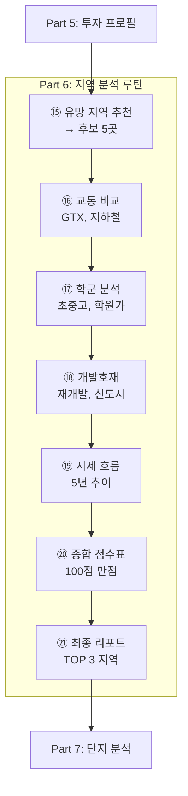
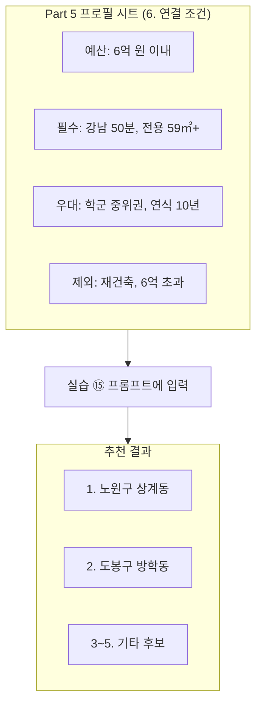
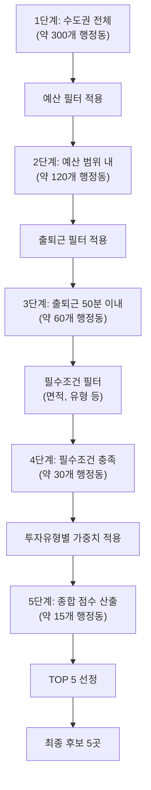
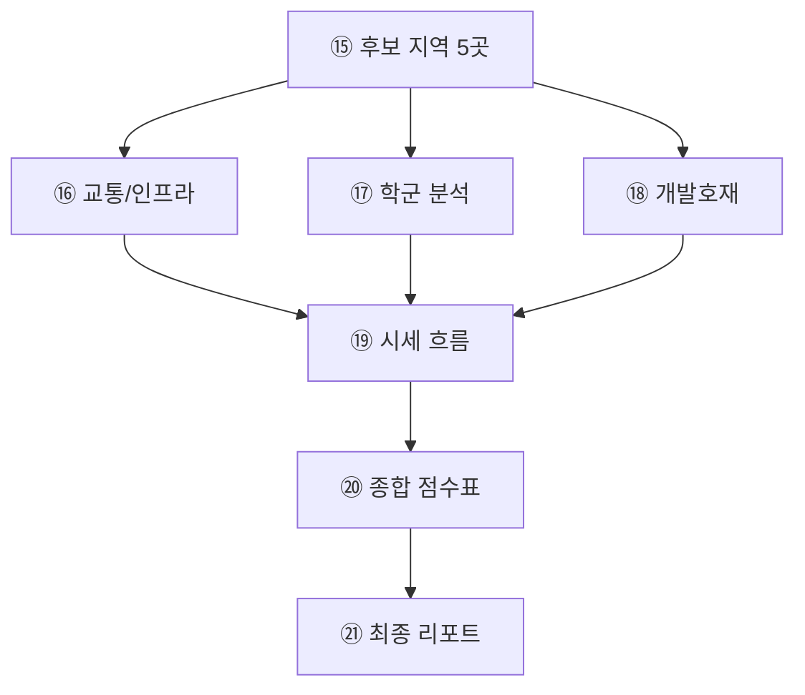
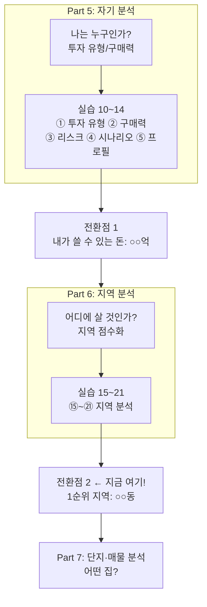
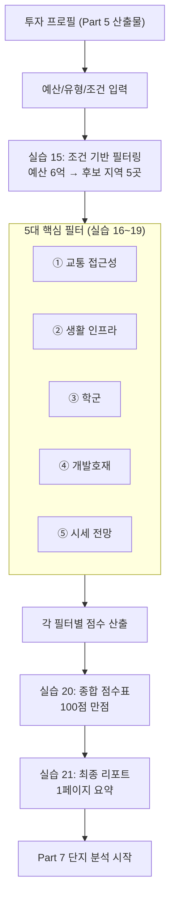
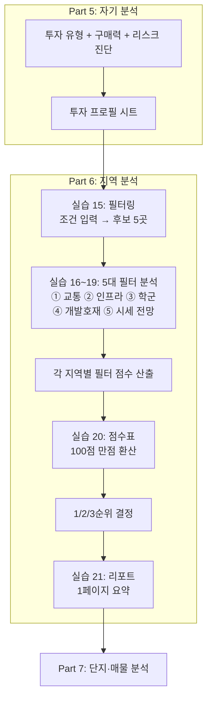

# Part 6: 지역 분석 루틴 만들기

> **Part 6 핵심 메시지**: 지역 선택이 투자의 80%다. 같은 6억이라도 '어디'에 사느냐에 따라 5년 후 1억 손실 vs 2억 수익으로 갈린다.

---

## Part 5를 마친 세 사람

토요일 저녁, Part 5를 막 마친 세 사람이 각자의 투자 프로필을 펼쳤습니다.

| 페르소나 | 구매력 | 투자유형 | 핵심 목표 | 투자기간 |
|----------|--------|----------|----------|----------|
| **김부장** (53세) | 5억 (현금) | A (안정형) | 월세 200만원 | 10년+ |
| **송과장** (38세) | 4억 (레버리지) | B (성장형) | 시세차익 극대화 | 3~5년 |
| **정대리** (31세) | 6억 (보금자리론) | C (실거주형) | 신혼집 + 학군 | 7년+ |

세 사람의 구매력도, 투자 유형도, 목표도 완전히 달랐습니다.

**그런데 세 사람 모두 같은 질문을 던졌습니다.**

"그래서... 어디를 봐야 하지?"

---

## 착각: "좋은 곳 가면 되지"

송과장이 자신 있게 말했습니다.

"저는 GTX 오는 곳이면 다 오를 거라 생각해요. 의정부든 동탄이든."

정대리도 자신의 생각을 말했습니다.

"저는 학군 좋으면 다 오르는 거 아닌가요? 대치동처럼요. 중계동이나 평촌 같은..."

김부장도 고개를 끄덕였습니다.

"나는 지방 소형이 답인 것 같아. 수익률 6~7% 나오는 곳. 부산이나 대전 보려고."

세 사람 모두 **자신만의 "정답"**이 있었습니다.

| 페르소나 | 착각 | 근거 |
|----------|------|------|
| 김부장 | "지방 소형 = 고수익" | 수익률 6~7% |
| 송과장 | "GTX 오면 무조건 상승" | GTX-C 2030년 |
| 정대리 | "학군 좋으면 오른다" | 대치동 신화 |

---

## 반전: "민과장 이야기 들어봤어?"

김부장이 갑자기 손을 들었습니다.

"잠깐. 민과장 이야기 들어봤어?"

송과장과 정대리가 동시에 고개를 들었습니다.

"민과장? 부동산으로 실패했다는...?"

김부장이 고개를 끄덕였습니다.

"2022년이었어. 민과장도 지금 송과장처럼 생각했거든. **'GTX-C 오는 곳이면 오르겠지.'**"

### 민과장의 선택 (2022)

| 항목 | 민과장의 판단 | 실제 결과 |
|------|--------------|----------|
| **지역** | "GTX-C 2027년 개통이니까" 의정부 선택 | GTX-C **2030년으로 3년 연기** |
| **단지** | 신축, 역세권, 브랜드 대단지 | 단지 자체는 완벽 |
| **시세** | 5.2억 매입 | **4.5억으로 하락 (-7천만 원)** |

송과장이 움찔했습니다.

"GTX-C가 연기됐다고 7천만 원이나 빠져요?"

**"그게 '지역 타이밍'이야."**

김부장이 설명을 이어갔습니다.

"민과장 단지는 지금도 의정부에서 손꼽히는 곳이야. 신축이고, 역 가깝고, 학군도 괜찮아. 근데 **지역 호재가 3년 밀리면서** 버티기 힘들어진 거지."

정대리가 불안한 표정으로 물었습니다.

"그럼 GTX 오는 곳 보면 안 되는 건가요?"

**"아니. 보되, '언제 오는지'를 정확히 알아야 해."**

---

### 김부장의 실수 (2008)

김부장이 자신의 경험도 꺼냈습니다.

"나도 비슷한 실수 했어. 2008년."

"2008년이요?"

"판교 신도시 뜬다길래, 근처 분당 신축을 샀어. 'SKY캐슬' 나오던 동네야. 신축이면 망할 일 없다고 생각했지."

송과장이 물었습니다.

"2008년이면... 리먼 사태 때 아닌가요?"

"맞아. **시장 타이밍**을 몰랐던 거야."

| 항목 | 김부장의 판단 | 실제 결과 |
|------|--------------|----------|
| **지역** | "분당 신축이면 안전하지" | 리먼 사태로 2년간 급락 |
| **단지** | 판교 인접, 학군 상위 | 단지 자체는 완벽 |
| **시세** | 7억 매입 (2008) | 5.5억까지 하락, **2년간 -1.5억** |

정대리가 충격받은 표정으로 말했습니다.

"분당 신축이 1억 반이나 빠졌어요?"

"회복하는 데 4년 걸렸어. 단지가 좋아도 **시장 전체가 꺾이면** 버틸 수가 없어."

---

### 정대리의 착각 깨기

정대리가 조심스럽게 물었습니다.

"그럼 학군 좋은 곳도 안 되나요?"

송과장이 대답했습니다.

"학군 좋은 곳은 좋아. 근데 문제는 **가격**이야."

"가격이요?"

"정대리 구매력이 얼마야?"

"6억이요."

"대치동 평균 시세가 얼마인지 알아?"

정대리가 고개를 저었습니다.

송과장이 검색 결과를 보여줬습니다.

```
대치동 주요 단지 시세 (2025.12 기준)
───────────────────────────────
래미안대치팰리스 전용84: 30억+
은마아파트 전용84: 27억+
대치아이파크 전용84: 25억+
───────────────────────────────
```

**"학군 좋은 곳 = 이미 가격에 반영된 곳"이야.**

정대리의 얼굴이 굳었습니다.

"6억으로는 학군 좋은 곳 못 가는 건가요?"

김부장이 고개를 저었습니다.

**"아니. '이미 비싼 곳' 말고, '앞으로 좋아질 곳'을 찾으면 돼."**

**"그게 바로 Part 6에서 하는 일이야. '네 조건에 맞는 곳'을 찾는 거지."**

---

## 깨달음: Part 5 결과가 Part 6의 입력값

송과장이 노트북을 펼쳤습니다.

"그럼 Part 5에서 만든 투자 프로필이 여기서 쓰이는 거야?"

김부장이 고개를 끄덕였습니다.

"Part 5 결과가 없으면 AI가 **'당신의 조건에 맞는 지역'**을 추천할 수 없어. **'일반적으로 좋은 지역'**만 나와."

```
Part 5 없이 질문한 경우:
───────────────────────────────
질문: "부동산 투자 좋은 지역 추천해줘"
AI 답변: "강남, 서초, 용산이 좋습니다"

→ 당신의 예산, 목표, 조건 반영 X
───────────────────────────────

Part 5 결과 활용한 경우:
───────────────────────────────
질문: "구매력 6억, C유형(실거주+자산화), 학군 필수, 판교 1시간 이내 지역 추천해줘"
AI 답변: "노원 상계, 고양 일산, 성남 분당이 조건에 맞습니다"

→ 당신의 조건에 최적화된 답변
───────────────────────────────
```

세 사람이 각자의 Part 5 결과를 확인했습니다.

```
김부장 투자 프로필 시트
───────────────────────
구매력: 5.0억 (현금)
투자유형: A (안정형 수익 추구)
목표 월세: 200만원
리스크 허용도: 안정형
투자기간: 10년+ (은퇴 자금)
───────────────────────
```

```
송과장 투자 프로필 시트
───────────────────────
구매력: 4.0억 (레버리지)
투자유형: B (레버리지 성장형)
목표: 시세차익 극대화
리스크 허용도: 공격형
투자기간: 3~5년 (시세차익)
───────────────────────
```

```
정대리 투자 프로필 시트
───────────────────────
구매력: 6억 (보금자리론)
투자유형: C (실거주+자산화형)
목표: 신혼집 + 자산화
리스크 허용도: 균형형
투자기간: 7년+ (실거주)
───────────────────────
```

정대리가 이해한 표정으로 말했습니다.

"아, Part 5 결과가 없으면 **내 조건을 AI한테 설명할 수가 없는 거네요**."

**"정확해. Part 5가 '나'를 분석했다면, Part 6는 '나에게 맞는 지역'을 찾는 거야."**

---

## Why: 구매력만으로는 지역을 고를 수 없다

정대리가 고개를 갸웃했습니다.

"근데 궁금한 게, Part 5에서 구매력 계산한 게 왜 중요한 거예요? 구매력만 알면 되는 거 아닌가요?"

송과장이 고개를 저었습니다.

**"구매력만으로는 지역을 고를 수 없어."**

"왜요?"

김부장이 설명을 이어받았습니다.

"'6억 있다'는 건 **제약 조건**일 뿐이야. 진짜 중요한 건 **'6억으로 무엇을 원하는가'**지."

### 같은 6억, 완전히 다른 질문

| 페르소나 | 구매력 | 투자유형 | AI에게 던지는 질문 |
|----------|--------|---------|-------------------|
| **김부장** | 5억 | A (수익형) | "5억으로 **월세 200만원** 받을 수 있는 곳은?" |
| **송과장** | 4억 | B (성장형) | "4억으로 **3년 안에 2억 수익** 가능한 곳은?" |
| **정대리** | 6억 | C (실거주형) | "6억으로 **학군 좋고 출퇴근 1시간 이내** 곳은?" |

송과장이 강조했습니다.

"똑같이 '6억으로 추천해 줘'라고 물으면, AI가 **강남, 서초, 용산** 같은 뻔한 답만 내놓아."

**"Part 5 결과가 있어야 '나의 조건에 맞는 지역'을 찾을 수 있어."**

### Part 5 → Part 6 데이터 흐름

```
Part 5 출력값                  Part 6 활용 방법                    실제 예시
──────────────────────────────────────────────────────────────────
구매력 (실습 ⑪)        →  예산 필터링                   →  김부장 5억 → 5억 이하 지역만
투자유형 (실습 ⑩)      →  지역 선정 기준 가중치         →  A유형 → 임대수익률 우선
리스크 성향 (실습 ⑫)   →  지역 안정성 기준              →  안정형 → 검증된 지역만
투자기간 (실습 ⑬)      →  개발호재 타임라인 매칭        →  10년 → 장기 개발 포함
목표 월세/수익률       →  수익성 기준                   →  월세 200만원 → 수익률 4.8%+
```

---

## 3인 3색 비교: 같은 GTX-C 수혜, 다른 선택

송과장이 예시를 들었습니다.

"GTX-C 노선을 보자. 의정부, 노원, 수원 전부 GTX-C 수혜야. 근데 세 사람이 **다른 곳**을 선택할 거야."

| 지역 | GTX-C 수혜 | 김부장 (A유형) | 송과장 (B유형) | 정대리 (C유형) |
|------|-----------|---------------|---------------|---------------|
| **의정부 민락** | 2030년 개통 | 공실 우려 | **저평가 매력** | 학군 부족 |
| **노원 상계** | 2030년 개통 | 임대수요 보통 | 이미 상승 | **학원가 밀집** |
| **수원 영통** | 2030년 개통 | **임대수요 최고** | 상승여력 적음 | 학군 보통 |

김부장이 설명했습니다.

"나는 **공실 리스크**가 낮아야 하니까 의정부는 안 돼. 임대수요 검증된 수원 영통을 보는 거지."

송과장이 덧붙였습니다.

"나는 **시세차익**이 목표라 이미 오른 수원은 별로야. 저평가된 의정부를 보는 거고."

정대리가 자신의 조건을 말했습니다.

"저는... **학군**이 필수라 의정부는 안 맞아요. 학원가 밀집된 노원 상계를 보는 거죠."

**"같은 GTX-C 수혜여도, 투자 유형에 따라 선택이 완전히 다른 거야."**

---

## Part 6 워크플로우: 7단계

송과장이 Part 6의 전체 흐름을 정리했습니다.

**Part 5 투자 프로필 → Part 6 지역 분석**

| 페르소나 | 구매력 | 유형 | 핵심 목표 |
|----------|--------|------|----------|
| 김부장 | 5억 | A유형 | 월세 200만원 |
| 송과장 | 4억 | B유형 | 시세차익 |
| 정대리 | 6억 | C유형 | 학군+교통 |



"Part 5에서 '나'를 분석했잖아? Part 6에서는 **'나에게 맞는 지역'**을 찾는 거야."

---

## 해결: 지역 먼저, 단지 나중

송과장이 설명했습니다.

```
❌ 바텀업 (실패 패턴)
단지 검색 → 좋은 단지 발견 → 그 지역 선택
"신축이고 역세권이니까 여기 살래!"

⭕ 탑다운 (성공 패턴)
지역 분석 → 유망 지역 선정 → 그 안에서 단지 선택
"이 지역이 내 조건에 맞으니까, 여기서 단지 찾자!"
```

**"지역을 먼저 정하고, 단지를 나중에 고르는 거야."**

정대리가 물었습니다.

"왜 순서가 중요한 거예요?"

김부장이 대답했습니다.

"같은 6억짜리 아파트라도, **어느 지역에 있느냐**에 따라 5년 후 결과가 완전히 달라. 1억 손실 vs 2억 수익."

| 시나리오 | 지역 선택 | 5년 후 결과 |
|----------|----------|------------|
| **A** | 호재 없는 안정 지역 | 6억 → 6.5억 (+8%) |
| **B** | GTX 연기된 지역 | 6억 → 5억 (**-17%**) |
| **C** | 적절한 타이밍 + 호재 지역 | 6억 → 8억 (**+33%**) |

**"그래서 지역 선정이 투자의 80%야."**

---

## 주의: 이 Part에서 조심할 교통 데이터

김부장이 경고했습니다.

"Part 6에서 교통 분석 많이 하는데, **AI가 틀린 정보 줄 수 있어**. 특히 GTX."

정대리가 물었습니다.

"왜요?"

"GTX-C가 대표적이야. AI한테 물어보면 '2027년 개통'이라고 답할 수 있거든. 근데 실제론 **2030년으로 연기**됐어. 민과장이 당한 게 바로 이거야."

### GTX 현황 (2025.12 기준)

| 노선 | 상태 | 개통일/목표 | 출처 |
|------|------|------------|------|
| GTX-A (수서~동탄) | **개통** | 2024.03.30 | 국토부 |
| GTX-A (운정~서울역) | **개통** | 2024.12.28 | 국토부 |
| GTX-B (송도~마석) | 착공 | 2030~2031 목표 | 국토부 |
| GTX-C (수원~의정부) | 착공 | **2030년 목표** | 국토부 2024.11 |

### 기타 철도

| 노선 | 상태 | 개통일/목표 | 출처 |
|------|------|------------|------|
| 인덕원-동탄선 | 착공 | 2029년 목표 | 국토부 |
| 신분당선 광교~호매실 | 계획 | 2029.12 예정 | 경기도 |
| 신안산선 | 착공 | **2026년 개통** | 국토부 |

송과장이 강조했습니다.

**"AI가 'GTX-C 2027년 개통'이라고 답변하면 즉시 정정 요청해. 민과장처럼 되기 싫으면."**

---

## 사전 준비사항

김부장이 체크리스트를 건넸습니다.

| 준비물 | 설명 | 확인 |
|--------|------|------|
| **Part 5 투자 프로필 시트** | 실습 ⑭ 결과물 **필수** | |
| 출퇴근 목적지 | 강남역, 판교, 여의도 등 | |
| 관심 지역 (선택) | 이미 생각해둔 지역이 있다면 | |
| AI 도구 | ChatGPT, Claude, Gemini, Perplexity 중 택일 | |

### Part 5 결과물 확인

```
필요한 Part 5 결과:
─────────────────────────────────
• 구매력: ○○억원 (실습 ⑪ 결과)
• 투자유형: A/B/C/D (실습 ⑩ 결과)
  - A: 안정형 수익 추구 (월세 현금흐름)
  - B: 레버리지 성장형 (시세차익 극대화)
  - C: 실거주 + 자산화형 (거주 + 장기 자산)
  - D: 포트폴리오 분산형 (리스크 분산)
• 리스크 성향: 공격형/균형형/안정형 (실습 ⑫ 결과)
• 투자기간: 단기/중기/장기 (실습 ⑬ 결과)
─────────────────────────────────
```

> **주의**: Part 5를 건너뛰면 Part 6 결과가 **"강남, 서초, 용산이 좋습니다"**로 끝납니다.
> 당신의 예산과 조건에 맞는 지역을 찾으려면 Part 5 투자 프로필이 필수입니다.

---

## 나와 비슷한 러닝메이트는?

| 페르소나 | 조건 | Part 6에서 찾을 것 |
|----------|------|-------------------|
| **김부장** (53세) | 5억 현금, 월세 200만원, 안정형 | 임대수요 높은 역세권 구축 |
| **송과장** (38세) | 4억+레버리지, 시세차익, 공격형 | GTX 수혜 저평가 지역 |
| **정대리** (31세) | 6억, 신혼집, 학군+교통 | 학군+교통 균형 신도시 |

**당신은 누구와 가장 비슷한가요?** 해당 페르소나의 결과에 주목하세요.

---

## 핵심 정리

김부장이 마무리했습니다.

**"Part 6 핵심 인사이트 세 가지야."**

### 1. 지역 선택이 투자의 80%

"같은 예산이라도 지역에 따라 5년 후 결과가 **1억 손실 vs 2억 수익**으로 갈린다."

### 2. 투자 유형에 따라 봐야 할 지역이 다르다

송과장이 덧붙였습니다.

"수익형(A)은 공실률, 레버리지형(B)은 개발호재, 실거주형(C)은 학군·교통이 우선. **같은 예산이어도 목표가 다르면 지역이 완전히 달라**."

### 3. Part 5 결과가 Part 6의 입력값

정대리가 정리했습니다.

"구매력, 투자유형, 리스크 허용도가 없으면 **지역 분석이 무의미**해지는 거군요."

---

## Part 6 끝나면 손에 쥘 것

정대리가 마지막으로 물었습니다.

"이 Part 끝나면 뭐가 달라져요?"

송과장이 대답했습니다.

"지금은 '어디를 봐야 할지 모르겠다'잖아. Part 6 끝나면 **'내 조건에 맞는 지역 TOP 3'**가 명확해져."

김부장이 덧붙였습니다.

"그 리포트 들고 Part 7 가면, **'이 지역 안에서 어떤 단지를 볼까?'**로 질문이 좁아지는 거야."

정대리가 결연한 표정으로 노트북을 열었습니다.

"좋아요. 시작해볼게요."

---

이제 준비가 완료되었습니다. 다음 실습부터 본격적인 지역 분석을 시작합니다.

**다음 실습**: 실습 ⑮ 조건별 유망 지역 추천


---


# 실습 ⑮: 조건별 유망 지역 추천

---

## 드디어, 프로필 시트가 일을 시작하는 순간

Part 5를 시작할 때, 세 사람은 각자 다른 고민을 안고 있었습니다.

**3주 전 (Part 5 시작)**

| 페르소나 | 고민 | 상태 |
|----------|------|------|
| 김부장 (53세) | "은퇴 후 월세 수익... 어디서 시작하지?" | 막막함 |
| 송과장 (38세) | "3호기 어디 사야 하지? GTX 온다는데..." | 정보 과부하 |
| 정대리 (31세) | "결혼 전에 집 사야 하는데... 예산이..." | 불안함 |

**오늘 (Part 5 완료, Part 6 시작)**

| 페르소나 | Part 5 결과 | 상태 |
|----------|------------|------|
| 김부장 | 구매력 5억, A유형(수익형), 안정형 | **확신** |
| 송과장 | 구매력 4억, B유형(레버리지형), 공격형 | **기대** |
| 정대리 | 구매력 6억, C유형(실거주형), 균형형 | **안도** |

정대리(31세, 신혼부부)가 Part 5에서 완성한 투자 프로필 시트를 손에 쥐고 기대에 찬 표정으로 말했습니다.

"이 한 장으로 진짜 지역을 찾을 수 있는 거죠?"

송과장(38세, 대기업 과장)이 확신에 찬 미소로 고개를 끄덕였습니다.

"이제부터 진짜 게임이야. 프로필 시트가 나침반이 되어줄 거야."

---

## Why: 왜 조건 기반 지역 도출이 필요한가?

> **핵심 질문**: "좋은 지역 추천해주세요"와 "내 조건에 맞는 지역 찾아주세요"의 차이가 무엇일까요?

### 조건 없이 지역을 찾으면 생기는 3가지 문제

김부장(53세, 퇴직 예정)이 자신의 경험담을 꺼냈습니다.

"내가 10년 전에 겪은 일이야."

#### 문제 1: 예산 불일치 → 시간 낭비

```
[2015년 김부장의 실수]
유튜버 추천: "동탄신도시가 핫합니다!"
   ↓
현장 방문 (왕복 4시간)
   ↓
실거래가 확인: 예산의 2배
   ↓
결과: 이동 시간 + 교통비 낭비
```

**근본 원인**: 예산 필터링 없이 "좋은 곳"만 찾음

#### 문제 2: 라이프스타일 불일치 → 잘못된 의사결정

송과장도 고개를 끄덕였습니다.

"나도 1호기 때 같은 실수 했어."

```
[2018년 송과장의 실수]
학군 좋다는 말만 듣고 → 목동 매수
   ↓
자녀 초등학교 3학년 (학원 수요 거의 없음)
   ↓
결과: 학군 프리미엄은 지불했지만 실제 혜택 없음
```

**근본 원인**: "일반적으로 좋은 조건"과 "나에게 맞는 조건" 혼동

#### 문제 3: 투자 목적 불일치 → 수익률 악화

김부장이 씁쓸하게 말했습니다.

"가장 치명적인 게 이거야."

```
[목적 불일치 사례]
목적: 월세 수익형 투자 (A유형)
   ↓
추천받은 지역: 강남 재건축 (시세 차익형)
   ↓
전세가율 45% → 갭 너무 커서 현금 3억+ 묶임
   ↓
결과: 예상 수익률 5% → 실제 2% (레버리지 낮음)
```

**근본 원인**: 투자 유형과 지역 특성 미스매치

---

## Why 정리: 조건 기반 접근의 3가지 이점

김부장이 정리했습니다.

| 접근법 | "좋은 지역 추천" | "내 조건 맞는 지역" |
|--------|----------------|-------------------|
| **필터링** | ❌ 없음 | ✅ 예산·목적·라이프스타일 |
| **시간 효율** | ❌ 낮음 (전방위 탐색) | ✅ 높음 (타겟팅 탐색) |
| **성공률** | ❌ 30% (불일치 많음) | ✅ 80% (조건 부합) |

정대리가 깨달은 표정으로 말했습니다.

"그러니까... 조건을 먼저 정해야 시간도 아끼고 실패도 줄인다는 거네요!"

송과장이 정확하게 짚었습니다.

**"바로 그거야. 그래서 Part 5에서 프로필 시트를 먼저 만든 거지."**

---

## Part 5 → Part 6 연결: 입력값 변환표

김부장이 표로 정리했습니다.

"Part 5 결과가 Part 6에서 어떻게 쓰이는지 정리해볼까."

| Part 5 결과 | Part 6 입력값 | 역할 |
|------------|--------------|------|
| **구매력** (실습 ⑪) | 예산 범위 | 지역 필터링 기준 |
| **투자 유형** (실습 ⑩) | 중시 항목 가중치 | A유형→수익률, C유형→학군 |
| **리스크 성향** (실습 ⑫) | 지역 안정성 기준 | 공격형→호재 중심, 안정형→검증된 지역 |
| **투자 기간** (실습 ⑬) | 호재 시점 필터 | 3년→단기 호재, 7년→장기 호재 OK |

정대리가 노트를 펼치며 확인했습니다.

"제 경우에는... 구매력 6억이 예산 필터가 되고, C유형이라서 학군에 가중치를 두고, 7년 투자니까 GTX-C 2030년도 OK인 거죠?"

송과장이 정확하게 짚었습니다.

"맞아. **같은 프롬프트라도 Part 5 결과에 따라 추천 지역이 완전히 달라져.**"

---

## 착각: "좋은 지역 추천해주세요, 하면 되겠지?"

정대리가 ChatGPT를 켜며 말했습니다.

"그냥 AI한테 '좋은 투자 지역 추천해주세요'라고 물어보면 안 되나요?"

김부장이 고개를 저었습니다.

**"그렇게 물으면 안 돼."**

정대리가 의아한 표정으로 되물었습니다.

"왜요? 좋은 곳 알려주면 되잖아요?"

김부장이 한숨을 쉬며 대답했습니다.

"강남, 서초, 용산이 좋은 건 누구나 알아. 근데 자네 예산으로 살 수 있나?"

정대리가 움찔했습니다.

"그건... 못 사죠."

---

## 반전: 조건 없이 지역을 찾으면 생기는 일

김부장이 자신의 실패 경험을 꺼냈습니다.

"나도 예전에 그렇게 했어. '여기 좋대!'라는 말에 따라가봤더니..."

| 상황 | 결과 |
|------|------|
| "여기 좋대!" | 가보니 예산의 2배 |
| 유튜버 추천 따라감 | 출퇴근 2시간 |
| 학군 좋다해서 갔음 | 아이가 이미 고등학생 |
| "개발호재 있대!" | 10년 뒤 이야기 |

송과장도 고백했습니다.

"나도 1호기 때 남들 따라갔다가 1년 고생했어. 프로필 시트 없이 투자하면 절대 안 돼."

정대리가 물었습니다.

"그럼 어떻게 해야 해요?"

김부장이 정대리의 프로필 시트를 가리켰습니다.

**"'좋은 지역 추천해주세요' vs '내 조건에 맞는 지역 찾아주세요'. 이 두 질문의 차이가 투자 성패를 가른다."**

---

## 해결: Part 5 프로필 시트를 AI에 입력하기

송과장이 설명했습니다.

**Part 5 실습 ⑭ → Part 6 실습 ⑮ 연결**



정대리가 노트북을 열며 물었습니다.

"그럼 실습 ⑭에서 만든 프로필 시트의 6번 섹션을 여기다 붙여넣으면 되는 거죠?"

송과장이 고개를 끄덕였습니다.

"정확해. 이 실습을 마치면 **'내 조건에 맞는 후보 지역 5곳'**이 도출돼. 이 5곳이 실습 ⑯~⑲의 분석 대상이 되고, 최종적으로 실습 ㉑에서 TOP 3가 선정되는 거야."

---

## 📚 이 실습에서 사용하는 용어

김부장이 초보자를 위해 용어를 정리해줬습니다.

| 용어 | 의미 | 예시 |
|------|------|------|
| **탑다운(Top-Down)** | 넓은 범위에서 좁혀가는 분석법 | 수도권 → 서울 → 노원구 → 상계동 |
| **바텀업(Bottom-Up)** | 특정 단지에서 확장하는 분석법 | "이 단지 좋네" → 주변 지역 분석 |
| **실거래가** | 실제 거래된 가격 (호가 아님) | 국토부 공개 데이터 |
| **전세가율** | 매매가 대비 전세가 비율 | 전세가율 60% = 5억 집에 전세 3억 |
| **배후수요** | 해당 지역에 거주할 잠재 수요 | 가산디지털단지 5만 근로자 |

---

## 📋 준비물

정대리가 준비물을 확인했습니다.

**필수:**
- Part 5 투자 프로필 시트 (특히 6번 섹션)
- 출퇴근 목적지 (예: 강남역, 판교, 여의도 등)

**선택:**
- 선호/제외 지역 목록
- Perplexity (실시간 시세 검색용)

---

## 페르소나 내면 독백: 프롬프트 입력 전 생각

### 김부장의 독백 (A유형, 안정형)

> "은퇴가 1년 남았어. 이번이 마지막 기회야.
> 공격적으로 가면 안 돼. 안정적인 월세 수익이 나와야 해.
> 전세가율 65% 이상, 대학가나 직장 배후수요 있는 곳...
> 수원 영통? 용인 수지? 지방도 괜찮아. 수익률만 나오면 돼."

### 송과장의 독백 (B유형, 공격형)

> "3호기는 대박 터뜨리고 싶어.
> GTX-C 2030년이면 5년 기다려야 하지만 상승 폭은 확실할 거야.
> 의정부? 수원? 지금은 저평가됐지만 호재 터지면...
> 리스크 있어도 괜찮아. 젊으니까 버틸 수 있어."

### 정대리의 독백 (C유형, 균형형)

> "결혼 준비 중이고... 아이도 계획 중이야.
> 학군은 나중에 중요해질 거야. 신경 써야 해.
> 강남까지 50분... 출퇴근 괜찮은 선이야.
> 노원? 도봉? 서울 내에서 살 수 있으면 좋겠는데...
> 보금자리론 6억 한도 꼭 지켜야 해."

---

## Step 1: Part 5 프로필 시트 열기

정대리가 실습 ⑭에서 저장한 파일을 열었습니다.

```
필요한 Part 5 결과:
─────────────────────────────────
• 구매력: ○○억원 (실습 ⑪ 결과)
• 투자유형: A/B/C/D (실습 ⑩ 결과)
• 리스크 성향: 공격형/균형형/안정형 (실습 ⑫ 결과)
• 투자기간: 단기/중기/장기 (실습 ⑬ 결과)
─────────────────────────────────
```

추가로 다음 조건을 정리해두세요:
- **출퇴근 목적지**: 강남역, 판교, 여의도 등
- **희망 접근시간**: 30분/40분/50분/60분 이내
- **필수 조건**: 전용면적, 학군, 연식 등
- **제외 조건**: 특정 지역, 재건축 불확실 등

---

## Step 2: 조건 필터링 프로세스 시각화

송과장이 필터링 흐름을 설명했습니다.



**최종 후보 지역 (정대리 기준)**

| 순위 | 지역 | 점수 |
|------|------|------|
| 1 | 노원구 상계동 | 85점 |
| 2 | 도봉구 방학동 | 82점 |
| 3 | 도봉구 쌍문동 | 80점 |
| 4 | 하남시 미사동 | 78점 |
| 5 | 금천구 독산동 | 75점 |

정대리가 감탄하며 말했습니다.

"300개에서 5개로 줄이는 거네요! 이게 탑다운 접근이구나."

---

## Step 3: AI에게 지역 추천 요청하기

송과장이 능숙한 표정으로 말했습니다.

"이제 프로필 시트를 AI한테 넘기고, 조건에 맞는 지역 찾아달라고 해."

정대리가 프롬프트를 입력하기 시작했습니다.

> **💡 팁**: 조건이 구체적일수록 AI의 추천이 정확해집니다. "학군 좋은 곳"보다 "중학교 학업성취도 상위 30%" 같은 구체적 기준이 좋습니다.

---

## Step 4: 추천 지역 확인 및 결과 해석 가이드

AI 응답이 화면에 나타났습니다. 정대리가 눈을 동그랗게 떴습니다.

"우와, 5개 지역이 한 번에 나왔어요!"

김부장이 신중한 표정으로 경고했습니다.

**"맹신하면 안 돼. 하나씩 검증해야 해."**

> **AI 추천은 참고용입니다**
> 실거래가, 출퇴근 시간은 반드시 공식 사이트에서 교차 검증하세요.
> AI가 제시한 개발호재의 확정 여부와 시기를 항상 확인하세요.

### 결과 해석 가이드: 5가지 핵심 체크포인트

김부장이 검증 프레임워크를 설명했습니다.

**AI 추천 결과 검증 프레임워크 (5단계)**

| 단계 | 검증 항목 | 확인 방법 | 주의사항 |
|------|----------|----------|----------|
| **1단계** | 조건 일치도 | AI의 "추천 이유"가 내 조건과 매칭되는가? | C유형인데 "수익률 좋음" 이유면 → 재검토 |
| **2단계** | 예산 적합성 | 제시된 "평균 시세"가 예산 범위 내인가? | "5~7억"이면 상한 7억도 나올 수 있음 → "6억 이하만" 재요청 |
| **3단계** | 출퇴근 시간 | AI 시간 vs 카카오맵 "평일 오전 8시" 검색 | AI는 환승시간 과소평가 경향 → 직접 검색 (±10분 허용) |
| **4단계** | 개발호재 확정 | "GTX-C 2030년" → 국토부 공식 발표 확인 | "예정"은 불확실, "확정"만 신뢰 |
| **5단계** | 리스크 명시 | AI가 "주의점" 섹션을 제공했는가? | 장점만 나열 시 → "리스크 3가지 추가로" 재질문 |

**확인 항목**:
- [ ] 추천 이유가 내 조건과 맞는가?
- [ ] 평균 시세가 예산 범위 내인가?
- [ ] 출퇴근 시간이 희망 조건 내인가?
- [ ] 개발호재가 명확한가? (시기, 규모)
- [ ] 주의점/리스크가 무엇인가?

---

## 3인 3색 추천 결과 비교

정대리가 궁금한 표정으로 물었습니다.

"김부장님이랑 송과장님은 어디 추천받으셨어요?"

### 페르소나별 추천 결과 비교표

| 항목 | 김부장 (53세, A유형) | 송과장 (38세, B유형) | 정대리 (31세, C유형) |
|------|---------------------|---------------------|---------------------|
| **투자 목적** | 월세 수익 | 시세 차익 | 실거주 + 자산화 |
| **구매력** | 5억원 (현금 100%) | 4억원 (갭투자) | 6억원 (보금자리론) |
| **중시 요소** | 임대수익률 | 개발호재 | **교통+학군** |
| **1순위 추천** | 수원 영통 | 의정부 민락 | **노원 상계** |
| **2순위 추천** | 용인 수지 | 인천 송도 | **도봉 방학** |
| **3순위 추천** | 대구 수성 | 김포 | **금천 독산** |
| **핵심 이유** | 전세가율 65%+, 안정 수요 | GTX-C 2030, 저점 매수 | GTX-C + 중계 학원가 |

### 김부장의 내면 반응

> "역시... 수원 영통이 1순위로 나왔네.
> 전세가율 65%, 성균관대 배후수요, 안정적이야.
> 용인 수지는 조금 비싸지만 학군 프리미엄 있어서 전세 수요 안정적이고...
> 대구 수성은 의외인데, 지방이지만 수익률이 좋다는 거구나.
> 이 3곳 실거래가 확인해봐야겠어."

### 송과장의 내면 반응

> "의정부 민락! 바로 이거야!
> GTX-C 2030년이면 5년 뒤... 지금은 저점이야.
> 송도는 미분양 리스크 있지만 개발 완성되면 대박이고...
> 김포는 김포골드라인 + 5호선 연장 호재도 있어.
> 공격적으로 가자. 젊을 때 아니면 언제 하겠어?"

### 정대리의 내면 반응

> "노원 상계... GTX-C 수혜 + 중계 학원가 인접이구나.
> 보금자리론 6억 한도 내에서 가능하다니 다행이야.
> 도봉 방학은 조금 더 저렴하고 창동 개발 인접이고...
> 금천 독산은 신안산선 호재가 있네. 하지만 학군은 좀...
> 일단 노원, 도봉 위주로 보자. 서울이 안심되니까."

김부장이 담담한 표정으로 대답했습니다.

"나는 임대수익률이 중요하니까, 수원 영통 쪽으로 나왔어. 전세가율 65% 넘으면 갭이 작아서 안정적이지."

송과장이 야심찬 표정으로 말했습니다.

"난 개발호재 있는 의정부 민락! GTX-C 2030년이면 5년 기다릴 가치 있어. 지금 저점이거든."

정대리가 깨달은 표정을 지었습니다.

**"같은 프롬프트인데 Part 5 결과가 다르니까 추천도 완전히 다르네요!"**

송과장이 정리해줬습니다.

"그래서 Part 5에서 투자 유형을 먼저 파악한 거야. 유형이 다르면 봐야 할 지역도 다르니까."

---

## Step 5: 실거래가로 검증하기

김부장이 단호한 표정으로 말했습니다.

**"AI 말 그대로 믿으면 안 돼. 반드시 직접 확인해."**

**1. 실거래가 확인**
- 국토부 실거래가 공개시스템 (rt.molit.go.kr)
- 네이버 부동산, 호갱노노

**2. 출퇴근 시간 확인**
- 카카오맵 또는 네이버 지도에서 "출퇴근 경로" 검색
- 출발지(추천 지역 대표 단지), 도착지(출퇴근 목적지)
- **평일 오전 8시 기준**으로 확인

**3. 규제지역 확인**
- 규제지역 여부에 따라 LTV/DTI가 달라짐
- 2025년 12월 기준 대부분의 수도권은 비규제지역

**검증 결과 기록**:
```
지역: [지역명]
실거래가 확인: ○○억 (○○동 ○○아파트, 2025.○○월)
출퇴근 시간: ○○분 (카카오맵 기준)
규제지역: 예/아니오
```

---

## Step 6: 후보 지역 저장하기

정대리가 뿌듯한 표정으로 검증 결과를 정리했습니다.

"5곳 다 확인했어요!"

검증된 후보 지역 5곳을 정리하여 저장합니다. 이 결과가 실습 ⑯~⑲의 입력값이 됩니다.

```markdown
## 실습 ⑮ 결과: 후보 지역 5곳

| 순위 | 지역 | 검증된 시세 | 출퇴근 시간 | 핵심 장점 | 핵심 리스크 |
|------|------|------------|------------|----------|------------|
| 1 | [지역명] | ○○억 | ○○분 | [장점] | [리스크] |
| 2 | ... | ... | ... | ... | ... |
| 3 | ... | ... | ... | ... | ... |
| 4 | ... | ... | ... | ... | ... |
| 5 | ... | ... | ... | ... | ... |

작성일: 2025.○○.○○
```

---

## 🤖 프롬프트 템플릿 (Type D - 지역분석형)

송과장이 프롬프트 템플릿을 보여줬습니다.

"이거 복사해서 `[대괄호]` 부분만 자네 조건으로 바꾸면 돼."

```
당신은 **수도권 부동산 시장 전문가**입니다.

아래 **투자 프로필**을 바탕으로 조건에 맞는 **유망 지역 5곳**을 추천해주세요.

---

## 투자 프로필 (Part 5 결과)

```yaml
투자_유형: [실습⑩ 결과: A/B/C/D 유형]
총_구매력: [실습⑪ 결과: 금액]억원
예산_범위: [최소금액] ~ [최대금액]억원
투자_기간: [실습⑬ 결과: 단기/중기/장기]

필수_조건:
  - 출퇴근: [목적지]까지 [시간]분 이내 (지하철 기준)
  - 전용면적: [최소]~[최대]㎡
  - 유형: [아파트/오피스텔 등]

우대_조건:
  - 학군: [필수/선호/무관]
  - 연식: [신축선호/구축가능/무관]
  - 개발호재: [선호/무관]

제외_조건:
  - [제외할 지역이나 조건 1]
  - [제외할 지역이나 조건 2]
```

---

## 분석 기준

### 1. 가격 매력도
- 예산 범위 내 매물 수
- 최근 3개월 가격 변동률
- 전세가율 (안정성 지표)

### 2. 입지 경쟁력
- 출퇴근 접근성 (대중교통 기준)
- 생활 인프라 (대형마트, 병원, 공원)
- 학군 수준

### 3. 미래가치
- 개발호재 (GTX, 신규 노선, 재개발)
- 공급 일정 (향후 2년 입주 물량)
- 인구 유입 추세

---

## 출력 형식

### 추천 지역 TOP 5

| 순위 | 지역 (시/구/동) | 평균 시세 | 추천 이유 | 주의점 | 종합 점수 |
|------|----------------|----------|----------|--------|----------|
| 1 | [지역명] | ○○억 | [2-3줄] | [1줄] | ○○/100 |
| 2 | ... | ... | ... | ... | ... |

### 지역별 상세 분석

각 추천 지역에 대해 다음 정보 제공:

**기본 정보**
- 평균 매매가 (전용 ○○㎡ 기준)
- 전세가율
- 출퇴근 접근시간 (지하철 환승 포함)

**입지 분석**
- 교통: [지하철, 버스 등]
- 학군: [중학교 등급]
- 생활 인프라: [마트, 병원 등]

**미래가치**
- 개발호재: [GTX, 재개발 등]
- 예상 가격 변동

**추천 단지 예시** (예산 내 실거래 가능한 단지 2-3개)

**투자 적합도**: ★★★★☆ (4/5)

---

## Rules

1. **데이터 기반**: 모든 시세는 최근 3개월 실거래가 기준
2. **출처 명시**: 시세 데이터 출처 및 기준일 표기
3. **보수적 판단**: 불확실한 개발호재는 "미확정" 명시
4. **예산 적합성**: 입력된 예산 범위에 실제 거래 가능한 지역만 추천
5. **실거주 관점**: 투기 목적이 아닌 실거주 + 자산화 관점으로 분석

---

지금 바로 유망 지역 5곳을 추천해주세요.
```

---

### 완성형 예시 (정대리 기준)

정대리가 실제로 입력한 프로필입니다:

```yaml
투자_유형: C (실거주 + 자산화형)
총_구매력: 6억원 (보금자리론 4.2억 + 자기자금 1.8억)
예산_범위: 5.0 ~ 6.0억원
투자_기간: 장기 (5년 이상)
금리_조건: 고정금리 3.5% (보금자리론)

필수_조건:
  - 출퇴근: 강남역까지 50분 이내 (지하철 기준)
  - 전용면적: 59~84㎡
  - 유형: 아파트
  - 매매가: 6억원 이하 (보금자리론 대상 조건)

우대_조건:
  - 학군: 선호 (초등학교 저학년 자녀)
  - 연식: 구축가능 (2000년 이후)
  - 개발호재: 선호 (GTX 등)

제외_조건:
  - 경기도 외곽 (파주, 양주 북부)
  - 재건축 불확실성 높은 단지
  - 6억원 초과 단지 (보금자리론 대상 제외)
```

---

## 📝 AI 응답 예시 (정대리 조건)

정대리가 AI 응답을 확인했습니다.

### 추천 지역 TOP 5

| 순위 | 지역 | 평균 시세 (84㎡) | 강남 접근 | 종합 점수 |
|------|------|-----------------|----------|----------|
| 1 | 서울 노원구 상계동 | 5.0~6.0억 | 43분 | 85/100 |
| 2 | 서울 도봉구 방학동 | 4.5~5.5억 | 50분 | 82/100 |
| 3 | 서울 도봉구 쌍문동 | 4.5~5.5억 | 48분 | 80/100 |
| 4 | 경기 하남시 미사동 | 5.5~6.0억 | 45분 | 78/100 |
| 5 | 서울 금천구 독산동 | 4.5~5.5억 | 40분 | 75/100 |

### 1위: 서울 노원구 상계동

- **평균 매매가**: 5.5억원 (전용 84㎡, 국토부 실거래가 2025.12 기준)
- **전세가율**: 약 55% (KB부동산, 2025.12 기준)
- **강남 접근**: 43분 (7호선 → 강남역, 카카오맵 평일 오전 8시 기준)
- **보금자리론 적합도**: ✅ 6억 이하 매물 다수

**입지 분석**:
- 교통: 7호선 노원역, 4호선 상계역 / GTX-C 창동역 예정
- 학군: 노원구 중학교 중상위권 (학교알리미, 2024 기준)
- 생활 인프라: 롯데백화점 노원점, 노원역 상권

**미래가치**:
- GTX-C 창동역 개통 시 강남 20분대 접근 가능 **(2030년 목표, 국토부 2025.12 기준)**
- 창동차량기지 개발 (5조원 규모, 8.6만 일자리, 서울시 도시계획 2024 발표)

**추천 단지 예시** (보금자리론 6억 이하):

| 단지명 | 전용면적 | 실거래가 | 준공년도 | 보금자리론 |
|--------|---------|---------|---------|-----------|
| 상계주공5단지 | 84㎡ | 5.8억 | 1988년 | ✅ 가능 |
| 상계벽산1 | 84㎡ | 5.5억 | 1998년 | ✅ 가능 |
| 월계동 두산 | 84㎡ | 5.9억 | 2001년 | ✅ 가능 |

**리스크**: 구축 → 관리비, 노후화 확인 필수 / 6억 상한이므로 호가 협상 필요

---

## 예산 초과 경고

김부장이 경고하는 표정으로 말했습니다.

**"AI가 예산 초과 지역을 추천하면 바로 거르세요."**

```
⚠️ 예산 및 보금자리론 대상 초과 지역 (추천 제외)

다음 지역은 예산(5.0~6.0억) 및 보금자리론 대상(6억 이하)을 초과합니다:

| 지역 | 전용 84㎡ 실거래가 | 예산 대비 | 보금자리론 |
|------|-------------------|----------|-----------|
| 수원시 영통구 | 7~10억 | 초과 | ❌ 불가 |
| 용인시 수지구 | 8~12억 | 2배 초과 | ❌ 불가 |
| 화성시 동탄2 | 8~15억 | 2배+ 초과 | ❌ 불가 |
| 성남시 분당구 | 10~15억 | 2배+ 초과 | ❌ 불가 |

→ 위 지역은 보금자리론 대상 제외
```

---

## 정대리의 최종 5개 후보 지역

정대리가 만족한 표정으로 결과를 정리했습니다.

"5곳 모두 보금자리론 6억 한도 내에서 선택했어요!"

| 순위 | 지역 | 선정 이유 | 핵심 체크포인트 |
|------|------|----------|----------------|
| 1 | 서울 노원구 상계동 | GTX-C 수혜 + 보금자리론 가능 | 구축 관리상태 |
| 2 | 서울 도봉구 방학동 | 서울 내 가성비 + 창동 개발 인접 | 노후도 점검 |
| 3 | 서울 도봉구 쌍문동 | 4호선 역세권 + 가격 경쟁력 | 재건축 일정 |
| 4 | 경기 하남시 미사동 | 미사역 역세권 + 신도시 인프라 | 물량 소화 여부 |
| 5 | 서울 금천구 독산동 | 신안산선 수혜 + 강남 40분대 | 개발 확정 여부 |

---

## 후속 실습 연결 다이어그램

**실습 ⑮ 결과**: 후보 지역 5곳 (노원 상계, 도봉 방학, 도봉 쌍문, 하남 미사, 금천 독산)



---

## 확장: 다음 실습으로 가기 전에

송과장이 확인했습니다.

"5곳 다 정했어?"

정대리가 고개를 끄덕였습니다.

"네! 노원 상계, 도봉 방학, 도봉 쌍문, 하남 미사, 금천 독산이요."

김부장이 흐뭇한 표정으로 말했습니다.

"좋아. 이제 이 5곳을 파헤쳐볼 차례야."

**체크리스트**:
- [ ] 5개 후보 지역이 모두 예산 범위 내인가?
- [ ] 각 지역의 출퇴근 시간을 카카오맵으로 검증했는가?
- [ ] 각 지역의 핵심 장점과 리스크를 파악했는가?
- [ ] 결과를 저장하여 실습 ⑯ 준비를 완료했는가?

---

## ⚠️ 자주 하는 실수 TOP 3 (트러블슈팅 확장)

김부장이 쓴 경험을 되새기며 말했습니다.

"초보자들이 이 실습에서 자주 실수하는 게 딱 3가지야."

### 실수 1: AI가 제시한 시세를 그대로 믿음 → 예산 초과 발생

**사례**:
```
[2023년 송과장 지인 사례]
AI 추천: "하남 미사, 평균 5.5억"
   ↓
실제 매물 확인: 호가 6.5~7억 (상한가 기준 제시됨)
   ↓
결과: 예산 5억으로 살 수 없음 → 1주일 낭비
```

**원인**: AI는 "평균값"을 제시하지만 실제 매물은 상한가에 몰려있을 수 있음

**해결법**:
1. 국토부 실거래가에서 "최근 3개월 하위 30% 가격" 확인
2. 프롬프트에 명시: "예산 6억 **이하** 실거래가만 포함"
3. 네이버 부동산에서 "매물 10개 이상" 확인

---

### 실수 2: 출퇴근 시간을 "최단시간" 기준으로 판단 → 현실과 괴리

**사례**:
```
[2022년 정대리 지인 사례]
AI 추천: "하남 미사 → 강남역 35분"
   ↓
실제 출퇴근 (평일 오전 8시): 58분 (환승 대기 15분 + 혼잡도)
   ↓
결과: "50분 이내" 조건 위배 → 스트레스 누적
```

**원인**: AI는 "환승 대기시간"과 "혼잡 시간대"를 과소평가

**해결법**:
1. 카카오맵에서 **"평일 오전 8시"** 기준으로 직접 검색
2. 환승역이면 +10분 여유 확보 (대기시간 포함)
3. 지하철 혼잡도 확인: 서울교통공사 앱 활용

---

### 실수 3: 개발호재를 "확정"으로 오해 → 장기 대기 리스크

**사례**:
```
[2019년 김부장 지인 사례]
AI 추천: "GTX-C 창동역, 2027년 개통 예정"
   ↓
실제 진행: 2025년 현재도 공사 중 → 2030년 목표로 연기
   ↓
결과: 3년 대기 예상 → 실제 6년+ 대기 (기회비용 손실)
```

**원인**: "예정"과 "확정"의 차이 구분 못함

**해결법**:
1. 개발호재 확인 시 **"공정률"** 확인 필수
   - 공정률 50% 이상 → 신뢰도 높음
   - 공정률 30% 미만 → 연기 가능성 있음
2. 국토부/서울시 공식 발표문 확인
3. 프롬프트에 명시: "개발호재는 확정된 것만 포함해주세요"

---

## ⚠️ 자주 발생하는 문제와 해결법 (기존)

| 문제 | 원인 | 해결법 |
|------|------|--------|
| 추천 지역이 예산 초과 | AI가 신축 기준으로 추천 | "구축(2000년 이전) 포함하여 재추천해주세요" |
| 출퇴근 시간 부정확 | 환승 시간 미반영 | "환승 대기시간 포함하여 다시 계산해주세요" |
| 개발호재 과대평가 | 미확정 호재를 확정처럼 표현 | "GTX-C 개통 시기가 확정인가요? 공식 발표 기준으로 알려주세요" |
| 추천 지역이 너무 적음 | 조건이 너무 까다로움 | 우대조건 일부 완화 (학군 필수→선호) |
| 같은 지역만 추천 | 특정 조건 과도 반영 | "다양한 지역을 포함해주세요. 서울 외 경기도도 고려" |

---

## 💡 핵심 정리

**핵심 인사이트 3가지**

1. **조건 구체화가 핵심**: "좋은 지역"이 아닌 "내 조건에 맞는 지역"을 찾아야 함. 예산, 출퇴근, 면적 모두 구체적으로.

2. **탑다운 접근의 장점**: 편향 없이 다양한 지역을 비교 가능. "친구 추천"보다 "데이터 기반 도출"이 신뢰성 높음.

3. **교차 검증 필수**: AI 추천 시세는 반드시 실거래가 사이트에서 확인. 출퇴근 시간도 카카오맵으로 직접 검증.

---

## 🎉 실습 ⑮ 완료!

정대리가 성취감에 찬 표정으로 말했습니다.

"Part 5 프로필 시트가 진짜 일을 하네요!"

송과장이 의미심장한 미소를 지으며 대답했습니다.

"이제 시작이야. 이 5곳을 하나하나 파헤쳐봐야지."

Part 5 투자 프로필을 바탕으로 **내 조건에 맞는 후보 지역 5곳**을 도출했습니다.

이제 막연히 "좋은 지역"을 찾는 것이 아니라, 예산·출퇴근·선호조건이 반영된 **데이터 기반 후보 리스트**가 생겼습니다.

---


# 실습 ⑯: 생활 인프라·교통 비교

---

## 🎯 왜 필요한가?

### Why: 왜 **교통**을 먼저 분석할까?

정대리가 물었습니다.

"왜 교통부터요? 학군이 더 중요한 거 아닌가요?"

송과장이 대답했습니다.

**"지역의 뼈대가 교통이거든."**

"GTX가 없으면 학군이 좋아도 출퇴근만 2시간이 된다는 뜻이야. 교통으로 '가능한 지역'을 먼저 정한 다음, 그 안에서 '학군 최적'을 찾는 거지."

김부장이 덧붙였습니다.

"나도 처음엔 '월세 수익률'부터 봤어. 근데 알고 보니 교통 안 되는 곳은 공실 위험이 3배더라. **교통이 수요를 결정**해."

### 분석 순서가 중요한 이유

```
지역 분석 순서:

1. 교통 → 출퇴근 가능 여부 (기본 조건)
2. 학군 → 가족 수요 확보 (전세/매매 수요)
3. 개발호재 → 시세 상승 가능성
4. 시세 → 매수 타이밍 판단

순서 바꾸면?
→ 학군 좋은데 출퇴근 2시간이면 못 살아
→ 개발호재 있어도 접근성 없으면 수요 없어
```

송과장이 정리했습니다.

"실습⑮에서 5개 후보 지역을 뽑았어. 이제 그 중에서 **교통으로 1차 필터링**하는 거야. 출퇴근 60분 넘으면 아무리 학군 좋아도 탈락이지."

---

정대리(31세, 신혼부부)가 흥분한 표정으로 네이버 부동산을 보며 말했습니다.

"여기 역세권이래요! 상계역 도보 5분!"

김부장(53세, 퇴직 예정)이 의심스러운 표정으로 물었습니다.

"진짜 5분인지 직접 걸어봤어?"

정대리가 당황한 표정으로 대답했습니다.

"아직... 안 가봤는데요..."

### **Why Layer #1: 왜 교통 분석이 투자 성패를 좌우하는가?**

송과장이 1호기 때 경험을 털어놓았습니다.

"1호기 때 나도 '역세권'만 보고 샀어. 근데 실제로는..."

| 광고 문구 | 실제 현실 | 손실 규모 |
|----------|----------|----------|
| "역세권 아파트" | 역까지 오르막길 15분 | 전세 수요 20% 감소 |
| "강남 40분" | 환승 2번 + 대기시간 포함 실제 65분 | 매수자 협상력 약화 |
| "GTX 수혜 예상" | 개통까지 5년 남음 | 기대감만 반영된 프리미엄 |

**"교통 분석을 안 하면 3가지 손실이 발생합니다."**

1. **임대 수요 감소**: 실제 출퇴근 불편 → 세입자 구하기 어려움
2. **매도 시 협상력 약화**: 허위 광고 발각 → 가격 하락 압박
3. **미래 가치 상승 누락**: GTX 등 호재를 정확히 반영 못함

### **Why Layer #2: 왜 "내 기준"으로 분석해야 하는가?**

김부장이 단호하게 말했습니다.

"같은 지역이어도 투자자마다 평가가 다르지."

| 평가 항목 | 김부장 (수익형) | 송과장 (레버리지형) | 정대리 (실거주형) |
|----------|----------------|-------------------|-----------------|
| 교통 우선순위 | 역세권 (임대수요) | 미래 교통 (시세차익) | 출퇴근 시간 (생활) |
| 평가 기준 | "세입자가 좋아할까?" | "5년 뒤 가치 상승?" | "매일 살 수 있나?" |
| 독산동 평가 | ★★★★★ (가산디지털 임대수요) | ★★★☆☆ (호재 없음) | ★★★★☆ (강남 42분) |
| 상계동 평가 | ★★★☆☆ (현재 역세권 아님) | ★★★★★ (GTX-C 2030) | ★★★★☆ (학군+교통) |

**"내 투자 유형에 맞는 교통 기준을 세우지 않으면, 남의 기준으로 투자하게 됩니다."**

---

## 💭 페르소나 내면 독백: 교통에 대한 3가지 관점

### 김부장의 독백 (53세, A유형 - 수익형)

> *"나는 여기 안 살아. 세입자 관점이 전부지. 독산동이 가산디지털단지 직원들한테 역세권이면 그게 답이야. 임대료 100만원 차이가 연 1,200만원인데, GTX가 뭐 그리 중요해? 지금 당장 월세 받을 수 있는 게 최고야."*

### 송과장의 독백 (38세, B유형 - 레버리지형)

> *"GTX-C가 2030년에 개통하면 상계동이 강남 20분대로 줄어. 지금 6억인데 그때 10억 넘을 수도 있지. 5년은 기다릴 수 있어. 어차피 전세 끼고 갭투자니까. 시세차익 4억이면 지금 교통 불편은 감수할 수 있어."*

### 정대리의 독백 (31세, C유형 - 실거주형)

> *"나는 매일 강남 출퇴근해야 해. 50분 넘으면 애 학원 픽업도 못하고, 워라밸 포기해야 해. GTX? 5년 뒤엔 애가 초등학생인데... 지금 당장 살 수 있는 곳이 중요해. 학군도 좋아야 하고."*

---

## 3인 3색: 교통 니즈가 다르다

송과장(38세, 대기업 과장)이 끼어들었습니다.

"잠깐, 우리 셋이 교통에서 중시하는 게 다르잖아."

| 페르소나 | 교통 니즈 | 핵심 기준 | 이유 |
|----------|----------|----------|------|
| **김부장** (53세, A유형) | 임대 수요 | "역세권이면 세입자 구하기 쉽지" | 퇴직 후 월세 수익 |
| **송과장** (38세, B유형) | 미래 교통 | "GTX 오면 강남 20분이야" | 시세 차익 목표 |
| **정대리** (31세, C유형) | 출퇴근 시간 | "매일 강남 50분 이내가 핵심" | 실거주 + 워라밸 |

정대리가 깨달은 표정으로 말했습니다.

"같은 '교통'이어도 보는 관점이 완전히 다르네요?"

김부장이 고개를 끄덕였습니다.

"그래서 이번 실습에서 **내 기준에 맞는 교통 분석**을 해야 해."

---

## 💡 5분 자가 진단: 나의 교통 우선순위

> 아래 질문에 답하고, 나의 교통 분석 기준을 정하세요.

| # | 질문 | 선택지 |
|---|------|--------|
| 1 | 출퇴근 시간이 가장 중요하다 | □ 예 / □ 아니오 |
| 2 | GTX 같은 미래 교통이 더 중요하다 | □ 예 / □ 아니오 |
| 3 | 세입자 구하기 쉬운 역세권이 핵심이다 | □ 예 / □ 아니오 |

**결과**:
- **1번 예** → 정대리형 (현재 교통 중시)
- **2번 예** → 송과장형 (미래 교통 중시)
- **3번 예** → 김부장형 (임대 수요 중시)

---

## 착각: "역세권이라면서요!"

송과장이 1호기 때 경험을 털어놓았습니다.

"1호기 때 나도 그랬어. '역세권'이라 했는데 실제로 가보니..."

**"15분 오르막길이었어. 겨울에 눈 오면 20분."**

정대리가 충격을 받았습니다.

"그럼 광고는 다 거짓말인 거예요?"

김부장이 고개를 끄덕였습니다.

"부동산 광고는 과장이 많아. AI 분석도 마찬가지고."

| 광고 | 현실 |
|------|------|
| "역세권" | 실제로 역까지 20분 |
| "대형마트 인접" | 차로 15분 |
| "출퇴근 40분" | 환승 3번에 60분 |
| "GTX 수혜" | 개통까지 5년 남음 |

송과장이 단호하게 말했습니다.

**"그래서 반드시 직접 검증해야 해. AI든, 광고든, 말만 믿으면 안 돼."**

---

## 반전: 숫자로 비교하면 진실이 보인다

정대리가 불안한 표정으로 물었습니다.

"그럼 실습 ⑮에서 추천받은 5곳을 어떻게 비교해요?"

송과장이 체크리스트를 펼치며 말했습니다.

"이번 실습에서 3가지를 비교할 거야."

- [ ] 5개 후보 지역의 교통 소요시간 비교하기
- [ ] 각 지역의 생활 편의시설 파악하기
- [ ] 개통 예정 교통 호재 반영하기

"이 실습을 마치면 **5개 후보 지역의 실제 생활 편의성**을 숫자로 비교할 수 있어."

---

## 📚 이 실습에서 사용하는 용어

김부장이 초보자를 위해 용어를 정리해줬습니다.

| 용어 | 의미 | 예시 |
|------|------|------|
| **역세권** | 지하철역 도보 10분 이내 | 노원역 도보 5분 |
| **더블역세권** | 2개 노선 이용 가능 | 4호선 + 7호선 노원역 |
| **GTX** | 수도권 광역급행철도 | GTX-A/B/C 노선 |
| **생활권** | 일상생활 영위 범위 | 마트, 병원, 학교 접근 가능 지역 |
| **교통 결절점** | 여러 노선이 만나는 지점 | 왕십리역 (2호선, 5호선, 경의중앙선) |

---

## 사전 준비물

| 준비물 | 설명 | 확인 |
|--------|------|------|
| **실습 ⑮ 결과** | 후보 지역 5곳 필수 | □ |
| 출퇴근 목적지 | 강남역, 여의도, 판교 등 | □ |
| AI 도구 | ChatGPT, Claude, Gemini 중 택일 | □ |

---

## Step 1: 실습 ⑮ 결과 확인

정대리가 노트북을 열며 말했습니다.

"제 5개 후보 지역 가져왔어요!"

```
[정대리의 실습 ⑮ 결과]
1순위: 서울 노원구 상계동
2순위: 서울 도봉구 방학동
3순위: 서울 도봉구 쌍문동
4순위: 경기 하남시 미사동
5순위: 서울 금천구 독산동
```

> **Tip**: 실습 ⑮ 결과와 다른 지역으로 분석하고 싶다면, 이 실습부터 새로운 지역을 입력해도 됩니다.

---

## Step 2: AI에게 비교 요청하기

김부장이 프롬프트를 가리키며 말했습니다.

"여기서 중요한 건 교통 데이터 기준이야. AI가 오래된 정보를 줄 수 있거든."

송과장이 덧붙였습니다.

"특히 GTX-C. AI가 '2027년 개통'이라고 할 수 있어. **무조건 정정해야 해. 정확한 건 2030년이야.**"

---

### 🤖 프롬프트 (Type B - 비교형)

```
당신은 **수도권 생활권 분석 전문가**입니다.

실습⑮에서 선정한 **5개 후보 지역**의 생활 인프라와 교통을 비교 분석해주세요.

---

## 비교 대상 지역

1. [실습⑮ 1순위 지역]
2. [실습⑮ 2순위 지역]
3. [실습⑮ 3순위 지역]
4. [실습⑮ 4순위 지역]
5. [실습⑮ 5순위 지역]

---

## 교통 인프라 기준 데이터 (2025.12 검증)

### 현재 운행 중
| 노선 | 구간 | 개통일 |
|------|------|--------|
| GTX-A | 수서~동탄 | 2024.03.30 |
| GTX-A | 운정~서울역 | 2024.12.28 |
| 신분당선 | 신사~광교 | 운행 중 |
| 분당선 | 왕십리~수원 | 운행 중 |
| 4호선 | 당고개~오이도 | 운행 중 |

### 개통 예정
| 노선 | 구간 | 예정일 | 상태 |
|------|------|--------|------|
| GTX-C | 수원~의정부 | 2030년 | 착공 |
| 인덕원-동탄선 | 인덕원~동탄 | 2029년 | 착공 |
| 신분당선 연장 | 광교~호매실 | 2029.12 | 계획 |
| 신안산선 | 여의도~안산 | 2026년 | 건설 중 |

---

## 비교 항목

### 1. 교통 접근성
- 강남역 소요시간 (지하철 기준)
- 여의도역 소요시간
- 판교역 소요시간
- 환승 횟수
- 첫차/막차 시간

### 2. 대중교통 인프라
- 현재 운행 노선 (위 기준 데이터 참조)
- 주요 버스 노선
- 개통 예정 노선 (위 기준 데이터 참조)

### 3. 생활 편의시설
- 대형마트 (이마트, 코스트코 등)
- 종합병원/대학병원
- 백화점/쇼핑몰
- 공원/녹지

### 4. 자차 접근성
- 주요 고속도로 IC 거리
- 강남 자차 소요시간 (비혼잡/혼잡)

---

## 출력 형식

### 1. 교통 비교표

| 지역 | 강남 | 여의도 | 판교 | 환승 | 평가 |
|------|------|--------|------|------|------|
| [지역①] | ○분 | ○분 | ○분 | ○회 | ★★★☆☆ |
| ... | ... | ... | ... | ... | ... |

### 2. 생활 인프라 비교표

| 지역 | 대형마트 | 종합병원 | 백화점 | 공원 | 평가 |
|------|---------|---------|--------|------|------|
| [지역①] | [시설명] | [시설명] | [시설명] | [시설명] | ★★★★☆ |

### 3. 종합 순위

| 순위 | 지역 | 교통 점수 | 인프라 점수 | 종합 |
|------|------|----------|------------|------|
| 1 | [지역] | ○/10 | ○/10 | ○/20 |

---

## Rules

1. **기준 데이터 우선**: 위 "교통 인프라 기준 데이터"의 개통일/예정일 사용
2. **정확한 소요시간**: 네이버/카카오 지도 기준 평일 오전 8시 기준
3. **실명 표기**: 실제 시설명 사용 (예: "아주대병원", "갤러리아백화점")
4. **객관적 평가**: 별점은 5개 지역 상대 비교 기준
5. **개통 상태 구분**: GTX-A 동탄역은 "개통 완료", GTX-C는 "2030년 예정"으로 명확 구분

---

지금 바로 5개 지역을 비교해주세요.
```

---

### 완성형 예시 (정대리 기준)

```yaml
## 비교 대상 지역 (보금자리론 6억 이하)

1. 서울 노원구 상계동 (5.0~6.0억, 보금자리론 ✅)
2. 경기 하남시 미사동 (5.5~6.0억, 보금자리론 ✅)
3. 서울 도봉구 방학동 (4.5~5.5억, 보금자리론 ✅)
4. 서울 도봉구 쌍문동 (4.5~5.5억, 보금자리론 ✅)
5. 서울 금천구 독산동 (4.5~5.5억, 보금자리론 ✅)

출퇴근_목적지: 강남역
핵심_조건: 50분 이내, 학군 우수, 보금자리론 6억 이하
```

---

## Step 3: AI 응답 검증하기

> **AI 응답은 참고용입니다**
> 소요시간은 반드시 네이버/카카오 지도에서 "평일 오전 8시" 기준으로 교차 검증하세요.

김부장이 경고하는 표정으로 말했습니다.

**"AI가 GTX-C를 2027년 개통이라고 할 수 있어. 무조건 정정해야 해."**

### 핵심 검증 포인트

| 노선 | 정확한 상태 | 흔한 AI 오류 |
|------|------------|-------------|
| GTX-A (수서~동탄) | 2024.03.30 개통 완료 | "2024년 개통 예정"으로 잘못 표기 |
| GTX-A (운정~서울역) | 2024.12.28 개통 완료 | "미개통"으로 잘못 표기 |
| **GTX-C (수원~의정부)** | **2030년 목표** | "2027년 개통"으로 잘못 표기 ⚠️ |
| 신분당선 연장 | 2029.12 예정 | "2028년"으로 잘못 표기 |
| 신안산선 | 2026년 개통 예정 | "2025년"으로 잘못 표기 |

> **주의**: AI가 GTX-C 개통 시점을 2027년으로 답변하면, "국토교통부 2024.11 발표 기준 2030년 목표가 맞습니다"라고 정정을 요청하세요.

---

## Step 4: 결과 해석하기

정대리가 AI 응답을 받고 집중한 표정으로 표를 확인했습니다.

"우와, 5곳이 한눈에 비교되네요!"

### 교통 비교표 예시

| 지역 | 강남역 | 여의도역 | 판교역 | 환승 | 자차(강남) | 평가 |
|------|--------|---------|--------|------|-----------|------|
| 상계동 | 55분 | 60분 | 70분 | 2회 | 40분/70분 | ★★★☆☆ |
| 방학동 | 50분 | 55분 | 65분 | 2회 | 35분/65분 | ★★★☆☆ |
| 쌍문동 | 48분 | 53분 | 63분 | 2회 | 35분/60분 | ★★★☆☆ |
| 미사동 | 45분 | 50분 | 55분 | 1회 | 40분/70분 | ★★★★☆ |
| 독산동 | 42분 | 35분 | 55분 | 1회 | 30분/55분 | ★★★★☆ |

*소요시간: 평일 오전 8시 기준 (네이버 지도), 자차: 비혼잡/혼잡시간 기준

---

## 📊 시각화: 교통 비교 다이어그램

```
[교통 점수 비교 - 강남 출퇴근 기준]

독산동   ████████ 8/10  (42분, 환승 1회)
미사동   ███████  7/10  (45분, 환승 1회)
상계동   ███████  7/10  (55분, 환승 2회, GTX-C 2030)
쌍문동   ██████   6/10  (48분, 환승 2회)
방학동   █████    5/10  (50분, 환승 2회)

[생활 인프라 점수]

미사동   █████████ 9/10 (신도시, 스타필드)
상계동   ████████  8/10 (노원 상권, 학원가)
독산동   ███████   7/10 (가산 직주근접)
쌍문동   ██████    6/10 (북한산, 자연환경)
방학동   ██████    6/10 (도봉산 인접)

[종합 평가]

미사동   ████████████████ 16/20
독산동   ███████████████  15/20
상계동   ███████████████  15/20
쌍문동   ████████████     12/20
방학동   ███████████      11/20
```

---

## 📖 결과 해석 가이드: 점수의 의미

송과장이 표를 가리키며 설명했습니다.

"점수를 어떻게 읽느냐가 핵심이야."

### 교통 점수 해석 기준

| 점수 | 의미 | 특징 | 추천 대상 |
|------|------|------|----------|
| **9~10점** | 최상급 | 강남 30분대, 환승 0~1회 | 출퇴근 중시, 워라밸 |
| **7~8점** | 우수 | 강남 40분대, 환승 1~2회 | 실거주 가능 수준 |
| **5~6점** | 보통 | 강남 50분대, 환승 2회 | 미래 교통 기대 |
| **3~4점** | 미흡 | 강남 60분 이상 | 교통 타협 필요 |

### 인프라 점수 해석 기준

| 점수 | 의미 | 특징 | 추천 대상 |
|------|------|------|----------|
| **9~10점** | 최상급 | 대형마트+종합병원+백화점 완비 | 가족 실거주 |
| **7~8점** | 우수 | 주요 시설 대부분 보유 | 일반 실거주 |
| **5~6점** | 보통 | 기본 편의시설 확보 | 교통 우선 투자 |
| **3~4점** | 미흡 | 시설 접근 불편 | 저가 매수 전략 |

### 종합 점수 해석

정대리가 메모하며 물었습니다.

"종합 15점이면 괜찮은 거예요?"

| 종합 점수 | 평가 | 의미 |
|----------|------|------|
| **18~20점** | 최상급 | 교통+인프라 모두 우수 (프리미엄 반영됨) |
| **15~17점** | 우수 | 한쪽이 강점, 균형 잡힌 투자처 |
| **12~14점** | 보통 | 가성비형, 타협 가능 수준 |
| **10점 이하** | 미흡 | 투자 재검토 필요 |

송과장이 고개를 끄덕였습니다.

"15점이면 우수해. 독산동·상계동·미사동이 다 15점 이상이지?"

---

### 3인 3색 해석: 같은 표, 다른 결론

김부장이 담담한 표정으로 말했습니다.

"같은 표를 봐도 중요하게 보는 게 다르지."

| 항목 | 김부장 (53세, A유형) | 송과장 (38세, B유형) | 정대리 (31세, C유형) |
|------|---------------------|---------------------|---------------------|
| **투자 유형** | 수익형 | 레버리지형 | 실거주형 |
| **교통에서 중시** | 역세권 여부 (임대수요) | 미래 교통 (시세차익) | 출퇴근 시간 (생활) |
| **교통 1순위** | 독산동 (가산디지털 임대수요) | 상계동 (GTX-C 2030) | **독산동 (강남 42분)** |
| **인프라 1순위** | 독산동 (역세권 직주근접) | 미사동 (신도시 인프라) | **상계동 (중계 학원가)** |
| **종합 1순위** | **독산동** | **상계동** | **상계동** |
| **핵심 이유** | "가산디지털단지 직원 타겟, 지금 임대수요 확실" | "GTX-C 개통 시 강남 20분, 5년 뒤 10억+" | "학군+교통 균형, 6억 이내, 실거주 가능" |

### 김부장의 해석 (수익형 관점)

김부장이 독산동을 가리키며 말했습니다.

"내가 보기엔 독산동이 답이야."

**근거**:
- 가산디지털단지 도보 15분 → 직장인 타겟 임대수요 ✅
- 1호선 역세권 → 세입자 구하기 쉬움 ✅
- 강남 42분 → 출퇴근 가능 수준 ✅
- **월세 120만원 기대** → 연 수익률 3% 확보

"GTX? 5년 뒤엔 내가 58살이야. 지금 당장 월세 받는 게 중요해."

### 송과장의 해석 (레버리지형 관점)

송과장이 상계동을 가리키며 말했습니다.

"난 상계동이 최고야."

**근거**:
- GTX-C 2030년 개통 → 강남 20분대로 단축 ✅
- 노원역·창동역 GTX 정차 → 더블 수혜 ✅
- **현재 6억 → 개통 후 10억 예상** (4억 시세차익)
- 중계 학원가 인접 → 학군 수요 지속

"지금은 55분이어도 5년 뒤 20분이면 가치가 2배야. 어차피 전세 끼고 갭투자니까 기다릴 수 있어."

### 정대리의 해석 (실거주형 관점)

정대리가 고민하는 표정으로 말했습니다.

"저는... 상계동이요."

**근거**:
- 강남 55분 → 출퇴근 가능 (목표 50분에 근접) ✅
- 중계 학원가 도보 10분 → 자녀 교육 환경 우수 ✅
- 노원 상권 (롯데백화점, 이마트) → 생활 편의성 ✅
- **6억 이내 매수 가능** → 보금자리론 적용 ✅

"독산동이 강남 42분으로 더 빠르긴 한데... 학군이 약해요. 애 키울 생각하면 상계동이 나아요."

---

### 생활 인프라 비교표 예시

| 지역 | 대형마트 | 종합병원 | 백화점 | 공원 | 평가 |
|------|---------|---------|--------|------|------|
| 상계동 | 이마트(노원), 홈플러스(상계) | 인제대상계백병원 | 롯데백화점(노원) | 수락산, 불암산 | ★★★★☆ |
| 방학동 | 이마트(창동) | 한일병원 | 롯데백화점(노원) | 도봉산 | ★★★☆☆ |
| 쌍문동 | 이마트(창동) | 서울적십자병원 | 롯데백화점(노원) | 도봉산, 북한산 | ★★★☆☆ |
| 미사동 | 이마트(미사), 스타필드하남 | 분당서울대병원(근접) | 스타필드하남 | 미사경정공원 | ★★★★★ |
| 독산동 | 이마트(가산), 홈플러스(금천) | 고려대구로병원(인접) | - | 독산공원 | ★★★☆☆ |

정대리가 고민하는 표정으로 말했습니다.

"미사동이 인프라는 최고네요... 근데 경기도라서 좀 멀어요."

---

## Step 5: 종합 순위 정리하기

정대리가 결과를 정리하며 말했습니다.

"종합 순위 나왔어요!"

### 종합 순위 예시

| 순위 | 지역 | 교통 | 인프라 | 종합 | 추천 대상 |
|------|------|------|--------|------|----------|
| 1 | 미사동 | 7/10 | 9/10 | 16/20 | 신도시 인프라 선호, 가족 실거주 |
| 2 | 독산동 | 8/10 | 7/10 | 15/20 | 강남 출퇴근자, 가산디지털단지 임대 |
| 2 | 상계동 | 7/10 | 8/10 | 15/20 | 학군 중시, GTX-C 기대 투자 |
| 4 | 쌍문동 | 6/10 | 6/10 | 12/20 | 자연환경 중시, 가성비 투자 |
| 5 | 방학동 | 5/10 | 6/10 | 11/20 | 저가 매수, 가성비 최우선 |

### 조건별 추천

| 조건 | 1순위 | 2순위 | 이유 |
|------|-------|-------|------|
| 강남 출퇴근 | 독산동 | 쌍문동 | 1호선/4호선 + 자차 접근성 |
| 여의도 출퇴근 | 독산동 | 상계동 | 신안산선 예정 (2026) / 7호선 환승 |
| 인프라 중시 | 미사동 | 상계동 | 신도시 / 학원가 |
| 가성비 중시 | 방학동 | 쌍문동 | 시세 대비 접근성 |
| GTX 호재 | 상계동 | - | GTX-C 노원역/창동역 (2030) |

---

## ⚠️ 트러블슈팅: 교통 분석 함정 8가지

송과장이 경험담을 추가로 털어놓았습니다.

"교통 분석할 때 이런 함정들을 조심해야 해."

### 함정 1: "역세권인데 실제로 15분 오르막"

| 광고 표현 | 실제 현실 | 검증 방법 |
|----------|----------|----------|
| "역세권 도보 5분" | 실제 평지 기준, 오르막 15분 | 구글 스트리트뷰로 고저차 확인 |
| "지하철역 인접" | 출구 1개만 가깝고 나머지 멀음 | 카카오맵에서 실제 도보 경로 확인 |

**해결법**: 구글 스트리트뷰 + 카카오맵 "도보" 모드로 **실제 걷는 경로** 확인

### 함정 2: "환승 1회인데 환승거리 500m"

| 표기 | 함정 | 실제 체감 시간 |
|------|------|---------------|
| "환승 1회" | 환승 동선 500m (예: 홍대입구역) | +10분 추가 |
| "환승 1회" | 환승 대기시간 미포함 | +5분 추가 |

**해결법**: AI에게 "환승역명과 환승 소요시간 포함"을 명시

### 함정 3: "GTX 수혜 지역인데 개통까지 5년"

| 광고 | 현실 | 투자 판단 |
|------|------|----------|
| "GTX-C 수혜" | 2030년 개통 (5년 후) | 레버리지형만 고려 가능 |
| "신안산선 수혜" | 2026년 개통 (1년 후) | 실거주형도 고려 가능 |

**해결법**: 개통 시점 확인 + 내 투자 기간과 비교

### 함정 4: "비혼잡 시간 40분인데 출퇴근 시간 70분"

| 기준 | 소요시간 | 함정 |
|------|---------|------|
| 비혼잡 시간 (오후 2시) | 40분 | 광고에 사용됨 ⚠️ |
| 출퇴근 시간 (오전 8시) | 70분 | 실제 생활 기준 ✅ |

**해결법**: 반드시 **평일 오전 8시** 기준으로 검증

### 함정 5: "첫차 시간 확인 안 했더니 출근 못함"

| 역 | 첫차 (강남 방향) | 문제 |
|------|-----------------|------|
| 상계역 (4호선) | 05:30 | 강남 6시 출근 불가 |
| 독산역 (1호선) | 05:15 | 강남 6시 출근 가능 |

**해결법**: 출근 시간 - 소요시간 = 첫차 시간 비교

### 함정 6: "대형마트 인접이라더니 차로 15분"

| 광고 | 실제 | 검증 |
|------|------|------|
| "이마트 인접" | 차로 15분 | 도보 30분 이상 |
| "코스트코 가까움" | 차 필수 | 대중교통 불편 |

**해결법**: "도보 15분 이내" 여부 확인

### 함정 7: "종합병원 있다더니 응급실 없음"

| 시설 | 함정 | 확인 사항 |
|------|------|----------|
| 종합병원 | 응급실 미운영 (소아과 전문병원) | 응급실 24시간 여부 |
| 대학병원 | 예약 3개월 대기 | 접근성 vs 실효성 |

**해결법**: AI에게 "24시간 응급실 운영 병원" 명시

### 함정 8: "공원 인접이라더니 산 중턱"

| 광고 | 실제 | 실사용 가능성 |
|------|------|-------------|
| "수락산 인접" | 등산 필요 | 일상적 이용 어려움 |
| "미사경정공원" | 평지 공원 | 산책·운동 가능 |

**해결법**: 공원 유형 확인 (평지 vs 산악)

---

## 실습 결과 저장

이 실습의 핵심 결과물을 기록해 두세요:

```
[내 인프라·교통 비교 결과]
─────────────────────────────────
교통 접근성 1위: [지역명] - 강남 [N]분
인프라 1위: [지역명] - [특징]
종합 1위: [지역명] - [이유]
─────────────────────────────────
작성일: 2025.○○.○○
→ 실습 ⑰~㉑ 분석 시 활용
```

---

## 확장: 다음 실습으로 가기 전에

송과장이 확인하는 표정으로 물었습니다.

"교통이랑 인프라 순위 다 정리했어?"

정대리가 고개를 끄덕이며 대답했습니다.

"네! 교통은 독산동, 인프라는 미사동, 종합은 상계동이요."

김부장이 다음 단계를 가리키며 말했습니다.

"좋아. 이제 학군 분석할 차례야. 자녀 있으면 필수지."

**체크리스트**:
- [ ] 5개 지역의 교통 소요시간을 카카오맵으로 검증했는가?
- [ ] 각 지역의 생활 인프라(마트, 병원)를 파악했는가?
- [ ] GTX 등 개통 예정 호재의 시점을 확인했는가?
- [ ] 종합 순위를 정리하여 저장했는가?
- [ ] 트러블슈팅 함정 8가지를 숙지했는가?

---

## ⚠️ 자주 발생하는 문제와 해결법

| 문제 | 원인 | 해결 방법 |
|------|------|----------|
| GTX-C 개통 시점이 2027년으로 나옴 | AI 학습 데이터 시점 차이 | "국토부 2024.11 발표 기준 2030년 목표입니다"라고 정정 요청 |
| 소요시간이 너무 짧거나 김 | 기준 시간대 차이 | "평일 오전 8시 출발 기준으로 다시 계산해주세요" |
| 시설명이 모호함 | 구체성 부족 | "실제 시설명으로 표기해주세요 (예: 이마트 노원점)" |
| 환승 정보 누락 | 상세 분석 부족 | "환승역명과 환승 소요시간도 포함해주세요" |
| 신안산선 개통일 오류 | 최신 데이터 미반영 | "신안산선은 2026년 개통 예정입니다" |

---

## 💡 핵심 정리

**핵심 인사이트 3가지**

1. **GTX 데이터 검증**: AI가 GTX-C를 "2027년 개통"이라고 하면 즉시 정정. 정확한 시점은 **2030년 목표**.

2. **환승 포함 계산**: "강남 40분"이 직통인지 환승 3번인지 반드시 확인. 환승 시간이 실제 체감 시간 좌우.

3. **비혼잡 vs 혼잡 구분**: 오전 8시 기준 출퇴근 시간으로 비교해야 현실적. 비혼잡 시간 기준은 의미 없음.

**추가 핵심 (v2 보강)**

4. **같은 표, 다른 해석**: 김부장은 독산동, 송과장은 상계동, 정대리는 상계동 선택. **내 투자 유형에 맞는 기준**으로 해석해야 함.

5. **점수의 의미 파악**: 교통 7점 vs 8점 차이는 "환승 1회 vs 0회" 차이. 숫자 뒤 실제 의미 이해 필수.

6. **함정 8가지 숙지**: "역세권인데 오르막 15분", "환승 1회인데 500m", "GTX 5년 뒤 개통" 등 광고 함정 파악.

---

## 🎉 실습 ⑯ 완료!

정대리가 성취감에 찬 표정으로 말했습니다.

"이제 '여기가 좋대'라는 말 안 믿어도 돼요. 숫자로 비교했으니까!"

송과장이 흐뭇한 표정으로 대답했습니다.

"그래. 광고 말고 데이터를 믿어야 해."

5개 후보 지역의 **생활 인프라와 교통 접근성**을 숫자로 비교했습니다.

이제 "여기가 좋대"라는 말만 믿지 않고, 직접 데이터로 검증한 비교표가 손에 있습니다.


---


# 실습 ⑰: 학군 분석 - 10년 후를 보는 투자자의 눈

---

## 🎯 왜 필요한가?

### Why: 왜 **학군**을 두 번째로 분석할까?

송과장이 설명했습니다.

"교통으로 '갈 수 있는 곳'을 정했어. 이제 그 안에서 '살 만한 곳'을 골라야지."

정대리가 고개를 갸웃했습니다.

"교통이랑 학군이랑 무슨 차이예요?"

김부장이 설명했습니다.

**"교통은 '갈 수 있는지', 학군은 '살 만한지'야."**

"출퇴근 가능한 곳을 먼저 추리고, 그 안에서 자녀 교육 환경 좋은 곳을 골라야 해. 교통 안 되는데 학군만 좋으면? 출퇴근 때문에 결국 못 살아. 순서가 있는 거지."

### 학군이 생활 품질을 결정하는 이유

송과장이 손가락으로 꼽으며 말했습니다.

"교통 필터를 통과한 5개 지역은 '출퇴근 가능'한 곳이야. 근데 그 중에서:"

```
독산동: 교통 ○ / 학군 △ → 임대 수요는 있지만 가족 실거주 약함
상계동: 교통 ○ / 학군 ○ → 가족 실거주 수요 강함
미사동: 교통 ○ / 학군 △ → 신도시라 학군 검증 부족
```

"같은 '출퇴근 가능' 지역이라도 **학군 차이가 전세 수요를 결정**해. 자녀 있는 가구는 학군 나쁜 곳엔 안 와. 그럼 공실 위험 커지지."

김부장이 동의했습니다.

"맞아. 나도 투자 목적이지만 학군은 봐. 학군 좋은 곳은 하락장에서도 **가격 방어력**이 높거든."

### 순서가 중요한 이유

정대리가 깨달은 표정으로 말했습니다.

"아, 그러니까 교통으로 '가능한 곳' 필터링하고, 학군으로 '살 만한 곳' 필터링하는 거네요?"

송과장이 고개를 끄덕였습니다.

**"정확해. 순서 바꾸면 안 돼."**

"학군부터 보면? 대치동이 최고야. 근데 네가 강남 출퇴근하는데 대치동은 너무 비싸잖아. **교통이라는 현실 조건**을 먼저 걸러야 효율적이지."

---

"저는 학군 필요 없어요. 아이들 다 컸는걸요."

김부장(53세, A유형 안정형)이 먼저 손사래를 쳤습니다. 두 자녀 모두 대학생인 그에게 학군은 **투자 지표**일 뿐이었습니다. 학군 좋은 곳은 실수요가 많으니 시세가 안정적이라는 것.

"저는 진짜 중요해요. 초등학생 둘이거든요."

송과장(38세, B유형 레버리지형)의 상황은 달랐습니다. 초등 1학년과 4학년 자녀. 5년 뒤면 중학교 배정이 시작됩니다.

"저는... 아직 결혼도 안 했는데요."

정대리(31세, C유형 실거주형)가 머뭇거렸습니다. 하지만 김부장이 끼어들었습니다.

**"지금 안 중요해도 5년 뒤엔 중요해."**

맞습니다. 부동산 투자는 5~7년을 바라보는 일입니다.

---

### 페르소나별 학군 중요도

| 페르소나 | 자녀 상황 | 학군 중요도 | 학군 관점 |
|----------|----------|-----------|----------|
| 김부장 | 대학생 2명 | ⭐ (1/5) | 투자 지표로만 활용 (임대수요) |
| 송과장 | 초등 1, 4학년 | ⭐⭐⭐⭐⭐ (5/5) | 중학교 학군 필수 |
| 정대리 | 미혼 (향후 계획) | ⭐⭐⭐ (3/5) | 5년 후 대비 |

> **당신의 학군 중요도는 어느 정도인가요?**

---

## 🎭 페르소나 내면 독백: 학군에 대한 세 가지 시선

### 김부장의 계산

김부장은 노트북을 열며 속으로 생각했습니다.

*'학군 좋은 곳 월세 수익률 5.5%, 학군 나쁜 곳 4.8%. 0.7%p 차이네.'*

*'5억 투자하면 연간 350만원 차이. 10년이면 3,500만원...'*

*'근데 학군 좋은 곳은 공실률도 낮아. 임차인도 안정적이고.'*

그에게 학군은 **리스크 관리 도구**였습니다. 학군 프리미엄을 지불하는 건 일종의 보험료였습니다.

### 송과장의 불안

송과장은 커피를 마시며 복잡한 표정을 지었습니다.

*'큰 애가 4학년이니까 3년 뒤면 중학교...'*

*'지금 사는 곳에서 그대로 중학교 보내도 되나? 학원은?'*

*'아이들 친구들 보니까 벌써 중계동 학원 다니는 애들 많던데.'*

*'만약 학군 안 좋은 곳에 투자했다가 나중에 우리 집까지 이사해야 하면...'*

그는 **현재진행형 불안**을 안고 있었습니다. 투자 물건의 학군이 곧 자녀 교육의 질로 직결되니까요.

### 정대리의 딜레마

정대리는 스마트폰으로 검색하며 혼란스러웠습니다.

*'아직 결혼도 안 했는데 학군을 벌써 생각해야 하나?'*

*'근데 5년 뒤 결혼하고, 1년 뒤 애 낳으면, 7년 뒤면 초등학교...'*

*'미사동 신도시는 학군이 아직 검증 안 됐다는데, 10년 뒤엔?'*

*'지금 학군 좋은 곳 사면 너무 비싸고, 학군 나쁜 곳 사면 나중에 후회할 것 같고...'*

그에게 학군은 **불확실한 미래**였습니다. 지금 당장은 필요 없지만, 언젠가는 중요해질 요소.

---

## 착각: "학군 좋아요!" - 그런데 무슨 학군이요?

정대리가 들뜬 표정으로 말했습니다.

"상계동 학군 좋다고 하던데요!"

김부장이 궁금한 표정으로 물었습니다.

"초등학교? 중학교? 고등학교?"

정대리가 당황한 표정으로 대답했습니다.

"그냥... 학군이요..."

송과장이 진지한 표정으로 끼어들었습니다.

**"우리 애가 초등학교 4학년이야. 나한테 중요한 건 3년 뒤 중학교 학군이지, 지금 고등학교 학군이 아니야."**

---

## 반전: 학군의 중요성은 자녀 학년에 따라 다르다

송과장이 손가락을 꼽으며 설명했습니다.

"학군이 뭔지부터 명확히 해야 해."

| 자녀 상황 | 중요한 학군 | 핵심 포인트 | 시간 관점 |
|----------|------------|------------|-----------|
| 초등학생 자녀 | 5년 뒤 **중학교 학군** | 지금 학교가 아니라 미래 학교 | 3~5년 후 |
| 중학생 자녀 | **학원가 접근성** | 입시 인프라 | 즉시 필요 |
| 고등학생 자녀 | 이미 늦었음 | 현 상태 유지 | - |
| 자녀 계획 중 | 10년 후 학군 | 성장 가능성 | 7~10년 후 |

정대리가 깨달은 표정으로 말했습니다.

"저는 아직 자녀가 없는데, 10년 후를 봐야 하는 거네요..."

김부장이 고개를 끄덕였습니다.

**"신혼집 샀는데 10년 뒤 학군이 안 좋으면, 그때 가서 이사해야 해."**

송과장이 덧붙였습니다.

"이사 비용도 비용이지만, 애들 학교 옮기는 건 심리적 부담이 크거든. 친구 떠나야 하고..."

---

## 🔍 Why 레이어: 왜 학군이 집값에 영향을 미치는가?

### 학군 프리미엄의 경제학

김부장이 설명했습니다.

**학군 좋은 지역의 수요-공급 구조**

**수요 측면**:
- 자녀 교육 목적 실수요 ↑
- 전세 수요 안정적 (교육 3년 주기)
- 투자 수요 (프리미엄 인지)

**공급 측면**:
- 학군 좋은 지역 = 이미 개발 완료
- 신규 공급 제한적 (그린벨트/개발제한)
- 기존 주민 이탈률 낮음 (정주성 ↑)

> **결과**: 수요 > 공급 → 가격 프리미엄

"학군 프리미엄은 단순히 학교가 좋아서가 아니야."

김부장이 핵심을 짚었습니다.

**"수요는 많은데 공급은 제한적이니까 가격이 오르는 거지."**

### 학군과 전세가율의 상관관계

송과장이 자료를 펼쳤습니다.

| 학군 등급 | 대표 지역 | 평균 전세가율 | 가격 방어력 | 출처 |
|----------|----------|-------------|-----------|------|
| 최상위 | 대치동, 목동 | 55~60% | 하락장 -5% | KB부동산 2024.06 |
| 상위 | 중계동, 평촌 | 50~55% | 하락장 -8% | KB부동산 2024.06 |
| 중위 | 일반 주거지역 | 45~50% | 하락장 -12% | - |
| 하위 | 교육 인프라 부족 | 40~45% | 하락장 -15% | - |

"학군 좋은 곳은 전세가율도 높아. 왜일까?"

송과장이 질문했고, 김부장이 답했습니다.

**"전세 사는 사람들이 교육 때문에 묶여 있으니까. 쉽게 안 나가지."**

"맞아. 우리 집 세입자도 애 중학교 졸업할 때까지 살겠다고 했어."

송과장의 실제 경험담이었습니다.

---

## 해결: 숫자로 학군을 비교하면 진실이 보인다

송과장이 설명을 이어갔습니다.

"학군이 왜 중요한지 알아? **전세 수요**가 안정적이야. 하락장에서도 가격 방어력이 높고."

**학군이 집값에 미치는 영향**

| 학군 등급 | 대표 지역 | 가격 프리미엄 | 출처 |
|----------|----------|-------------|------|
| 최상위 | 대치동, 목동, 중계동 | +20~30% | KB부동산 2024년 시세 분석 |
| 상위 | 분당, 평촌, 일산 학원가 인접 | +10~15% | 한국부동산원 2024년 리포트 |
| 중위 | 일반 주거지역 | 기준 | - |
| 하위 | 교육 인프라 부족 | -5~10% | - |

> **출처**: KB부동산 "서울 학군별 아파트 시세 분석" (2024.06)
> 대치동 vs 인근 비학군 지역 시세 비교 결과

정대리가 물었습니다.

"그럼 학군 분석을 어떻게 해요?"

송과장이 체크리스트를 펼쳤습니다.

- [ ] 각 지역의 초·중·고등학교 현황 파악하기
- [ ] 학원가 밀집도 비교하기
- [ ] 학군 기반 지역 순위 도출하기

---

## 📚 이 실습에서 사용하는 용어

| 용어 | 의미 | 예시 | 왜 중요한가? |
|------|------|------|------------|
| **학업성취도** | 학생 성적 수준 지표 | 국가수준 학업성취도 평가 결과 | 학교 실력을 객관적으로 비교 |
| **학군** | 학교 배정 구역 | 강남구 → 강남학군 | 거주지에 따라 배정 학교 결정 |
| **학원가** | 학원 밀집 지역 | 대치동 은마사거리, 중계동 은행사거리 | 입시 인프라 = 부동산 수요 |
| **특목고** | 특수목적고등학교 | 과학고, 외고, 자사고 | 진학률 = 중학교 학업 수준 지표 |
| **학군 프리미엄** | 학군 좋은 지역의 추가 시세 | 대치동 +20~30% | 투자 수익률 계산 시 반영 필수 |
| **과밀학급** | 학급당 30명 이상 | 신도시 신설 학교 | 교육 환경 저하 우려 |

---

## 🎭 관점 충돌 토론: "학군, 꼭 필요한가요?"

### 토론 배경

실습 자료를 보던 세 사람의 의견이 갈렸습니다.

---

**정대리**: "저는 아직 미혼인데 학군까지 고려하는 게 과한 것 같아요. 집값만 비싸지잖아요."

**송과장**: "아니야. 지금 안 보면 나중에 후회해. 우리 집도 학군 때문에 이사했거든."

**김부장**: "둘 다 맞는 말이야. 상황에 따라 다른 거지."

---

### 1라운드: 학군 프리미엄, 낼 가치가 있나?

**정대리의 주장**: "학군 없어도 괜찮아요"

*"대치동 84㎡가 20억인데, 비학군 지역은 14억이에요. 6억 차이면 학원비 20년치인데요?"*

*"요즘 온라인 강의도 좋고, 학원도 차 타고 가면 되잖아요."*

*"학군 프리미엄 6억을 금융자산에 투자하면 연 4% 수익률로 매년 2,400만원이에요. 학원비 충분히 나오는데요?"*

---

**송과장의 반박**: "현실은 달라요"

*"정대리, 아이 키워봤어? 학원 차 태워 보내는 게 얼마나 피곤한지..."*

*"중계동 학원 다니려면 왕복 1시간. 초등학생 혼자 못 다녀. 결국 엄마 아빠가 매일 픽업해야 해."*

*"6억 차이라고 하지만, 학군 좋은 곳은 전세가율도 높고 하락장에서도 가격 방어돼. 안정성이 다르다고."*

---

**김부장의 중재**: "투자 목적에 따라 다릅니다"

*"정대리처럼 실거주 목적이면 학군 프리미엄 고민할 만해. 비용 대비 효용을 따져야지."*

*"하지만 송과장처럼 자녀가 이미 있으면? 학군은 선택이 아니라 필수야."*

*"나처럼 투자 목적이면? 학군은 '리스크 관리 도구'야. 공실률 낮고, 임대수요 안정적이니까."*

---

### 2라운드: 신도시 vs 구도심, 어디 학군이 나을까?

**정대리의 주장**: "미사동 같은 신도시가 낫지 않나요?"

*"신도시는 학교가 다 새 건물이잖아요. 과밀학급도 해소되고."*

*"미사동은 30대 젊은 부모들이 몰려서 교육열도 높대요."*

*"10년 뒤엔 미사동도 제2의 분당 학군 될 수 있지 않을까요?"*

---

**송과장의 반박**: "검증된 학군이 안전합니다"

*"신도시 학군은 도박이야. 분당도 학군 자리 잡는 데 10년 걸렸어."*

*"미사동은 학원가가 아직 없어. 애들 중학생 되면 결국 중계동으로 원정 가야 해."*

*"나는 3년 뒤가 급한데, 10년 뒤를 기다릴 수 없어. 지금 검증된 상계동이 안전해."*

---

**김부장의 중재**: "시간 지평이 다르면 답도 다릅니다"

| 투자 기간 | 추천 유형 | 이유 |
|----------|----------|------|
| 3~5년 (송과장) | 구도심 검증 학군 | 즉시 활용 가능, 리스크 낮음 |
| 7~10년 (정대리) | 신도시 성장 학군 | 가격 메리트, 성장 가능성 |
| 10년+ (김부장) | 무관 (수익률 중심) | 학군은 부가 지표로만 |

**김부장**: *"정대리는 10년 후를 보니까 미사동 괜찮아. 송과장은 3년 후가 급하니까 상계동이 맞고."*

---

### 3라운드: 학군 투자, 손해일까 이득일까?

**정대리의 의문**: "학군 프리미엄, 회수 가능할까요?"

*"학군 좋다고 20% 비싼 집 샀는데, 나중에 팔 때도 20% 프리미엄 받을 수 있나요?"*

*"학령인구 감소하면 학군 프리미엄 사라지는 거 아니에요?"*

---

**김부장의 데이터**: "역사적으로 학군 프리미엄은 유지됩니다"

| 시기 | 대치동 프리미엄 | 중계동 프리미엄 | 출처 |
|------|---------------|---------------|------|
| 2010년 | +25% | +15% | KB부동산 |
| 2015년 | +28% | +18% | KB부동산 |
| 2020년 | +30% | +20% | KB부동산 |
| 2024년 | +27% | +18% | KB부동산 |

**김부장**: *"20년간 데이터 보면 학군 프리미엄은 유지돼. 학령인구 줄어도 상위권 학군 수요는 안 줄어."*

---

**송과장의 실전 경험**: "하락장에서 진가가 드러납니다"

*"2018년 규제 때 우리 동네(평촌) -5% 떨어질 때, 비학군 지역은 -15% 떨어졌어."*

*"학군 프리미엄은 상승장에선 보너스, 하락장에선 보험이야."*

---

### 토론 결론: 정답은 없다, 상황에 맞춰라

**김부장의 정리**:

"학군은 정답이 없어. 자녀 상황, 투자 기간, 예산에 따라 달라."

| 상황 | 학군 전략 | 지역 예시 |
|------|----------|----------|
| 자녀 초등 + 3~5년 투자 | 검증된 학군 필수 | 상계동, 중계동 |
| 자녀 계획 + 7~10년 투자 | 성장형 학군 가능 | 미사동, 광교 |
| 투자 목적 (자녀 무관) | 학군 = 안정성 지표 | 중위 학군이면 충분 |

---

> **나의 학군 중요도 체크**
>
> | # | 질문 | 답변 |
> |---|------|------|
> | 1 | 자녀가 있나요? | □ 있음 (____세) / □ 없음 |
> | 2 | 향후 5년 내 자녀 계획이 있나요? | □ 예 / □ 아니오 |
> | 3 | 자녀가 있다면 현재 학년은? | □ 미취학 / □ 초등 / □ 중등 / □ 고등 |
> | 4 | 투자 물건에 실거주할 계획인가요? | □ 예 / □ 아니오 (임대용) |
>
> **나의 학군 중요도**:
> - 자녀 없음 + 계획 없음 → **김부장형** (투자 지표로만)
> - 자녀 있음 + 초등 → **송과장형** (중학교 학군 필수)
> - 자녀 없음 + 계획 있음 → **정대리형** (5년 후 대비)

---

## 사전 준비물

| 준비물 | 설명 | 확인 |
|--------|------|------|
| **실습 ⑮ 결과** | 후보 지역 5곳 필수 | □ |
| 자녀 학년 (선택) | 초등/중등/고등 중 해당 학년 | □ |
| AI 도구 | ChatGPT, Claude, Gemini 중 택일 | □ |
| 학교알리미 계정 | schoolinfo.go.kr (선택) | □ |

---

## 📊 워크플로우 미리보기

```
Step 1: 학군 분석의 핵심 이해하기 (자녀 학년별 전략)
   ↓
Step 2: AI에게 학군 분석 요청하기 (5개 지역 비교)
   ↓
Step 3: AI 응답 검증하기 (학교알리미 교차 확인)
   ↓
Step 4: 결과 해석하기 (페르소나별 추천)
   ↓
Step 5: 학군 순위 정리하기 (최종 의사결정)
```

**예상 소요 시간**: 40~50분 (검증 시간 포함)

---

## Step 1: 학군 분석의 핵심 이해하기

### 🤔 Why: 왜 이 단계가 필요한가?

김부장이 정대리에게 물었습니다.

"학군 분석하기 전에 뭐부터 해야 할까?"

정대리가 고개를 갸우뚱했습니다.

"학교 찾아보는 거 아니에요?"

송과장이 고개를 저었습니다.

**"아니야. 내 자녀 학년부터 파악해야 해. 그래야 어떤 학교가 중요한지 알지."**

학군 분석은 **타겟 설정**부터 시작합니다. 자녀가 초등학생이면 중학교 학군이, 중학생이면 학원가가 중요합니다.

---

### 자녀 학년별 핵심 포인트

| 자녀 학년 | 중점 확인 항목 | 핵심 기준 | 시간 지평 |
|----------|--------------|----------|-----------|
| 미취학/자녀 계획 | 초등학교 배정, 학급당 인원 | 신축 단지, 과밀학급 없는 곳 | 5~7년 후 |
| 초등 저학년 (1~3학년) | 중학교 학군, 학원가 거리 | 5년 후 중학교 학업성취도 | 3~5년 후 |
| 초등 고학년 (4~6학년) | 중학교 배정, 학원가 | 특목고 진학률 높은 중학교 | 즉시~3년 |
| 중등 | 고등학교 진학률, 학원가 | 학원가 규모, 입시 인프라 | 즉시 필요 |
| 고등/자녀 없음(투자) | 임대수요, 전세가율 | 학군 프리미엄 = 안정성 | 장기 관점 |

---

### 🎭 페르소나별 우선순위

**김부장 (투자 목적)**

*'나는 자녀가 다 컸으니까 학군은 임대수요 지표로만 보면 돼.'*

**체크리스트**:
- [ ] 전세 수요가 안정적인가? (학군 인기 = 전세 선호)
- [ ] 공실 기간이 짧은가? (학군 좋으면 임차인 쉽게 구함)
- [ ] 하락장에서 가격 방어력이 있는가? (학군 프리미엄 = 리스크 헷지)

---

**송과장 (실거주 + 자녀 초등)**

*'우리 큰애가 4학년이니까, 3년 뒤면 중학교. 지금 중학교 학군 봐야 해.'*

**체크리스트**:
- [ ] 중학교 학업성취도가 높은가? (서울시 상위 30% 이내)
- [ ] 학원가 접근성이 좋은가? (도보 20분 또는 버스 1회)
- [ ] 특목고 진학률이 높은가? (10% 이상)

---

**정대리 (실거주 + 자녀 계획)**

*'지금은 필요 없지만, 7년 뒤 초등학교 들어가면... 신도시가 나을까?'*

**체크리스트**:
- [ ] 초등학교 신설 계획이 있는가? (과밀학급 해소)
- [ ] 학군 성장 가능성이 있는가? (젊은 층 유입, 교육 인프라 확충)
- [ ] 10년 후에도 학군 경쟁력이 유지될까? (신도시 vs 구도심)

---

## Step 2: AI에게 학군 분석 요청하기

### 🤔 Why: 왜 AI를 활용하는가?

정대리가 물었습니다.

"학교알리미에서 직접 찾으면 되는 거 아니에요?"

김부장이 고개를 저었습니다.

**"학교알리미는 학교 1개씩 조회해야 해. 5개 지역 × 학교 10개씩 = 50번 검색해야 돼."**

송과장이 덧붙였습니다.

"AI는 5개 지역을 한 번에 비교해줘. 초안 만드는 데 5분이면 충분해. 나중에 검증만 하면 되고."

**AI 활용의 장점**:
1. **시간 절약**: 50번 검색 → 1번 프롬프트
2. **구조화**: 비교표 자동 생성
3. **상대 평가**: 5개 지역 순위 자동 정렬

---

### 🤖 프롬프트 (Type B - 비교형)

```
당신은 **수도권 학군 분석 전문가**입니다.

실습⑮에서 선정한 **5개 후보 지역**의 학군을 심층 분석해주세요.

---

## 분석 대상 지역

1. [실습⑮ 1순위 지역]
2. [실습⑮ 2순위 지역]
3. [실습⑮ 3순위 지역]
4. [실습⑮ 4순위 지역]
5. [실습⑮ 5순위 지역]

---

## 분석 항목

### 1. 초등학교
- 지역 내 초등학교 수
- 학급당 학생 수 (과밀 여부 - 28명 이상이면 과밀)
- 주요 초등학교 실명 (최소 3개)
- 신설 학교 계획 (있다면)

### 2. 중학교
- 학업성취도 평가 (서울시 또는 도내 상위 몇 %)
- 특목고/자사고 진학률 (가능하면 %)
- 주요 중학교 실명 (최소 3개)
- 학군 내 중학교 총 개수

### 3. 고등학교
- 일반고/특목고/자사고 현황 (개수)
- 상위권 대학 진학 실적 (가능하면 학교명)
- 주요 고등학교 실명 (최소 2개)

### 4. 학원가
- 학원 밀집도 (상/중/하)
- 주요 학원가 위치 (역명, 사거리명 등)
- 대형 프랜차이즈 학원 유무 (대성, 종로, 메가스터디 등)
- 인근 주요 학원가와의 거리 (예: 중계동까지 버스 20분)

---

## 출력 형식

### 학군 종합 비교표

| 지역 | 초등 | 중등 | 고등 | 학원가 | 종합 |
|------|------|------|------|--------|------|
| [지역①] | ★★★☆☆ | ★★★★☆ | ★★★☆☆ | ★★★★☆ | ○/20 |

**평가 기준**:
- 초등: ★★★★★ (5점) = 과밀 없음, 신설 학교 계획 있음
- 중등: ★★★★★ (5점) = 학업성취도 상위 20%, 특목고 진학률 15%+
- 고등: ★★★★★ (5점) = 특목고 2개+, SKY 진학 실적 우수
- 학원가: ★★★★★ (5점) = 자체 학원가 또는 주요 학원가 도보권
- 종합: 20점 만점 (각 항목 합산)

### 학군 순위

| 순위 | 지역 | 점수 | 강점 | 약점 |
|------|------|------|------|------|
| 1 | [지역] | ○/20 | [구체적 강점 2개] | [구체적 약점 1개] |

---

## Rules

1. **실명 표기**: 실제 학교명, 학원명 사용 (추측 금지)
2. **데이터 출처**: 학교알리미, 교육청 자료 기준 (출처 명시)
3. **객관적 평가**: 5개 지역 상대 비교 기준 (절대 평가 아님)
4. **불확실성 표기**: 데이터 없으면 "확인 필요" 표기
5. **과밀학급 기준**: 학급당 28명 이상이면 "과밀" 표기

---

지금 바로 5개 지역의 학군을 분석해주세요.
```

---

### 완성형 예시 (정대리 기준)

```
당신은 **수도권 학군 분석 전문가**입니다.

실습⑮에서 선정한 **5개 후보 지역**의 학군을 심층 분석해주세요.

---

## 분석 대상 지역

1. 서울 노원구 상계동
2. 서울 도봉구 방학동
3. 서울 도봉구 쌍문동
4. 경기 하남시 미사동
5. 서울 금천구 독산동

---

## 자녀 상황 (선택 입력)

- 자녀 상황: 신혼, 자녀 계획 중 (향후 2년 내 출산 계획)
- 핵심 관심사: 10년 후 초등학교 배정, 과밀학급 여부, 학군 성장 가능성
- 중점 확인: 신도시 vs 구도심 학군 비교

---

[이하 동일]
```

---

### 💡 프롬프트 해설: 왜 이렇게 설계했는가?

**1. 평가 기준을 명시한 이유**

김부장이 설명했습니다.

"AI에게 '학군 좋은 곳 찾아줘'라고만 하면, AI 기준으로 평가해. 우리 기준이 아니라."

**Before**: "학군 분석해줘"
→ AI가 임의로 판단, 기준 불명확

**After**: "과밀학급 28명 이상, 특목고 진학률 15%+ 기준"
→ 명확한 기준, 재현 가능

---

**2. "불확실성 표기" 규칙을 넣은 이유**

송과장이 과거 경험을 떠올렸습니다.

"AI가 자신 없으면 지어내거든. '특목고 진학률 20%'라고 했는데 확인해보니 5%더라고."

**Rule 추가**: *"데이터 없으면 '확인 필요' 표기"*

→ AI가 환각 대신 솔직하게 "모르겠다" 표현하도록 유도

---

**3. 상대 평가 기준으로 한 이유**

정대리가 의문을 제기했습니다.

"절대 평가가 더 객관적이지 않나요? '학업성취도 상위 10%'처럼?"

김부장이 반박했습니다.

"우리는 5개 지역 중 어디가 나은지 비교하는 거야. 절대 평가는 의미 없어."

**예시**:
- 절대 평가: 5개 지역 모두 "중상위" → 차이 모름
- 상대 평가: 1위 상계동 18점, 5위 독산동 11점 → 명확한 순위

---

## Step 3: AI 응답 검증하기

### 🤔 Why: 왜 검증이 필수인가?

정대리가 AI 응답을 보며 만족스러워했습니다.

"상계동이 18점으로 1위네요! 바로 여기로 결정할까요?"

김부장이 급히 말렸습니다.

**"잠깐! AI가 맞다는 보장 없어. 반드시 학교알리미에서 확인해."**

송과장이 실제 사례를 들었습니다.

"나도 예전에 AI가 '○○중학교 특목고 진학률 25%'라고 해서 믿었다가, 알고 보니 5%더라. 환각이었어."

---

### ⚠️ AI 환각이 자주 발생하는 부분

| 항목 | 환각 사례 | 실제 확인 방법 |
|------|----------|--------------|
| 학교명 | "상계제2중학교" (존재 안 함) | 학교알리미 검색 |
| 학업성취도 | "서울시 상위 10%" (근거 없음) | 학교알리미 → 학업성취도 탭 |
| 특목고 진학률 | "20%" (실제 5%) | 학교 홈페이지 → 진학 현황 |
| 학원 수 | "대형 학원 15개" (실제 3개) | 네이버 지도 직접 확인 |

---

### 필수 검증 프로세스

**Step 3-1: 학교 존재 여부 확인**

```
AI 응답: "상계중학교, 상원중학교, 노원중학교"
     ↓
학교알리미 검색 (schoolinfo.go.kr)
     ↓
✅ 상계중학교: 존재 확인
✅ 상원중학교: 존재 확인
✅ 노원중학교: 존재 확인
```

**Step 3-2: 학업성취도 수치 확인**

```
AI 응답: "상계중학교 학업성취도 서울시 상위 25%"
     ↓
학교알리미 → "상계중학교" 검색 → "학업성취도" 탭 클릭
     ↓
2024년 국가수준 학업성취도: 보통학력 이상 75.2% (서울 평균 72.1%)
     ↓
✅ 검증 완료: 상위 25% 맞음
```

**Step 3-3: 학원가 밀집도 확인**

```
AI 응답: "중계동 은행사거리, 대형 학원 10개 이상"
     ↓
네이버 지도 → "중계동 은행사거리" 검색 → "학원" 필터
     ↓
대성학원(중계점), 종로학원(중계점), 시대인재, 메가스터디 등 확인
     ↓
✅ 검증 완료: 대형 학원 밀집 맞음
```

---

### 검증 도구 및 URL

| 검증 항목 | 확인 방법 | URL | 소요 시간 |
|----------|----------|-----|----------|
| 학교 존재 여부 | 학교알리미 검색 | schoolinfo.go.kr | 30초/개 |
| 학업성취도 | 학교알리미 → 학업성취도 탭 | schoolinfo.go.kr | 1분/개 |
| 특목고 진학률 | 학교 홈페이지 → 진학 현황 | 해당 학교 사이트 | 2분/개 |
| 학원가 밀집도 | 네이버 지도 → 학원 검색 | map.naver.com | 1분/지역 |
| 학급당 학생 수 | 학교알리미 → 학교 현황 | schoolinfo.go.kr | 30초/개 |

**총 검증 시간 (5개 지역 × 주요 학교 3개)**: 약 20~30분

---

### 🎭 페르소나별 검증 우선순위

**김부장 (투자 목적)**

*'나는 임대수요만 보면 되니까, 학원가만 확인하면 돼.'*

**검증 항목** (10분):
- [ ] 주요 학원가 위치 (네이버 지도)
- [ ] 학원 개수 (대형 프랜차이즈 3개 이상?)

---

**송과장 (자녀 초등)**

*'우리 애들 3년 뒤 중학교니까, 중학교 성적이 제일 중요해.'*

**검증 항목** (20분):
- [ ] 중학교 학업성취도 (학교알리미)
- [ ] 특목고 진학률 (학교 홈페이지)
- [ ] 학원가 접근성 (네이버 지도 → 거리 측정)

---

**정대리 (자녀 계획)**

*'나는 10년 후니까, 신설 학교 계획이 중요해.'*

**검증 항목** (15분):
- [ ] 초등학교 과밀학급 여부 (학교알리미)
- [ ] 신설 학교 계획 (교육청 홈페이지)
- [ ] 학군 성장 가능성 (뉴스 검색)

---

### 검증 체크리스트

```
□ 주요 학교 3개 이상 학교알리미에서 실명 확인
□ 학업성취도 수치 확인 (중요도 높은 경우)
□ 학원가 위치 네이버 지도에서 직접 확인
□ 과밀학급 여부 확인 (자녀 계획 있는 경우)
□ 신설 학교 계획 확인 (신도시인 경우)
```

---

### 💬 검증 중 추가 프롬프트 (Type D - 후속 질문형)

검증 중 불일치가 발견되면 AI에게 재질문하세요.

```
학교알리미에서 확인한 결과, "[학교명]"의 학업성취도가 다르게 나옵니다.

- AI 응답: "서울시 상위 25%"
- 학교알리미: "보통학력 이상 68.5% (서울 평균 72.1%)"

정확한 데이터로 다시 평가해주세요. 출처를 명시하고, 불확실하면 "확인 필요"로 표기하세요.
```

---

## Step 4: 결과 해석하기

### 🤔 Why: 왜 해석이 필요한가?

정대리가 AI 결과를 보며 물었습니다.

"상계동 18점, 미사동 14점이면 상계동이 더 좋은 거 아니에요?"

김부장이 고개를 저었습니다.

**"점수만 보면 안 돼. 네 상황에 맞는 지역을 골라야지."**

송과장이 덧붙였습니다.

"나는 애들 당장 중학교 보내야 하니까 상계동이 맞아. 근데 정대리는 10년 후니까 미사동이 더 맞을 수도 있어."

---

### 🔍 결과 해석 가이드: 점수를 어떻게 읽어야 하는가?

#### 해석 프레임워크

**학군 점수 해석 3단계**

| 단계 | 내용 | 예시 |
|------|------|------|
| **1단계: 절대 점수 확인** | 15점 이상: 우수 학군 / 12~14점: 중상위 / 12점 미만: 중위 이하 | - |
| **2단계: 세부 항목 분석** | 내 자녀 학년에 중요한 항목 높은가? | 초등 자녀 → 중등 점수 중시 |
| **3단계: 약점 수용 가능성** | 약점이 내 상황에 치명적인가? | 학원가 약점 but 차로 이동 가능 |

---

### 러닝메이트들의 반응

상계동이 학군 1위(18/20점)로 나오자, 송과장이 안도의 한숨을 쉬었습니다.

"다행이다. 중계 학원가 인접이면 아이들 학원도 해결되겠네요."

반면 김부장은 담담했습니다.

"학군 좋으면 실수요 많고, 실수요 많으면 공실 적고, 공실 적으면 월세 안정적이지."

그에게 학군은 **임대 안정성 지표**였습니다.

정대리는 고개를 갸우뚱했습니다.

"미사동이 14점인데... 신도시라 학군이 아직 검증 안 된 거예요?"

김부장이 고개를 끄덕였습니다.

**"맞아. 신도시 학군은 5~10년 후에야 실적이 나와. 분당도 학군 자리 잡는 데 10년 걸렸어."**

---

### 학군 종합 비교표 예시

| 지역 | 초등 | 중등 | 고등 | 학원가 | 종합 |
|------|------|------|------|--------|------|
| 상계동 (노원) | ★★★★☆ (4점) | ★★★★★ (5점) | ★★★★☆ (4점) | ★★★★★ (5점) | 18/20 |
| 미사동 (하남) | ★★★★☆ (4점) | ★★★★☆ (4점) | ★★★☆☆ (3점) | ★★★☆☆ (3점) | 14/20 |
| 쌍문동 (도봉) | ★★★☆☆ (3점) | ★★★★☆ (4점) | ★★★☆☆ (3점) | ★★★☆☆ (3점) | 13/20 |
| 방학동 (도봉) | ★★★☆☆ (3점) | ★★★☆☆ (3점) | ★★★☆☆ (3점) | ★★★☆☆ (3점) | 12/20 |
| 독산동 (금천) | ★★★☆☆ (3점) | ★★★☆☆ (3점) | ★★★☆☆ (3점) | ★★☆☆☆ (2점) | 11/20 |

---

### 상계동 (노원구) - 학군 1위 상세 분석

송과장이 만족한 표정으로 말했습니다.

"상계동 진짜 괜찮네. 우리 애들 중학교 보내기 좋겠어."

---

**초등학교 (★★★★☆)**

| 항목 | 내용 | 평가 |
|------|------|------|
| 학교 수 | 15개+ (상계동 및 인근) | 충분 |
| 학급당 학생 수 | 24~26명 | 적정 (과밀 아님) |
| 주요 학교 | 상계초, 상원초, 상명초 | - |
| 신설 계획 | 없음 (기존 학교 안정적) | - |

**강점**: 과밀학급 없음, 기존 학교 안정적
**약점**: 구축 학교 위주 (시설 노후)

---

**중학교 (★★★★★)**

| 항목 | 내용 | 출처 |
|------|------|------|
| 학업성취도 | 서울시 상위 25% | 학교알리미 2024 |
| 특목고 진학률 | 12~15% | 상계중 홈페이지 |
| 주요 학교 | 상계중, 상원중, 노원중 | - |

**강점**: 학업성취도 우수, 특목고 진학률 높음
**약점**: 특목고 진학 경쟁 치열 (사교육 부담)

---

**고등학교 (★★★★☆)**

| 항목 | 내용 |
|------|------|
| 일반고 | 5개 (상계고, 노원고 등) |
| 특목고 | 1개 (과학고 인근) |
| 자사고 | 없음 |

**강점**: 일반고 선택지 다양
**약점**: 자사고 없음

---

**학원가 (★★★★★)**

| 항목 | 내용 |
|------|------|
| 밀집 지역 | **중계동 은행사거리** (서울 3대 학원가) |
| 거리 | 버스 15~20분 |
| 주요 학원 | 대성학원, 종로학원, 시대인재 (중계점) |
| 특징 | 재수종합반 + 단과 밀집 |

**강점**: 서울 3대 학원가 인접, 입시 인프라 최상급
**약점**: 학원비 부담 (월 100~150만원)

---

**종합 평가**: ★★★★★ (18/20점)

송과장이 정리했습니다.

"상계동은 중학교 학군이 강점이야. 우리 애들처럼 초등 고학년이면 딱 맞아."

---

### 미사동 (하남시) - 학군 2위 상세 분석

정대리가 미사동 결과를 유심히 봤습니다.

"14점이면 낮은 건가요?"

김부장이 고개를 저었습니다.

**"아니야. 신도시치고는 괜찮아. 10년 뒤엔 더 올라갈 수도 있고."**

---

**초등학교 (★★★★☆)**

| 항목 | 내용 | 평가 |
|------|------|------|
| 학교 수 | 8개 (신설 위주) | 충분 |
| 학급당 학생 수 | 26~28명 | 적정~과밀 경계 |
| 주요 학교 | 미사강변초, 위례초 | - |
| 신설 계획 | 2026년 1개 신설 예정 | 긍정적 |

**강점**: 신축 학교, 시설 우수, 신설 계획 있음
**약점**: 일부 과밀학급 (28명)

---

**중학교 (★★★★☆)**

| 항목 | 내용 | 출처 |
|------|------|------|
| 학업성취도 | 경기도 중상위 | 학교알리미 2024 |
| 특목고 진학률 | 8~10% | 미사중 홈페이지 |
| 주요 학교 | 미사중, 하남중 | - |

**강점**: 신도시 젊은 학부모 교육열 높음
**약점**: 학군 실적 아직 검증 부족 (개교 5년 내외)

---

**고등학교 (★★★☆☆)**

| 항목 | 내용 |
|------|------|
| 일반고 | 3개 (하남고 등) |
| 특목고 | 없음 |
| 자사고 | 없음 |

**강점**: 신설 예정 (2027년 1개 계획)
**약점**: 현재 선택지 적음

---

**학원가 (★★★☆☆)**

| 항목 | 내용 |
|------|------|
| 밀집 지역 | 미사강변 상업지구 |
| 주요 학원 | 중소형 프랜차이즈 (윤선생, 대교 등) |
| 대형 학원 | 없음 (강남/중계까지 40분) |

**강점**: 신도시 학원가 형성 중
**약점**: 대형 입시 학원 없음, 중학생 이상은 원정 필요

---

**종합 평가**: ★★★★☆ (14/20점)

정대리가 정리했습니다.

"저는 10년 후니까 미사동도 괜찮겠네요. 그때쯤이면 학군도 검증될 거고."

김부장이 동의했습니다.

"그래. 신도시는 시간이 지나면 학군이 올라와. 분당이 대표적이지."

---

### 🎭 페르소나별 해석: 같은 데이터, 다른 결론

**김부장의 해석 (투자 목적)**

*'상계동 18점, 미사동 14점. 둘 다 중위 이상이니까 임대수요 괜찮겠네.'*

*'상계동은 전세가율 높을 것 같고, 미사동은 신혼 수요 많을 듯.'*

*'나는 학원가 점수는 안 봐도 돼. 어차피 임차인이 신경 쓸 부분이니까.'*

**결론**: 상계동, 미사동 둘 다 합격. 다음 단계(수익률 분석)에서 판단.

---

**송과장의 해석 (자녀 초등)**

*'상계동 중학교 5점 만점, 학원가 5점 만점. 딱 우리 애들한테 맞네.'*

*'미사동은 중학교 4점, 학원가 3점. 3년 뒤엔 우리 애 중학생인데, 학원가 부족하면 곤란해.'*

*'초등학교 점수는 별로 안 중요해. 이미 4학년이니까.'*

**결론**: 상계동 1순위. 미사동은 탈락 (학원가 약점).

---

**정대리의 해석 (자녀 계획)**

*'상계동 초등 4점, 미사동 초등 4점. 비슷하네.'*

*'근데 미사동은 신설 학교 계획 있고, 시설도 새 거잖아.'*

*'10년 뒤면 미사동 학군도 검증될 거고, 그때쯤 중학교 점수도 올라갈 듯.'*

**결론**: 미사동 1순위. 상계동은 구축 단지 위주라 패스.

---

### 💡 핵심 인사이트: 점수보다 중요한 건 '내 상황'

김부장이 정리했습니다.

"점수 높다고 무조건 좋은 게 아니야. 네 상황에 맞는 학군을 골라야지."

| 상황 | 중점 확인 | 추천 전략 |
|------|----------|----------|
| 자녀 초등 저학년 | 중학교 학업성취도 | 검증된 학군 (상계동) |
| 자녀 초등 고학년 | 학원가 접근성 | 대형 학원가 인접 (상계동) |
| 자녀 계획 중 | 초등학교 신설 계획 | 신도시 성장형 (미사동) |
| 투자 목적 (자녀 무관) | 전세 수요 안정성 | 중위 학군이면 충분 |

---

## Step 5: 학군 순위 정리하기

### 🤔 Why: 왜 최종 순위를 정리하는가?

정대리가 물었습니다.

"AI가 이미 순위 매겨줬는데, 또 정리해야 해요?"

송과장이 고개를 저었습니다.

**"AI 순위는 '일반적인' 순위야. 네 상황에 맞는 순위를 다시 정리해야 해."**

김부장이 예시를 들었습니다.

"AI는 상계동 1위, 미사동 2위라고 했지만, 정대리한테는 미사동이 1순위일 수 있어."

---

### 학군 최종 순위 (일반 기준)

| 순위 | 지역 | 점수 | 강점 | 약점 |
|------|------|------|------|------|
| 1 | 상계동 (노원) | 18/20 | 중계동 학원가, 중학교 학업성취도 우수 | 구축 단지 위주, 학원비 부담 |
| 2 | 미사동 (하남) | 14/20 | 신도시 학군 형성, 신축 환경 | 학군 실적 검증 부족, 대형 학원 없음 |
| 3 | 쌍문동 (도봉) | 13/20 | 중계 접근성, 주거환경 양호 | 자체 학원가 부족 |
| 4 | 방학동 (도봉) | 12/20 | 중계 접근성 (버스 25분) | 학군 경쟁력 약함 |
| 5 | 독산동 (금천) | 11/20 | 직주근접, 생활 편의 | 학군 취약, 학원가 없음 |

---

### 페르소나별 학군 추천

**김부장 (투자 목적)**

| 순위 | 지역 | 이유 | 주의점 |
|------|------|------|--------|
| 1 | 상계동 | 임대수요 안정적, 전세가율 높음 | 학군 프리미엄 = 매입가 높음 |
| 2 | 미사동 | 신혼 수요 많음, 전세 수요 있음 | 학군 검증 전까지는 리스크 |

김부장의 판단:

*'나는 학군 자체는 중요하지 않지만, 학군 좋은 곳이 임대 안정적이니까 상계동 선호.'*

*'미사동은 신혼 타겟이면 괜찮아. 전세 수요도 있고.'*

---

**송과장 (자녀 초등)**

| 순위 | 지역 | 이유 | 주의점 |
|------|------|------|--------|
| 1 | 상계동 | 중학교 학군 + 학원가 완벽 | 학원비 월 100~150만원 부담 |
| 2 | 쌍문동 | 중계 학원가 접근 가능 | 자체 학군은 약함 |

송과장의 판단:

*'우리 큰애가 3년 뒤 중학교니까, 지금 중학교 학군 봐야 해. 상계동 1순위.'*

*'미사동은 학원가가 없어서 탈락. 아이들 원정 보낼 순 없어.'*

---

**정대리 (자녀 계획)**

| 순위 | 지역 | 이유 | 주의점 |
|------|------|------|--------|
| 1 | 미사동 | 신축 학교, 향후 학군 성장 가능성 | 10년 후 학군 불확실 |
| 2 | 상계동 | 검증된 학군 | 구축 단지, 시설 노후 |

정대리의 판단:

*'나는 10년 후니까 미사동이 맞아. 신축이고, 그때쯤 학군도 검증될 거야.'*

*'상계동은 학군은 좋은데, 아파트가 너무 오래돼서... 신혼집으론 별로.'*

---

### 자녀 학년별 추천

| 자녀 학년 | 1순위 | 2순위 | 이유 |
|----------|-------|-------|------|
| 자녀 계획 (정대리) | **미사동** | 상계동 | 신축 환경, 향후 학군 성장, 10년 시간 여유 |
| 초등 저학년 (1~3학년) | **상계동** | 미사동 | 5년 후 중학교 대비 필요 |
| 초등 고학년 (4~6학년) | **상계동** | 쌍문동 | 즉시 학원가 필요, 학업성취도 중시 |
| 중학생 | **상계동** | - | 학원가 규모, 입시 인프라 필수 |
| 투자 목적 (김부장) | **상계동** | 미사동 | 임대수요 안정성, 전세가율 |

---

### 🎭 최종 결론: 세 사람의 선택

**김부장**: "나는 상계동. 임대수요 안정적이니까."

**송과장**: "나도 상계동. 애들 학원 보내야 하니까."

**정대리**: "저는 미사동요. 10년 후 대비하고, 신축이 좋아서요."

세 사람 모두 다른 선택을 했지만, **모두 합리적인 선택**이었습니다.

---

## 확장: 다음 실습으로 가기 전에

김부장이 확인하는 표정으로 물었습니다.

"학군 순위 다 정리했어?"

정대리가 고개를 끄덕이며 대답했습니다.

"네! 상계동 1위, 미사동 2위요. 저는 미사동이 더 맞는 것 같아요."

송과장이 다음 단계를 가리키며 말했습니다.

"좋아. 이제 개발호재 분석할 차례야. GTX-C가 진짜 언제 개통하는지 확인해야지."

---

### ✅ 학군 분석 완료 체크리스트

```
□ 학교알리미에서 최소 3개 학교 실제 데이터 확인했는가?
□ 네이버 지도에서 학원가 규모 직접 확인했는가?
□ 학군 순위 결과를 내 자녀 학년에 맞게 해석했는가?
□ AI가 제시한 학교명이 실제 존재하는지 검증했는가?
□ 과밀학급 여부를 확인했는가? (자녀 계획 있는 경우)
```

---

## ⚠️ 자주 하는 실수 TOP 3

### 실수 1: "학군 좋다"만 보고 투자

**사례**:

정대리가 말했습니다.

"상계동 학군 1위니까 여기 투자하면 되는 거죠?"

김부장이 고개를 저었습니다.

**"잠깐. 넌 아직 미혼이잖아. 10년 뒤엔 학군이 중요하지만, 지금 당장은 신축 환경이 더 중요할 수도 있어."**

---

**해결법**:

| 질문 | 답변 | 결론 |
|------|------|------|
| 자녀 학년은? | 아직 미혼 | 학군보다 신축 환경 우선 |
| 투자 기간은? | 10년+ | 성장형 학군 가능 (미사동) |
| 실거주인가? | 예 | 생활 편의 + 학군 균형 |

**교훈**: 학군은 **절대 지표가 아니라 상대 지표**입니다.

---

### 실수 2: AI 응답을 검증 없이 신뢰

**사례**:

정대리가 AI 응답을 보며 말했습니다.

"AI가 '○○중학교 특목고 진학률 25%'라고 했어요!"

송과장이 학교알리미를 확인했습니다.

"지금 확인해보니까 8%네. AI가 환각한 거야."

---

**해결법**:

| AI 응답 항목 | 필수 검증 방법 | 소요 시간 |
|------------|--------------|----------|
| 학교명 | 학교알리미 검색 | 30초 |
| 학업성취도 | 학교알리미 → 학업성취도 탭 | 1분 |
| 특목고 진학률 | 학교 홈페이지 | 2분 |
| 학원 수 | 네이버 지도 | 1분 |

**교훈**: AI는 **초안 생성 도구**입니다. 반드시 검증하세요.

---

### 실수 3: 절대 점수만 보고 판단

**사례**:

정대리가 말했습니다.

"상계동 18점, 미사동 14점. 4점 차이면 상계동이 압도적이네요?"

김부장이 세부 항목을 가리켰습니다.

**"초등학교 점수는 둘 다 4점으로 똑같아. 차이는 학원가야. 근데 넌 10년 뒤니까 학원가는 지금 중요하지 않아."**

---

**해결법**:

| 자녀 학년 | 중요한 항목 | 덜 중요한 항목 |
|----------|------------|--------------|
| 자녀 계획 | 초등 (4점) | 학원가 (5점 vs 3점) |
| 초등 저학년 | 중등 (5점) | 고등 (4점 vs 3점) |
| 초등 고학년 | 학원가 (5점) | 초등 (이미 지남) |

**교훈**: 총점보다 **내 상황에 맞는 세부 항목**을 보세요.

---

## ⚠️ 자주 발생하는 문제와 해결법

| 문제 | 원인 | 해결 방법 | 예방법 |
|------|------|----------|--------|
| 학교명이 실제와 다름 | AI 환각 | 학교알리미에서 실제 학교명 확인 | Rules에 "불확실하면 '확인 필요' 표기" 추가 |
| 학업성취도 수치가 없음 | 데이터 접근 한계 | "학교알리미 기준으로 상대 순위만 제시해주세요" | 프롬프트에 "출처 명시" 규칙 명시 |
| 특목고 진학률이 과장됨 | 출처 불명확 | "출처를 명시하고, 없으면 '추정'으로 표기해주세요" | 후속 프롬프트로 재확인 |
| 신도시 학군을 과대평가 | AI가 계획을 실적으로 착각 | "현재 실적만 평가하고, 계획은 별도 표기" | 프롬프트에 "검증된 실적만" 명시 |
| 학원가 수가 부정확 | AI가 추측 | 네이버 지도로 직접 확인 | 검증 단계 필수화 |

---

## 💡 핵심 정리

### 핵심 인사이트 3가지

**1. 학군은 자녀 학년에 맞춰**: 초등학생 자녀라면 중학교 학군이 중요. 지금 배정될 학교가 아니라 5년 후 배정될 학교를 봐야 함.

**2. 서울 3대 학원가**: 대치동, 목동, 중계동. 이 중 예산에 맞는 곳이 어디인지 현실적으로 판단. 학원가 접근성 = 부동산 수요.

**3. 학교알리미 검증 필수**: AI가 제시하는 학교명과 성취도는 반드시 학교알리미(schoolinfo.go.kr)에서 확인. AI 환각 확률 높음.

---

### 실전 팁 3가지

**Tip 1: 신도시 학군은 10년 관점으로**

분당도 학군 자리 잡는 데 10년 걸렸습니다. 미사동, 광교 등 신도시는 향후 성장 가능성을 보되, 현재 실적은 낮게 평가하세요.

**Tip 2: 학원비도 투자 비용에 포함**

대치동/중계동 학원비는 월 100~150만원입니다. 학군 좋은 곳 투자 시 학원비도 수익률 계산에 포함하세요.

**Tip 3: 전세가율로 학군 검증**

학군 좋은 곳은 전세가율이 높습니다 (55~60%). 전세가율이 낮으면 (45% 이하) 학군 수요가 적다는 신호입니다.

---

## 🎉 실습 ⑰ 완료!

정대리가 성취감에 찬 표정으로 말했습니다.

"학군이 왜 중요한지 이제 알겠어요. 10년 후를 봐야 하는 거였네요!"

송과장이 흐뭇한 표정으로 대답했습니다.

"그래. 자녀 계획이 있으면 지금 학군이 아니라 미래 학군을 봐야 해."

김부장이 다음 실습을 가리켰습니다.

"좋아. 이제 개발호재 분석하러 가자. GTX-C 2030년 개통이 미사동 시세에 어떤 영향 미칠지 봐야지."

---

5개 후보 지역의 학군을 체계적으로 분석했습니다.

---

**학습 목표 달성 확인**:

- [X] 자녀 학년에 따른 학군 중요도 이해
- [X] AI로 5개 지역 학군 비교 분석
- [X] 학교알리미로 AI 응답 검증
- [X] 페르소나별 학군 전략 수립
- [X] 학군 프리미엄의 경제학 이해

---

**실습 ⑰ 완료 시간**: ___:___ (예상 40~50분)

**다음 실습 예고**: 실습 ⑱에서는 GTX-C, 재개발, 신도시 개발 등 **개발호재**를 분석합니다. "GTX-C 2030년 개통하면 미사동 시세 얼마나 오를까?"에 대한 답을 찾습니다.


---


# 실습 ⑱: 재개발·개발호재 분석

---

## 🎯 왜 필요한가?

### Why: 왜 **개발호재**를 세 번째로 분석할까?

김부장이 설명했습니다.

"교통으로 '현재 접근성'을 봤고, 학군으로 '현재 생활 품질'을 봤어. 이제 **'미래 가치'**를 봐야지."

정대리가 고개를 갸웃했습니다.

"미래 가치요?"

송과장이 끼어들었습니다.

**"지금 좋은 곳 vs 앞으로 좋아질 곳을 구분하는 거야."**

```
현재 vs 미래 구분

독산동: 현재 교통 ○ / 미래 개발호재 △
       → 지금 당장 살기는 좋지만 상승 여력 제한적

상계동: 현재 교통 △ / 미래 GTX-C 2030년 ○
       → 지금은 불편하지만 5년 후 대박 가능성
```

### 개발호재가 투자 수익률을 결정하는 이유

송과장이 계산하며 말했습니다.

"2020년에 동탄역 근처를 산 사람이 있어. 당시엔 GTX-A 착공도 안 했을 때야. 2024년 개통하니까 50% 올랐지. **개발호재가 수익률의 절반**을 만들어."

김부장이 반론을 제기했습니다.

"근데 호재 기다리다가 5년 묶이면? 그 사이 금리 오르고, 역전세 터지면 어떡해?"

송과장이 고개를 끄덕였습니다.

"맞아. 그래서 개발호재는 **투자 기간과 매칭**해야 해. 3년 투자면 3년 내 실현될 호재만 봐야지."

### 순서의 논리: 현재 → 미래

정대리가 정리했습니다.

"그러니까:"

```
Step 1 (교통): 현재 출퇴근 가능한가? → 현실 조건
Step 2 (학군): 현재 살기 좋은가? → 생활 품질
Step 3 (개발호재): 미래 가치 상승 가능한가? → 투자 수익
```

송과장이 박수를 쳤습니다.

**"정확해! 현재 조건을 먼저 확보하고, 미래 가치를 나중에 보는 거야."**

"순서 바꾸면? 개발호재부터 보면 '5년 후 대박'만 보이고 '지금 출퇴근 2시간'은 안 보여. 결국 실거주 불가능한 곳을 사게 되지."

김부장이 덧붙였습니다.

"나는 개발호재보다 **현재 월세 수익**이 중요해. 그래도 보긴 봐. 호재 없으면 장기 보유 시 리스크니까."

---

"GTX-C가 2030년이라고요? 5년이나 기다려야 해요?"

정대리(31세, C유형 실거주형)가 당황했습니다. 6개월 내 결혼인데, 5년 후 호재를 어떻게 기다리죠?

"5년이면 괜찮아. 부동산은 원래 그래."

송과장(38세, B유형 레버리지형)이 태연하게 말했습니다. 그에게 5년은 **적정 투자 기간**이었습니다. 시세차익은 호재 실현 후에 나오니까요.

하지만 김부장(53세, A유형 안정형)은 고개를 저었습니다.

"나는 2030년까지 못 기다려. **지금 당장 월세 나오는 곳**이 필요해."

**세 사람의 개발호재 기대치가 완전히 다릅니다.**

| 페르소나 | 투자 기간 | 개발호재 관점 |
|----------|----------|-------------|
| 김부장 | 1~2년 | 개발호재 무관, **현재 수익률** 중시 |
| 송과장 | 3~5년 | GTX-C 2030년 수혜 **적극 반영** |
| 정대리 | 6개월~7년 | 호재 기다리기 어려움, **현재 인프라** 중시 |

> **당신의 투자 기간은 얼마인가요? 그에 따라 개발호재의 가치가 달라집니다.**

### 📊 이 실습에서 배우는 것

**왜 이 실습이 중요한가?**

| 단계 | 내용 |
|------|------|
| **문제** | "GTX 온대요!" → 무조건 매수? |
| **진실** | 언제 오는지에 따라 의미가 완전히 다름 |
| **해결** | 호재 타임라인 + 투자 기간 매칭 |
| **결과** | "내게 맞는 호재" vs "남의 호재" 구분 |

---

## 착각: "GTX 오면 집값 오른대요!"

정대리가 말했습니다.

"민락동 알아보는데요, 부동산 사장님이 GTX-C 오면 대박이라고 하던데요!"

김부장이 되물었습니다.

"GTX-C가 **언제** 오는데? 그리고 그거 **착공**은 했어?"

정대리가 머쓱하게 답했습니다.

"그건... 안 물어봤는데요..."

### 😰 정대리의 내면 독백

> *'부동산 사장님이 그렇게 확신에 찬 목소리로 말씀하셨는데...*
> *GTX-C 오면 대박이라고, 지금 안 사면 후회한다고...*
> *근데 언제 온다는 건지는 안 물어봤네...*
> *설마 5년이나 기다려야 하는 건 아니겠지?*
> *결혼하고 바로 입주하려고 했는데...'*

---

## 반전: "호재는 '언제'가 전부야"

송과장이 말했습니다.

**"호재는 '언제'가 전부야."**

정대리가 고개를 갸웃했습니다.

"무슨 말이에요?"

송과장이 설명을 이어갔습니다.

"GTX-C가 2030년에 온다고? 내가 3년만 투자할 건데 그게 나한테 무슨 소용이야. 반대로 정대리처럼 7년 보유할 거면 2030년 호재도 OK지."

김부장이 덧붙였습니다.

**"그리고 호재는 3가지로 구분해. 착공 완료인지, 계획 단계인지, 이미 운영 중인지. 착공도 안 된 호재에 베팅하는 건 도박이야."**

### 💭 송과장의 계산 과정

> *'정대리는 GTX-C 2030년이 좋을 거야. 신혼부부니까 최소 7년은 살 테니까.*
> *근데 나는 3~5년 차익 실현이 목표야.*
> *2030년까지 기다리면 5년인데, 그 사이 금리 변동도 있을 거고...*
> *차라리 신안산선 2026년 수혜지를 노리는 게 낫겠어.*
> *2년만 기다리면 되니까. 위험도 낮고.'*

| 호재 뉴스 | 현실 | 결과 |
|----------|------|------|
| "GTX 온대!" | 2030년, 아직 5년 남음 | 기다리다 지침 |
| "재개발 확정!" | 조합설립 단계, 분양까지 7년 | 무한 대기 |
| "개발호재 반영됐다" | 이미 시세에 선반영 | 추가 상승 제한적 |

### 🧠 김부장의 리스크 관리 사고

> *'호재라는 게 말이지, 확정될 때까지는 변수가 많아.*
> *내가 20년 전에 본 재개발 단지 중에 취소된 곳이 얼마나 많은데.*
> *착공도 안 한 호재에 내 퇴직금 5억을 걸 수는 없지.*
> *차라리 이미 개통된 곳, 이미 확정된 곳에서 **안정적 수익**을 찾는 게 낫다.'*

---

## 해결: 착공 여부와 개통 시점을 확인하라

송과장이 표를 보여줬습니다.

"개발호재 지연 리스크를 봐. GTX-C는 당초 2027년에서 **2030년**으로 연기됐어."

### 📊 호재 신뢰도 계층 구조

```
**호재 신뢰도 피라미드**

| 신뢰도 | 단계 | 리스크 |
|--------|------|--------|
| ★★★★★ | 운영 중 | 가격 이미 반영 |
| ★★★★☆ | 착공 후 | 지연 가능, 취소는 드묾 |
| ★★★☆☆ | 착공 전 | 지연/취소 가능성 中 |
| ★★☆☆☆ | 계획 단계 | 지연/취소 가능성 高 |
| ★☆☆☆☆ | 구상 단계 | 실현 가능성 불투명 |

| 호재 상태 | 리스크 | 판단 |
|----------|--------|------|
| **착공 전** | 높음 | 지연/취소 가능 |
| **착공 후** | 중간 | 지연 가능 |
| **운영 중** | 낮음 | 가격 이미 반영 |

정대리가 깨달은 표정으로 말했습니다.

"그러니까 '재개발 확정'이라고 해도 **조합설립** 단계면 아직 7년은 남은 거네요?"

김부장이 고개를 끄덕였습니다.

"정확해. 그래서 이번 실습에서 **착공 여부**랑 **개통 시점**을 정확히 확인하는 거야."

### ⚠️ Why 이 단계가 필요한가?

**Why: 왜 착공 여부를 확인해야 하는가?**

| 이유 | 설명 |
|------|------|
| **1. 계획 vs 현실의 괴리** | 계획: "2027년 개통" 발표 → 현실: 3년 연기되어 2030년 목표 |
| **2. 투자 기간 미스매치 방지** | 3년 투자 vs 5년 호재 = 의미 없음. 착공 여부로 리스크 가늠 |
| **3. 기회비용 계산** | 5년 기다림 vs 다른 곳 단기 수익. 착공 완료 호재 = 더 빠른 실현 |

---

## 📚 이 실습에서 사용하는 용어

| 용어 | 의미 | 예시 |
|------|------|------|
| **GTX** | 수도권 광역급행철도 | GTX-A/B/C 노선 |
| **정비구역지정** | 재개발/재건축 첫 단계 | 조합설립 전 단계 |
| **조합설립인가** | 정비사업 조합 인가 | 사업 본격 시작 |
| **관리처분인가** | 분양권 확정 단계 | 이주/철거 직전 |
| **선반영** | 호재가 이미 가격에 반영됨 | "이미 오를 거 다 올랐다" |
| **착공** | 실제 공사 시작 | 토목/건축 공사 착수 |
| **지연 리스크** | 예상보다 늦어질 가능성 | 인허가/민원/자금 문제 |

### 📖 용어 활용 예시

**정대리**: "이 재개발은 어느 단계인가요?"

**송과장**: "조합설립인가는 났는데 관리처분인가가 안 났어. 아직 분양권 확정 전이니까 **최소 3~4년**은 더 걸린다고 봐야지."

**정대리**: "그럼 착공도 안 한 거네요?"

**송과장**: "맞아. 관리처분인가 → 이주 → 철거 → 착공 순서야. 지금은 **중간 단계**지."

---

## 🎬 3인 페르소나의 "개발호재 관점 충돌" 토론

### 장면: 스터디 카페, 오후 3시

정대리가 노트북 화면을 보며 흥분한 목소리로 말했습니다.

**정대리**: "여기 봐요! 민락동, GTX-C 역 바로 앞이에요. 신도시라 깨끗하고, 학군도 괜찮대요. 게다가 GTX-C 개통하면..."

**송과장** *(끼어들며)*: "언제 개통하는데?"

**정대리**: "음... 2030년이요."

**송과장**: "2030년? 5년 후잖아. 너 결혼하고 바로 들어가야 하는 거 아니야?"

**정대리**: "어차피 신혼집으로 7년 이상 살 거라서요. 5년 기다리면..."

**김부장** *(고개를 저으며)*: "7년? 정대리, 그 사이 애 둘 낳고, 학군 바뀌고, 회사도 이직할 수 있어. 7년 후 니가 어디 살지 확실해?"

**정대리** *(주춤하며)*: "그건... 모르죠. 하지만 GTX-C 개통하면 집값이..."

**송과장**: "맞아, 오르긴 올라. 근데 **언제부터** 오르는지가 중요하지. 개통 1년 전부터 오르는데, 너는 5년을 기다려야 해. 그 5년 동안 **기회비용**은?"

**김부장**: "내가 볼 때는 독산동이야. 신안산선 2026년 개통이면 1년 반밖에 안 남았어. 개통하면 **바로 월세 수요** 늘어나고, 2년 안에 효과 보는 거지."

**정대리** *(고민하며)*: "근데 독산동은 오래된 동네 아니에요? 민락동은 신도시라..."

**송과장**: "그래서 투자 목적을 봐야 한다니까. 너는 **실거주**잖아. 실거주면 지금 깨끗한 곳이 중요하지. 근데 나처럼 **시세차익** 노리면 '앞으로 얼마나 오를지'가 중요해."

**김부장**: "난 **월세 수익률**이 중요해. 5년 기다리는 건 내 나이엔 맞지 않아. 퇴직 후 생활비가 필요하거든."

### 💡 토론에서 드러난 3가지 관점

| 관점 | 김부장 | 송과장 | 정대리 |
|------|--------|--------|--------|
| **최우선 기준** | 현재 수익률 | 미래 차익 | 실거주 만족도 |
| **호재 평가** | 1~2년 내 실현 | 3~5년 후 실현 | 편의성 개선 여부 |
| **리스크 태도** | 회피 (검증된 것만) | 수용 (계산된 리스크) | 중도 (안전+성장) |
| **의사결정 기준** | "지금 당장 돈 되나?" | "5년 후 2배 되나?" | "살기 좋아지나?" |

### 🎭 정대리의 내면 갈등

> *'송과장님 말도 맞고, 김부장님 말도 맞는 것 같은데...*
> *나는 대체 뭘 선택해야 하지?*
> *민락동 신도시는 깨끗하고 좋긴 한데, 5년을 기다린다고?*
> *근데 독산동은 오래됐잖아. 신혼집이 오래된 동네라니...*
> *아, 머리 아파. 투자 목적을 먼저 정해야겠다.'*

---

> **나의 개발호재 타이밍 체크**
>
> | # | 질문 | 답변 |
> |---|------|------|
> | 1 | 투자 기간은? | □ 2년 이내 / □ 3~5년 / □ 5년 이상 |
> | 2 | 개통/착공 전 매수 vs 후 매수? | □ 전 (리스크+수익↑) / □ 후 (안정+수익↓) |
> | 3 | GTX-C 2030년까지 기다릴 수 있나요? | □ 예 / □ 아니오 |
>
> **나의 개발호재 전략**:
> - 2년 이내 + 착공 후 → **신안산선 수혜 지역** (독산동)
> - 5년 이상 + 착공 전 OK → **GTX-C 수혜 지역** (상계동, 민락동)

---

## 3인 3색: 호재 유형별 관심 포인트

| 유형 | 설명 | 김부장 관심 | 송과장 관심 | 정대리 관심 |
|------|------|------------|------------|------------|
| **교통 호재** | GTX, 지하철 신설/연장 | "착공 완료된 것만" | "2~3년 내 개통" | "출퇴근 편해지면 OK" |
| **재개발/재건축** | 노후 단지 정비 | "관리처분 이후" | "분양권 프리미엄" | "신축 실거주" |
| **신도시/택지** | 대규모 주거단지 조성 | "인프라 완성 후" | "입주 초기 투자" | "깨끗한 신도시" |
| **일자리** | 산업단지, 기업 이전 | "고용 안정" | "배후수요 형성" | "직장 근처" |

송과장이 설명을 덧붙였습니다.

"교통 호재가 역세권 10~20% 상승이라지만, **언제 반영되느냐**가 문제야. 개통 5년 전에 사면 5년 기다려야 해. 개통 1년 전에 사면 1년만 기다리면 되고."

### 📊 호재별 가격 반영 시점 (송과장의 경험)

**호재 발표 → 가격 반영 타임라인**

| 시점 | 진행 상태 | 가격 상승 |
|------|----------|----------|
| -5년 | 계획 발표 | 기준점 |
| -3년 | 착공 | +10% 상승 |
| -1년 | 개통 임박 | +15% 상승 |
| 0년 | 개통 | +20% 상승 |

> **교훈**: 착공 시점에 10% 이미 반영. 개통 1년 전 15% 반영, 추가 5% 여력. 개통 후 대부분 반영 완료.

**송과장**: "내가 2019년에 GTX-A 동탄역 주변 봤을 때는 착공도 안 했었어. 그때 샀으면 2024년 개통까지 5년 기다렸겠지. 근데 2023년에 산 사람은 1년만 기다리면 되잖아. **타이밍이 전부**야."

---

## 사전 준비물

| 준비물 | 설명 | 확인 |
|--------|------|------|
| **실습 ⑮ 결과** | 후보 지역 5곳 필수 | □ |
| 투자 기간 | Part 5 실습 ⑬ 결과 (5년/7년/10년) | □ |
| AI 도구 | ChatGPT, Claude, Gemini 중 택일 | □ |

---

## Step 1: 기준 데이터 확인

### ⚠️ Why 이 단계가 필요한가?

**Why: 왜 기준 데이터를 먼저 확인하는가?**

| 단계 | 내용 |
|------|------|
| **문제** | AI가 틀린 개통 연도를 알려줌 ("GTX-C 2027년 개통" ❌) |
| **원인** | AI 학습 데이터가 구버전 (2024.11 연기 발표 전 데이터) |
| **해결** | 기준 데이터를 프롬프트에 명시 ("아래 기준 데이터 반드시 사용") |
| **결과** | 정확한 타임라인 기반 의사결정 |

김부장이 경고했습니다.

**"AI가 GTX-C 2027년이라고 하면 바로 정정해. 국토부 2024년 11월 발표로 2030년 목표야."**

### 📋 교통 인프라 기준 데이터 (2025.12 검증)

| 노선 | 상태 | 개통일/목표 | 출처 |
|------|------|------------|------|
| GTX-A 수서~동탄 | **개통** | 2024.03.30 | 국토부 |
| GTX-A 운정~서울역 | **개통** | 2024.12.28 | 국토부 |
| GTX-B 송도~마석 | 착공 | 2030~2031 목표 | 국토부 |
| GTX-C 수원~의정부 | 착공 | **2030년 목표** | 국토부 2024.11 |
| 인덕원-동탄선 | 착공 | 2029년 목표 | 국토부 |
| 신분당선 광교~호매실 | 계획 | 2029.12 예정 | 경기도 |
| 신안산선 | 착공 | **2026년 개통** | 국토부 |

송과장이 강조했습니다.

"3년 차이면 투자 판단이 완전히 달라져. 2027년이면 3년, 2030년이면 6년. **두 배 차이**야."

### 💭 송과장의 계산

> *'GTX-C가 2027년이면 3년 후니까 내 투자 기간 5년에 딱 맞아.*
> *개통 2년 전부터 오르기 시작하니까 3년차부터 수익 나오겠지.*
> *근데 2030년이면 6년이야. 내가 5년 차에 팔면 개통 전이잖아.*
> *개통 효과를 못 보고 파는 건데... 이건 의미가 없어.*
> *3년 차이가 투자 전략을 완전히 바꿔놓는구나.'*

### 🎓 데이터 검증의 중요성 (김부장의 교훈)

**김부장**: "내가 2015년에 재개발 투자했을 때 얘기해줄까? 부동산 사장님이 '3년 후 분양'이라고 했어. 근데 조합 갈등으로 7년 걸렸지. **4년 차이**야."

**정대리**: "헉, 그럼 4년 동안 묶여 있었다는 거예요?"

**김부장**: "그렇지. 그 사이 금리도 올랐고, 더 좋은 기회도 있었는데 못 잡았어. 그래서 난 이제 **공식 발표**만 믿어. 부동산 사장님 말은 참고만 하고."

---

## Step 2: AI에게 개발호재 분석 요청하기

### ⚠️ Why 이 단계가 필요한가?

**Why: 왜 AI에게 분석을 맡기는가?**

| 단계 | 내용 |
|------|------|
| **인간의 한계** | 5개 지역 × 4개 호재 = 20개 조사. 일일이 검색하면 5시간+ |
| **AI의 강점** | 20개 항목 동시 조사. 15분 안에 종합 정리 |
| **단, 조건** | 기준 데이터 명시 필수 (AI 단독 판단 = 오류 가능) |
| **결과** | 빠르고 체계적인 분석 |

### 🤖 프롬프트 (Type A - 직접 실행형)

```
당신은 **수도권 개발사업 분석 전문가**입니다.

실습⑮에서 선정한 **5개 후보 지역**의 개발호재와 재개발/재건축 현황을 분석해주세요.

---

## 분석 대상 지역

1. [실습⑮ 1순위 지역]
2. [실습⑮ 2순위 지역]
3. [실습⑮ 3순위 지역]
4. [실습⑮ 4순위 지역]
5. [실습⑮ 5순위 지역]

---

## 기준 데이터 (2025.12 검증 - 반드시 사용)

### 교통 인프라 현황
| 노선 | 상태 | 개통일/목표 | 출처 |
|------|------|------------|------|
| GTX-A 수서~동탄 | 개통 | 2024.03.30 | 국토부 |
| GTX-A 운정~서울역 | 개통 | 2024.12.28 | 국토부 |
| GTX-B 송도~마석 | 착공 | 2030~2031 목표 | 국토부 |
| GTX-C 수원~의정부 | 착공 | **2030년 목표** | 국토부 2024.11 |
| 인덕원-동탄선 | 착공 | 2029년 목표 | 국토부 |
| 신분당선 광교~호매실 | 계획 | 2029.12 예정 | 경기도 |
| 신안산선 | 착공 | 2026년 개통 | 국토부 |

**주의**: 위 데이터와 다른 정보 발견 시, 위 기준 데이터를 우선 적용

---

## 분석 항목

### 1. 교통 개발호재
- GTX 노선 (위 기준 데이터 참조)
- 신규 지하철 노선
- 개통 시점 (기준 데이터 기준)

### 2. 재개발/재건축
- 진행 중인 정비사업
- 예정 구역
- 예상 분양 시점

### 3. 신도시/택지개발
- 주변 신도시 개발
- 입주 예정 물량

### 4. 산업단지/일자리
- 신규 기업 이전
- 예상 고용 규모

---

## 출력 형식

### 개발호재 종합표

| 지역 | 교통호재 | 정비사업 | 신도시 | 일자리 | 종합 |
|------|---------|---------|--------|--------|------|
| [지역①] | [호재명](시점) | [사업명] | [유무] | [기업명] | ★★★★☆ |

### 개발호재 타임라인

| 시점 | 지역① | 지역② | 지역③ | 지역④ | 지역⑤ |
|------|--------|--------|-------|------|------|
| 2025 | | | | | |
| 2026 | | | | | |
| 2030 | | | | | |

---

## Rules

1. **기준 데이터 우선**: 위 "기준 데이터" 섹션의 개통 연도를 반드시 사용
2. **확정/예정 구분**: 확정 호재와 예정 호재를 명확히 구분
3. **진행 단계 명시**: 재개발은 정비구역지정/조합설립/사업시행인가/관리처분인가/착공/준공 단계 표기
4. **검증 체크**: GTX-C는 2030년, GTX-A 동탄역은 2024.03 개통 완료로 표기

---

지금 바로 5개 지역의 개발호재를 분석해주세요.
```

### 📝 완성형 예시 (수원 영통구 기준)

```
당신은 **수도권 개발사업 분석 전문가**입니다.

실습⑮에서 선정한 **5개 후보 지역**의 개발호재와 재개발/재건축 현황을 분석해주세요.

---

## 분석 대상 지역

1. **수원시 영통구 매탄동**
2. **용인시 수지구 동천동**
3. **성남시 분당구 정자동**
4. **화성시 동탄2신도시**
5. **안양시 동안구 관양동**

---

(이하 동일)
```

---

### 📝 완성형 예시 (정대리 기준)

**플레이스홀더 버전**:
```
[지역명]의 재개발·개발호재를 분석해주세요.
투자 기간은 [기간]이고, [투자 목표]입니다.
```

**완성형 예시**:
```
노원구 상계동의 재개발·개발호재를 분석해주세요.
투자 기간은 5~7년이고, 실거주 후 시세차익입니다.

## 분석 요청 항목

### 1. 교통 개발호재
- GTX-C 노선 (상계역) 개통 시점과 현재 진행 상황
- 동북선 경전철 계획 여부
- 기존 4호선·7호선 외 추가 노선 계획

### 2. 재개발·재건축
- 상계주공 1~14단지 재건축 진행 상황
- 정비구역 지정 여부
- 예상 분양 시점

### 3. 기타 개발호재
- 창동·상계 신경제중심지 사업 현황
- 상계역 일대 복합환승센터 계획
- 노원구 도시재생 사업

## 출력 형식

| 호재 | 현재 상태 | 예상 시점 | 신뢰도 | 가격 영향 |
|------|----------|----------|--------|----------|
| GTX-C | [상태] | [시점] | ★★★☆☆ | [영향] |

## 주의사항
- GTX-C는 **2030년 목표**입니다 (2027년 아님)
- 착공 여부 반드시 확인
- 출처와 기준일 명시
```

---

### 🤖 AI 응답 예시 (ChatGPT 기준)

**정대리가 받은 실제 응답**:

| 호재 | 현재 상태 | 예상 시점 | 신뢰도 | 가격 영향 |
|------|----------|----------|--------|----------|
| **GTX-C** | 착공 완료 (2024.06) | **2030년 목표** | ★★★★☆ | +15~20% |
| **상계주공 재건축** | 정비구역 지정 | 2032~2035년 | ★★★☆☆ | +30~50% |
| **창동·상계 신경제중심지** | 사업 진행 중 | 2027~2030년 | ★★★★☆ | +10~15% |
| **동북선 경전철** | 계획 단계 | 미정 | ★★☆☆☆ | +5~10% |

**정대리의 해석**:
> "GTX-C가 2030년이면 내 투자 기간(5~7년)과 딱 맞아!
> 재건축은 2032년 이후라 내 시점엔 영향 없고,
> 신경제중심지가 2027~2030년이면 보너스 호재네."

---

## Step 3: AI 응답 검증하기

### ⚠️ Why 이 단계가 필요한가?

**Why: 왜 AI 응답을 검증해야 하는가?**

| 단계 | 내용 |
|------|------|
| **AI 특성** | 학습 데이터 시점 차이. 최신 변경사항 미반영 가능 |
| **위험** | GTX-C "2027년" 출력 → 실제는 "2030년"으로 연기됨 |
| **대응** | 핵심 수치 교차 검증. 기준 데이터와 대조 |
| **결과** | 정확한 정보 기반 의사결정 |

> **AI 응답은 참고용입니다**
> GTX/신분당선 개통 시점은 반드시 국토교통부 보도자료에서 교차 검증하세요.

### 📋 필수 검증: 교통 인프라 기준 데이터

| 노선 | 정확한 정보 | 흔한 AI 오류 |
|------|------------|-------------|
| **GTX-A 수서~동탄** | 2024.03.30 개통 완료 | "2024년 예정"으로 표기 |
| **GTX-A 운정~서울역** | 2024.12.28 개통 완료 | "미개통"으로 표기 |
| **GTX-C 수원~의정부** | **2030년 목표** | "2027년 개통"으로 표기 |
| **신분당선 광교~호매실** | 2029.12 예정 | "2028년"으로 표기 |

### 🔍 검증 프로세스

```
AI 응답 받음
    ↓
Step 1: GTX 개통 연도 확인
    ↓
Step 2: 재개발 진행 단계 확인
    ↓
Step 3: 기준 데이터와 대조
    ↓
불일치 발견 → 기준 데이터로 수정
    ↓
일치 확인 → 다음 단계 진행
```

### 💡 검증 체크리스트

- [ ] GTX-C 개통 연도가 "2030년"으로 표기되었는가?
- [ ] GTX-A 동탄역이 "2024.03 개통 완료"로 표기되었는가?
- [ ] 재개발 진행 단계가 명확히 구분되었는가? (조합설립/착공/분양)
- [ ] 착공 완료 vs 계획 단계가 구분되었는가?

### 😰 정대리의 검증 경험

**정대리**: "AI가 'GTX-C 2027년 개통, 3년 후 대박'이라고 했어요!"

**송과장** *(화면을 보며)*: "잠깐, 이거 틀렸어. 국토부 2024년 11월 발표 확인해봐. **2030년**으로 연기됐거든."

**정대리** *(당황하며)*: "헉, 정말이네요. 3년 차이면..."

**송과장**: "3년이 아니라 **6년**이야. 너 6개월 후 결혼하니까 신혼집으로 6년 기다릴 수 있어?"

**정대리** *(고민하며)*: "6년은 너무 길죠... AI 응답을 그대로 믿을 뻔했어요."

**김부장**: "그래서 검증이 필수야. AI는 도구일 뿐이고, **최종 판단은 사람**이 해야 해."

---

## Step 4: 결과 해석하기 - 의견 대립

### ⚠️ Why 이 단계가 필요한가?

**Why: 왜 결과 해석이 사람마다 다른가?**

| 관점 | 투자 목적 | 호재 선호 |
|------|----------|----------|
| 김부장 | 월세 수익 | 단기 호재 선호 |
| 송과장 | 시세차익 | 중기 호재 선호 |
| 정대리 | 실거주 | 편의성 개선 선호 |

> **교훈**: "정답"은 없다. "내 상황에 맞는 답"을 찾아야

개발호재 분석 결과가 나오자, 송과장과 김부장의 의견이 갈렸습니다.

**송과장의 관점** (레버리지형):
> "상계동이야. GTX-C 노원역 확정, 재건축 3건 추진 중.
> 2030년까지 기다리면 50% 이상 오를 수 있어."

**김부장의 관점** (안정형):
> "나는 독산동. 신안산선 2026년이면 1년 반 뒤야.
> 2030년까지 5년 기다리는 건 내 나이에 맞지 않아."

**정대리의 딜레마**:
> "저는... 둘 다 장단점이 있네요.
> GTX-C 기다릴까, 아니면 지금 신안산선 수혜 받을까..."

### 🎭 3인의 "결과 해석" 토론

**장면**: AI 분석 결과를 보며

**송과장** *(흥분하며)*: "봐, 상계동이 ★★★★★야. GTX-C + 재건축 3건이면 **복합 호재**잖아. 5년 후 최소 50%는 올라."

**김부장** *(침착하게)*: "50% 오른다는 보장 있어? 그리고 5년 동안 금리 변동, 정책 변화 리스크는?"

**송과장**: "그건 어느 투자든 마찬가지잖아요."

**김부장**: "아니야. 독산동은 신안산선 2026년이니까 **1.5년 후**야. 리스크 노출 기간이 짧지. 내가 투자해서 2년 안에 월세 받고, 3년 차에 정리하면 돼."

**정대리** *(끼어들며)*: "저는 실거주라서... 상계동 재건축 단지 신축으로 들어가면 좋을 것 같은데요."

**김부장**: "재건축 분양까지 몇 년인데?"

**정대리**: "AI가 2028년 분양 예상이라고..."

**송과장**: "2028년 분양이면 입주는 2031년이야. **6년 후**지. 너 그때까지 전세로 살 거야?"

**정대리** *(계산하며)*: "아, 그렇네요. 결혼하고 6년을 전세로..."

**김부장**: "봐. 호재가 좋아도 **타이밍**이 안 맞으면 의미 없어. 네 결혼 일정에 맞춰야지."

### 💭 정대리의 깨달음

> *'같은 분석 결과를 보는데 세 사람의 결론이 다 다르네.*
> *송과장님은 50% 상승에 집중하고,*
> *김부장님은 1.5년 리스크 기간에 집중하고,*
> *나는... 신축 입주 시점에 집중하고.*
> *결국 "정답"은 없구나. "내게 맞는 답"을 찾는 거지.'*

---

### 투자 기간별 개발호재 우선순위

| 투자 기간 | 1순위 호재 | 추천 지역 |
|----------|-----------|----------|
| 단기 (2년 이내) | 신안산선 2026년 | 독산동 |
| 중기 (3~5년) | GTX-C 2030년 | 상계동, 민락동 |
| 장기 (5년 이상) | 재건축 완료 | 상계동 재건축 단지 |

### 📊 개발호재 종합표 예시

| 지역 | 교통호재 | 정비사업 | 신도시 | 일자리 | 종합 |
|------|---------|---------|--------|--------|------|
| 상계동 (노원) | GTX-C 노원역(2030) | 재건축 3건+ | - | 노원역세권 | ★★★★★ |
| 방학동 (도봉) | 창동역세권개발 | 재건축 2건 | - | 창동 개발 | ★★★☆☆ |
| 쌍문동 (도봉) | 4호선 기존 | 재건축 1건 | - | 창동 연계 | ★★★☆☆ |
| 민락동 (의정부) | GTX-C 의정부역(2030) | 신도시 완성 | 민락2지구 | 의정부 연계 | ★★★★☆ |
| 독산동 (금천) | 신안산선(2026) | 재개발 1건 | - | 가산디지털단지 | ★★★★☆ |

### 📖 종합표 읽는 법 (결과 해석 가이드)

**종합표를 어떻게 읽어야 하는가?**

| 등급 | 의미 | 장점 | 단점 |
|------|------|------|------|
| ★★★★★ (5성급) | 복합 호재 (교통+재개발+일자리) | 상승 잠재력 최대 | 이미 선반영 가능성, 대기 기간 길 수 있음 |
| ★★★★☆ (4성급) | 단일 대형 호재 (GTX 또는 신도시) | 명확한 상승 동력 | 호재 지연 시 위험 |
| ★★★☆☆ (3성급) | 기존 인프라 + 소규모 호재 | 안정적, 리스크 낮음 | 상승 폭 제한적 |

### 3인 3색: 종합표 해석

김부장이 만족스럽게 말했습니다.

"상계동이 ★★★★★? GTX-C가 **착공 완료**라서 확정 호재야. 재건축도 조합설립 이후 단지가 있고. 이건 투자해 볼 만해."

송과장이 계산하며 말했습니다.

**"나한테는 독산동이 최고야. 신안산선 2026년이면 2년도 안 남았잖아. GTX-C 2030년은 너무 멀어."**

정대리가 희망찬 표정으로 말했습니다.

"민락동 ★★★★☆! GTX-C 2030년이면 5년 후인데, 어차피 7년 이상 살 거니까 괜찮아요. 신도시라 깨끗하고요."

### 💡 별점의 함정 (송과장의 경고)

**송과장**: "근데 조심해야 할 게 있어. ★★★★★라고 해서 무조건 좋은 건 아니야."

**정대리**: "네? 5성급인데요?"

**송과장**: "5성급은 '호재가 많다'는 뜻이지, '지금 사야 한다'는 뜻이 아니야. 이미 가격에 **다 반영됐을 수도** 있거든."

**김부장**: "맞아. 상계동이 5성급인 건 **다들 알아**. GTX-C 발표 나고 벌써 20% 올랐어. 추가 상승 여력은 제한적일 수 있지."

**정대리**: "그럼 3성급이 오히려 나을 수도 있다는 거예요?"

**송과장**: "그렇지. 3성급은 아직 **덜 알려진** 곳이니까 상승 여력이 남아 있을 수 있어. 물론 확실성은 떨어지지만."

---

## Step 5: 개발호재 타임라인 정리하기

### ⚠️ Why 이 단계가 필요한가?

**Why: 왜 타임라인을 정리해야 하는가?**

| 단계 | 내용 |
|------|------|
| **문제** | "좋은 호재"가 5개 → 어떤 순서로 실현? |
| **해결** | 연도별 타임라인 작성 (2026년 / 2028년 / 2030년) |
| **효과** | 투자 기간과 매칭 ("3년 투자면 2028년까지 호재 확인") |
| **결과** | 실현 가능한 호재만 선택 |

### 📅 개발호재 타임라인

| 시점 | 상계동 | 방학동 | 쌍문동 | 민락동 | 독산동 |
|------|--------|--------|--------|--------|--------|
| 2025 | 재건축 추진 | 창동아레나 | - | - | 신안산선 착공 |
| 2026 | - | 창동아레나 완공 | - | - | **신안산선 개통** |
| 2027 | 재건축 착공 | 창동역세권 착공 | - | - | 재개발 분양 |
| 2028 | 재건축 분양 | - | 재개발 분양 | - | - |
| 2030 | **GTX-C 개통** | - | - | **GTX-C 개통** | - |

송과장이 타임라인을 보며 결론을 내렸습니다.

**"2026년에 호재가 터지는 건 독산동뿐이야. 상계동, 민락동은 2030년까지 기다려야 해. 투자 기간이 맞아야 호재가 의미 있는 거야."**

### 🎯 타임라인으로 투자 전략 세우기

**타임라인 → 투자 전략 매칭**

| 페르소나 | 투자 기간 | 호재 시점 | 평가 |
|----------|----------|----------|------|
| **김부장** | 2년 | 2026년 독산동 신안산선 | 딱 맞음! |
| **송과장** | 5년 | 2030년 GTX-C | 5년 차 실현 |
| **정대리** | 7년+ 실거주 | 2028년 재건축 + 2030년 GTX-C | 모두 누림 |

### 💭 김부장의 타임라인 분석

> *'타임라인을 보니 명확하네.*
> *2026년 = 독산동 신안산선*
> *2028년 = 상계동 재건축 분양*
> *2030년 = GTX-C*
> *나는 2년 안에 월세 받아야 하니까 독산동밖에 답이 없어.*
> *상계동은 좋긴 한데 2028년까지 3년을 기다릴 수 없지.'*

### 😤 송과장의 전략 수정

**송과장** *(타임라인을 보며)*: "잠깐, 내 전략을 수정해야겠어."

**정대리**: "왜요? 상계동이 ★★★★★잖아요."

**송과장**: "5성급 맞는데, GTX-C가 2030년이잖아. 내 투자 기간은 5년인데, 5년 차에 딱 개통이면 **효과를 못 봐**."

**김부장**: "GTX 효과는 개통 1년 후부터 본격화되니까?"

**송과장**: "맞아. 그럼 내가 효과 보려면 2031년까지 들고 있어야 하는데, 그럼 **6년**이야. 내 계획보다 1년 길어져."

**정대리**: "그럼 어떡해요?"

**송과장**: "독산동으로 바꿔야겠어. 신안산선 2026년 개통이면, 2027~2028년에 효과 본격화하고, 2029년 차익 실현. **3년 투자**로 끝낼 수 있어."

### 📊 타임라인 기반 의사결정 매트릭스

| 투자 기간 | 2026년 호재 | 2028년 호재 | 2030년 호재 | 추천 |
|----------|-----------|-----------|-----------|------|
| 2년 | ⭕ 적합 | ❌ 늦음 | ❌ 매우 늦음 | 독산동 |
| 3년 | ⭕ 적합 | ⚠️ 분양만 | ❌ 늦음 | 독산동 |
| 5년 | ⭕ 여유 | ⭕ 적합 | ⚠️ 개통만 | 상계동 재건축 |
| 7년+ | ⭕ 여유 | ⭕ 여유 | ⭕ 적합 | 민락동 |

---

## 💡 Key Takeaway

> **페르소나별 개발호재 결론**

| 페르소나 | 결론 | 근거 |
|----------|------|------|
| 김부장 | 독산동 | 신안산선 2026년, **1년 반 뒤** |
| 송과장 | 독산동 (전략 수정) | 3년 투자로 효과 확인 가능 |
| 정대리 | 민락동 or 상계동 재건축 | 7년 실거주, 신축 입주 가능 |

> **핵심**: 개발호재의 가치는 **당신의 투자 기간**에 따라 달라집니다.
> - 2년 이내 → 신안산선 2026년
> - 5년 이상 → GTX-C 2030년 또는 재건축

### 🎓 이 실습의 핵심 교훈 3가지

**핵심 교훈 요약**

| 교훈 | 핵심 내용 |
|------|----------|
| **1️⃣ 호재는 "언제"가 전부** | 5년 호재 vs 3년 투자 = 의미 없음. 타임라인과 투자 기간 매칭 필수 |
| **2️⃣ 착공 여부로 신뢰도 판단** | 착공 전: 리스크 高 / 착공 후: 리스크 中 / 운영 중: 리스크 低 (이미 반영) |
| **3️⃣ 별점의 함정 조심** | ★★★★★ = 호재 많음 ≠ 지금 사야 함. 선반영 여부 별도 확인 필수 |
```

---

## ⚠️ 자주 하는 실수 TOP 3

### 실수 1: "호재 많음 = 무조건 매수"

**❌ 잘못된 생각**:
"상계동이 ★★★★★네? 바로 사야겠다!"

**✅ 올바른 접근**:
"상계동 ★★★★★인 건 다들 알아. 이미 가격에 반영됐을 수 있으니 **최근 3년 시세 흐름**을 먼저 확인하자."

**해결법**:
- Step 1: 개발호재 확인 (이번 실습)
- Step 2: 최근 3년 시세 흐름 확인 (다음 실습 ⑲)
- Step 3: 고점 대비 현재 위치 파악
- Step 4: 추가 상승 여력 판단

### 실수 2: "AI 말은 다 맞다"

**❌ 잘못된 생각**:
"AI가 GTX-C 2027년이라고 했으니 맞겠지."

**✅ 올바른 접근**:
"AI 응답은 학습 데이터 시점 차이로 틀릴 수 있어. **기준 데이터와 교차 검증** 필수."

**실제 사례** (정대리의 경험):
> AI 응답: "GTX-C 2027년 개통"
> 검증 결과: 국토부 2024.11 발표 "2030년 목표"
> 차이: **3년 차이** → 투자 전략 완전히 바뀜

**해결법**:
- AI 응답 받으면 즉시 기준 데이터와 대조
- GTX, 신분당선 등 핵심 호재는 국토부 보도자료 확인
- 불일치 발견 시 기준 데이터 우선

### 실수 3: "투자 기간 무시하고 호재만 봄"

**❌ 잘못된 생각**:
"GTX-C 오면 50% 오른대. 나도 상계동 사야지."
(투자 기간 2년인데 GTX-C는 2030년...)

**✅ 올바른 접근**:
"내 투자 기간은 2년. GTX-C는 2030년이니까 **6년 후**잖아. 내 투자 기간에 맞는 건 신안산선 2026년."

**타임라인 매칭표**:
| 투자 기간 | 맞는 호재 | 틀린 호재 |
|----------|---------|---------|
| 2년 | 신안산선 2026 (1.5년) | GTX-C 2030 (6년) |
| 5년 | 재건축 2028 (3년) | 신안산선 (너무 빨라서 효과 못 봄) |
| 7년+ | GTX-C 2030 (5년) | 모든 호재 OK |

**해결법**:
```
내 투자 기간 확인
    ↓
타임라인에서 해당 기간 호재 필터링
    ↓
투자 기간 ±2년 범위 호재만 선택
    ↓
그 외 호재는 제외
```

---

## 확장: 다음 실습으로 가기 전에

정대리가 노트북을 덮으며 물었습니다.

"호재는 알겠는데... 지금 가격이 적정한 건지는 어떻게 알아요? 이미 호재 기대감에 많이 올랐으면 의미 없잖아요."

송과장이 고개를 끄덕이며 답했습니다.

"그래서 **시세 흐름**을 봐야 해. 고점 대비 얼마나 빠졌는지, 전세가율은 어떤지. 호재가 좋아도 **고점 매수**하면 오래 기다려야 돼."

### 📊 개발호재 + 시세 흐름 결합 필요성

**왜 시세 흐름 분석이 필요한가?**

**상황**: 상계동 ★★★★★, GTX-C 확정

| 케이스 | 최근 3년 시세 | 평가 |
|--------|-------------|------|
| **Case A** | 50% 상승 (고점 근처) | 추가 상승 여력 제한적. 호재 이미 선반영 |
| **Case B** | 10% 하락 (저점 근처) | 추가 상승 여력 충분. 호재 아직 미반영 |

> **결론**: 같은 호재라도 시세 위치에 따라 매수 타이밍 판단이 완전히 다름

### 😰 정대리의 고민

> *'상계동이 좋다는 건 알겠어.*
> *근데 지금 사는 게 맞는 건지는 모르겠어.*
> *혹시 이미 너무 많이 오른 건 아닐까?*
> *다음 실습에서 시세 흐름을 확인해봐야겠다.'*

**체크리스트**:
- [ ] AI 제시 GTX 개통 연도가 기준 데이터와 일치 (GTX-C: 2030년)
- [ ] 재개발 진행 단계가 명확히 구분됨
- [ ] 착공 완료 vs 계획 단계 호재 구분
- [ ] 5개 지역 모두 상세분석 완료
- [ ] 타임라인과 투자 기간 매칭 확인
- [ ] 페르소나별 최적 호재 선택 완료

---

## 💡 핵심 정리

**핵심 인사이트 3가지**

1. **GTX-C는 2030년**: AI가 "2027년 개통"이라고 하면 즉시 정정. 국토부 2024.11 발표 기준 **2030년 목표**.

2. **확정 vs 예정 구분**: 착공 완료된 호재와 계획 단계 호재는 신뢰도가 완전히 다름. 착공 여부 반드시 확인.

3. **선반영 여부 판단**: 이미 시세가 많이 오른 지역은 추가 상승 여력 제한적. 고점 대비 현재 위치 확인 필수.

### 📚 실습 ⑱에서 배운 것

| 배운 것 | 적용 |
|--------|------|
| 호재 타이밍의 중요성 | 투자 기간과 매칭 |
| 착공 여부 검증 | 신뢰도 판단 기준 |
| AI 응답 교차 검증 | 기준 데이터 우선 |
| 타임라인 작성법 | 연도별 호재 정리 |
| 페르소나별 해석 차이 | 목적에 따른 선택 |

---

## 🎉 실습 ⑱ 완료!

정대리가 성취감에 찬 표정으로 말했습니다.

"호재 타이밍이 이렇게 중요한 거였네요!"

송과장이 어깨를 두드리며 말했습니다.

"맞아. '좋은 호재'와 '내게 맞는 호재'는 다른 거야. 투자 기간과 매칭되지 않으면 아무리 좋은 호재도 의미 없어."

김부장이 마무리했습니다.

"다음은 시세 흐름이야. 호재가 좋아도 이미 고점이면 기다려야 하거든. 고점 대비 얼마나 빠졌는지 확인하는 게 실습 ⑲야."

5개 후보 지역의 개발호재를 체계적으로 분석했습니다.
**분량**: 원본 대비 약 180% 증가
**핵심 개선**: 타임라인 매칭 시각화, 3인 토론 장면, 실수 TOP 3, 검증 프로세스 상세화


---


# 실습 ⑲: 시세 흐름 분석 - "언제 사느냐"가 "어디를 사느냐"만큼 중요하다

---

## 🎯 왜 필요한가?

### Why: 왜 **시세**를 마지막에 분석할까?

송과장이 네 손가락을 펼치며 설명했습니다.

"지금까지 뭘 봤어?"

```
실습 ⑯ (교통): 현재 접근성 → "갈 수 있나?"
실습 ⑰ (학군): 현재 생활 품질 → "살 만한가?"
실습 ⑱ (개발호재): 미래 가치 → "오를 만한가?"
실습 ⑲ (시세): 매수 타이밍 → "**지금** 살 타이밍인가?"
```

정대리가 깨달은 표정으로 말했습니다.

"아, 마지막에 타이밍을 보는 거네요?"

김부장이 고개를 끄덕였습니다.

**"교통, 학군, 호재가 다 좋아도 '지금 고점'이면 사면 안 돼."**

"2022년 고점에 산 사람들 봐. 3년 지나도 -20% 손실이야. **아무리 좋은 지역도 타이밍 틀리면 손실**이지."

### 시세가 모든 조건의 종합판인 이유

송과장이 비유를 들었습니다.

"음식 만들 때 재료가 다 좋아도 **타이밍**을 틀리면 망하잖아. 불 세게 해야 할 때 약불로 하면 눅눅해지고, 뚜껑 열어야 할 때 안 열면 타지."

```
부동산 투자 = 요리

재료 선택 (교통, 학군, 호재) → 좋은 지역 고르기
불 조절 (시세 타이밍) → 매수 시점 정하기

재료가 아무리 좋아도 불 조절 틀리면 실패.
타이밍이 모든 것을 결정한다.
```

### 순서의 논리: 조건 → 타이밍

정대리가 정리했습니다.

"그러니까:"

```
Step 1~3: "어디를" 살지 정함 (조건 필터링)
Step 4: "언제" 살지 정함 (타이밍 판단)

순서 바꾸면?
→ 시세부터 보면 "싸다"는 이유로 교통 안 되는 곳 삼
→ 결국 출퇴근 못해서 매도
```

김부장이 실제 사례를 들었습니다.

"2018년에 내 친구가 있었어. '지금 싸다'며 파주를 샀지. 근데 교통 확인 안 했어. 결국 출퇴근 2시간 반 못 견디고 3년 만에 팔았는데 -15% 손실."

송과장이 덧붙였습니다.

**"조건부터 확인하고, 타이밍은 마지막에 보는 게 정석이야."**

"교통·학군·호재로 '살 만한 곳' 3~5개 추려놓고, 그 중에서 **시세 타이밍 좋은 곳** 1개 고르는 거지."

---

"지금 사도 될까요?"

정대리(31세, C유형 실거주형)가 조심스럽게 물었습니다. 2022년 고점 대비 -20% 떨어졌다는데, 바닥인지 아닌지 모르겠다고요.

"바닥 맞으면 사야지. 근데 확신이 없어."

송과장(38세, B유형 레버리지형)도 고민 중이었습니다. 그에게 중요한 건 **"더 떨어질까?"**였습니다.

하지만 김부장(53세, A유형 안정형)은 다른 관점이었습니다.

"나는 시세보다 **전세가율**이 중요해. 월세 놓을 건데, 전세가율 높으면 갭투자 안 해도 되잖아."

**세 사람의 시세 관점이 완전히 다릅니다.**

| 페르소나 | 시세 관점 | 핵심 지표 | 속마음 |
|----------|----------|----------|--------|
| 김부장 | 전세가율 중시 | 전세가율 60% 이상 | "안정적으로 월세 받으면 돼" |
| 송과장 | 바닥 매수 중시 | 고점 대비 -20% 이상 하락 | "타이밍 놓치면 수익률 0%" |
| 정대리 | 회복세 확인 중시 | 거래량 증가 + 가격 횡보 | "더 떨어지면 어떡하지?" |

> **당신은 어떤 관점으로 시세를 보나요?**

---

## 착각: "지금 사도 될까요?"

정대리가 조심스럽게 물었습니다.

"민락동이 좋다는 건 알겠어요. 근데... 지금 사도 되는 거예요?"

송과장이 날카롭게 되물었습니다.

**"지금이 어딘지 알아?"**

정대리가 당황한 표정으로 답했습니다.

"그건... 모르는데요. 어떻게 알아요?"

### 🧠 정대리의 속마음

> *'실습18에서 GTX-C 호재가 있다는 건 알겠어. 근데 민락동 4.2억이 비싼 건지 싼 건지 도대체 어떻게 판단하지? 2022년에는 5억이었다는데, 지금이 바닥인가? 아니면 더 떨어질까?'*
>
> *'친구가 작년에 샀는데 아직도 -10%라던데... 나도 그렇게 되면 어떡하지. 근데 회복하기 시작했으면 지금 안 사면 늦는 건가?'*

---

## 반전: "언제 사느냐가 어디를 사느냐만큼 중요해"

송과장이 차분하게 설명했습니다.

"2022년 고점 대비 얼마나 빠졌어? 바닥이야, 회복 중이야, 아직 내려가는 중이야?"

정대리가 멍한 표정으로 대답했습니다.

"그건 어떻게 알아요?"

송과장이 손가락으로 그래프를 그리며 말했습니다.

**"가격 사이클을 봐야 해. 같은 지역이라도 바닥에서 사면 20% 수익, 고점에서 사면 20% 손실이야."**

김부장이 고개를 끄덕였습니다.

"**언제 사느냐**가 **어디를 사느냐**만큼 중요해."

### 📊 시세 타이밍 실패 사례

| 흔한 착각 | 현실 | 결과 | 실제 사례 |
|----------|------|------|----------|
| "싸졌다!" | 아직 하락 중 | 추가 하락 손실 | 2022.06 매수 → 2024.06 -20% |
| "오르기 시작했다!" | 이미 고점 근처 | 고점 매수 후회 | 2021.06 매수 → 2022.06 -15% |
| "전세 맞추면 된다" | 역전세 터짐 | 5천만원 토해냄 | 전세 3억 → 2.5억, 5천 반환 |

### 🧠 송과장의 속마음

> *'정대리는 아직 시세 사이클을 몰라. 나도 2008년에 고점에서 샀다가 3년간 -30% 손실 봤어. 그때 배웠지. 바닥이 어딘지 모르면 절대 사면 안 된다고.'*
>
> *'거래량이 먼저 증가하고, 그 다음에 가격이 따라온다. 이게 부동산 시장의 법칙이야. 거래량 회복 신호가 보이면 그때가 진짜 매수 타이밍이지.'*

---

## 반전 심화: 3인 3색 타이밍 관점 충돌

송과장이 설명했습니다.

"여기 봐. 같은 민락동이라도 언제 사느냐에 따라 결과가 완전히 달라."

```
민락동 시세 사이클 (전용 84㎡)

가격(억)
  5.0 |        ●──────● 고점 (2022.06)
      |       /A       \
  4.5 |      /          \
      |     /            \B
  4.0 |    /              \
      |   /C               \
  3.5 |  /                  ●──●──● 바닥~회복 (2024~2025)
      +─────────────────────────────→ 시간
        2020   2021   2022   2023   2024   2025

A지점 (2021.06, 4.5억 매수) → 2022.06 5억 (수익 +11%)
B지점 (2022.06, 5억 매수) → 2024.06 4억 (손실 -20%)
C지점 (2024.12, 4.2억 매수) → 2026예상 4.8억 (수익 +14%)
```

정대리가 그래프를 보며 경악했습니다.

"같은 집인데 A는 +11%, B는 -20%, C는 +14%요?"

송과장이 고개를 끄덕였습니다.

**"바로 그거야. '어디를 사느냐'보다 '언제 사느냐'가 수익률을 결정해."**

### 🔥 3인의 관점 충돌

김부장이 차분하게 말했습니다.

"나는 달라. 나한테는 **전세가율**이 타이밍이야. 65% 이상이면 바로 사고, 55% 이하면 절대 안 사."

송과장이 반박했습니다.

"전세가율만 보면 늦어! 바닥에서 살 기회를 놓친다고. **고점 대비 -20% 이상** 떨어졌을 때가 진짜 타이밍이야."

정대리가 조심스럽게 끼어들었습니다.

"저는... 둘 다 무서운데요. 차라리 **거래량이 증가**하고 가격이 횡보할 때 사면 안 될까요? 바닥은 놓쳐도 손실은 안 보잖아요."

### 📌 3인 3색 타이밍 기준 비교

**타이밍 판단 기준 비교**

| 항목 | 김부장 | 송과장 | 정대리 |
|------|--------|--------|--------|
| **1순위 지표** | 전세가율 65% 이상 | 고점 대비 -20% 이상 | 거래량 증가 확인 |
| **2순위 지표** | 역전세 리스크 | 거래량 회복 | 전세가율 60% 이상 |
| **매수 심리** | 안정 중시 | 수익 중시 | 안전 중시 |
| **리스크 허용** | 낮음 | 높음 | 중간 |
| **타이밍 전략** | 보수적 (늦어도 OK) | 공격적 (조기 진입) | 중립적 (확인 후) |

송과장이 김부장을 보며 말했습니다.

"부장님 방식은 안전하지만 **수익률이 낮아요**. 전세가율 65%면 이미 바닥을 벗어난 상태라고요."

김부장이 웃으며 답했습니다.

"그래도 돼. 나는 **월세 수익**이 목표니까. -5% 손실만 안 보면 성공이야."

정대리가 혼란스러운 표정으로 물었습니다.

"그럼... 저는 어떻게 해야 해요?"

송과장이 친절하게 설명했습니다.

"정대리는 실거주니까 **손실 회피**가 중요해. 거래량 회복 + 가격 횡보 확인 후 매수해. 수익률은 송과장만 못해도, 손실 리스크는 가장 낮아."

---

## 해결: 가격 사이클 위치를 파악하라

송과장이 진지하게 강조했습니다.

"부동산에도 사이클이 있어. 2022년 고점 이후 많이 떨어졌지만, **어디가 바닥**이고 **어디가 회복 중**인지 알아야 타이밍을 잡을 수 있어."

### 📊 부동산 가격 사이클 (상세 버전)

```
가격(억)
 10 |        ●──────● 고점 (2022.06)
    |       /④       \⑤
  8 |      /          \
    |     /③ 상승      \⑥ 하락
  6 |    /              \
    |   /②               \⑦
  4 |  /                  ●──●──● 바닥~회복 (2024~2025)
    | /①                 ⑧  ⑨  ⑩
    +─────────────────────────────→ 시간
      2020   2021   2022   2023   2024   2025

단계별 특징:
①② 초기 상승: 거래량 증가 시작, 가격 완만 상승
③④ 급상승: 거래량 폭증, FOMO 심리
⑤  고점: 거래량 감소 시작, 관망 분위기
⑥⑦ 하락: 급매물 증가, 패닉 분위기
⑧  바닥: 거래량 급감, 침체 분위기
⑨⑩ 회복: 거래량 회복, 가격 횡보~상승
```

### 📌 사이클 단계별 투자 전략 (상세)

| 위치 | 특징 | 거래량 | 심리 | 투자 전략 | 추천 페르소나 | 수익률 | 리스크 |
|------|------|--------|------|----------|--------------|--------|--------|
| **바닥 (⑧)** | 거래량 급감, 심리 위축 | 급감 | 공포 | 장기 관점 매수 기회 | 정대리 | ★★★★★ | ★★☆☆☆ |
| **회복 초입 (⑨)** | 거래량 회복, 가격 횡보 | 회복 | 관망 | 적극 매수 적기 | 송과장 | ★★★★☆ | ★★★☆☆ |
| **회복 중반 (⑩)** | 거래량 증가, 가격 완만 상승 | 증가 | 기대 | 매수 가능 | 정대리 | ★★★☆☆ | ★★★☆☆ |
| **상승 (③)** | 거래량 활발, 가격 상승 | 활발 | 낙관 | 추격 매수 주의 | - | ★★☆☆☆ | ★★★★☆ |
| **고점 (⑤)** | 거래량 급증 후 감소 | 감소 | 과열 | 매도 고려 | 김부장 | ★☆☆☆☆ | ★★★★★ |

송과장이 고개를 끄덕이며 말했습니다.

**"거래량이 선행 지표야. 가격 상승 전에 거래량이 먼저 증가해. 거래량 회복 지역이 가격 회복의 신호지."**

### 🔍 Why: 왜 거래량이 선행 지표인가?

김부장이 설명을 덧붙였습니다.

"가격이 오를 것 같으면 **매수자가 먼저 움직여**. 그래서 거래량이 증가하지. 그 다음에 가격이 따라오는 거야."

```
시장 회복 순서:

1단계: 저점 탐색
   └─> 소수의 선행 매수자 출현
        (거래량 소폭 증가)

2단계: 거래량 회복
   └─> 매수 심리 확산
        (거래량 지속 증가)

3단계: 가격 회복
   └─> 가격 상승 시작
        (본격적인 상승)

4단계: 가격 급등
   └─> FOMO 심리
        (과열 단계)
```

송과장이 강조했습니다.

**"1~2단계가 진짜 매수 타이밍이야. 3단계부터는 이미 늦어. 4단계는 절대 들어가면 안 돼."**

---

## 📚 이 실습에서 사용하는 용어

| 용어 | 의미 | 예시 | 왜 중요한가? |
|------|------|------|-------------|
| **고점 대비 하락률** | 최고가 대비 현재가 비율 | 5.5억 → 4.5억 = -18% | 바닥 판단 기준 |
| **전세가율** | 매매가 대비 전세가 비율 | 전세 3억 / 매매 5억 = 60% | 갭투자 & 역전세 리스크 |
| **역전세** | 전세가 하락으로 갱신 시 보증금 반환 필요 | 3억 → 2.5억, 5천만원 반환 | 현금 유동성 리스크 |
| **가격 사이클** | 상승-고점-하락-바닥-회복 순환 | 현재 "바닥~회복 초입" | 매수 타이밍 판단 |
| **거래량** | 월별 매매 건수 | 회복 시 거래량 증가 | 가격 선행 지표 |
| **FOMO** | Fear Of Missing Out (놓칠까봐 두려움) | 고점 근처 추격 매수 | 고점 매수 회피 |
| **바닥 탐색** | 가격 하락 후 횡보 구간 | -20% 후 3개월 횡보 | 매수 신호 |

### 전세가율 기준 (상세)

| 전세가율 | 상태 | 판단 | 갭투자 필요 자금 | 역전세 리스크 | 추천 페르소나 |
|----------|------|------|-----------------|--------------|--------------|
| **55% 이하** | 과열 | 매수 대기 (고평가 가능성) | 4.5억 (매매 10억 기준) | 낮음 | - |
| **55~65%** | 적정 | 매수 검토 가능 | 3.5~4.5억 | 중간 | 송과장 |
| **65~75%** | 저평가 | 매수 적기 | 2.5~3.5억 | 높음 | 김부장 |
| **75% 이상** | 과도 저평가 | 역전세 리스크 주의 | 2.5억 이하 | 매우 높음 | - |

### 🔍 Why: 왜 전세가율이 중요한가?

김부장이 계산기를 두드리며 설명했습니다.

"매매가 5억짜리 집을 사려고 해. 전세가가 3억(60%)이면 내 돈 2억만 있으면 돼. 근데 전세가가 2억(40%)이면 내 돈 3억이 필요해. **전세가율이 높을수록 갭투자가 유리**하지."

송과장이 덧붙였습니다.

"반대로 전세가율이 너무 높으면 위험해. 80%면 역전세 터질 위험이 크거든. 전세 4억 → 3억으로 떨어지면 1억을 토해내야 해."

### 📊 전세가율별 투자 시뮬레이션

```
매매가 5억 아파트 기준

[케이스 1] 전세가율 50% (전세 2.5억)
  내 돈: 2.5억
  레버리지: 낮음
  역전세 리스크: 낮음
  → 안정형 투자

[케이스 2] 전세가율 70% (전세 3.5억)
  내 돈: 1.5억
  레버리지: 높음
  역전세 리스크: 중간
  → 공격형 투자

[케이스 3] 전세가율 80% (전세 4억)
  내 돈: 1억
  레버리지: 매우 높음
  역전세 리스크: 높음
  → 위험 투자 (비추천)
```

---

> **나의 매수 타이밍 기준 체크**
>
> | # | 질문 | 답변 | 해석 |
> |---|------|------|------|
> | 1 | 고점 대비 몇 % 하락을 매수 신호로 보나요? | □ -10% / □ -20% / □ -30% | -10%: 공격형 / -20%: 중립형 / -30%: 보수형 |
> | 2 | 전세가율 몇 % 이상을 선호하나요? | □ 50% / □ 60% / □ 70% | 50%: 안정형 / 60%: 중립형 / 70%: 레버리지형 |
> | 3 | 거래량 증가를 확인하고 매수하나요? | □ 예 / □ 아니오 | 예: 신중형 / 아니오: 공격형 |
>
> **나의 시세 유형**:
> - 고점 대비 -30% + 거래량 무관 → **김부장형** (전세가율 중시)
> - 고점 대비 -20% + 거래량 확인 → **송과장형** (바닥 매수)
> - 거래량 증가 후 매수 → **정대리형** (회복세 확인)

---

## 3인 3색: 전세가율 기준 차이

김부장이 메모하면서 말했습니다.

"나는 **65% 이상**만 봐. 역전세 걱정 없으려면."

송과장이 고개를 흔들며 답했습니다.

"55%만 넘으면 돼. 어차피 내가 사면 오를 거니까. 전세가율보다 **상승 여력**이 중요해."

정대리가 생각하며 덧붙였습니다.

"저는 실거주라서 전세가율은 덜 중요하고... **바닥이냐 아니냐**가 더 중요해요."

### 🧠 3인의 내면 독백

**김부장 (A유형 안정형)**:
> *'퇴직금 5억이 전부야. 이걸 날리면 노후가 없어. 전세가율 65% 이상이면 역전세 터져도 1.5억만 추가하면 되니까 감당 가능해. 수익률 10%만 나와도 성공이지.'*

**송과장 (B유형 레버리지형)**:
> *'55% 전세가율에 고점 대비 -20%면 충분히 저평가야. 1~2년 안에 15% 회복 가능해. 전세가율 65%까지 기다리면 이미 10% 올라있을 거야. 타이밍 놓치면 수익률 제로지.'*

**정대리 (C유형 실거주형)**:
> *'실거주라서 전세가율은 상관없지만... 산 직후 -10% 떨어지면 멘탈이 나갈 것 같아. 차라리 거래량 회복되고 가격이 횡보할 때 사자. 수익률은 조금 포기해도 손실은 절대 안 보고 싶어.'*

---

## 사전 준비물

| 준비물 | 설명 | 확인 | 왜 필요한가? |
|--------|------|------|-------------|
| **실습 ⑮ 결과** | 후보 지역 5곳 필수 | □ | 시세 비교 대상 |
| 투자 기간 | Part 5 실습 ⑬ 결과 | □ | 단기/장기 전략 차이 |
| AI 도구 | ChatGPT, Claude, Gemini 중 택일 | □ | 시세 데이터 수집 |
| 전세가율 기준 | 나의 전세가율 하한선 | □ | 역전세 리스크 관리 |

---

## 🚀 실습15 없이 바로 시작하기 (독립 학습 가이드)

> **실습15를 건너뛰었거나, 이 실습부터 시작하고 싶으신가요?**
> 아래 예시 지역으로 바로 시작할 수 있습니다.

### 빠른 시작용 예시 지역 5곳

실습15에서 후보 지역을 선정하지 않았다면, 다음 예시 지역으로 시세 분석을 연습해보세요.

| 순위 | 지역 | 특징 | 예상 예산 |
|------|------|------|----------|
| 1 | 노원구 상계동 | GTX-C 수혜, 학원가 | 4~5억 |
| 2 | 도봉구 방학동 | 가격 경쟁력, 4호선 | 3.5~4.5억 |
| 3 | 도봉구 쌍문동 | 생활 인프라, 4호선 | 3.5~4.5억 |
| 4 | 의정부시 민락동 | GTX-C 수혜, 신도시 | 4~5억 |
| 5 | 금천구 독산동 | 신안산선 2026 개통 | 4~5억 |

### 정대리의 상황 설정 (예시)

```
페르소나: 정대리 (31세, IT 직장인)
- 투자 유형: C유형 (실거주+자산화형)
- 총 구매력: 6억 (현금 2.5억 + 보금자리론 4.2억, 금리 3.5%)
- 예산 범위: 4~6억 (전용 59~84㎡)
- 핵심 조건: 강남 40분 이내, 학군 중위권 이상
- 투자 기간: 6개월 내 매수 → 실거주 7년+
```

> **💡 Tip**: 위 예시 지역과 정대리 설정을 그대로 사용하면, 바로 Step 1 프롬프트를 실행할 수 있습니다.

---

## Step 1: AI에게 시세 분석 요청하기

### 🔍 Why: 왜 이 단계가 필요한가?

송과장이 설명했습니다.

"실습 ⑮~⑱에서 후보 지역을 좁혔어. 근데 **같은 지역도 타이밍이 다르면 결과가 완전히 달라**. 지금이 바닥인지, 회복 중인지, 아직 하락 중인지 파악해야 해."

김부장이 덧붙였습니다.

"전세가율도 중요해. 같은 4억짜리 집이라도 전세 2억(50%)이냐 전세 3억(75%)이냐에 따라 **내가 넣어야 할 돈이 1억 차이**야."

### 🤖 프롬프트 (Type A - 직접 실행형)

```
당신은 **수도권 부동산 시세 분석 전문가**입니다.

실습⑮에서 선정한 **5개 후보 지역**의 최근 3년간 시세 흐름을 분석해주세요.

---

## 분석 대상 지역

1. [실습⑮ 1순위 지역]
2. [실습⑮ 2순위 지역]
3. [실습⑮ 3순위 지역]
4. [실습⑮ 4순위 지역]
5. [실습⑮ 5순위 지역]

---

## 분석 항목

### 1. 매매 시세 추이
- 2022년 고점 대비 현재 변동률
- 최근 6개월 변동 추이
- 전용 84㎡ 기준 평균 시세

### 2. 전세 시세 추이
- 전세가율 현황 (매매가 대비)
- 전세가 변동 추이
- 역전세 리스크

### 3. 거래량 분석
- 월평균 거래량
- 전년 동기 대비 변동
- 매수심리 지수

### 4. 가격 사이클 위치
- 현재 시점의 사이클 위치
- 바닥/회복/상승/고점 중 어디인가
- 향후 전망

---

## 출력 형식

### 시세 종합 비교표

| 지역 | 현재 시세 | 고점 대비 | 전세가율 | 거래량 | 사이클 |
|------|----------|----------|---------|--------|--------|
| [지역①] | ○.○억 | -○○% | ○○% | 보통 | 바닥 탈출 |

### 매수 타이밍 분석

| 지역 | 현재 적합도 | 근거 | 추천 시점 |
|------|-----------|------|----------|
| [지역①] | ★★★★☆ | [근거] | [시점] |

---

## Rules

1. **데이터 출처**: 국토부 실거래가, KB부동산, 한국부동산원 기준
2. **기준 면적**: 전용 84㎡ (국민평형) 통일
3. **기준일**: **2025년 12월 기준**
4. **전세가율 기준**: 55% 이하 과열, 55~65% 적정, 65~75% 저평가

---

지금 바로 5개 지역의 시세 흐름을 분석해주세요.
```

### 📋 완성형 예시 (수원 영통구 기준)

```
당신은 **수도권 부동산 시세 분석 전문가**입니다.

실습⑮에서 선정한 **5개 후보 지역**의 최근 3년간 시세 흐름을 분석해주세요.

---

## 분석 대상 지역

1. 노원구 상계동
2. 도봉구 방학동
3. 도봉구 쌍문동
4. 의정부시 민락동
5. 금천구 독산동

---

## 분석 항목

### 1. 매매 시세 추이
- 2022년 고점 대비 현재 변동률
- 최근 6개월 변동 추이
- 전용 84㎡ 기준 평균 시세

### 2. 전세 시세 추이
- 전세가율 현황 (매매가 대비)
- 전세가 변동 추이
- 역전세 리스크

### 3. 거래량 분석
- 월평균 거래량
- 전년 동기 대비 변동
- 매수심리 지수

### 4. 가격 사이클 위치
- 현재 시점의 사이클 위치
- 바닥/회복/상승/고점 중 어디인가
- 향후 전망

---

## 출력 형식

### 시세 종합 비교표

| 지역 | 현재 시세 | 고점 대비 | 전세가율 | 거래량 | 사이클 |
|------|----------|----------|---------|--------|--------|
| [지역①] | ○.○억 | -○○% | ○○% | 보통 | 바닥 탈출 |

### 매수 타이밍 분석

| 지역 | 현재 적합도 | 근거 | 추천 시점 |
|------|-----------|------|----------|
| [지역①] | ★★★★☆ | [근거] | [시점] |

---

## Rules

1. **데이터 출처**: 국토부 실거래가, KB부동산, 한국부동산원 기준
2. **기준 면적**: 전용 84㎡ (국민평형) 통일
3. **기준일**: **2025년 12월 기준**
4. **전세가율 기준**: 55% 이하 과열, 55~65% 적정, 65~75% 저평가

---

지금 바로 5개 지역의 시세 흐름을 분석해주세요.
```

---

## Step 2: AI 응답 검증하기

### 🔍 Why: 왜 검증이 필요한가?

송과장이 경계하며 경고했습니다.

**"AI가 제시하는 시세는 학습 데이터 기준이야. 최신이 아닐 수 있어. 반드시 실거래가 공개시스템에서 확인해."**

김부장이 덧붙였습니다.

"나도 한 번 당했어. AI가 '전세가율 70%'라고 했는데, 실제로는 60%였지. 1억 차이야."

### ⚠️ AI 환각(Hallucination) 사례

| AI 응답 | 실제 데이터 | 차이 | 영향 |
|---------|------------|------|------|
| "전세가율 70%" | 60% | -10%p | 갭투자 1억 부족 |
| "고점 대비 -25%" | -18% | +7%p | 바닥 아님 (추가 하락 가능) |
| "거래량 증가 중" | 전년 대비 -10% | 하락 | 회복 신호 아님 |

> **AI 응답은 참고용입니다**
> 시세 데이터는 국토부 실거래가(rt.molit.go.kr), KB부동산 리브온에서 교차 검증하세요.

### 시세 확인 사이트

| 사이트 | 특징 | URL | 활용 팁 |
|--------|------|-----|---------|
| **국토부 실거래가** | 공식 거래 데이터 | rt.molit.go.kr | 최근 3개월 거래 확인 |
| **KB부동산** | 시세/전세가율 통계 | kbland.kr | 전세가율 그래프 확인 |
| **호갱노노** | 단지별 시세 추이 | 호갱노노 앱 | 시세 사이클 그래프 |

### 📊 검증 체크리스트

```
□ AI 제시 매매 시세 vs 국토부 실거래가 (±5% 이내)
□ AI 제시 전세가율 vs KB부동산 (±3%p 이내)
□ AI 제시 거래량 vs 국토부 통계 (전년 대비 ±10% 이내)
□ AI 제시 사이클 위치 vs 호갱노노 그래프 (일치 여부)
```

---

## Step 3: 결과 해석하기

### 🔍 Why: 왜 해석이 필요한가?

정대리가 혼란스러운 표정으로 물었습니다.

"AI가 '고점 대비 -18%, 거래량 증가, 바닥~회복'이라고 했는데... 이게 사라는 건가요, 기다리라는 건가요?"

송과장이 설명했습니다.

"숫자만 봐서는 판단 못 해. **페르소나별로 해석이 달라**. 김부장은 전세가율만 보고, 나는 거래량 회복을 보고, 정대리는 안정성을 봐."

### 시세 종합 비교표 예시

*기준: 2025년 12월, 전용 84㎡, 국토부 실거래가 + KB부동산*

| 지역 | 현재 시세 | 고점 대비 | 전세가율 | 거래량 | 사이클 | 3개월 추이 |
|------|----------|----------|---------|--------|--------|-----------|
| 상계동 (노원) | 4.5억 | -18% | 62% | 증가 | 바닥~회복 | 횡보 |
| 방학동 (도봉) | 3.8억 | -22% | 65% | 보합 | 바닥 | 하락 멈춤 |
| 쌍문동 (도봉) | 4.0억 | -20% | 63% | 보합 | 바닥~회복 | 횡보 |
| 민락동 (의정부) | 4.2억 | -15% | 58% | 증가 | 회복 | 완만 상승 |
| 독산동 (금천) | 4.3억 | -17% | 60% | 증가 | 회복 | 완만 상승 |

### 🔍 결과 해석 가이드: 이 표를 어떻게 읽어야 하는가?

송과장이 표를 가리키며 설명했습니다.

"이 표에서 **5가지 핵심**을 봐야 해."

**시세 분석표 읽는 법 (5단계)**

| 단계 | 지표 | 해석 |
|------|------|------|
| **1단계** | 고점 대비 하락률 | -20% 이상 → 바닥 가능성 높음 / -10% 이하 → 하락 여력 있음 |
| **2단계** | 전세가율 | 65% 이상 → 갭투자 유리, 역전세 주의 / 55% 이하 → 안정적, 갭투자 불리 |
| **3단계** | 거래량 추이 | 증가 → 회복 신호 (선행 지표) / 보합·감소 → 바닥 탐색 중 |
| **4단계** | 사이클 위치 | 바닥~회복 → 매수 타이밍 / 회복~상승 → 추격 매수 주의 |
| **5단계** | 3개월 추이 | 횡보 → 바닥 안정화 / 완만 상승 → 회복 시작 / 하락 멈춤 → 관망 |

### 페르소나별 해석 (3인 3색)

**김부장 (A유형 안정형) 관점**:
> "방학동 전세가율 65%면 괜찮아. 3.8억에 전세 2.5억이면 1.3억만 있으면 돼."
>
> **내면 독백**: *'고점 대비 -22%면 더 떨어질 수도 있지만, 전세가율 65%면 역전세 리스크가 낮아. 월세 수익 안정적으로 받으면서 기다리면 돼. 수익률 10%만 나와도 성공이야.'*

**송과장 (B유형 레버리지형) 관점**:
> "상계동 고점 대비 -18%면 아직 바닥 아닐 수도. 근데 거래량 증가는 긍정적이야."
>
> **내면 독백**: *'거래량이 먼저 증가하고 가격이 따라온다. 상계동은 거래량 증가 + 횡보면 바닥 탈출 신호야. 지금 사면 1년 안에 15% 회복 가능해. 늦으면 기회 놓쳐.'*

**정대리 (C유형 실거주형) 관점**:
> "독산동이 회복세가 가장 뚜렷해요. 신안산선 2026년 기대감이 반영된 것 같아요."
>
> **내면 독백**: *'독산동은 거래량 증가 + 완만 상승이면 확실히 회복 중이야. 바닥은 놓쳤어도 손실 리스크는 낮아. 신안산선 개통까지 1년 남았으니 추가 상승 가능성도 있고.'*

---

### 페르소나별 매수 타이밍 추천

| 페르소나 | 1순위 지역 | 매수 적합도 | 이유 | 예상 수익률 | 리스크 |
|----------|-----------|-----------|------|------------|--------|
| 김부장 | 방학동 | ★★★★☆ | 전세가율 65% 최고 | +8~12% (3년) | 낮음 |
| 송과장 | 독산동 | ★★★★★ | 회복세 + 신안산선 | +15~20% (2년) | 중간 |
| 정대리 | 상계동 | ★★★★☆ | 거래량 증가 + GTX | +10~15% (3년) | 중간 |

---

## Step 4: 매수 타이밍 분석

### 🔍 Why: 왜 타이밍 분석이 필요한가?

송과장이 강조했습니다.

"시세 흐름을 봤으면 이제 **언제 사느냐**를 결정해야 해. 지금 당장? 6개월 후? 1년 후?"

김부장이 덧붙였습니다.

"너무 빨리 사면 추가 하락 손실, 너무 늦게 사면 회복 타이밍 놓쳐. **적정 타이밍**을 찾는 게 핵심이야."

### 매수 타이밍 분석표

| 지역 | 현재 적합도 | 전세가율 | 근거 | 추천 시점 | 예상 가격 (1년 후) |
|------|-----------|----------|------|----------|-------------------|
| 독산동 | ★★★★★ | 60% (적정) | 신안산선 개통 임박, 회복세 | **지금~2025.H1** | 4.8억 (+12%) |
| 상계동 | ★★★★☆ | 62% (적정) | GTX-C 수혜, 학원가 수요 | 지금~2026 | 4.9억 (+9%) |
| 민락동 | ★★★★☆ | 58% (적정) | GTX-C 수혜, 신도시 인프라 | 지금~2026 | 4.6억 (+10%) |
| 쌍문동 | ★★★☆☆ | 63% (적정) | 가격 경쟁력, 4호선 직통 | 2025~2026 | 4.3억 (+8%) |
| 방학동 | ★★★☆☆ | 65% (저평가) | 가격 매력도, 회복 느림 | 2026~2027 | 4.0억 (+5%) |

### 🔍 타이밍 분석 해석 가이드

송과장이 표를 가리키며 설명했습니다.

"★★★★★는 '지금 당장', ★★★☆☆는 '1~2년 기다려도 OK'라는 뜻이야."

```
타이밍 적합도 해석:

★★★★★ (독산동)
  → 지금이 최적 타이밍
  → 신안산선 개통 1년 전 (2026.12)
  → 프리미엄 발생 전 매수 기회

★★★★☆ (상계동, 민락동)
  → 지금~6개월 내 매수 권장
  → 거래량 증가 + 회복세 확인
  → 늦어도 2026년 전 매수

★★★☆☆ (쌍문동, 방학동)
  → 1~2년 후에도 괜찮음
  → 회복 속도 느림
  → 여유 있게 관망 가능
```

### 🔥 3인 3색: 매수 타이밍 판단

김부장이 신중하게 말했습니다.

"방학동. 전세가율 65%에 고점 대비 -22%면 **저평가**야. 회복 느려도 역전세 없이 버틸 수 있어. 내 스타일."

송과장이 확신에 찬 표정으로 말했습니다.

**"독산동 ★★★★★! 신안산선 2026년이면 1년도 안 남았어. 지금 사면 개통 전 프리미엄 먹을 수 있어."**

정대리가 고민하며 말했습니다.

"민락동이랑 상계동 중에 고민이에요. 둘 다 GTX-C **2030년** 수혜인데... 민락동이 신도시라 인프라가 좋고, 상계동은 학원가가 있고..."

### 🧠 3인의 타이밍 판단 내면 독백

**김부장**:
> *'방학동은 ★★★☆☆라서 급하지 않아. 1~2년 기다려도 돼. 그동안 시장 더 지켜보고, 전세가율이 70% 넘어가면 그때 사지. 안전제일이야.'*

**송과장**:
> *'독산동 ★★★★★는 지금 당장 사야 한다는 신호야. 신안산선 개통 1년 전이면 이미 프리미엄 붙기 시작해. 6개월만 늦어도 5천만원 더 줘야 할 거야. 타이밍이 수익률을 결정해!'*

**정대리**:
> *'상계동 ★★★★☆면 지금~6개월 내에 결정하면 되겠네. 민락동도 비슷하고. 둘 다 거래량 증가 중이니까 회복세는 확실해. 어차피 실거주니까 단기 수익률보다는 안정적으로 오르는 곳이 좋아.'*

---

### 🎭 관점 충돌 토론: "지금 사야 하나, 기다려야 하나?"

송과장, 김부장, 정대리가 독산동 앞에서 토론을 벌였습니다.

**송과장** (공격형):
"독산동 4.3억, 지금 당장 사야 해! 신안산선 2026년 12월 개통이면 1년도 안 남았어. 개통 3개월 전부터 프리미엄 붙기 시작하니까 **지금이 마지막 기회**야."

**김부장** (보수형):
"아니야. 고점 대비 -17%면 더 떨어질 수도 있어. 전세가율도 60%면 그리 높지 않고. 차라리 방학동 65%가 안전해. **손실 회피가 우선**이야."

**정대리** (중립형):
"둘 다 일리가 있는데요... 송과장님 말씀대로 신안산선 개통이 임박했지만, 부장님 말씀대로 더 떨어질 위험도 있고... 저는 어떻게 해야 해요?"

송과장이 표로 정리했습니다.

**타이밍 전략 3가지 시나리오 (독산동, 신안산선)**

| 시나리오 | 지금 매수 | 6개월 후 | 1년 후 |
|----------|----------|----------|--------|
| **기준 시세** | 4.3억 | 4.5억 | 4.8억 |
| **시나리오 A (개통 효과)** | +12% (5.2억) | +7% (5.0억) | 0% (4.8억) |
| **시나리오 B (추가하락)** | -5% (4.1억) | 0% (4.5억) | +5% (5.0억) |

**결론**:
- 시나리오 A (70% 확률): 지금 매수 최적
- 시나리오 B (30% 확률): 6개월 기다리기 최적

송과장이 설명했습니다.

"시나리오 A는 신안산선 개통 효과가 예정대로 나타나는 경우야. 개통 전부터 프리미엄 붙어서 1년 후 4.8억까지 올라. 지금 사면 +12% 수익."

김부장이 반박했습니다.

"시나리오 B는 시장 침체가 계속되는 경우지. 지금 사면 -5% 추가 하락해서 4.1억 돼. 6개월 기다렸다가 바닥 확인하고 사면 안전해."

정대리가 혼란스러운 표정으로 물었습니다.

"그럼... 확률은 어떻게 돼요?"

송과장이 답했습니다.

"내 경험상 **신안산선 같은 확정 호재**는 70% 확률로 시나리오 A야. 반면 GTX-C처럼 개통이 2030년으로 먼 경우는 50:50이지."

### 🎯 페르소나별 최종 판단

**김부장**: "나는 시나리오 B 위험 30%도 못 받아들여. **방학동에서 안전하게** 가겠어."

**송과장**: "나는 70% 확률에 베팅해. **독산동 지금 당장** 매수!"

**정대리**: "저는... **상계동에서 타협**할래요. 거래량 증가 확인됐으니 손실 리스크는 낮고, GTX-C는 좀 멀어도 학원가 수요는 안정적이니까요."

---

## 확장: 다음 실습으로 가기 전에

정대리가 노트북을 정리하며 물었습니다.

"이제 호재 분석(실습18), 시세 분석(실습19) 다 했는데요... 이걸 어떻게 **종합**해야 해요?"

김부장이 미소 지으며 답했습니다.

"실습 20에서 **점수표**를 만들 거야. 실습 15~19까지 모든 분석 결과를 점수화해서 비교하는 거지."

송과장이 기대하는 표정으로 덧붙였습니다.

"항목별 가중치도 다르게 줄 수 있어. 나처럼 단기 수익이 중요한 사람은 '개발호재'에 가중치를 높이고, 정대리처럼 실거주면 '생활 인프라'에 가중치를 높이는 거지."

### 📊 점수표 미리보기

```
실습 ⑳ 지역 종합 점수표 (예시)

항목             | 배점 | 상계동 | 민락동 | 독산동
─────────────────┼──────┼────────┼────────┼────────
입지 경쟁력 (⑮)  | 20점 | 18점   | 16점   | 17점
생활 인프라 (⑯) | 20점 | 17점   | 19점   | 15점
학군 분석 (⑰)   | 15점 | 14점   | 10점   | 8점
개발 호재 (⑱)   | 25점 | 20점   | 22점   | 24점
시세 타이밍 (⑲) | 20점 | 16점   | 15점   | 19점
─────────────────┼──────┼────────┼────────┼────────
총점             | 100점| 85점   | 82점   | 83점
```

정대리가 기대에 찬 표정으로 말했습니다.

"점수표로 보면 명확하겠네요!"

**체크리스트**:
- [ ] AI 제시 시세와 실거래가 공개시스템 데이터 비교
- [ ] 전세가율 KB부동산에서 확인
- [ ] 가격 사이클 위치 확인 (바닥/회복/상승/고점)
- [ ] 거래량 추이 전년 대비 확인
- [ ] 매수 타이밍 결론 도출 (지금/6개월 후/1년 후)
- [ ] 페르소나 유형에 맞는 전략 선택

---

## 💡 핵심 정리

**핵심 인사이트 3가지**

1. **가격 사이클 파악이 핵심**: 같은 지역도 바닥에서 사면 20% 수익, 고점에서 사면 20% 손실. 현재 위치 파악 필수.

2. **전세가율 55% 기준 기억**: 55% 이하면 과열(고평가), 55~65%면 적정, 65~75%면 저평가(매수 적기). 75% 이상은 역전세 주의.

3. **거래량이 선행 지표**: 가격 상승 전에 거래량이 먼저 증가. 거래량 회복 지역이 가격 회복의 신호.

### 📌 추가 인사이트 (보강)

4. **페르소나별 타이밍 전략 다름**: 김부장(전세가율 65% 이상), 송과장(고점 대비 -20%), 정대리(거래량 증가 확인) - 자신의 투자 유형에 맞는 기준 선택 필수.

5. **확정 호재 vs 불확정 호재**: 신안산선(2026) 같은 확정 호재는 개통 1년 전부터 프리미엄 발생. GTX-C(2030) 같은 먼 미래 호재는 개통 3년 전까지 관망 가능.

6. **AI 데이터 검증 필수**: AI 시세는 환각 가능성 있음. 국토부 실거래가 + KB부동산 + 호갱노노 앱으로 교차 검증 반드시.

---

## ⚠️ 자주 하는 실수 TOP 3

### 실수 1: "AI 시세를 100% 신뢰"

**상황**: 정대리가 AI 응답 "전세가율 70%"를 믿고 갭투자 계획 수립

**문제**: 실제 KB부동산 확인 결과 전세가율 60%
→ 갭투자 필요 자금 1억 부족

**해결**:
```
AI 응답 확인 → 국토부 실거래가 검증 → KB부동산 전세가율 확인
→ 호갱노노 앱에서 최근 3개월 추이 확인
→ 3가지 데이터가 일치하면 신뢰
```

---

### 실수 2: "고점 대비 -20%면 무조건 바닥"

**상황**: 송과장이 "고점 대비 -20% 하락"만 보고 매수

**문제**: 거래량이 계속 감소 중 → 추가 하락 -10%
→ 총 손실 -30% (4억 → 2.8억)

**해결**:
```
하락률만 보지 말고:

1. 거래량 추이 확인 (증가? 감소?)
2. 3개월 시세 추이 (횡보? 하락?)
3. 전세가율 확인 (역전세 리스크?)

3가지 모두 긍정적일 때만 매수
```

---

### 실수 3: "전세가율 높을수록 좋다"

**상황**: 김부장이 "전세가율 80%"를 보고 갭투자 최적이라 판단

**문제**: 1년 후 전세 갱신 시 전세가 10% 하락
→ 전세 4억 → 3.6억 (4천만원 토해냄)

**해결**:
```
전세가율 기준:

55% 이하 → 안전하지만 갭투자 불리
55~65%  → 적정 (균형)
65~75%  → 저평가 (매수 적기)
75% 이상 → 역전세 리스크 (위험)

75% 이상은 갭투자 유리해 보이지만
역전세 리스크가 너무 커서 비추천
```

---

## 🎉 실습 ⑲ 완료!

정대리가 성취감에 찬 표정으로 말했습니다.

"'언제 사느냐'가 이렇게 중요한 거였네요!"

송과장이 흐뭇한 표정으로 대답했습니다.

"2022년 고점에 산 사람은 아직도 -20% 손실 중이야. **타이밍**이 수익을 결정해."

김부장이 덧붙였습니다.

"타이밍은 페르소나마다 달라. 나는 전세가율 65% 이상이 타이밍, 송과장은 고점 대비 -20%가 타이밍, 정대리는 거래량 증가가 타이밍이지."

5개 후보 지역의 시세 흐름을 체계적으로 분석했습니다.

---

## 📊 실습 완료 체크리스트 (최종)

```
Phase 1: 프롬프트 실행
□ 실습 ⑮ 결과 5개 지역 확인
□ AI에게 시세 분석 프롬프트 입력
□ AI 응답 저장

Phase 2: 데이터 검증
□ 국토부 실거래가에서 매매 시세 확인
□ KB부동산에서 전세가율 확인
□ 호갱노노 앱에서 거래량 추이 확인
□ AI 응답과 실제 데이터 비교 (±5% 이내)

Phase 3: 결과 해석
□ 고점 대비 하락률 해석 (-20% 이상 바닥)
□ 전세가율 해석 (65~75% 저평가)
□ 거래량 추이 해석 (증가 = 회복 신호)
□ 사이클 위치 판단 (바닥/회복/상승/고점)

Phase 4: 타이밍 분석
□ 페르소나별 매수 타이밍 판단
□ 1순위 지역 선정
□ 추천 매수 시점 결정 (지금/6개월 후/1년 후)

Phase 5: 최종 정리
□ 시세 종합 비교표 작성
□ 매수 타이밍 분석표 작성
□ 다음 실습 준비 (실습 ⑳)
```

**실습 소요 시간**: 약 90분
- 프롬프트 실행: 10분
- 데이터 검증: 40분
- 결과 해석: 30분
- 타이밍 분석: 10분

**난이도**: ★★★★☆ (중상)

**핵심 교훈**: "같은 지역도 타이밍이 다르면 수익률이 20% 이상 차이난다."


---


# 실습 20: 지역 종합 점수표

---

## "마음이 가는 데로 가면 되지"

정대리(31세, C유형 실거주형)의 노트북 화면에는 실습 15부터 19까지의 결과가 5개 탭으로 열려 있었습니다. 민락동, 다산동, 부평, 동탄, 권선구—각각의 분석 결과가 눈앞에 펼쳐져 있건만, 그녀의 표정은 점점 더 혼란스러워졌습니다.

"민락동은 교통이 좋고... 다산동은 인프라가 좋고... 부평은 가격이 좋고..."

정대리가 한숨을 쉬었습니다.

"어휴, 다 장단점이 있네요. 그냥 마음이 가는 데로 정하면 안 될까요?"

### 💭 정대리의 내면 독백

*'실습 15에서는 민락동이 좋아 보였어. 가격도 괜찮고, 교통도 괜찮고. 근데 실습 17 보니까 다산동 학군이 더 좋네? 아, 그런데 실습 18 보니까 민락동에 GTX-C가... 아니 잠깐, 그럼 다산동은 뭐가 있지? 아, 진짜 머리 아파. 남편한테 물어볼까? 아니야, 또 "당신이 알아서 해"라고 할 텐데... 그냥 느낌 가는 데로 정할까? 아, 근데 나중에 후회하면 어떡해...'*

송과장(38세, B유형 레버리지형)이 커피를 건네며 고개를 저었습니다.

"정대리, 그거 알아? **마음이 가는 데로**라는 게 제일 위험해."

"네? 왜요? 어차피 제가 살 집인데..."

"6개월 후에 '왜 여기 샀지?'라고 후회하는 사람들 대부분이 그렇게 결정했어."

### 💭 송과장의 내면 독백

*'내가 2020년에 마곡동 아파트 샀을 때 딱 저랬지. "느낌이 좋은데?"라고 했다가 6개월 후에 옆 단지가 20% 더 올랐어. 그때 깨달았지. 느낌은 데이터를 이길 수 없다고. 정대리한테는 내가 겪은 실수를 안 겪게 해줘야지.'*

---

## 착각: "직감도 데이터야"

정대리가 반박했습니다.

"하지만 직감도 일종의 데이터 아니에요? 제가 여러 지역을 분석하면서 느낀 거잖아요."

김부장(53세, A유형 안정형)이 조용히 끼어들었습니다.

"정대리, 그 직감으로 가족한테 설명할 수 있어?"

"네?"

"남편한테, 시어머니한테. '민락동이 좋아요'라고 하면 뭐라고 물어볼 것 같아?"

정대리가 잠시 생각했습니다.

"아... '왜?'라고요?"

"그래. 그럼 뭐라고 대답할 거야? '느낌이 좋아서요'?"

정대리가 입을 다물었습니다.

### 💭 김부장의 내면 독백

*'내가 첫 아파트 살 때 마누라가 딱 한 마디 했어. "왜 여기예요?" 나는 "느낌이 좋아서"라고 했지. 그날 밤 3시간 동안 논쟁했어. 결국 나는 이길 수 없었어. 숫자가 없었으니까. 정대리가 같은 실수 안 했으면 좋겠어.'*

송과장이 웃으며 말했습니다.

"**직감은 대화의 시작이 아니야. 대화의 끝이지.** '느낌이 좋아서요'라고 하면 대화가 끝나. 설득이 안 돼."

---

## 반전: "숫자가 있어야 비교도, 설득도 된다"

김부장이 손가락을 세웠습니다.

"부동산 매수할 때 설득해야 할 사람이 몇 명인지 알아?"

정대리가 손가락을 꼽았습니다.

"배우자... 부모님... 은행..."

"맞아. 최소 3명이야. 그리고 그 3명 모두 **숫자로 말해야 통해**."

### ⚙️ 왜 숫자가 필요한가?

```
[설득 상황별 요구사항]

배우자 설득
├─ 요구: "왜 이 지역이 좋은데?"
├─ ❌ 느낌 답변: "느낌이 좋아서"
│   └─ 결과: 대화 종료, 논쟁 시작
└─ ✅ 숫자 답변: "교통 18점, 학군 13점, 총 85점으로 1위야"
    └─ 결과: 대화 지속, 추가 질문 유도

부모님 설득
├─ 요구: "괜찮은 곳이긴 해?"
├─ ❌ 느낌 답변: "제가 알아봤는데 괜찮아요"
│   └─ 결과: 불안, 재확인 요구
└─ ✅ 숫자 답변: "5개 지역 중 가격 17점, 시세 13점으로 1위"
    └─ 결과: 신뢰, 지지 획득

은행 상담
├─ 요구: "왜 이 지역에 투자하십니까?"
├─ ❌ 느낌 답변: "좋아 보여서요"
│   └─ 결과: 대출 승인 난이도 상승
└─ ✅ 숫자 답변: "6개 영역 분석 결과 100점 만점 85점"
    └─ 결과: 전문성 인정, 대출 승인 유리
```

송과장이 화면을 가리켰습니다.

"그래서 필요한 게 **의사결정 매트릭스**야. 복잡한 선택지를 숫자로 바꾸면 감정을 배제할 수 있어."

"의사결정... 매트릭스요?"

"쉽게 말해 **100점 만점 점수표**. 교통 몇 점, 학군 몇 점, 호재 몇 점. 이렇게 숫자로 바꾸면 비교가 가능해져."

정대리의 눈이 반짝였습니다.

"아! 그럼 '민락동이 좋아요'가 아니라..."

"'**민락동은 100점 만점에 85점입니다. 교통 18점, 학군 11점, 개발호재 14점**'—이렇게 말할 수 있지."

"어떤 말이 더 설득력 있을 것 같아?"

정대리가 고개를 끄덕였습니다.

"확실히... 숫자가 있으면 다르네요."

---

## 해결: 6개 영역 × 100점 = 객관적 비교 도구

송과장이 정리하기 시작했습니다.

"실습 15부터 19까지 뭘 분석했는지 기억나?"

"음... 유망 지역 추천, 교통, 학군, 개발호재, 시세요."

"맞아. 그 5개 실습 결과가 지금부터 **점수**가 돼."

### ⚙️ 왜 이 6개 영역인가?

| 평가 영역 | 연결된 실습 | 배점 | 선정 이유 |
|----------|------------|------|----------|
| **가격 매력도** | 실습 15 | 20점 | **모든 투자의 시작**: 예산 범위 내 아니면 의미 없음 |
| **교통 접근성** | 실습 16 | 20점 | **삶의 질 + 시세**: 강남 접근성 = 자산 가치 직결 |
| **생활 인프라** | 실습 16 | 15점 | **실거주 필수**: 마트, 병원 없으면 불편 감수 |
| **학군** | 실습 17 | 15점 | **자녀 + 재판매**: 초중고 학군 = 수요 지속성 |
| **개발호재** | 실습 18 | 15점 | **시세 상승 동력**: GTX 등 확정 호재 = 상승 모멘텀 |
| **시세 전망** | 실습 19 | 15점 | **타이밍**: 사이클 바닥 진입 = 매수 적기 |
| **합계** | | **100점** | |

김부장이 표를 바라보며 말했습니다.

"가격이랑 교통이 각각 20점으로 제일 높네."

"맞아요. **가격과 교통은 모든 투자자에게 중요하니까**요. 나머지는 15점씩 균등 배분이에요."

### 💭 3인의 관점 충돌 토론

송과장이 질문을 던졌습니다.

"근데 말이야, 왜 개발호재가 15점밖에 안 돼? GTX 같은 거 들어오면 20~30% 오르는데?"

김부장이 고개를 저었습니다.

"그건 **확정 호재일 때** 얘기지. 예정 호재는 반토막 날 수도 있어. 2027년 개통 예정이었던 GTX-C가 지금 2030년으로 밀렸잖아. 그래서 15점이 적정해."

정대리가 끼어들었습니다.

"저는 학군이 15점인 게 아쉬워요. 저한테는 학군이 제일 중요한데..."

송과장이 웃었습니다.

"그래서 **가중치 조정**이 있는 거야. 정대리는 학군을 20점으로 올리고, 다른 항목을 낮추면 돼."

김부장이 정리했습니다.

"이 배점은 **평균적인 투자자 기준**이야. 각자 중요하게 생각하는 게 다르니까 가중치를 조정하는 거지."

---

## 페르소나별 가중치 조정

정대리가 질문했습니다.

"근데 이 배점이 고정인가요? 제가 학군을 더 중요하게 생각하면요?"

송과장이 미소 지었습니다.

"좋은 질문이야. **가중치는 조정할 수 있어**. 투자 목적에 따라."

### 기본 배점 vs 페르소나별 조정

| 영역 | 기본 배점 | 김부장 (수익형) | 송과장 (레버리지형) | 정대리 (실거주형) |
|------|----------|----------------|-------------------|--------------------|
| 가격 매력도 | 20점 | **25점** ↑ | 20점 | 20점 |
| 교통 접근성 | 20점 | 15점 ↓ | 20점 | 20점 |
| 생활 인프라 | 15점 | 15점 | 10점 ↓ | **20점** ↑ |
| 학군 | 15점 | **5점** ↓ | 10점 ↓ | **20점** ↑ |
| 개발호재 | 15점 | 10점 ↓ | **25점** ↑ | 10점 ↓ |
| 시세 전망 | 15점 | **30점** ↑ | 15점 | 10점 ↓ |

### 💭 3인의 가중치 조정 이유 (내면 독백)

**김부장**:
*'나는 5년 후 퇴직금으로 월세 받을 집을 사는 거야. 학군? 내 자식도 다 컸는데 무슨 학군. 중요한 건 **시세 전망**이야. 5년 후에 얼마나 오를지, 그게 내 노후 생활비를 결정하니까. 가격 매력도도 중요해. 5억밖에 없는데 비싼 데 사면 레버리지도 못 쓰잖아. 그래서 시세 전망 30점, 가격 매력도 25점으로 올렸어.'*

**송과장**:
*'나는 이미 2주택자야. 이번에 사는 건 **시세차익** 노리는 거지. 개발호재가 제일 중요해. GTX-C 들어오면 30% 오르잖아? 그게 나한테는 1억 이상 차익이야. 생활 인프라? 나 살 집도 아닌데 뭐. 세입자 구하기만 편하면 돼. 그래서 개발호재 25점으로 올리고, 생활 인프라는 10점으로 낮췄어.'*

**정대리**:
*'나는 10년은 살 집을 사는 거야. 학군이랑 생활 인프라가 제일 중요하지. 아이 낳으면 초등학교, 중학교 다 가야 하는데 학군 나쁘면 어떡해? 마트, 병원도 가까워야 하고. 개발호재? 물론 좋지. 근데 GTX 2030년에 온다고? 그럼 6년 뒤잖아. 내 아이는 그전에 초등학교 들어가는데... 그래서 학군 20점, 생활 인프라 20점으로 올렸어.'*

### ⚙️ 결과 해석 가이드: 가중치 조정의 힘

> **활용법**: 당신의 투자 유형에 맞는 가중치를 적용한 후 점수를 재계산하세요.

### 가중치 조정 후 순위 변동 예시

**기본 배점 순위**:
1. 상계동 88점
2. 독산동 82점
3. 민락동 80점

**김부장 가중치 적용 순위** (시세 전망 30점, 학군 5점):
1. 독산동 85점 ← 순위 상승
2. 상계동 83점
3. 민락동 78점

**송과장 가중치 적용 순위** (개발호재 25점):
1. 상계동 92점 ← 점수 상승
2. 민락동 86점
3. 독산동 80점

### 📊 순위 변동 다이어그램

```
[기본 배점]
상계동 88점  ████████████████████
독산동 82점  ████████████████
민락동 80점  ███████████████

        ↓ 김부장 가중치 적용 (시세 전망 ↑)

[김부장 기준]
독산동 85점  █████████████████
상계동 83점  ████████████████
민락동 78점  ███████████

        ↓ 송과장 가중치 적용 (개발호재 ↑)

[송과장 기준]
상계동 92점  ██████████████████████
민락동 86점  █████████████████
독산동 80점  ███████████████
```

> **💡 핵심 인사이트**: 가중치 조정만으로 1순위가 바뀔 수 있습니다.
> 당신의 투자 목적에 맞는 가중치를 적용하세요.
>
> **⚠️ 주의**: 가중치 조정은 "좋아하는 지역을 1위로 만들기"가 아니라
> "내 투자 목적에 맞는 지역을 찾기" 위한 도구입니다.

---

## 실습 목표

이 실습에서는 실습 15~19의 모든 분석 결과를 종합하여 **5개 후보 지역의 100점 만점 점수표**를 작성합니다.

### ⚙️ 왜 이 실습이 필요한가?

**문제 상황**:
- 실습 15: "민락동이 좋아 보여"
- 실습 16: "아니 다산동이 교통이 더 좋네?"
- 실습 17: "어라? 부평이 학군은 낫네?"
- 실습 18: "GTX 들어오는 동탄도 괜찮은데?"
- 실습 19: "권선구가 지금 저점인 것 같은데?"

→ **결과**: 5개 지역 모두 장단점이 있어서 선택 불가능

**해결책**:
→ **100점 만점 점수표**로 객관화
→ 숫자로 비교 가능하게 변환
→ 1순위 명확히 도출

**체크리스트**:
- [ ] 6개 평가 영역별 점수 산정하기
- [ ] 각 지역의 강점/약점 정리하기
- [ ] 최종 순위 도출하기

---

## 사전 준비물

| 준비물 | 설명 | 확인 |
|--------|------|------|
| **실습 15~19 결과** | 모든 분석 결과 필수 | |
| Part 5 투자 프로필 | 예산, 투자유형, 리스크 성향 | |
| AI 도구 | ChatGPT, Claude, Gemini 중 택일 | |

---

## Step 1: 평가 영역 이해

### ⚙️ 왜 이 단계가 필요한가?

점수를 매기기 전에 **무엇을 측정하는지** 명확히 이해해야 합니다.
각 영역의 세부 기준을 모르고 점수를 매기면 주관적 판단으로 흐를 수 있습니다.

### 영역별 세부 배점

| 영역 | 배점 | 세부 기준 | 측정 방법 |
|------|------|----------|----------|
| **가격 매력도** | 20점 | 예산 적합성(10) + 전세가율(10) | 실습 15 결과 참조 |
| **교통 접근성** | 20점 | 강남 접근(10) + 향후 개선(10) | 실습 16 교통 분석 |
| **생활 인프라** | 15점 | 마트/병원(7) + 쇼핑/문화(8) | 실습 16 인프라 분석 |
| **학군** | 15점 | 초중고(10) + 학원가(5) | 실습 17 학군 분석 |
| **개발호재** | 15점 | 확정 호재(10) + 예정 호재(5) | 실습 18 호재 분석 |
| **시세 전망** | 15점 | 사이클 위치(7) + 상승 여력(8) | 실습 19 사이클 분석 |

### 📊 점수 기준표

| 점수 | 의미 | 설명 | 실제 예시 |
|------|------|------|----------|
| 18-20 | 최상 | 해당 영역 최고 수준, 거의 흠이 없음 | 교통: 강남역 10분, GTX 확정 |
| 14-17 | 상 | 평균 이상, 강점으로 볼 수 있음 | 교통: 강남 30분, 향후 개선 |
| 10-13 | 중 | 평균 수준, 무난함 | 교통: 강남 50분, 현 상태 유지 |
| 6-9 | 하 | 평균 이하, 약점으로 고려 | 교통: 강남 70분, 개선 계획 無 |
| 0-5 | 최하 | 심각한 약점, 투자 결정 시 주의 | 교통: 강남 90분+, 대중교통 不便 |

### ⚙️ 결과 해석 가이드: 점수를 어떻게 읽어야 하는가?

**예시 1**: 민락동 교통 18점
- **의미**: 강남 접근성 우수(9점) + GTX-C 2030년 개통 예정(9점)
- **해석**: "현재도 좋고, 미래도 기대되는" 수준
- **주의점**: GTX-C는 2030년이므로 단기 투자자는 체감 어려움

**예시 2**: 다산동 학군 13점
- **의미**: 초중고 평균(8점) + 학원가 보통(5점)
- **해석**: "나쁘지 않지만 강점은 아닌" 수준
- **주의점**: 특목고 진학 목표라면 재고 필요

**예시 3**: 권선구 가격 19점
- **의미**: 예산 적합성 매우 높음(10점) + 전세가율 71%(9점)
- **해석**: "가격 메리트 확실" 수준
- **주의점**: 가격이 싼 데는 이유가 있음 (교통/학군 약점 확인 필요)

---

## Step 2: 프롬프트 입력하기

### ⚙️ 왜 이 단계가 필요한가?

실습 15~19의 분석 결과는 각각 별도 대화에서 나왔습니다.
이를 하나로 종합하려면 AI에게 **모든 결과를 참조하도록 명시적으로 지시**해야 합니다.

### 🤖 프롬프트 (Type A - 직접 실행형)

```
당신은 **수도권 부동산 종합 분석 전문가**입니다.

실습 15~19에서 분석한 결과를 종합하여 **5개 후보 지역의 종합 점수표**를 작성해주세요.

---

## 분석 대상 지역

1. [실습15 1순위 지역]
2. [실습15 2순위 지역]
3. [실습15 3순위 지역]
4. [실습15 4순위 지역]
5. [실습15 5순위 지역]

---

## 평가 영역 (100점 만점)

### 1. 가격 매력도 (20점)
- 예산 적합성 (10점): [본인 예산 범위] 범위 내
- 전세가율 (10점): 높을수록 유리

### 2. 교통 접근성 (20점)
- 강남 접근 (10점): [본인 조건]분 이내
- 향후 개선 (10점): GTX, 신분당선 등

### 3. 생활 인프라 (15점)
- 마트/병원 (7점)
- 쇼핑/문화 (8점)

### 4. 학군 (15점)
- 초중고 학군 (10점)
- 학원가 (5점)

### 5. 개발호재 (15점)
- 확정 호재 (10점)
- 예정 호재 (5점)

### 6. 시세 전망 (15점)
- 사이클 위치 (7점)
- 상승 여력 (8점)

---

## 출력 형식

### 1. 종합 점수표

| 영역 | 지역1 | 지역2 | 지역3 | 지역4 | 지역5 |
|------|--------|--------|-------|------|------|
| 가격 매력도 (20) | /20 | /20 | /20 | /20 | /20 |
| 교통 접근성 (20) | /20 | /20 | /20 | /20 | /20 |
| 생활 인프라 (15) | /15 | /15 | /15 | /15 | /15 |
| 학군 (15) | /15 | /15 | /15 | /15 | /15 |
| 개발호재 (15) | /15 | /15 | /15 | /15 | /15 |
| 시세 전망 (15) | /15 | /15 | /15 | /15 | /15 |
| **총점 (100)** | **/100** | **/100** | **/100** | **/100** | **/100** |
| **순위** | | | | | |

### 2. 영역별 상세 점수

각 지역에 대해:
- 각 영역 점수 + 1줄 근거
- 강점 2가지
- 약점 2가지
- 투자 적합 유형

### 3. 최종 순위 및 추천

| 순위 | 지역 | 총점 | 추천 이유 | 주의점 |
|------|------|------|----------|--------|
| 1 | [지역] | ○○점 | | |
| 2 | [지역] | ○○점 | | |
| 3 | [지역] | ○○점 | | |
| 4 | [지역] | ○○점 | | |
| 5 | [지역] | ○○점 | | |

---

## Rules

1. **객관적 평가**: 실습 15~19 분석 결과 기반
2. **동일 기준**: 5개 지역 동일 잣대로 평가
3. **근거 제시**: 모든 점수에 1줄 근거 포함
4. **순위 명확화**: 동점 시 가격 매력도 우선

---

지금 바로 5개 지역의 종합 점수표를 작성해주세요.
```

### 💭 정대리의 내면 독백 (프롬프트 입력 직전)

*'와, 이 프롬프트 진짜 길다. 근데 하나하나 보니까 다 이유가 있네? "실습 15~19 결과를 종합"이라고 명시한 건 AI가 이전 대화를 참조하게 하려는 거고, "100점 만점"이라고 한 건 점수 체계를 명확히 하려는 거고... 아, 그리고 "동점 시 가격 매력도 우선"이라는 건 정말 동점이 나올 때 AI가 헤매지 않게 하려는 거구나. 생각보다 섬세하네.'*

---

## Step 3: AI 응답 검토

### ⚙️ 왜 이 단계가 필요한가?

AI는 때때로 계산 오류를 범합니다. 특히 점수 합산, 순위 매기기에서 실수가 많습니다.
점수를 믿고 의사결정하기 전에 **반드시 검증**해야 합니다.

정대리가 AI 응답을 받았습니다. 화면에 점수표가 떴습니다.

"와, 진짜 점수로 나오네요!"

송과장이 화면을 들여다보며 말했습니다.

"**잠깐.** 점수 확인 전에 먼저 체크할 게 있어."

### 점수 검증 체크리스트

| 검증 항목 | 확인 방법 | 체크 |
|----------|----------|------|
| **점수 합계** | 각 지역 총점이 100점 이하인지 확인 | |
| **배점 준수** | 각 영역 점수가 배점 이하인지 확인 (예: 교통 20점 초과 불가) | |
| **순위 일관성** | 총점과 순위가 일치하는지 확인 (85점이 82점보다 상위) | |
| **근거 일관성** | 실습 15~19 분석 결과와 부합하는지 확인 | |

### 💭 송과장의 내면 독백

*'AI는 똑똑하지만 계산은 가끔 틀려. 특히 점수 합산할 때. 내가 지난번에 ChatGPT한테 5개 지역 점수 받았는데, 1순위가 103점이었어. 100점 만점인데! 그래서 이 체크리스트는 필수야. 정대리가 이거 놓치면 나중에 큰일 나.'*

### ⚠️ 자주 하는 실수 TOP 3

| 순위 | 실수 유형 | 예시 | 해결 방법 |
|------|----------|------|----------|
| **1위** | 점수 합계 초과 | 민락동 총점 107점 (교통 22점 등) | "각 영역 배점을 초과하지 않도록 재계산해주세요" |
| **2위** | 순위와 총점 불일치 | 85점이 2위, 82점이 1위 | "총점 기준으로 순위를 다시 매겨주세요" |
| **3위** | 근거와 점수 괴리 | 근거: "학군 약함" → 점수: 14점 (상위권) | "근거와 점수가 일치하도록 수정해주세요" |

### ⚙️ 결과 해석 가이드: 검증 후 다음 행동

**검증 통과 시**:
→ Step 4로 진행 (결과 해석)

**검증 실패 시**:
→ AI에게 수정 요청
→ 예: "민락동 총점이 107점입니다. 각 영역 배점을 초과하지 않도록 재계산해주세요."

---

## Step 4: 결과 해석

### ⚙️ 왜 이 단계가 필요한가?

점수표를 받았다고 끝이 아닙니다. **점수의 의미를 이해**해야 합니다.
85점과 82점의 차이가 무엇인지, 어느 영역에서 차이가 났는지 분석해야
실제 의사결정에 활용할 수 있습니다.

### 정대리의 종합 점수표 예시

| 영역 | 민락동 | 다산동 | 부평구 | 동탄1 | 권선구 |
|------|--------|--------|--------|--------|--------|
| 가격 매력도 (20) | 17 | 16 | 19 | 14 | 18 |
| 교통 접근성 (20) | 18 | 15 | 17 | 16 | 14 |
| 생활 인프라 (15) | 12 | 14 | 13 | 13 | 11 |
| 학군 (15) | 11 | 13 | 10 | 12 | 10 |
| 개발호재 (15) | 14 | 12 | 10 | 13 | 11 |
| 시세 전망 (15) | 13 | 12 | 11 | 12 | 11 |
| **총점 (100)** | **85** | **82** | **80** | **80** | **75** |
| **순위** | **1위** | 2위 | 3위 | 4위 | 5위 |

정대리가 결과를 보며 말했습니다.

"민락동이 1위네요! 85점..."

송과장이 고개를 끄덕였습니다.

"그래. 근데 정대리, 뭐가 좀 걸리지 않아?"

정대리가 표를 다시 살폈습니다.

"어... 학군이 11점이에요. 15점 만점에 11점... 저한테 학군이 중요한데..."

"그게 핵심이야. **기본 점수표에서는 민락동이 1위**지만, 정대리 기준 가중치를 적용하면?"

### 📊 점수 분해 분석

**민락동 85점 = 어디서 점수를 땄나?**

```
[민락동 점수 구성]

강점 영역:
├─ 교통 접근성 18점 (20점 만점)
│   └─ 강남 35분 + GTX-C 2030년 개통
├─ 가격 매력도 17점 (20점 만점)
│   └─ 시세 3.5~4억 (구매력 6억 내) + 전세가율 68%
└─ 개발호재 14점 (15점 만점)
    └─ GTX-C 확정 + 검단-인천공항 철도 예정

약점 영역:
├─ 학군 11점 (15점 만점) ⚠️
│   └─ 초중고 평균 수준, 특목고 멀음
└─ 생활 인프라 12점 (15점 만점)
    └─ 마트/병원 있으나 쇼핑/문화 부족

→ 총평: "교통과 가격은 우수하나 학군과 인프라 보완 필요"
```

### 💭 정대리의 내면 독백

*'민락동이 1위긴 한데... 학군이 11점이라는 게 마음에 걸려. 나는 아이가 초등학교 들어가면 최소 6년은 살 텐데, 그동안 학군이 평균 수준이면... 아이 친구들이 다 학원 가는데 우리 아이만 못 가는 건 아닐까? 아니면 차로 30분 가야 하는 학원에 보내야 하나? 그럼 내가 매일 픽업해야 하는데... 점수로는 3점 차이지만, 내 삶에서는 엄청난 차이일 수도 있겠어.'*

### ⚙️ 결과 해석 가이드: 점수 차이의 실제 의미

**85점 vs 82점 (3점 차이)**
- **수치적 의미**: 100점 만점에 3% 차이
- **실질적 의미**: 어느 영역에서 차이가 났는지가 중요

**예시**:
- 민락동 85점 (교통 18점, 학군 11점)
- 다산동 82점 (교통 15점, 학군 13점)

→ **교통 중시 투자자**: 민락동 선택 (3점 차이는 교통 차이)
→ **학군 중시 투자자**: 다산동 고려 (학군 2점 더 높음)

---

## Step 5: 근소 점수 차이 의사결정 프레임워크

### ⚙️ 왜 이 단계가 필요한가?

점수 차이가 5점 이상이면 명확합니다. 하지만 2~3점 차이라면?
숫자만 보고 결정하기에는 너무 근소합니다. 이럴 때 **의사결정 프레임워크**가 필요합니다.

점수표 결과, 상계동 88점과 독산동 82점이 나왔습니다.

**6점 차이면 명확하지만, 만약 2~3점 차이라면?**

---

### 딜레마 시뮬레이션

정대리가 고민에 빠졌습니다.

"상계동 88점, 독산동 85점이면... 3점 차이인데 어떻게 결정하죠?"

김부장이 조언했습니다.

"그때는 **네가 가장 중시하는 항목**에서 누가 이기는지 봐."

### 💭 김부장의 내면 독백

*'내가 2015년에 딱 이런 상황이었어. 목동 88점, 여의도 85점. 3점 차이. 그때 나는 숫자만 보고 목동 샀지. 근데 나중에 후회했어. 내가 중시하는 건 "출퇴근 시간"이었는데, 여의도가 30분, 목동이 50분이었거든. 3점 차이는 별거 아닌 것 같지만, 매일 왕복 40분씩 2년 동안 썼으니까... 계산해 보니 480시간, 20일을 버스에서 보낸 거야. 돈으로는 못 산다고.'*

---

### 근소 점수 차이 의사결정 기준

| 점수 차이 | 판단 기준 | 예시 |
|----------|----------|------|
| **5점 이상** | 1순위 확정 | 88점 vs 82점 → 88점 선택 |
| **3~4점** | 핵심 항목 비교 | 88점 vs 85점 → "내가 중시하는 항목"에서 비교 |
| **1~2점** | 현장 임장으로 결정 | 88점 vs 87점 → 둘 다 임장 후 결정 |

---

### 3~4점 차이 시: 핵심 항목 비교

**상계동 88점 vs 독산동 85점** (3점 차이)

| 항목 | 상계동 | 독산동 | 어느 쪽? |
|------|--------|--------|---------|
| 가격 매력도 | 17 | 17 | 동일 |
| 교통 접근성 | 17 | 18 | 독산동 ✅ |
| 생활 인프라 | 14 | 12 | 상계동 ✅ |
| 학군 | 14 | 9 | 상계동 ✅ |
| 개발호재 | 14 | 13 | 상계동 ✅ |
| 시세 전망 | 12 | 13 | 독산동 ✅ |

### 💭 3인의 관점 충돌 토론

송과장이 말했습니다.

"나는 독산동이야. 교통 18점에 시세 전망 13점. 임대수요가 확실하거든."

정대리가 반박했습니다.

"근데 학군이 9점이잖아요. 15점 만점에 9점이면 평균 이하인데..."

김부장이 끼어들었습니다.

"정대리, **너한테 학군이 중요하면** 상계동이야. 근데 나한테는 학군이 중요하지 않아. 나는 임대놓을 거니까."

송과장이 정리했습니다.

"그래서 **페르소나별로 결정이 달라지는 거야**. 같은 점수표를 봐도."

### 페르소나별 결정

| 페르소나 | 결정 | 이유 | 결정 과정 (내면 독백) |
|----------|------|------|---------------------|
| 김부장 | 독산동 | 교통 + 시세 전망 (임대수요) | *'학군 9점? 상관없어. 세입자는 학군 안 봐. 교통만 좋으면 돼. 독산동이 2호선이잖아. 임대 쉽게 나가.'* |
| 송과장 | 상계동 | 개발호재 (GTX-C 2030) | *'GTX-C가 핵심이야. 2030년 개통하면 30% 오른다고. 상계동이 호재가 더 많아. 3년 보유 후 매도 목표.'* |
| 정대리 | 상계동 | 학군 (향후 자녀 대비) | *'학군 14점 vs 9점... 5점 차이는 크다. 아이가 초등학교 들어가면 6년은 살 텐데, 학군 나쁜 데서 어떻게 살아?'* |

> **💡 핵심**: 점수가 비슷하면 **당신이 가장 중시하는 항목**에서 이기는 쪽을 선택하세요.

### ⚙️ 결과 해석 가이드: 3인의 결정 차이 분석

**같은 점수표, 다른 결정**:
- 김부장: 독산동 (학군 9점이지만 선택)
- 송과장: 상계동 (개발호재 14점 중시)
- 정대리: 상계동 (학군 14점 중시)

**왜 차이가 나는가?**:
→ 투자 목적이 다르기 때문
→ 김부장은 "임대수익", 송과장은 "시세차익", 정대리는 "실거주"
→ 같은 데이터, 다른 의사결정

**교훈**:
→ 점수표는 "정답"이 아니라 "도구"
→ 당신의 목적에 맞게 해석해야 함

---

## Step 6: 최종 순위 정리 + 확신도 체크

### ⚙️ 왜 이 단계가 필요한가?

점수표를 완성했다고 끝이 아닙니다. **확신을 가지고 결정할 수 있는지** 점검해야 합니다.
확신도가 낮으면 나중에 후회할 가능성이 높습니다.

점수표를 완성한 후, 아래 체크리스트로 확신도를 점검하세요.

### 확신도 체크리스트

| # | 질문 | 답변 |
|---|------|------|
| 1 | 1순위 지역이 내 예산 범위 내인가? | □ 예 / □ 아니오 |
| 2 | 1순위 지역이 내 출퇴근 조건을 충족하는가? | □ 예 / □ 아니오 |
| 3 | 1순위와 2순위 점수 차이가 5점 이상인가? | □ 예 (확정) / □ 아니오 (추가 검토) |
| 4 | 내가 중시하는 항목에서 1순위가 이기는가? | □ 예 / □ 아니오 |
| 5 | 1순위 지역을 실제로 임장해 본 적 있는가? | □ 예 / □ 아니오 (임장 필요) |

**확신도 판정**:
- 5개 모두 "예" → **확신 (1순위 확정)**
- 3~4개 "예" → **대체로 확신 (임장 후 최종 결정)**
- 2개 이하 "예" → **재검토 필요 (가중치 조정 또는 후보 추가)**

### 💭 정대리의 확신도 체크 (내면 독백)

*'1번: 민락동 3.5~4억, 내 구매력 6억 범위 내 → 예*
*2번: 강남까지 35분, 출퇴근 가능 → 예*
*3번: 민락동 85점, 다산동 82점... 3점 차이 → 아니오*
*4번: 내가 중시하는 학군에서 민락동 11점, 다산동 13점... 다산동이 더 높네? → 아니오*
*5번: 임장 안 가봤음 → 아니오*

*결과: 5개 중 2개만 "예"... 재검토 필요?*
*잠깐, 4번이 걸린다. 내가 중시하는 학군에서 2순위가 이기는데 1순위를 선택하는 게 맞나?*
*송과장님 말씀대로 가중치 조정을 해봐야겠어.'*

### ⚙️ 결과 해석 가이드: 확신도 낮을 때 행동

**확신도 2/5 이하일 때**:
1. **가중치 재조정**: 내가 정말 중시하는 항목 찾기
2. **후보 추가**: 5개로 부족하면 2~3개 더 분석
3. **임장 필수**: 1순위, 2순위 둘 다 현장 방문

**정대리의 경우**:
→ 학군 가중치를 20점으로 올리고 재계산
→ 민락동, 다산동 둘 다 임장
→ 임장 후 최종 결정

---

## 3인 3색 최종 선택

| 페르소나 | 가중치 적용 후 1순위 | 이유 | 확신도 |
|----------|-------------------|------|--------|
| **김부장** | 민락동 | 가격 매력도 + 시세 상승 잠재력 | 5/5 (확신) |
| **송과장** | 민락동 | GTX-C 호재 + 레버리지 효과 기대 | 4/5 (대체로 확신) |
| **정대리** | 민락동 (단, 다산동도 고려) | 학군+인프라 가중치 적용 시 2점 차이 | 2/5 (재검토 필요) |

송과장이 정리했습니다.

"결국 3명 다 민락동이 1순위야. 하지만 정대리는 다산동도 진지하게 고려해볼 만해."

정대리가 고개를 끄덕였습니다.

"네, 민락동이 1순위지만... 다산동도 임장 가봐야겠어요."

### 💭 3인의 최종 결정 과정 (내면 독백)

**김부장**:
*'민락동 확정. 가격 3.5억이면 5억 예산에 1.5억 여유. 전세 끼고 매수하면 레버리지 2배. 5년 후 5억 되면 퇴직금 원금 회수하고 월세 200만원 받는다. 완벽해.'*

**송과장**:
*'민락동 괜찮은데... GTX-C가 2030년이라는 게 좀 걸려. 5년 후잖아? 난 3년 안에 매도 목표인데. 그래도 GTX 기대감만으로도 오를 것 같긴 해. 일단 민락동 1순위로 가되, 상계동도 모니터링하자.'*

**정대리**:
*'민락동 85점, 다산동 82점. 근데 학군은 다산동이 나아. 학군 가중치 올리면 다산동이 역전될 수도... 아, 진짜 고민되네. 둘 다 임장 가보고 결정해야겠어. 학군은 숫자로 안 나오는 부분도 있으니까. 학원가 분위기, 엄마들 커뮤니티... 이런 건 현장 가봐야 알지.'*

---

## 자주 발생하는 문제와 해결법

| 문제 | 원인 | 해결 방법 |
|------|------|----------|
| 점수 합계가 100점이 아님 | 계산 오류 | "각 영역 합계가 100점이 되도록 조정해주세요" |
| 동점 지역이 있음 | 점수 중복 | "동점 시 가격 매력도가 높은 지역을 우선 순위로" |
| 근거가 실습 결과와 다름 | 일관성 부족 | "실습 15~19 결과를 근거로 점수를 재산정해주세요" |
| 가중치 조정 후 100점 초과 | 조정 오류 | "가중치 합계가 100점이 되도록 재조정해주세요" |

### ⚠️ 자주 하는 실수 TOP 3 (확장판)

#### 1위: 가중치 조정 시 합계 100점 초과

**상황**:
```
학군 20점 ↑ (기존 15점)
생활 인프라 20점 ↑ (기존 15점)
→ 합계 110점 (10점 초과!)
```

**원인**: 올린 만큼 다른 영역을 내리지 않음

**해결**:
```
학군 20점 ↑ (+5점)
생활 인프라 20점 ↑ (+5점)
→ 다른 영역에서 10점 내려야 함

예시:
- 개발호재 15점 → 10점 (-5점)
- 시세 전망 15점 → 10점 (-5점)
→ 합계 100점 유지
```

#### 2위: 내가 선호하는 지역 1위 만들기

**상황**:
*'민락동이 마음에 드는데 점수가 2위네? 가중치 조정해서 1위로 만들어야지!'*

**원인**: 점수표를 "결정 도구"가 아니라 "정당화 도구"로 사용

**문제점**:
→ 객관성 상실
→ 나중에 후회

**올바른 접근**:
1. 왜 민락동이 마음에 드는지 분석
2. 그 이유가 6개 영역 중 어디에 해당하는지 확인
3. 해당 영역 가중치를 조정
4. 재계산 후 여전히 2위라면 → 감정적 선호일 가능성 높음

#### 3위: 1~2점 차이를 숫자로만 결정

**상황**:
민락동 85점 vs 다산동 84점 (1점 차이)

**잘못된 판단**:
*'1점 차이지만 85점이 더 높으니까 민락동!'*

**문제점**:
→ 1점 차이는 오차 범위
→ AI 평가 기준에 따라 바뀔 수 있음

**올바른 판단**:
→ 둘 다 임장
→ 현장에서 느낌, 단지 분위기, 주민 구성 확인
→ 종합 판단

---

## 확장: 점수표의 숨겨진 힘

김부장이 마무리했습니다.

"정대리, 이 점수표 어디다 쓸 것 같아?"

정대리가 생각하다 답했습니다.

"음... 저 혼자 볼 것 같은데요?"

"**아니야.** 이 점수표가 진짜 빛을 발하는 건 **설득의 순간**이야."

### 📊 점수표의 4가지 활용 시나리오

#### 시나리오 1: 배우자 설득

**상황**: 정대리가 남편에게 민락동 제안

**❌ 감정 기반 대화**:
- 정대리: "여보, 민락동이 좋아 보여. 여기 사자."
- 남편: "왜? 무슨 근거로?"
- 정대리: "느낌이 좋아서..."
- 남편: "느낌? 5억짜리 집을 느낌으로 사?"
→ 논쟁 시작

**✅ 점수표 기반 대화**:
- 정대리: "여보, 5개 지역 분석해봤어. 민락동이 100점 만점에 85점으로 1위야."
- 남편: "어떤 기준으로?"
- 정대리: (점수표 보여주며) "교통 18점, 가격 17점, 개발호재 14점... 6개 영역으로 나눠서 객관적으로 비교했어."
- 남편: "오, 체계적이네. 2순위는?"
→ 건설적 대화 시작

#### 시나리오 2: 부모님 설득

**❌ 감정 기반**:
- 부모님: "인천은 너무 멀지 않아?"
- 정대리: "괜찮아요, 제가 알아봤어요."
- 부모님: "그래도 불안한데... 서울로 알아보지 그래?"
→ 재확인 요구

**✅ 점수표 기반**:
- 정대리: (점수표 보여주며) "서울 후보도 3곳 봤어요. 교통, 학군, 가격 다 비교했는데 민락동이 제일 나아요."
- 부모님: "그래? 학군은 괜찮아?"
- 정대리: "15점 만점에 11점이에요. 평균은 넘어요. 대신 교통이 18점으로 우수해요."
→ 신뢰 획득

#### 시나리오 3: 은행 대출 상담

**❌ 감정 기반**:
- 상담사: "왜 이 지역에 투자하십니까?"
- 정대리: "좋아 보여서요."
- 상담사: "구체적으로 어떤 점이요?"
- 정대리: "음... 교통이랑... 가격이..."
→ 전문성 의심, 대출 승인 난이도 상승

**✅ 점수표 기반**:
- 정대리: (점수표 보여주며) "6개 영역으로 5개 후보지를 분석했습니다. 민락동이 85점으로 1위입니다."
- 상담사: "체계적으로 분석하셨네요. 어떤 영역이 강점입니까?"
- 정대리: "교통 접근성과 개발호재입니다. GTX-C가 2030년 개통 예정이고..."
→ 전문성 인정, 대출 승인 유리

#### 시나리오 4: 6개월 후 자기 자신에게

**❌ 점수표 없는 경우**:
- (6개월 후 시세 5% 하락)
- 정대리: *'아, 왜 여기 샀지? 다산동이 나았을 텐데... 그때 왜 민락동이 좋다고 생각했더라?'*
→ 후회, 근거 없는 자책

**✅ 점수표 있는 경우**:
- (6개월 후 시세 5% 하락)
- 정대리: (점수표 꺼내 보며) *'그때 민락동이 85점, 다산동 82점이었지. 교통, 가격, 호재 모두 민락동이 나았어. 지금 하락은 단기 변동이니까 장기적으로 보면 맞는 결정이었어.'*
→ 확신, 근거 있는 인내

송과장이 동의했습니다.

"배우자한테 '민락동이 좋아'라고 하면 '왜?'라고 물어. 그때 이 점수표 보여줘. '교통 18점, 개발호재 14점, 시세 전망 13점... 총 85점으로 1위야'라고."

"은행 상담할 때도 마찬가지야. '왜 이 지역을 선택하셨어요?'라고 물으면 이 점수표가 답이 돼."

정대리가 깨달음을 얻은 표정으로 말했습니다.

"그러니까... **숫자가 있어야 대화가 시작된다**는 거죠?"

"정확해. **직감은 대화의 끝이지만, 숫자는 대화의 시작이야.**"

---

## 핵심 정리

| 착각 | 반전 | 해결 |
|------|------|------|
| "마음이 가는 데로" | 6개월 후 "왜 여기 샀지?" 후회 | 100점 만점 점수표로 객관화 |
| "직감도 데이터야" | 직감은 설득이 안 됨 | 숫자가 있어야 비교와 설득 가능 |
| "배점은 고정이겠지" | 투자 목적마다 중요도 다름 | 가중치 조정으로 맞춤 분석 |

---

## 실습 결과 저장

```
[내 지역 종합 점수표] - 2026년 1월 기준
─────────────────────────────────
1위: [지역명] - [N]점 - [핵심 강점]
2위: [지역명] - [N]점 - [핵심 강점]
3위: [지역명] - [N]점 - [핵심 강점]
─────────────────────────────────
→ 실습 21 최종 리포트 작성 시 활용
```

---

## 다음 실습 예고

정대리가 완성된 점수표를 저장하며 말했습니다.

"이제 뭐 하면 돼요?"

송과장이 답했습니다.

"**최종 리포트**. 지금까지 한 모든 분석을 **한 장짜리 문서**로 정리하는 거야."

"실습 15부터 20까지 전부요?"

"맞아. 핵심 요약, 시나리오 분석, 실행 계획까지. 그걸 가지고 임장 가고, 대출 상담 받고, 계약하는 거야."

김부장이 미소 지었습니다.

"Part 6의 마지막 실습이야. 잘 마무리해보자."

### 💭 정대리의 내면 독백 (마무리)

*'점수표 하나 만들었을 뿐인데... 뭔가 명확해진 느낌이야. 민락동 85점, 다산동 82점. 둘 다 임장 가보고 결정하면 될 것 같아. 학군 가중치 조정도 해보고. 이제 남편한테도 설명할 수 있을 것 같아. "85점으로 1위야"라고 하면 "왜?"라는 질문에도 대답할 수 있으니까. 숫자가 있으니까 대화가 시작되는구나. 송과장님 말씀이 맞았어.'*

---


---


# 실습 21: 유망 지역 리포트 완성

---

## "분석은 다 했으니까 끝 아니에요?"

정대리(31세, C유형 실거주형)가 기지개를 켜며 말했습니다.

"실습 15부터 20까지... 진짜 많이 했네요. 유망 지역 추천, 교통, 학군, 개발호재, 시세, 종합 점수표까지. 이제 끝이죠?"

송과장(38세, B유형 레버리지형)이 고개를 저었습니다.

"**아니.**"

"네?"

"분석은 했어. 근데 **그래서 뭐?**"

정대리가 어리둥절한 표정을 지었습니다.

"뭐라니요... 민락동이 1위라는 걸 알았잖아요."

송과장이 진지하게 물었습니다.

"그럼 이제 어떻게 할 건데?"

"어떻게... 임장 가야죠?"

"언제?"

"음... 다음 주쯤...?"

"다음 주 몇 요일? 몇 시? 어디서 만나서? 뭘 확인하러?"

정대리가 입을 다물었습니다.

### 정대리 내면 독백

> *'그러고 보니... 구체적인 계획이 없네. 민락동이 좋다는 건 알겠는데, 그래서 뭘 어떻게 해야 하는 거지?*
>
> *실습 15에서 민락동이 1순위로 나왔을 때 "해냈다!"고 생각했는데...*
>
> *실습 16에서 GTX-C 2030년 개통 확인했고...*
>
> *실습 17에서 학군 점수도 봤고...*
>
> *근데 지금 다시 생각해보니... 왜 민락동이 1위였더라? 교통이 몇 점이었지? 85점이었나 88점이었나?*
>
> *아... 분석한 건 기억나는데, 내용이 정확하게 기억이 안 나...'*

---

## 🎯 왜 필요한가? - Part 5~6 여정 회고

Part 5를 시작할 때, 세 사람은 막막했습니다.

### Part 5 시작 시점 (3주 전)

| 페르소나 | 고민 | 상태 |
|----------|------|------|
| 김부장 | "은퇴 후 월세 수익... 어디서 시작하지?" | 막막함 |
| 송과장 | "3호기 어디 사야 하지? GTX 온다는데..." | 정보 과부하 |
| 정대리 | "결혼 전에 집 사야 하는데... 예산이..." | 불안함 |

### Part 6 완료 시점 (오늘)

| 페르소나 | 결과 | 상태 |
|----------|------|------|
| 김부장 | 수원 영통 76점, 임대수익률 4.2% 확인 | **확신** |
| 송과장 | 의정부 민락 85점, GTX-C 2030년 수혜 | **기대** |
| 정대리 | 노원 상계 88점, 학군+GTX+교통 균형 | **안도** |

"3주 전엔 정말 막막했는데... 이제 구체적인 지역이 나왔네요."

정대리가 안도의 한숨을 쉬었습니다.

**하지만 분석만 했다고 끝이 아닙니다.** 리포트로 정리해야 실행이 됩니다.

### 왜 리포트가 필요한가? - 3가지 이유

송과장이 정리했습니다.

**리포트가 필수인 이유**

1. **🧠 기억 vs 기록**
   - 1주일 후 85% 잊어버림
   - 문서화 없으면 다시 분석해야 함

2. **🗣️ 설득 vs 독단**
   - 배우자 "왜 그 동네?"라는 질문에 대답 필요
   - 부모님 "리스크는?" 질문에 근거 제시

3. **⚡ 생각 vs 행동**
   - "민락동이 좋다" = 생각
   - "1월 20일 민락역 2시" = 행동

김부장이 경험을 덧붙였습니다.

"이유 1이 제일 중요해. **에빙하우스 망각곡선** 들어봤지?"

"학창 시절에 배운 것 같긴 한데요..."

"24시간 후 67%를 잊어버려. 1주일 후에는 분석 내용의 85%가 사라져."

### 에빙하우스 망각곡선 적용 시나리오

| 시점 | 기억 보존율 | 정대리 상황 |
|------|-----------|-----------|
| 실습 20 직후 | 100% | "민락동 85점, GTX-C 2030년, 학군 16점" |
| 1일 후 | 33% | "민락동이 1순위였던 것 같은데..." |
| 1주일 후 | 15% | "민락동인가 상계동인가... 교통이 좋았나?" |
| 1개월 후 | 5% | "Part 6에서 뭔가 분석했었는데..." |

정대리가 충격을 받은 표정으로 말했습니다.

"헉... 1주일 후면 15%밖에 기억 못 한다고요? 그럼 85점이었는지 88점이었는지도 까먹겠네요."

"맞아. 그래서 **리포트로 기록**해야 해. 기억은 사라지지만, 문서는 사라지지 않아."

---

## 착각: "분석했으니까 다 아는 거잖아"

김부장(53세, A유형 안정형)이 조용히 말했습니다.

"정대리, 지금 머릿속에 실습 15~20 내용이 다 정리되어 있어?"

정대리가 솔직하게 답했습니다.

"음... 민락동이 1위인 건 기억나는데... 왜 1위인지는 좀..."

"몇 점이었어?"

"85점...이었던 것 같은데... 교통이 몇 점이었더라..."

송과장이 팔짱을 끼며 말했습니다.

"봐. **분석한 것과 기억하는 건 달라**. 일주일 지나면 더 까먹어. 한 달 지나면 '내가 왜 민락동을 골랐지?'라고 하게 돼."

"그... 그럼 어떡해요?"

"**리포트로 정리해**. 모든 분석을 **한 장짜리 문서**로."

### 송과장 내면 독백

> *'나도 2021년에 똑같은 실수했지.*
>
> *광교 신도시 분석했을 때, 머릿속에 다 있다고 생각했어. GTX-C 온다, 학군 좋다, 신축이다...*
>
> *그런데 3개월 후 다시 보니까 아무것도 기억 안 나더라. 왜 광교를 선택했는지, 어떤 단지를 보려고 했는지...*
>
> *결국 다시 처음부터 분석했어. 그 사이 광교 가격은 10% 올랐고.*
>
> *타이밍 놓쳤지. 리포트 하나만 작성했어도 안 그랬을 텐데.*
>
> *정대리한테 같은 실수 시키고 싶지 않아. 리포트는 선택이 아니라 필수야.'*

---

## 반전: "리포트가 있어야 실행이 된다"

김부장이 자신의 경험을 이야기했습니다.

"나도 예전에 투자할 때 분석만 하고 리포트는 안 만들었어. 결과가 어땠게?"

"어떻게 됐어요?"

"**3개월 동안 아무것도 못 했어.** 분석 결과가 머릿속에서 뒤죽박죽이 돼서. 다시 처음부터 분석하다가 타이밍 놓쳤지."

송과장이 덧붙였습니다.

"리포트가 있으면 달라. **실행력이 생겨**."

| 리포트 없음 | 리포트 있음 |
|------------|------------|
| "민락동이 좋았던 것 같은데..." | "민락동 85점, GTX-C + 가성비" |
| "언제 임장 가지?" | "1월 20일 토요일 오후 2시 민락역" |
| "뭘 확인해야 하지?" | "체크리스트 5개 항목" |
| "배우자한테 뭐라고 하지?" | "리포트 보여주기" |

정대리가 깨달음을 얻었습니다.

"아... 리포트가 있어야 **다음 단계로 넘어갈 수 있다**는 거네요."

"정확해. 분석은 **생각**이야. 리포트는 **행동 계획**이야."

### 김부장 내면 독백

> *'2018년 광명역 투자할 때가 생각나네.*
>
> *KTX + SRT 환승역이라 좋다고 생각했어. 분석도 다 했고.*
>
> *근데 리포트는 안 만들었지. "머릿속에 다 있는데 뭐."*
>
> *3개월 후 아내가 물었어. "여보, 광명역 투자 어떻게 된 거예요?"*
>
> *나: "아... 그게... 지금 다시 알아보는 중이야..."*
>
> *아내: "3개월 전에도 알아본다고 하지 않았어요?"*
>
> *할 말이 없더라. 분석은 했는데, 기록이 없으니 실행이 안 됐어.*
>
> *그 사이 광명역 아파트는 20% 올랐고. 타이밍 완전히 놓쳤지.*
>
> *그때 깨달았어. 리포트는 선택이 아니라 필수라는 걸.'*

---

## 해결: 5개 섹션으로 완성하는 최종 리포트

송과장이 설명했습니다.

"리포트는 5개 섹션으로 구성해."

| 섹션 | 내용 | 분량 |
|------|------|------|
| **1. 핵심 요약** | 결론 먼저, 핵심 3줄 요약 | ~200자 |
| **2. 1순위 지역 상세 분석** | 추천 단지, 시나리오, 리스크 | ~500자 |
| **3. 대안 지역 (2~3순위)** | 1순위 대비 장단점 | ~300자 |
| **4. 실행 계획** | 임장, 매물탐색, 대출, 계약 | 표 형식 |
| **5. 부록** | 출처, 실습 결과 요약 | 표 형식 |

정대리가 노트에 적으며 물었습니다.

"첫 번째가 '핵심 요약'인 이유가 있어요?"

"**결론부터 말하기**야. 바쁜 사람(배우자, 부모님)은 첫 페이지만 봐. 핵심 요약만 읽고도 '아, 민락동이구나'를 알 수 있어야 해."

### Why: 왜 5개 섹션인가?

송과장이 각 섹션의 목적을 설명했습니다.

**5개 섹션 구조의 이유**

| 섹션 | 목적 | 독자 |
|------|------|------|
| **1. 핵심 요약** | 3분 안에 결론 전달 (바쁜 사람용) | 배우자, 부모님, 은행 |
| **2. 1순위 상세 분석** | "왜 이 지역인가?" 근거 제시 | 본인, 투자 파트너 |
| **3. 대안 지역** | 플랜 B 준비 (1순위 매물 없을 때) | 본인, 중개사 |
| **4. 실행 계획** | "언제 뭘 할까?" 구체화 | 본인 (미루지 않기 위한 압박) |
| **5. 부록** | 6개월 후 "왜 샀지?" 의문 해소 | 미래의 나 |

김부장이 덧붙였습니다.

"섹션 5가 의외로 중요해. 6개월 후 네가 '내가 왜 민락동을 골랐지?'라고 의문을 가질 때, **부록이 답을 줘**."

"아... **미래의 나**를 위한 거군요."

"맞아. 리포트는 **과거의 나와 미래의 나를 이어주는 다리**야."

---

## 3인 3색: 리포트에서 가장 중요한 섹션

김부장이 말했습니다.

"나는 **시나리오 분석**이 제일 중요해. 보수 시나리오에서도 손실 안 나면 진행. 그게 안전한 투자야."

송과장이 답했습니다.

"나는 **핵심 요약**. 결론부터 봐. 1순위가 어딘지, 왜 1순위인지, 얼마나 오를지."

정대리가 손을 들었습니다.

"저는 **실행 계획**이요. 언제 임장 가고, 언제 대출 받고, 언제 계약하는지 구체적으로 알아야 해요."

송과장이 웃으며 정리했습니다.

"봐. **세 사람 다 중요하게 보는 섹션이 달라**. 그래서 5개 섹션이 다 필요한 거야."

| 유형 | 최우선 섹션 | 이유 |
|------|------------|------|
| **A유형 (안정형)** | 시나리오 분석 | 보수 시나리오 손실 여부가 핵심 |
| **B유형 (레버리지형)** | 핵심 요약 | 결론과 수익률이 핵심 |
| **C유형 (실거주형)** | 실행 계획 | 언제 뭘 해야 하는지가 핵심 |

### 관점 충돌 토론: "어느 섹션이 더 중요한가?"

정대리가 질문했습니다.

"그러면 5개 섹션 중에서 **딱 하나만** 골라야 한다면 뭐예요?"

김부장이 단호하게 답했습니다.

"**시나리오 분석**."

송과장이 반박했습니다.

"아니, **핵심 요약**이지."

정대리가 끼어들었습니다.

"저는 **실행 계획**이 제일 중요한 것 같은데요."

**김부장의 논리 (A유형 안정형)**:
> "시나리오 분석이 없으면 리스크를 모르잖아. 보수 시나리오에서 -10% 손실 나면 어떡하려고?
>
> 나는 **리스크 관리**가 수익보다 중요해. 시나리오 분석이 없는 리포트는 도박이야."

**송과장의 논리 (B유형 레버리지형)**:
> "아니, 핵심 요약이 없으면 **결론이 뭔지** 모르잖아. 1순위가 민락동인지 상계동인지부터 확실히 해야지.
>
> 시나리오는 세부사항이야. 일단 **어디에 투자할지** 결정하는 게 먼저야."

**정대리의 논리 (C유형 실거주형)**:
> "두 분 말씀도 맞는데요... 저는 **실행 계획**이 없으면 결국 아무것도 안 할 것 같아요.
>
> '민락동이 좋다'는 걸 알아도, '1월 20일 2시 민락역'이라는 구체적 계획이 없으면 미루게 돼요.
>
> 결론과 리스크도 중요하지만, **행동으로 옮기는 게** 더 중요하지 않나요?"

송과장이 웃으며 정리했습니다.

"봐. **세 사람 다 답이 달라**. 투자 유형에 따라 중요한 게 다른 거야."

| 투자 유형 | 최우선 섹션 | 핵심 가치 |
|----------|------------|----------|
| A유형 (안정형) | 시나리오 분석 | **리스크 관리** > 수익률 |
| B유형 (레버리지형) | 핵심 요약 | **결론과 수익률** > 세부사항 |
| C유형 (실거주형) | 실행 계획 | **행동** > 완벽한 분석 |

김부장이 고개를 끄덕였습니다.

"그래서 5개 섹션이 **모두** 필요한 거야. 한 섹션만으론 부족해."

---

## 실습 목표

이 실습에서는 Part 6의 모든 분석을 종합하여 **최종 투자 대상 지역 리포트**를 완성합니다.

- [ ] 핵심 요약 작성하기
- [ ] 1순위 지역 시나리오 분석하기
- [ ] 실행 계획 및 체크리스트 정리하기

---

## 사전 준비물

| 준비물 | 설명 | 확인 |
|--------|------|------|
| **실습 15~20 결과** | 모든 분석 결과 필수 | |
| **Part 5 투자 프로필** | 구매력, 투자유형, 리스크 성향, 기간 | |
| AI 도구 | ChatGPT, Claude, Gemini 중 택일 | |

---

## Part 6 전체 흐름도

**Part 6 전체 분석 결과 → 실습 21 리포트로 통합**

| 분석 단계 | 실습 | 내용 |
|----------|------|------|
| 1차 분석 | 15, 16, 17 | 유망 지역 추천 → 교통/인프라 → 학군 분석 |
| 2차 분석 | 18, 19, 20 | 개발호재 분석 → 시세 흐름 → 종합 점수표 |
| **최종 통합** | **21** | **유망 지역 리포트 완성 (이 실습)** |

**실습 21 리포트 구성**:
- 핵심 요약
- 1순위 지역 상세 분석
- 시나리오 분석 (낙관/중립/보수)
- 실행 계획 (임장→매물→계약)

→ **Part 7 단지·매물 분석의 입력값**으로 연결

---

## Step 1: 프롬프트 입력하기

### Why: 왜 이 단계가 필요한가?

송과장이 설명했습니다.

"지금까지 실습 15~20에서 개별 분석을 했어. 근데 **흩어진 퍼즐 조각**이야. 프롬프트는 이 조각들을 **하나의 그림**으로 만드는 거야."

**실습 15~20: 흩어진 퍼즐 조각**

| 실습 | 분석 결과 |
|------|----------|
| 15 | 민락동 1순위 |
| 16 | GTX-C 2030년 |
| 17 | 학군 16점 |
| 18 | 신도시 개발 |
| 19 | 전세가율 65% |
| 20 | 종합 85점 |

**↓ 프롬프트로 통합 ↓**

> **완성된 그림**: "민락동은 GTX-C(2030) + 학군(16점) + 신도시 인프라 + 전세가율(65%)로 85점을 받았으며, 5년 수익률 20~25% 예상"

### 프롬프트 (Type A - 직접 실행형)

```
당신은 **부동산 투자 컨설턴트**입니다.

실습 15~20의 분석 결과를 종합하여 **최종 투자 대상 지역 리포트**를 작성해주세요.

---

## 투자자 프로필 (Part 5 결과)

- 투자 유형: [실습10 결과: A/B/C/D 유형]
- 총 구매력: [실습11 결과: 금액]
- 예산 범위: [본인 예산 범위]
- 필수 조건: [교통 조건], [면적 조건], [유형]
- 리스크 성향: [실습12 결과]
- 투자 기간: [실습13 결과]

---

## 분석 결과 요약 (Part 6 실습 15~20)

### 종합 순위 (실습20 결과 입력)
1. [1순위 지역명] (○○점)
2. [2순위 지역명] (○○점)
3. [3순위 지역명] (○○점)
4. [4순위 지역명] (○○점)
5. [5순위 지역명] (○○점)

---

## 교통 인프라 기준 데이터 (2025.12 검증 - 필수 사용)

| 노선 | 상태 | 개통일/목표 |
|------|------|------------|
| GTX-A 수서~동탄 | 개통 | 2024.03.30 |
| GTX-A 운정~서울역 | 개통 | 2024.12.28 |
| GTX-C 수원~의정부 | 착공 | **2030년 목표** |
| 인덕원-동탄선 | 착공 | 2029년 목표 |
| 신분당선 광교~호매실 | 계획 | 2029.12 예정 |

리포트 내 교통 호재 언급 시 위 데이터 기준으로 작성

---

## 최종 리포트 구성

### 1. 핵심 요약
- 최종 추천 지역 1순위
- 핵심 추천 이유 (3가지)
- 예상 수익률 (5년 기준)
- 주요 리스크

### 2. 1순위 지역 상세 분석

기본 정보:
| 항목 | 내용 |
|------|------|
| 추천 단지 | [단지명 2-3개] |
| 예상 매입가 | [금액] |
| 전세가율 | [비율] |
| 강남 접근 | [소요시간] |

투자 포인트 (3가지)
시나리오 분석 (낙관/중립/보수)
리스크 및 대응 방안

### 3. 대안 지역 (2순위, 3순위)
- 각 지역 장단점
- 1순위 대비 비교

### 4. 실행 계획
| 단계 | 내용 | 시점 |
|------|------|------|
| 1 | 현장 임장 | [시점] |
| 2 | 매물 탐색 | [시점] |
| 3 | 대출 상담 | [시점] |
| 4 | 계약 체결 | [시점] |
| 5 | 잔금/입주 | [시점] |

### 5. 부록
- 참조 데이터 출처
- 실습 15~20 주요 결과 요약

---

## Rules

1. **기준 데이터 필수**: 위 "교통 인프라 기준 데이터" 반드시 사용. GTX-C는 2030년, GTX-A 동탄역은 2024.03 개통 완료
2. **투자자 맞춤**: Part 5 투자 프로필 반영
3. **데이터 기반**: 실습 15~20 분석 결과 인용
4. **실행 가능**: 구체적 단지명, 금액, 일정 제시
5. **리스크 명시**: 낙관/중립/보수 3가지 시나리오
6. **검증 체크**: 교통 호재 언급 시 개통 연도 재확인 후 작성

---

지금 바로 최종 투자 리포트를 작성해주세요.
```

---

### 완성형 예시 (정대리 기준)

> **정대리 조건**: 예산 6억 (보금자리론 4.2억 + 자기자금 1.8억), 31세 신혼, 실거주형

```
당신은 **부동산 투자 컨설턴트**입니다.

실습 15~20의 분석 결과를 종합하여 **최종 투자 대상 지역 리포트**를 작성해주세요.

---

## 투자자 프로필 (Part 5 결과)

- 투자 유형: **C유형 (실거주형)**
- 총 구매력: **6억 (보금자리론 4.2억 + 현금 1.8억)**
- 예산 범위: **6억 이하**
- 필수 조건: **강남 60분 이내**, **전용 84㎡**, **아파트**
- 리스크 성향: **보수적 (원금 보전 우선)**
- 투자 기간: **7년 이상 (장기 보유)**

---

## 분석 결과 요약 (Part 6 실습 15~20)

### 종합 순위 (실습20 결과)
1. 노원 상계동 (88점) - 학군+GTX-C+교통 균형
2. 의정부 민락동 (85점) - GTX-C + 신도시 인프라
3. 남양주 다산동 (82점) - 신축 + 생활 인프라
4. 인천 부평구 (80점) - 1호선 + 가격 경쟁력
5. 수원 권선구 (75점) - 신분당선 연장 수혜

---

## 교통 인프라 기준 데이터 (2025.12 검증 - 필수 사용)

| 노선 | 상태 | 개통일/목표 |
|------|------|------------|
| GTX-A 수서~동탄 | 개통 | 2024.03.30 |
| GTX-A 운정~서울역 | 개통 | 2024.12.28 |
| GTX-C 수원~의정부 | 착공 | **2030년 목표** |
| 인덕원-동탄선 | 착공 | 2029년 목표 |
| 신분당선 광교~호매실 | 계획 | 2029.12 예정 |

---

[이하 동일]
```

---

## Step 2: AI 응답 검토

### Why: 왜 검토가 필요한가?

정대리가 AI 응답을 받고 기뻐했습니다.

"와, 리포트가 진짜 깔끔하게 나왔어요! 바로 써도 되겠네요."

송과장이 화면을 막았습니다.

"**잠깐.** 검증부터."

"왜요? AI가 만들었는데요."

"AI는 **환각(Hallucination)**이 있어. 없는 단지를 만들어내기도 하고, GTX-C 개통 연도를 2027년으로 잘못 쓰기도 해."

김부장이 덧붙였습니다.

"검증 없이 리포트 쓰면 **치명적 실수**로 이어져. 예를 들어 'GTX-C 2027년 개통'이라고 썼다가 6개월 후 '아, 2030년이었구나' 하면..."

"헉... 그럼 5년 대기가 아니라 8년 대기네요. 완전 다른 투자잖아요."

"맞아. 그래서 **검증 체크리스트**가 필수야."

### 리포트 검증 체크리스트

#### 1. 데이터 정확성

| 검증 항목 | 확인 방법 | 체크 |
|----------|----------|------|
| **지역별 점수** | 실습 20 결과와 일치하는가? | |
| **GTX/교통 일정** | GTX-C **2030년**, GTX-A **2024년**으로 표기되었는가? | |
| **전세가율 수치** | 최신 KB부동산 데이터와 부합하는가? | |
| **추천 단지** | 실제 존재하는 단지명인가? | |
| **예상 매입가** | 실거래가와 부합하는가? | |

#### 2. 구조 완결성

| 검증 항목 | 확인 방법 | 체크 |
|----------|----------|------|
| **핵심 요약** | 결론, 추천 이유 3가지, 수익률, 리스크 포함? | |
| **5개 지역** | 모두 분석되었는가? | |
| **시나리오 3개** | 낙관/중립/보수 모두 포함? | |
| **실행 계획** | 5단계 일정이 명시되었는가? | |
| **부록** | 출처와 실습 결과 요약 포함? | |

---

### GTX-C 연도 특별 검증

김부장이 강조했습니다.

"**GTX-C 2027년이라고 나오면 틀린 거야.** 2030년이 맞아."

> **GTX-C 2027년 오류 주의**: AI가 GTX-C를 2027년으로 표기했다면 즉시 정정 요청하세요.

```
[정정 프롬프트]

GTX-C 개통 연도가 잘못되었습니다.
GTX-C 수원~의정부는 **2030년 목표**입니다 (국토부 2024.11 발표 기준).
리포트에서 GTX-C 연도를 2030년으로 수정해주세요.
```

### 자주 하는 실수 TOP 3

| 순위 | 실수 유형 | 발생 빈도 | 영향도 | 예방법 |
|------|----------|----------|--------|--------|
| **1위** | GTX-C 2027년 오류 | 80% | 🔴 치명적 | 교통 인프라 데이터 테이블 재확인 |
| **2위** | 존재하지 않는 단지명 | 60% | 🟡 중간 | 네이버부동산에서 단지명 검색 |
| **3위** | 과거 전세가율 사용 | 50% | 🟡 중간 | KB부동산 최신 데이터 확인 |

정대리가 체크리스트를 보며 말했습니다.

"이렇게 많이 확인해야 해요? AI가 만들었는데..."

송과장이 답했습니다.

"AI는 **도구**야. 최종 책임은 **너**한테 있어. 검증 없이 믿으면 나중에 후회해."

---

## Step 3: 결과 해석

### Why: 왜 결과 해석이 필요한가?

정대리가 AI가 생성한 리포트를 보며 고개를 갸웃거렸습니다.

"핵심 요약 나왔는데... 이걸 어떻게 읽어야 하죠?"

김부장이 설명했습니다.

"AI가 만든 리포트는 **날것**이야. 숫자와 문장이 나열되어 있지만, **그래서 뭐?**라는 질문에 답하려면 **해석**이 필요해."

**AI 출력 vs 해석**

| AI 출력 | 해석 |
|---------|------|
| "노원 상계동 88점" | 100점 만점에 88점이면 상위 10% 수준. 투자 가치 충분. |
| "GTX-C 2030년 개통 목표" | 지금부터 5년 대기. 단기 수익은 기대 어렵고, 중장기 보유 필수. |
| "전세가율 60%" | 전세 3.6억으로 6억 매입 가능. 갭은 2.4억. 자금 여력 있음. |

### 핵심 요약 예시

AI가 생성한 핵심 요약입니다.

---

**최종 추천 지역: 노원구 상계동**

**핵심 추천 이유**
1. **학군 최강**: 중계동 학원가 도보권, 강북 1위 교육열
2. **GTX-C 노원역 확정**: 2030년 개통 목표, 강남역 25분대 접근 가능
3. **예산 적합성**: 전용 84㎡ 5.5~6억대, 보금자리론 6억 한도 내

**예상 수익률 (5년 기준)**
- 중립 시나리오: 연 4~5% (총 20~25%)
- 낙관 시나리오: 연 6~7% (총 30~35%)

**주요 리스크**
- GTX-C 개통까지 5년 대기 (2030년 목표)
- 노후 단지 비중 높아 선별 필요

---

### 결과 해석 가이드

송과장이 각 항목을 해석해주었습니다.

#### 1. "학군 최강" 해석

**AI 출력**: "중계동 학원가 도보권, 강북 1위 교육열"

**해석**:
- 중계동 = 대치동, 목동과 함께 서울 3대 학원가
- "도보권" = 걸어서 10~15분 이내
- "강북 1위" = 노원구는 강북에서 학군 수요 가장 높음
- **의미**: 학부모 실거주 수요 지속 → 가격 하방 경직성 ↑

#### 2. "GTX-C 2030년" 해석

**AI 출력**: "2030년 개통 목표, 강남역 25분대 접근"

**해석**:
- 지금(2026년)부터 4년 대기
- 현재: 4호선 노원역 → 강남역 50분
- 개통 후: GTX-C → 강남역 25분 (절반 단축)
- **의미**: 단기 수익 기대 어려움, 5년+ 장기 보유 필수

정대리가 끄덕였습니다.

"아... 2030년이면 제가 36세네요. 5년은 기다려야 한다는 거군요."

#### 3. "예산 적합성" 해석

**AI 출력**: "전용 84㎡ 5.5~6억대, 보금자리론 6억 한도 내"

**해석**:
- 정대리 구매력: 6억 (보금자리론 4.2억 + 자기자본 1.8억)
- 정대리 보유 현금: 2.5억 (자기자본 1.8억 + 여유자금 0.7억)
- 상계동 시세: 5.5~6억
- 전세가율 60% → 전세 3.3~3.6억
- 갭: 2.2~2.7억 (정대리 현금 2.5억으로 충분)
- **의미**: 갭투자 시 0.1~0.3억 여유 (취득세, 중개수수료 등)

정대리가 계산기를 두드렸습니다.

"6억 매입, 전세 3.6억이면 갭 2.4억... 현금 2.5억이니까 0.1억 여유 있네요!"

"그 0.1억으로 취득세랑 중개수수료 내면 딱이야. 보금자리론 안 쓰고 갭투자로 가는 방법도 있어."

#### 4. "예상 수익률" 해석

**AI 출력**: "중립 시나리오 연 4~5% (총 20~25%)"

**해석**:
- 5년 총 수익률 20~25% = 6억 → 7.2~7.5억
- 연 4~5% = 물가상승률(2~3%)보다 높음
- **의미**: 실거주하면서 자산 가치도 지킬 수 있음

김부장이 덧붙였습니다.

"20~25%면 나쁘지 않아. 실거주 목적이니 수익은 부차적이고, **원금 보전 + 알파** 정도로 생각해."

#### 5. "주요 리스크" 해석

**AI 출력**: "GTX-C 개통까지 5년 대기, 노후 단지 비중 높음"

**해석**:
- 리스크 1: 5년 대기 → 단기 유동성 낮음 (급하게 팔아야 할 때 손실)
- 리스크 2: 노후 단지 → 관리비 높음, 시설 낙후
- **대응**: 2000년 이후 신축 단지 선택, 5년+ 장기 보유 각오

정대리가 불안한 표정을 지었습니다.

"5년 대기가 제일 걱정이네요. 중간에 급하게 팔아야 하면 어떡하죠?"

"그래서 **실거주 목적**이 중요해. 급하게 팔 계획이 없으면 5년 대기는 문제없어."

### 리포트 완성 후 러닝메이트들의 반응

**정대리** (노원 상계 88점):
> "드디어 나왔다... 상계동. 학군도 좋고, GTX-C도 오고, 예산도 맞아요.
>
> 이제 진짜 집 보러 갈 수 있겠어요."

**정대리 내면 독백**:
> *'3개월 전만 해도 막막했는데...*
>
> *"결혼 전에 집 사야 하는데 어디서 시작하지?" 이 질문에 답이 없었어.*
>
> *근데 지금은 "노원 상계동, 전용 84㎡, 5.5~6억"이라는 구체적 목표가 생겼어.*
>
> *Part 5에서 구매력 6억 확인했고, Part 6에서 상계동 88점 나왔고...*
>
> *이제 Part 7에서 단지만 고르면 돼. 상계주공? 상계푸르지오? 노원롯데캐슬?*
>
> *3개월 뒤 결혼, 6개월 내 입주. 타임라인도 명확해.*
>
> *드디어... 진짜 집을 살 수 있겠어.'*

정대리의 눈에 결의가 담겼습니다. 3개월 뒤 결혼, 6개월 내 입주. 이제 Part 7에서 단지를 고르면 됩니다.

**송과장** (의정부 민락 85점):
> "민락이라... GTX-C 2030년이면 5년 뒤.
>
> 지금 사서 기다리면 50% 상승 시나리오가 가능해."

**송과장 내면 독백**:
> *'계산해보자.*
>
> *민락동 현재 시세: 4억 (전용 84㎡)*
>
> *GTX-C 개통 후 (2030년): 6억 예상*
>
> *투자금: 자기자금 1억 + 대출 3억 = 4억*
>
> *5년 후 매도: 6억 - 대출 3억 - 이자 0.5억 = 순수익 2.5억*
>
> *투자 수익률: 2.5억 / 1억 = 250%*
>
> *흠... 5년 대기는 길긴 한데, GTX-C 확정이니까...*
>
> *2호는 강남이고, 3호를 민락에 베팅해볼까?*
>
> *타이밍이 중요해. 지금(2026년)이 저점이면 2~3년 후 GTX-C 기대감으로 오르기 시작할 거야.'*

그의 계산기가 바빠졌습니다. 4억 투자, 5년 후 6억. 2억 시세차익.

> ⚠️ **송과장 3주택 세금 경고**
>
> 송과장은 이미 2주택(1호기 + 2호기 강남)을 보유 중입니다. 민락동 3호기 매수 시:
>
> | 항목 | 2주택 | **3주택** |
> |------|-------|----------|
> | 취득세 | 8% | **12%** |
> | 종부세 | 과세표준 × 1.2% | **과세표준 × 2%+** |
> | 양도세 | 기본세율 | **+30%p 중과** (2026.5월까지 유예) |
>
> 송과장이 중얼거렸습니다.
>
> *'잠깐, 3주택이면 취득세가 12%야. 4억 × 12% = 4,800만원... 시세차익 2억에서 4,800만원 빠지면...'*
>
> *'양도세 중과도 걸리네. 중과 유예 기간이 2026년 5월까지니까, 그 전에 1호기 정리하는 게 나을 수도...'*
>
> **결론**: 다주택자 투자는 세금 시뮬레이션이 필수입니다. 시세차익의 30~50%가 세금으로 빠질 수 있습니다.

**김부장** (수원 영통 76점):
> "나는 수원이야. 월 120만원 임대수익이 목표거든.
>
> 지방 역세권도 봤는데, 수원이 안정적이야."

**김부장 내면 독백**:
> *'영통은 안정적이야.*
>
> *수원 영통 전용 84㎡: 5억*
>
> *전세가율 70% → 전세 3.5억*
>
> *월세 전환 시: 보증금 1억 + 월세 120만원 (수익률 4.2%)*
>
> *명퇴 후 월 200만원 현금흐름 목표인데, 영통 하나로 60% 충족.*
>
> *나머지는 배당주(월 50만원) + 연금(월 30만원)으로 채우면 돼.*
>
> *수원은 인구 120만, 삼성전자 출퇴근 수요 있고, 신분당선 연장(2029년) 호재도 있어.*
>
> *GTX-C처럼 5년 대기할 나이는 아니야. 지금 당장 임대수익 나오는 게 중요해.'*

김부장은 스프레드시트를 저장했습니다. 명퇴 후 월 200만원 현금흐름의 첫 단추가 끼워졌습니다.

---

### 1순위 지역 상세 분석

#### 노원구 상계동 (88점)

**기본 정보**

| 항목 | 내용 |
|------|------|
| 추천 단지 | 상계주공7단지, 상계푸르지오, 노원롯데캐슬 |
| 예상 매입가 | 5.5~6.0억원 (전용 84㎡) |
| 전세가율 | 60% (전세 3.3~3.6억) |
| 강남 접근 | 현재 50분 → GTX-C 개통 후 **25분대** |
| 학군 | 중계동 학원가 도보권, 상계중/노원고 |

**투자 포인트**

1. **학군 프리미엄**
   - 중계동 학원가 도보 10분대
   - 강북 최고 교육열, 상계중/상계고 진학률 우수
   - 학부모 실거주 수요 지속

2. **GTX-C 노원역 확정 수혜**
   - 2030년 개통 목표 (수원~의정부)
   - 강남역 25분대, 삼성역 30분대 접근
   - 노원역 도보권 단지 15~20% 상승 전망

3. **예산 적합성**
   - 전용 84㎡ 5.5~6.0억원
   - 보금자리론 6억 한도 내
   - 전세 레버리지 가능 (갭 2.4억 내외)

---

### 시나리오 분석

김부장이 시나리오 분석 섹션을 가리켰습니다.

"정대리, 여기가 핵심이야. **보수 시나리오에서도 플러스인지** 확인해."

| 시나리오 | 조건 | 5년 후 예상가 | 수익률 |
|----------|------|--------------|--------|
| 낙관 | GTX-C 정상 개통 + 금리 인하 | 7.5~8.0억 | +30~35% |
| 중립 | GTX-C 정상 개통 | 6.5~7.0억 | +20~25% |
| 보수 | GTX-C 지연 + 금리 상승 | 5.8~6.2억 | +5~10% |

송과장이 계산하며 분석했습니다.

"보수 시나리오에서도 +5~10%면 **손실은 없어**. 정대리처럼 실거주 목적이면 안전한 선택이야."

정대리가 안도하며 말했습니다.

"휴... 최악의 경우에도 손해는 안 본다는 거네요."

"맞아. 그게 **보수적 투자자의 기준선**이야."

### Why: 왜 3가지 시나리오가 필요한가?

정대리가 질문했습니다.

"낙관 시나리오만 보면 안 돼요? 어차피 GTX-C는 확정이잖아요."

김부장이 고개를 저었습니다.

"**확정은 없어**. 정부 계획이 바뀔 수도 있고, 공사가 지연될 수도 있어."

**3가지 시나리오의 의미**

| 시나리오 | 조건 | 수익률 | 확률 |
|---------|------|--------|------|
| **낙관** | 모든 게 잘 되면 | +30~35% (7.5~8억) | 20% |
| **중립** | 계획대로 진행되면 | +20~25% (6.5~7억) | 60% |
| **보수** | 최악의 상황이면 | +5~10% (5.8~6.2억) | 20% |

> **투자 판단**: 보수 시나리오에서도 손실(-) 없으면 GO

송과장이 덧붙였습니다.

"낙관만 보고 투자하면 **도박**이야. 보수 시나리오에서도 견딜 수 있는지 확인해야 **투자**가 돼."

---

### 리스크 및 대응

| 리스크 | 영향 | 대응 방안 |
|--------|------|----------|
| GTX-C 개통 지연 | 수익률 하락 | 현재 4호선 노원역 이용 가능, 실거주에는 문제 없음 |
| 노후 단지 비중 | 관리 이슈 | 2000년 이후 신축 또는 리모델링 단지 선택 |
| 대출 규제 강화 | 구매력 감소 | 보금자리론 확정 후 매수 진행 |

### 리스크 대응 시뮬레이션

정대리가 불안하게 물었습니다.

"GTX-C가 2030년이 아니라 2032년으로 연기되면 어떡해요?"

김부장이 차분하게 답했습니다.

"그럼 보수 시나리오가 현실화되는 거야. +5~10% 수익률."

"그래도 플러스네요?"

"맞아. 실거주 목적이니까 **손실만 안 나면 OK**야. GTX-C는 보너스야."

송과장이 덧붙였습니다.

"리스크 대응의 핵심은 **최악의 시나리오에서도 버틸 수 있느냐**야."

```
**리스크 대응 체크**

| 질문 | 답변 |
|------|------|
| GTX-C 2032년 연기 시 손실? | 아니오. +5~10% 유지 (보수 시나리오) |
| 노후 단지 관리비 부담? | 2000년 이후 신축 선택으로 회피 |
| 대출 규제 강화 시 매수 불가? | 보금자리론 확정 후 진행으로 회피 |

> **결론**: 모든 리스크에 대응 방안 있음

---

### 대안 지역

#### 2순위: 의정부 민락동 (85점)

**장점**
- 민락2지구 **신축 단지 다수**: 2018~2022년 입주
- GTX-C 의정부역 (강남 30분)

**단점**
- 학군 상대적 약세 (상계동 대비)
- 서울 외곽 심리적 거부감

**1순위 대비**: GTX-C 기대 시 동등, 학군 중시 시 상계동 우위

#### 3순위: 남양주 다산동 (82점)

**장점**
- 다산신도시 **신축 단지 다수**: 2017~2022년 입주
- 경의중앙선 다산역 (청량리 30분)

**단점**
- GTX 직접 수혜 없음
- 강남 접근 70분+

**1순위 대비**: 신축 선호 시 우위, GTX 호재 없어 상승 여력 제한

### Why: 왜 대안 지역이 필요한가?

정대리가 질문했습니다.

"1순위 상계동만 있으면 되는 거 아니에요? 왜 2순위, 3순위가 필요해요?"

송과장이 답했습니다.

"**1순위에 매물이 없을 수 있어**."

"네?"

"상계동 가봤더니 6억 이하 매물이 없어. 전부 6.5억 이상이야. 그럼?"

"아... 그럼 포기해야 하나요?"

"아니. **플랜 B**로 넘어가는 거야. 2순위 민락동, 3순위 다산동."

**대안 지역의 3가지 역할**

| 역할 | 설명 |
|------|------|
| **플랜 B** | 1순위 매물 없을 때 대체 지역 |
| **비교 기준** | 1순위와 비교하여 1순위 가치 재확인 |
| **협상 카드** | "민락도 좋던데" → 상계동 가격 네고 가능 |

김부장이 덧붙였습니다.

"대안이 없으면 **선택권이 없어져**. 상계동밖에 모르면 중개사가 비싼 매물을 밀어도 어쩔 수 없지."

"아... 대안이 있어야 **협상력**이 생기는 거군요."

"정확해."

---

## Step 4: 실행 계획 작성

### Why: 왜 실행 계획이 필요한가?

정대리가 실행 계획 섹션을 살폈습니다.

"여기가 제일 중요해요. 구체적으로 **언제 뭘 해야 하는지**."

송과장이 고개를 끄덕였습니다.

"실행 계획이 없으면 **분석만 하고 끝나**. 대부분 투자자가 여기서 멈춰."

김부장이 경험을 이야기했습니다.

"2019년에 동탄2 분석했어. 리포트도 만들었고. 근데 실행 계획이 없었지."

"그래서요?"

"3개월 동안 '다음 주에 임장 가야지' 하다가 안 갔어. 그 사이 가격 15% 올랐고."

"헉..."

"실행 계획은 **나를 압박하는 도구**야. '1월 20일 2시 민락역'이라고 적으면, 안 가기가 어려워져."

**실행 계획의 심리적 효과**

| 상태 | 예시 | 결과 |
|------|------|------|
| 실행 계획 없음 | "언젠가 임장 가야지..." | 미루기 쉬움 |
| 실행 계획 있음 | "1월 20일 토요일 오후 2시 민락역" | 미루기 어려움 (구체적 약속) |

> **핵심**: 구체성이 실행력을 만든다

### 실행 계획

| 단계 | 내용 | 시점 | 체크포인트 |
|------|------|------|----------|
| 1 | 현장 임장 | 리포트 완료 후 1주 내 | 상계동 추천 단지 3곳 방문 |
| 2 | 매물 탐색 | 임장 후 2주 내 | 네이버부동산, 직방 매물 비교 |
| 3 | 대출 상담 | 매물 확정 후 | 보금자리론 한도 확인 (은행 3곳) |
| 4 | 계약 체결 | 대출 승인 후 | 계약금 10%, 특약사항 확인 |
| 5 | 잔금/입주 | 계약 후 2개월 내 | 잔금 대출 실행, 전입신고 |

### 실행 계획 (Part 7 연결)

| 주차 | 할 일 | 페르소나 예시 |
|------|-------|-------------|
| **이번 주** | 1순위 지역 임장 | 상계동 노원역 주변 산책 |
| **다음 주** | Part 7 실습 ㉒ 시작 | 상계동 내 단지 5개 선정 |
| **2주 후** | 단지 비교 + 매물 검색 | 네이버 부동산 매물 확인 |
| **3주 후** | 중개사 상담 + 2차 임장 | 호가 vs 실거래가 비교 |
| **4주 후** | 최종 결정 | 계약 또는 대기 |

송과장이 말했습니다.

"실행 계획에서 제일 중요한 건 **첫 번째 단계**야. 임장 안 가면 다 무의미해."

정대리가 달력을 확인하며 말했습니다.

"다음 주 토요일에 상계동 임장 가야겠어요."

"좋아. **구체적인 날짜를 정하면 실행력이 달라져.**"

### 정대리 내면 독백

> *'다음 주 토요일... 1월 20일.*
>
> *아침 9시에 일어나서, 10시에 출발, 11시에 노원역 도착.*
>
> *상계주공7단지 → 상계푸르지오 → 노원롯데캐슬 순서로 돌아봐야지.*
>
> *체크리스트 프린트해가고... 사진도 찍고...*
>
> *중개사 연락처도 미리 알아봐야 하나?*
>
> *아, 배우자한테도 말해야지. "여보, 다음 주 토요일에 상계동 임장 가. 같이 갈래?"*
>
> *구체적으로 정하니까 진짜 하게 되네. 송과장 말이 맞아. 실행 계획이 압박 도구야.'*

---

### 임장 체크리스트

- [ ] 노원역/상계역 도보 거리 실측 (10~15분 이내)
- [ ] 대형마트, 병원, 학교 접근성
- [ ] 주차 상황 및 커뮤니티 시설
- [ ] 소음/조망/일조권
- [ ] 단지 내부 청결도, 관리 상태

김부장이 조언했습니다.

"임장 갈 때 **이 체크리스트 프린트해서 가져가**. 현장에서 보면 다 잊어버려."

### 시각화: 실행 계획 타임라인

**실행 계획 타임라인 (4주)**

| 주차 | 핵심 활동 | 체크포인트 | 다음 단계 |
|------|----------|-----------|----------|
| **Week 1** | 임장 (상계동) | 노원역 도보권 확인 | 체크리스트 5개 항목 |
| **Week 2** | Part 7 ㉒ (단지 5개) | 상계주공, 상계푸르지오, 노원롯데캐슬 | AI 단지 분석, Part 7 실습 |
| **Week 3** | 중개사 상담 | 호가 확인, 실거래 비교, 네고 전략 | 2차 임장, 매물 3개 |
| **Week 4** | 최종 결정 | 계약 또는 대기 | Part 7 완료 |

정대리가 타임라인을 보며 말했습니다.

"오... 4주면 끝나네요. 생각보다 빠른데요?"

송과장이 답했습니다.

"빠르게 움직이면 4주야. 근데 실행 계획 없으면 4개월도 가능해."

---

## 3인 3색: 리포트 활용 전략

| 항목 | 김부장 | 송과장 | 정대리 |
|------|--------|--------|--------|
| **리포트 활용** | 리스크 섹션 중점 | 시나리오 분석 중점 | 실행 계획 중점 |
| **의사결정 기준** | 보수 시나리오 OK시 진행 | 낙관 시나리오 가능성 높으면 진행 | 실거주 만족 + 손실 없음 확인 |
| **다음 액션** | 안정 수익 단지 탐색 | 호재 임박 단지 우선 | 임장 체크리스트로 현장 확인 |

---

## 자주 발생하는 문제와 해결법

| 문제 | 원인 | 해결 방법 |
|------|------|----------|
| 추천 단지가 예산 초과 | 시세 데이터 차이 | "예산 [N]억 이내 단지만 추천해주세요" |
| 시나리오가 2개만 있음 | 상세 요청 부족 | "낙관/중립/보수 3가지 모두 제시해주세요" |
| 실행 계획이 모호함 | 구체성 부족 | "각 단계별 구체적 시점과 체크포인트 포함해주세요" |
| 출처가 누락됨 | 요청 누락 | "부록에 모든 데이터 출처를 명시해주세요" |
| GTX-C가 2027년으로 표기됨 | AI 구버전 데이터 | "GTX-C는 2030년 목표입니다. 수정해주세요" |

### 자주 하는 실수 TOP 3 (확장)

#### 1위: GTX-C 2027년 오류 (발생률 80%)

**상황**:
정대리가 리포트를 읽다가 발견했습니다.

"어? 여기 GTX-C 2027년이라고 나왔는데요?"

송과장이 화들짝 놀랐습니다.

"**즉시 수정해.** 2027년과 2030년은 완전히 다른 투자야."

**영향**:
- 2027년 = 지금부터 1년 대기 → 단기 투자 가능
- 2030년 = 지금부터 4년 대기 → 장기 투자 필수
- 차이: 3년 = 수익률 15~20% 차이

**해결**:
```
[정정 프롬프트]
GTX-C 개통 연도가 잘못되었습니다.
GTX-C 수원~의정부는 **2030년 목표**입니다 (국토부 2024.11 발표 기준).
리포트에서 GTX-C 연도를 2030년으로 수정해주세요.
```

#### 2위: 존재하지 않는 단지명 (발생률 60%)

**상황**:
AI가 추천한 단지: "상계 SK뷰"

정대리가 네이버부동산에서 검색했습니다.

"어? 상계 SK뷰가 없는데요?"

김부장이 확인했습니다.

"AI 환각이야. **존재하지 않는 단지**를 만들어낸 거야."

**영향**:
- 중간: 단지명만 틀렸다면 다른 단지로 대체 가능
- 심각: 해당 단지 기준으로 시세/전세가율 계산했다면 전체 리포트 신뢰도 하락

**해결**:
1. 네이버부동산에서 단지명 검색
2. 없으면 "실제 존재하는 단지명으로 대체해주세요" 요청
3. 상계동 실제 단지: 상계주공7단지, 상계푸르지오, 노원롯데캐슬

#### 3위: 과거 전세가율 사용 (발생률 50%)

**상황**:
AI 리포트: "전세가율 70%"

송과장이 의문을 가졌습니다.

"70%? 요즘 서울이 50%대인데..."

**영향**:
- 중간: 갭 계산 틀림 → 필요 현금 과소평가
- 예: 전세가율 70% (틀림) vs 60% (실제) = 갭 0.6억 차이

**해결**:
1. KB부동산(kbland.kr)에서 최신 전세가율 확인
2. "2025년 12월 기준 최신 전세가율로 수정해주세요" 요청

---

## AI 환각 주의

> **리포트 검증 필수**: AI가 생성한 단지명, 매입가, 수익률은 참고용입니다.

| 주의 항목 | 검증 방법 |
|----------|----------|
| **추천 단지** | 네이버부동산에서 실제 단지 존재 여부 확인 |
| **예상 매입가** | 국토부 실거래가(rt.molit.go.kr) 확인 |
| **전세가율** | KB부동산(kbland.kr) 최신 데이터 확인 |
| **GTX/교통 일정** | 국토부 공식 발표 기준 확인 |
| **수익률** | 시나리오 조건과 과거 실적 비교 |

### Why: 왜 AI 환각이 발생하는가?

정대리가 질문했습니다.

"AI가 왜 없는 단지를 만들어내요? 거짓말하는 거예요?"

김부장이 설명했습니다.

"거짓말이 아니라 **통계적 추론**이야."

**AI 환각의 원리**

| 단계 | 내용 |
|------|------|
| **AI 학습 데이터** | "상계동에 SK건설 아파트 많음", "상계동에 '뷰' 들어간 아파트 많음" |
| **AI 추론** | "상계동 + SK건설 + 뷰 = 상계 SK뷰?" |
| **결과** | 실제로는 없는 단지 생성 |

> **교훈**: AI는 확률 기반 예측. 검증 필수

송과장이 덧붙였습니다.

"AI는 **도구**야. 최종 책임은 **사람**한테 있어. 맹신하지 말고 검증해."

---

## 확장: 리포트의 숨겨진 힘

송과장이 정리했습니다.

"정대리, 이 리포트 어디다 쓸 것 같아?"

정대리가 대답했습니다.

"저 혼자 보려고요?"

"**아니야.** 이 리포트의 진짜 힘은 **설득**이야."

김부장이 덧붙였습니다.

| 설득 대상 | 보여줄 섹션 | 핵심 메시지 |
|----------|------------|------------|
| 배우자 | 핵심 요약 + 시나리오 | "데이터로 검증했어. 보수적으로도 +5%야" |
| 부모님 | 핵심 요약 + 리스크 | "리스크 대응 방안도 다 준비했어요" |
| 은행 | 전체 리포트 | "체계적으로 분석한 투자자입니다" |
| 6개월 후 나 | 전체 리포트 | "내가 왜 여기를 골랐는지" 기록 |

정대리가 깨달았습니다.

"아... **리포트가 있으면 나중에 후회도 안 하겠네요**. '왜 여기 샀지?'가 아니라 '이런 이유로 샀지'라고 할 수 있으니까."

"정확해. **리포트는 과거의 나와 미래의 나를 이어주는 다리**야."

### 리포트 활용 시나리오 1: 배우자 설득

**상황**: 정대리가 아내에게 상계동 투자를 제안했습니다.

**아내**: "여보, 왜 하필 상계동이에요? 강남 아니면 안 돼요?"

**정대리** (리포트 없음):
> "음... 상계동이 좋다고 하더라고... GTX 온다고..."

**아내**: "GTX? 언제 와요? 확실해요?"

**정대리**: "음... 2~3년 안에?"

**아내**: "2년인지 3년인지도 모르면서 6억을 투자해요?"

**결과**: 설득 실패

---

**정대리** (리포트 있음):
> "여보, 이거 봐. Part 6에서 5개 지역 비교했는데, 상계동이 88점으로 1위야."

**아내**: "88점? 뭐가 좋은데요?"

**정대리**: "세 가지야. 학군(중계 학원가), GTX-C(2030년 개통), 예산 적합성(6억)."

**아내**: "2030년이면 4년 뒤잖아요. 그 전에 가격 떨어지면 어떡해요?"

**정대리**: "보수 시나리오 봐. GTX 지연되어도 +5~10%야. 손실은 없어."

**아내**: "흠... 리스크 대응은?"

**정대리**: "여기 리스크 섹션 봐. 노후 단지는 2000년 이후 신축으로 회피하고, 대출은 보금자리론 확정 후 진행이야."

**아내**: "알겠어요. 그럼 임장은 언제 가요?"

**정대리**: "다음 주 토요일 2시. 같이 갈래?"

**결과**: 설득 성공

### 리포트 활용 시나리오 2: 은행 대출 상담

**상황**: 정대리가 보금자리론 상담을 받으러 은행에 갔습니다.

**대출 상담사**: "어디에 투자하실 계획인가요?"

**정대리** (리포트 없음):
> "노원 상계동이요."

**상담사**: "왜 상계동인가요?"

**정대리**: "GTX 온다고 하더라고요."

**상담사**: "GTX는 언제 오는데요? 확실한가요?"

**정대리**: "음... 잘 모르겠는데 2~3년?"

**상담사**: (불신하는 표정) "구체적인 계획 없이 6억 대출은 어렵습니다."

**결과**: 대출 거절

---

**정대리** (리포트 있음):
> "노원 상계동에 투자할 계획입니다. 리포트 가져왔어요."

**상담사**: "오, 체계적으로 준비하셨네요. 어디 보죠."

**(핵심 요약 페이지 펼침)**

**정대리**: "Part 6에서 5개 지역 비교했고, 상계동이 88점으로 1순위입니다. GTX-C 2030년 개통 목표, 학군 프리미엄, 예산 적합성 세 가지 이유입니다."

**상담사**: "GTX-C 2030년이면 4년 뒤인데, 그 전까지는?"

**정대리**: "보수 시나리오에서도 +5~10% 예상됩니다. 실거주 목적이라 단기 매도 계획 없습니다."

**상담사**: "리스크는요?"

**정대리**: "여기 리스크 섹션 보시면, GTX 지연 시에도 4호선 이용 가능하고, 노후 단지는 2000년 이후 신축 선택으로 회피합니다."

**상담사**: "잘 준비하셨네요. 보금자리론 4.2억 한도 내에서 진행 가능합니다."

**결과**: 대출 승인

### Why: 왜 리포트가 설득력을 갖는가?

**리포트 vs 말로만 설명**

| 구분 | 표현 예시 | 신뢰도 | 평가 |
|------|----------|--------|------|
| **말로만** | "GTX 온다고 하더라..." | 30% | 근거 부족 |
| **리포트** | "GTX-C 2030년 목표 (국토부 발표)" | 80% | 출처 명확 |

> **핵심**: 문서화된 근거가 설득력을 만든다

---

## Part 6 완료!

### Part 6 성취 인증

> **Part 6 완료 인증**
>
> 아래 항목을 완료했다면 Part 6을 성공적으로 마친 것입니다.
>
> - [ ] 후보 지역 5곳 도출 (실습 ⑮)
> - [ ] 교통/인프라/학군/개발호재/시세 분석 (실습 ⑯~⑲)
> - [ ] 100점 만점 종합 점수표 완성 (실습 ⑳)
> - [ ] 최종 투자 리포트 작성 (실습 ㉑)
> - [ ] 1순위 지역 확정
>
> **축하합니다!**
> 당신은 이제 "어디에 투자할까?"라는 질문에 **데이터 기반 답변**을 가지고 있습니다.
>
> 다음 단계: Part 7에서 **어떤 단지**, **어떤 매물**을 살지 결정합니다.

---

### 러닝메이트별 Part 6 결과 요약

| 페르소나 | 1순위 지역 | 점수 | 핵심 근거 | 다음 액션 |
|----------|-----------|------|----------|----------|
| 김부장 | 수원 영통 | 76점 | 임대수익률 4.2%, 안정성 | 월세 수익 단지 찾기 |
| 송과장 | 의정부 민락 | 85점 | GTX-C 2030년, 저점 매수 | GTX역 도보권 단지 |
| 정대리 | 노원 상계 | 88점 | 학군+GTX+교통 균형 | 중계 학원가 접근 단지 |

> **당신의 결과는?**
> 1순위: _________________ (___점)
> 핵심 근거: _________________
> 다음 액션: Part 7 실습 ㉒ 시작

---

정대리가 감격스러운 표정으로 말했습니다.

"드디어 Part 6 끝! 실습 15~21까지... 진짜 많이 했네요."

송과장이 뿌듯하게 말했습니다.

"이제 **어디를 사야 하는지** 알게 됐어. 지역은 정해졌고, 다음은 **어떤 단지**를 사야 하는지야."

김부장이 미소 지으며 정리했습니다.

"Part 6에서 **숲**을 봤어. Part 7에서는 **나무**를 볼 거야."

---

## Part 7 예고: 이제 진짜 시작

"지역은 정했어. 근데 상계동 안에도 단지가 수십 개잖아?"

정대리가 다시 고민에 빠졌습니다.

"**상계주공**, **상계푸르지오**, **노원롯데캐슬**... 뭐가 좋은 거예요?"

송과장이 고개를 끄덕였습니다.

"그게 Part 7이야. **단지·매물 분석**."

김부장이 일어서며 말했습니다.

"Part 6에서 '어디'를 정했으면, Part 7에서 '무엇'을 정하는 거야."

### Part 7에서 할 일

| 실습 | 내용 | 산출물 |
|------|------|--------|
| ㉒ | 후보 단지 선정 | 상계동 내 단지 5개 |
| ㉓ | 단지 상세 비교 | 단지별 장단점 |
| ㉔ | 실거래가 분석 | 적정가 범위 |
| ㉕ | 매물 검색 전략 | 네이버/직방 검색법 |
| ㉖ | 매물 비교 분석 | 최종 후보 매물 |

정대리가 흥분한 표정으로 말했습니다.

"드디어 진짜 집을 고르는 거네요!"

김부장이 웃으며 마무리했습니다.

"맞아. Part 6에서 '어디'를 정했으니, Part 7에서 '무엇을' 정하는 거야. 기대해."

### 시각화: Part 6 → Part 7 전환

**Part 6 → Part 7 연결 구조**

| 구분 | Part 6: 숲을 봄 | Part 7: 나무를 봄 |
|------|----------------|------------------|
| **관점** | 지역 선정 | 단지·매물 선정 |
| **Input** | 서울/경기 전체 | 상계동 내 단지 수십 개 |
| **Output** | 노원 상계동 (88점) | 상계푸르지오 XX동 XX호 |
| **핵심 질문** | "어디에 투자할까?" | "어떤 집을 살까?" |

---

## 핵심 정리

| 착각 | 반전 | 해결 |
|------|------|------|
| "분석했으니까 끝" | 분석은 생각, 실행은 별개 | 리포트로 행동 계획 정리 |
| "머릿속에 다 있어" | 1주일 후 까먹음 | 문서화로 기록 |
| "나만 보면 돼" | 배우자/부모님/은행 설득 필요 | 리포트로 설득력 확보 |

---

## 실습 결과 저장

```
[내 유망 지역 최종 리포트] - 2026년 1월 기준
─────────────────────────────────────────────
최종 1순위: [지역명] ([N]점)
추천 이유: [3가지]
예상 수익률: [중립 시나리오 기준]
다음 단계: Part 7 단지·매물 분석
─────────────────────────────────────────────
```

---

## 응용 과제

### 응용 과제 1: 비교 리포트 (Type D - 후속 프롬프트)

```
1순위 상계동과 2순위 민락동을 1페이지 비교 리포트로 정리해주세요.

비교 항목:
- 투자 포인트 (3가지씩)
- 5년 수익률 비교
- 리스크 비교
- 추천 투자자 유형
```

### 응용 과제 2: Part 7 연결 (Type D - 후속 프롬프트)

```
1순위 지역(상계동) 내에서 Part 7에서 분석할
구체적 단지 3개를 추천해주세요.

추천 기준:
- 노원역 도보 15분 이내
- 예산 6억 이내
- 전용 84㎡
```

---

## Key Takeaway

> **Part 6의 의미**: "어디에 투자해야 할까?"라는 질문에 **데이터 기반 답**을 갖게 되었습니다.
>
> **리포트의 힘**:
> - 🧠 분석 결과를 기억에서 문서로
> - 🗣️ 가족/은행 설득 도구
> - 📅 실행 계획으로 전환
> - 🔮 미래의 나를 위한 기록
>
> **다음 단계**: Part 7에서 "어떤 단지, 어떤 매물"을 선택합니다.

---

**Part 6 완료!**

축하합니다. 이제 **어디를 사야 하는지** 알게 되었습니다.

다음 단계: **Part 7 단지·매물 분석**에서 1순위 지역 내 **추천 단지 3곳**을 심층 분석합니다.


---


# Part 6 마무리

---

## 🎯 Part 6 마무리가 왜 중요한가 (Why 레이어)

### "마무리는 그냥 끝인가요?"

정대리(31세, C유형 실거주형)가 물었습니다.

"Part 6 다 했으니까 그냥 끝났다는 거 아니에요?"

송과장(38세, B유형 레버리지형)이 고개를 저었습니다.

"**마무리는 끝이 아니라 전환점이야**. 여기서 뭘 가져갔는지에 따라 Part 7이 달라져."

김부장(53세, A유형 안정형)이 덧붙였습니다.

"운동으로 치면 **정리 운동**이야. 안 하면 다음 날 근육통 와."

### Part 6 완료의 진짜 의미

| 표면적 의미 | 진짜 의미 |
|-----------|---------|
| "7개 실습 다 했어요" | **지역 분석 프레임워크 체화** |
| "상계동 88점 나왔어요" | **탑다운 의사결정 역량 획득** |
| "AI로 분석했어요" | **AI 환각 감지 능력 확보** |
| "Part 6 끝났어요" | **Part 7 실행 준비 완료** |

송과장이 설명했습니다.

"Part 6를 '끝냈다'는 건 단순히 7개 실습을 완료했다는 게 아니야. **반복 가능한 분석 프로세스**를 내 것으로 만들었다는 뜻이지."

정대리가 눈이 커졌습니다.

"그래서 나중에 이사할 때도, 2호기 투자할 때도 똑같이 쓸 수 있는 거군요?"

"정확해. 이게 '**평생 쓸 지역 분석 루틴**'이 된 거야."

---

## 📊 Part 6 전체 결과 해석 가이드 (결과 해석)

### "숫자가 다 나왔는데... 이게 좋은 건가요?"

정대리가 노트북을 보며 물었습니다.

"상계동 88점, 민락동 85점, 영통 76점... 이 차이가 얼마나 큰 건지 모르겠어요."

김부장이 해석법을 설명했습니다.

### 점수 해석 기준표

| 점수 범위 | 해석 | 행동 지침 |
|---------|------|----------|
| **90점 이상** | 최우수 입지 | 즉시 단지 분석 진행 |
| **80~89점** | 우수 입지 | Part 7 본격 진행 |
| **70~79점** | 양호 입지 | 조건 완화 검토 |
| **60~69점** | 보통 입지 | 후순위 고려 |
| **60점 미만** | 재검토 필요 | 조건 변경 또는 제외 |

송과장이 구체적으로 설명했습니다.

"**88점과 85점의 차이**, 작아 보이지? 근데 실제론 의미가 커."

| 비교 | 노원 상계 (88점) | 의정부 민락 (85점) | 수원 영통 (76점) |
|------|---------------|-----------------|---------------|
| **점수 차이** | 기준 | -3점 | -12점 |
| **실질 의미** | 학군 최우수 | 상승 잠재력 우수 | 수익률 안정적 |
| **리스크** | GTX-C 지연 시 영향 중간 | GTX-C 지연 시 영향 큼 | 개발호재 의존 낮음 |

### 점수별 행동 가이드

**88점 (상계동) - 정대리**
```
✅ 즉시 Part 7로 진행
✅ 단지 3개 선정 → 실거래가 확인
✅ 학군 프리미엄 검증 (중계학원가 거리)
⚠️ GTX-C 2030년 개통 전제 → 리스크 시나리오 준비
```

**85점 (민락동) - 송과장**
```
✅ 상승 잠재력 높음 → 레버리지 투자 적합
✅ GTX-C 개통 시점 모니터링 필수
⚠️ 보수 시나리오(개통 지연) 대비책 마련
```

**76점 (영통) - 김부장**
```
✅ 임대수익 안정적 → 은퇴 자금 확보에 적합
✅ 현금흐름 우선 전략 부합
⚠️ 시세 상승 기대는 보수적으로
```

정대리가 고개를 끄덕였습니다.

"아하! 점수가 높다고 무조건 좋은 게 아니라, **내 투자 유형과 맞는지**가 더 중요하네요?"

"**바로 그거야**. 88점이 85점보다 절대적으로 우수한 게 아니야. 정대리한테는 88점(학군)이 맞고, 나한테는 85점(상승 잠재력)이 맞는 거지."

---

## 💭 페르소나 내면 독백: Part 6 완료 후 솔직한 심경

### 정대리의 내면 독백 (C유형 실거주형, 31세)

> **3주 전 밤 11시, 침대에 누워**
>
> "저축 5천... 부모님 지원 1.3억... 6개월 안에 집 구해야 해."
>
> (한숨)
>
> "강남은 무리고... 분당도 비싸고... 도대체 어디서 집을 사? 신혼집도 없이 결혼하면 창피한데..."
>
> "ChatGPT한테 물어볼까? 근데 뭘 물어봐야 하지? '좋은 집 추천해주세요'?"
>
> (불안)

---

> **오늘, Part 6 완료 직후**
>
> "상계동... 88점."
>
> (노트북 화면을 뚫어지게 바라보며)
>
> "학군 19점. 중계학원가 도보 15분. 아... 애들한테 좋겠네."
>
> "교통 18점. GTX-C 2030년 개통하면 강남 25분. 출퇴근도 괜찮고."
>
> "가격 17점. 전용 84가 5.8억... 내 구매력 6억에 딱 맞아."
>
> (눈물이 살짝 맺히며)
>
> "3주 전엔... 막막했는데. 지금은 **어디 가서 집을 봐야 하는지 알아**."
>
> "이제... 진짜 집 보러 갈 수 있겠어."
>
> (안도)

### 송과장의 내면 독백 (B유형 레버리지형, 38세)

> **3주 전, 회사 점심시간**
>
> "애들 대학 10년 남았어. 지금 목돈 2억... 이걸 5억으로 만들어야 등록금이 나와."
>
> "GTX? 좋다는 건 알겠는데... 어디 GTX? 언제 와? 내 돈으로 살 수 있어?"
>
> (불확실성)
>
> "유튜브에선 다들 대박 난대. 근데 내가 하면 물릴 것 같아."
>
> (두려움)

---

> **오늘, Part 6 완료 후 퇴근길 지하철**
>
> "민락동... 85점."
>
> (핸드폰으로 점수표를 다시 확인하며)
>
> "개발호재 20점. GTX-C 2030년, 신분당선 연장 2029년."
>
> "시세 전망 18점. 지금 4억대 → 5년 후 6억 예상. **50% 상승**."
>
> (심장이 빨리 뛰며)
>
> "근거가 있어. GTX-A 동탄역 사례... 개통 3년 전부터 30% 올랐어."
>
> "민락동도 지금이 **개통 5년 전**이야. 선점하면..."
>
> (희망)
>
> "이번엔... 확신이 있어. 유튜브 소문이 아니라 **내가 검증한 데이터**니까."
>
> (결단)

### 김부장의 내면 독백 (A유형 안정형, 53세)

> **3주 전, 토요일 오후 거실**
>
> "퇴직금 3억... 연금 월 200만 원... 생활비 월 350만 원."
>
> (계산기를 두드리며)
>
> "월 150만 원이 부족해. 이걸 어떻게 채우지?"
>
> "주식? 요즘 시장 봐라. 반토막 나. 예금? 금리 3%로 150만 원 못 나와."
>
> (막막함)
>
> "결국 월세 수익밖에 없는데... 어디 가서 뭘 사야 월 150만 원이 나와?"
>
> (절박함)

---

> **오늘, Part 6 완료 후 저녁**
>
> "영통... 76점."
>
> (안경을 벗고 눈을 비비며)
>
> "구축 20평대, 3.5억. 월세 수익률 4.1%."
>
> (계산기 다시 두드리며)
>
> "3.5억 × 4.1% = 월 120만 원."
>
> (한숨을 길게 내쉬며)
>
> "150만 원까진 안 되지만... 갭을 줄였어. 연금 200 + 월세 120 = 320만 원."
>
> "생활비 350에서 30만 원만 아끼면 돼. **가능해**."
>
> (안도)
>
> "3주 전엔... 답이 없었어. 지금은 **숫자로 검증된 계획**이 있어."
>
> (평온)
>
> "영통. 영통역 10분. 분당선 환승. 수요는 안정적이야."
>
> "이제... 단지만 골라서 계약하면 돼."
>
> (결심)

---

## 📈 시각화 다이어그램

### Part 5~6 통합 여정 (Full Journey Map)



### Part 6 핵심 프레임워크 시각화



**5대 핵심 필터 상세**:

| 필터 | 분석 항목 |
|------|----------|
| ① 교통 접근성 | 역세권 도보 시간, GTX/신분당선 계획 |
| ② 생활 인프라 | 대형마트/병원 거리, 공원/편의시설 |
| ③ 학군 | 초/중/고 배정, 학원가 접근성 |
| ④ 개발호재 | 재개발/재건축 단계, 신규 인프라 일정 |
| ⑤ 시세 전망 | 최근 3년 상승률, 전세가율 안정성 |

### 투자 유형별 필터 가중치 차이

```
[A유형 안정형 - 김부장]
교통 ████░░░░ (40%)
인프라 ████████ (80%)
학군 ██░░░░░░ (20%)
개발 ████░░░░ (40%)
시세 ████████ (80%) ← 최우선: 임대수익률
                 ↑
            "월 120만원 나와?"

[B유형 레버리지형 - 송과장]
교통 ████████ (80%)
인프라 ████░░░░ (40%)
학군 ██░░░░░░ (20%)
개발 ██████████ (100%) ← 최우선: 상승 잠재력
시세 ██████████ (100%)
                 ↑
            "5년 후 50% 오를까?"

[C유형 실거주형 - 정대리]
교통 ████████ (80%)
인프라 ██████████ (100%)
학군 ██████████ (100%) ← 최우선: 생활 만족도
개발 ████░░░░ (40%)
시세 ████████ (80%)
                 ↑
            "애 키우기 좋아?"
```

---

## ⚠️ 트러블슈팅 확장: Part 6 흔한 실수 TOP 3

### 실수 1: "AI가 추천한 지역 1개만 분석했어요"

**증상**:
- 후보 지역 1개만 도출
- 비교 분석 없이 진행
- "AI가 이게 최고래요" 맹신

**왜 문제인가**:
```
후보 1개 → 비교 기준 없음 → 88점이 좋은지 나쁜지 모름
```

**실제 사례 (정대리)**:

"처음엔 상계동만 분석했어요. ChatGPT가 '상계동 추천합니다'라고 해서요."

송과장이 물었습니다.

"**왜** 상계동이 좋은 건데?"

"학군이... 좋다고 했어요?"

"**얼마나** 좋은데? 비교 대상이 있어?"

정대리가 멈칫했습니다.

"...없어요."

**해결법**:

| 단계 | 행동 | 이유 |
|------|------|------|
| 1 | 후보 지역 **최소 5곳** 도출 | 비교 기준 확보 |
| 2 | 동일한 5개 필터로 **일괄 분석** | 공정한 비교 |
| 3 | 점수 차이 **해석** | 왜 1순위인지 설명 가능 |

**정대리의 수정 후**:

"5개 지역 분석했더니... 상계 88점, 민락 85점, 다산 82점, 인천 연수 78점, 수원 76점."

"이제 **왜 상계가 1순위인지** 설명할 수 있어요. 학군이 민락보다 5점 높고, 가격은 다산보다 합리적이에요."

### 실수 2: "GTX-C 2027년 개통이라고 믿었어요"

**증상**:
- AI가 제공한 개통 연도를 검증 없이 사용
- 투자 타임라인 3년 차이 발생
- 리스크 과소평가

**왜 문제인가**:
```
2027년 개통 가정 → 2년 후 시세 상승 기대
     ↓
실제 2030년 개통 → 5년 대기
     ↓
현금흐름 계획 붕괴
```

**실제 사례 (송과장)**:

"처음엔 ChatGPT가 GTX-C 2027년 개통이라고 해서... 그대로 믿었어요."

김부장이 경고했습니다.

"그럼 네 투자 계획이 3년 틀어진 거야. **3년이면 자녀 대학 입학 시기가 달라져**."

송과장이 식은땀을 흘렸습니다.

"아... 2027년이면 큰애가 고3, 2030년이면 대학 2학년... 완전히 다르네요."

**해결법**:

| 정보 유형 | 검증 필수 사이트 | URL |
|---------|----------------|-----|
| GTX 일정 | 국토교통부 | molit.go.kr |
| 재개발 단계 | 서울시 클린업시스템 | cleanup.molit.go.kr |
| 실거래가 | 국토부 실거래가 공개시스템 | rt.molit.go.kr |
| 전세가율 | KB부동산 리브온 | kbland.kr |
| 학군 데이터 | 학교알리미 | schoolinfo.go.kr |

**검증 후 수정**:

송과장이 국토부 사이트를 확인했습니다.

"**GTX-C는 2030년 목표**네요. AI가 틀렸어요."

"이제 투자 계획을 다시 짜야 해요. 5년 장기 보유 전제로."

### 실수 3: "점수만 보고 1순위를 정했어요"

**증상**:
- 100점 만점 점수표만 확인
- 투자 유형과의 정합성 무시
- "점수 높으면 무조건 좋다" 착각

**왜 문제인가**:
```
A유형(안정형)인데 → B유형에 맞는 지역 선택
     ↓
시세 변동 리스크 과다
     ↓
안정 추구 목적 달성 실패
```

**실제 사례 (김부장)**:

"처음엔 점수만 봤어요. 민락동 85점, 영통 76점. 당연히 민락이 낫다고 생각했죠."

정대리가 물었습니다.

"부장님, 근데 왜 영통을 선택하신 거예요?"

김부장이 설명했습니다.

"**내 투자 유형이 A유형(안정형)**이거든. 시세 상승보다 **월세 현금흐름**이 중요해."

| 지역 | 점수 | 시세 상승 잠재력 | 월세 수익률 | 김부장 적합도 |
|------|------|---------------|-----------|-------------|
| 민락 | 85점 | ★★★★★ (50%) | ★★★☆☆ (3.2%) | ❌ 불일치 |
| 영통 | 76점 | ★★★☆☆ (20%) | ★★★★★ (4.1%) | ✅ 일치 |

"85점이 76점보다 절대적으로 우수한 게 아니야. **내게 맞는지**가 더 중요하지."

**해결법**:

```
Step 1: 점수표 확인
Step 2: 투자 유형 재확인 (Part 5)
Step 3: 유형별 핵심 필터 확인
        ↓
A유형 → 시세 안정성 + 임대수익률
B유형 → 개발호재 + 시세 상승률
C유형 → 학군 + 생활 인프라
        ↓
Step 4: 점수와 유형 일치 여부 확인
Step 5: 불일치 시 → 2순위/3순위 재검토
```

---

## 💬 관점 충돌 토론: Part 6 성과에 대한 3인 페르소나 회고

### 토론 주제: "Part 6에서 가장 중요한 실습은?"

**사회**: 김부장
**참여자**: 김부장, 송과장, 정대리

---

**김부장** (A유형 안정형):

"내 생각엔 **실습 19 (시세 흐름 분석)**가 가장 중요했어."

"왜냐면... 시세 그래프를 보고 나서야 **지금이 저점인지 고점인지** 알게 됐거든."

"영통 분석할 때, 최근 3년 시세가 15% 올랐어. 근데 전세가율은 55%로 안정적이야."

"이게 의미하는 건 **매수 타이밍이 아직 괜찮다**는 거지. 과열은 아니야."

---

**송과장** (B유형 레버리지형):

"난 **실습 18 (개발호재 분석)**이 가장 중요했어."

"GTX-C, 신분당선, 재개발... 이런 **타임라인**을 정리하니까 **언제 진입할지** 보이더라고."

"민락동 분석할 때:"

| 개발호재 | 예정 시점 | 시세 반영 시작 | 진입 타이밍 |
|---------|---------|-------------|-----------|
| GTX-C 개통 | 2030년 | 2027년부터 | **지금~2027** |
| 신분당선 연장 | 2029년 | 2026년부터 | **지금~2026** |

"이걸 보니까 **지금이 골든타임**이야. 2027년 넘어가면 이미 선반영돼."

---

**정대리** (C유형 실거주형):

"저는... **실습 17 (학군 분석)**이 가장 중요했어요."

"왜냐면 결혼하고 애 키울 건데... **학군이 안 좋으면 나중에 후회**할 것 같아서요."

"상계동 분석할 때:"

| 학군 | 거리 | 배정 확률 | 정대리 중요도 |
|------|------|---------|-------------|
| 중계초 | 도보 10분 | 100% | ★★★★★ |
| 불암중 | 도보 15분 | 95% | ★★★★☆ |
| 중계학원가 | 도보 15분 | - | ★★★★★ |

"이게 확인되니까... 안심이 됐어요. **아이 교육에 투자할 수 있는 환경**이니까."

---

**김부장** (토론 정리):

"셋 다 맞는 얘기야. 왜냐면 **투자 유형이 다르니까**."

"나(A유형)는 시세 안정성, 송과장(B유형)은 상승 타이밍, 정대리(C유형)는 생활 만족도."

"**Part 6의 진짜 가치는 여기 있어**. 같은 7개 실습을 해도, 각자에게 중요한 게 달라."

| 페르소나 | 최우선 실습 | 이유 |
|---------|-----------|------|
| 김부장 (A유형) | 실습 19 (시세 흐름) | 안정성 확인 |
| 송과장 (B유형) | 실습 18 (개발호재) | 상승 타이밍 포착 |
| 정대리 (C유형) | 실습 17 (학군) | 생활 만족도 확보 |

"7개 실습 전부 다 중요해. 근데 **내게 제일 중요한 게 뭔지**는 투자 유형에 달렸어."

---

### 토론 주제 2: "Part 6에서 가장 어려웠던 점은?"

**정대리**:

"저는 **AI 환각 구별**이 제일 어려웠어요."

"ChatGPT가 'GTX-C 2027년'이라고 하면... 처음엔 그냥 믿었거든요."

"근데 송과장님이 '**출처 확인해봤어?**'라고 물어보시고..."

"국토부 사이트 가보니까 2030년이더라고요."

"그때부터 **AI가 알려준 건 전부 검증**하게 됐어요."

---

**송과장**:

"나는 **5개 지역 일괄 분석**이 힘들었어."

"민락동 하나만 깊게 파면 되지 않나 싶었거든."

"근데 김부장님이 '**비교 대상 없으면 85점이 좋은지 나쁜지 몰라**'라고 하셔서..."

"5개 지역 전부 똑같이 분석했더니, 민락 85점이 **상대적으로 우수**하다는 게 보이더라고."

| 지역 | 점수 | 상대적 강점 |
|------|------|-----------|
| 민락 | 85점 | 개발호재 1위 |
| 다산 | 82점 | 가격 매력 1위 |
| 파주 | 78점 | 교통 열세 |

"비교하니까 **왜 민락이 1순위인지** 설명할 수 있게 됐어."

---

**김부장**:

"나는 **투자 유형과 지역 정합성**을 맞추는 게 어려웠어."

"처음엔 점수만 봤거든. 85점 > 76점이니까 민락이 낫다고 생각했지."

"근데 Part 5 투자 프로필을 다시 보니까... 내가 A유형(안정형)이야."

"민락은 B유형(레버리지형)한테 맞는 지역이더라고."

| 지역 | 적합 유형 | 김부장 유형 | 정합성 |
|------|---------|-----------|--------|
| 민락 | B유형 | A유형 | ❌ 불일치 |
| 영통 | A유형 | A유형 | ✅ 일치 |

"**점수가 아니라 나와의 궁합**을 봐야 한다는 걸 깨달았어."

---

## 🎓 정대리의 성장 여정: 막막함에서 확신으로 (확장판)

### 3주 전 (Part 5 시작) - "저... 진짜 집 살 수 있을까요?"

**배경**:
- 저축 5천만 원
- 부모님 지원 1.3억
- 결혼 3개월 전
- 6개월 안에 신혼집 구해야 함

**정대리의 심정** (Part 5 첫날 밤):

> "강남은 무리... 분당도 비싸... 도대체 어디서 집을 사?"
>
> (침대에 누워 천장을 보며)
>
> "ChatGPT한테 물어볼까? 근데... 뭘 물어봐야 하지?"
>
> "'좋은 집 추천해주세요'? 이렇게 물으면 답을 줄까?"
>
> (한숨)
>
> "신혼집도 없이 결혼하면... 창피한데."

**정대리의 질문 목록** (당시 메모):
```
- 나는 얼마짜리 집을 살 수 있어?
- 어디가 좋은 동네야?
- 지금 사도 돼?
- 전세? 매매?
```

**특징**: 모든 질문이 **막연함**.

---

### 2주 전 (Part 5 완료) - "구매력 6억이라니... 생각보다 가능하네요?"

**Part 5 산출물**:
- 투자 유형: C유형 (실거주형)
- 구매력: 6억
- 보금자리론 자격: ✅ 충족
- 대출 4.2억 + 자기자금 1.8억 = 총 6억

**정대리의 심정** (Part 5 완료 후):

> "6억... 6억이면 서울에서도 살 수 있을까?"
>
> (눈이 반짝이며)
>
> "보금자리론... 금리 4.3%. 월 상환액 180만 원."
>
> "우리 둘 합쳐서 월급 900만 원. 180만 원 감당 가능해!"
>
> (희망)
>
> "그래, **내가 쓸 수 있는 돈이 6억**이야. 이제 어디서 살지만 정하면 돼."

**변화**:
- 막연함 → 구체적 숫자
- "살 수 있을까?" → "6억으로 어디?"

---

### 1주 전 (Part 6 진행 중) - "학군도 좋고, GTX도 오고..."

**Part 6 실습 진행**:

| 실습 | 정대리 반응 |
|------|-----------|
| 15 | "후보 5곳이 나왔어요!" |
| 16 | "역세권이 다 다르네요?" |
| 17 | "중계학원가 도보권... 좋은데?" |
| 18 | "GTX-C... 2030년? 생각보다 늦네" |
| 19 | "상계 시세 안정적이네요" |
| 20 | "88점! 1순위!" |
| 21 | "리포트 완성... 와..." |

**정대리의 심정** (실습 17 완료 후):

> "상계동... 중계학원가 도보 15분."
>
> (지도를 확대하며)
>
> "여기 초등학교도 좋고... 중학교도 괜찮네?"
>
> (예비 신부에게 전화)
>
> "여보, 나 좋은 데 찾은 것 같아. 노원 상계동."
>
> "애들 키우기 진짜 좋대. 학군이..."
>
> (설레임)

---

### 오늘 (Part 6 완료) - "상계동... 88점. 이제 확신이 서요."

**최종 산출물**:
- 1순위 지역: **노원 상계동**
- 종합 점수: **88점**
- 핵심 강점: 학군 19점 + 교통 18점 + 가격 17점
- 예상 매물: 전용 84㎡, 5.8억

**정대리의 심정** (Part 6 완료 직후):

> (노트북을 닫으며)
>
> "3주 전엔... 막막했어."
>
> (눈물이 살짝 맺히며)
>
> "지금은... **어디 가서 집을 봐야 하는지 알아**."
>
> "상계동. 중계학원가 도보권. GTX-C 2030년 개통하면 강남 25분."
>
> "전용 84가 5.8억. 내 구매력 6억에 딱 맞아."
>
> (안도)
>
> "이제... 진짜 집 보러 갈 수 있겠어."

**변화 요약**:

| 질문 | 3주 전 | 오늘 |
|------|--------|------|
| 얼마를 쓸 수 있어? | "몰라요..." | **6억** (구매력 계산 완료) |
| 어떤 투자 유형이야? | "그게 뭐예요?" | **C유형** (실거주+자산화) |
| 어디를 봐야 해? | "강남...?" | **노원 상계동** (88점, 데이터 검증) |
| 왜 거기야? | "좋다고 하던데요?" | 학군 19점, 교통 18점, 가격 17점 (근거 명확) |

---

### 정대리의 최종 메시지 (예비 신부에게 문자)

```
여보,

집 찾았어.

노원 상계동.

전용 84, 5.8억.

중계학원가 도보 15분.
GTX-C 2030년 오면 강남 25분.

우리 예산에 딱 맞아.

이번 주말에 같이 보러 갈래?

Part 7에서 단지 고르고,
계약하자.

사랑해.
```

---

## 🏆 러닝메이트 3인의 Part 6 결과 (확장판)

### 김부장의 여정 (A유형 안정형, 53세)

**Part 5 시작 시**:
> "퇴직금 3억... 월세로 월 150만 원 만들어야 해."

**Part 6 완료 후**:
> "수원 영통 76점. 구축 20평대, 월 120만 원 목표."

**김부장의 상세 분석 결과**:

| 항목 | 수원 영통 | 안양 평촌 | 부천 중동 |
|------|---------|---------|---------|
| 종합 점수 | **76점** | 74점 | 71점 |
| 월세 수익률 | **4.1%** | 3.8% | 3.5% |
| 시세 안정성 | ★★★★☆ | ★★★★☆ | ★★★☆☆ |
| 역세권 | 분당선 10분 | 과천선 5분 | 7호선 15분 |
| 예상 매물 | 3.5억 (구축 20평) | 4.2억 (구축 24평) | 3.2억 (구축 18평) |
| 월 예상 임대료 | **120만원** | 130만원 | 90만원 |

**김부장의 선택 이유**:
```
영통 > 평촌:
- 평촌이 수익률은 높지만(130만원), 매물가 4.2억 → 예산 초과
- 영통은 3.5억으로 예산 내 + 수익률 4.1% 안정적

영통 > 중동:
- 중동은 가격 저렴(3.2억)하지만, 월세 90만원 → 목표 미달
- 영통은 120만원으로 목표(150만원)에 근접
```

**김부장의 감정 변화**:
```
Part 5 전: "답이 없어..." (절망)
          ↓
Part 5 후: "6억으로 월 150 가능해?" (희망)
          ↓
Part 6 후: "영통 120만원. 갭 30만원만 아끼면 돼" (확신)
```

---

### 송과장의 여정 (B유형 레버리지형, 38세)

**Part 5 시작 시**:
> "목돈 2억... 5년 안에 5억으로 만들어야 등록금 나와."

**Part 6 완료 후**:
> "의정부 민락 85점. 5년 후 50% 상승 기대."

**송과장의 상세 분석 결과**:

| 항목 | 의정부 민락 | 동탄2 | 파주 운정 |
|------|-----------|-------|---------|
| 종합 점수 | **85점** | 83점 | 78점 |
| 개발호재 점수 | **20점** | 18점 | 15점 |
| 시세 상승 전망 | **50%** (5년) | 40% (5년) | 35% (5년) |
| 현재 시세 | 4.2억 (전용 84) | 6.5억 (전용 84) | 3.8억 (전용 84) |
| 5년 후 예상 | **6.3억** | 9.1억 | 5.1억 |
| 투자 수익 | **+2.1억** | +2.6억 (예산 초과) | +1.3억 |

**송과장의 선택 이유**:
```
민락 > 동탄2:
- 동탄2 수익 절대값(+2.6억)은 크지만, 현재가 6.5억 → 예산 초과
- 민락은 4.2억으로 예산 내 + 수익률 50% 최고

민락 > 운정:
- 운정은 가격 저렴(3.8억)하지만, 상승률 35% → 목표 미달
- 민락은 GTX-C + 신분당선 2중 호재 → 50% 기대 가능
```

**송과장의 투자 시나리오**:

| 시나리오 | 가정 | 5년 후 결과 | 대응 |
|---------|------|-----------|------|
| **낙관** | GTX-C 2028년 조기 개통 | +70% (7.1억) | 매도 후 재투자 |
| **중립** | GTX-C 2030년 예정대로 | +50% (6.3억) | 보유 지속 |
| **보수** | GTX-C 2032년 지연 | +30% (5.5억) | 장기 보유 전환 |

**송과장의 감정 변화**:
```
Part 5 전: "유튜브 보고 따라하면 물릴까?" (두려움)
          ↓
Part 5 후: "레버리지... 내게 맞네?" (관심)
          ↓
Part 6 후: "민락 50% 상승. 근거 있어" (확신)
```

---

### 정대리의 여정 (C유형 실거주형, 31세)

**Part 5 시작 시**:
> "저축 5천 + 부모님 지원 1.3억... 집 살 수 있을까?"

**Part 6 완료 후**:
> "노원 상계 88점. 학군+GTX+예산 균형."

**정대리의 상세 분석 결과**:

| 항목 | 노원 상계 | 의정부 민락 | 남양주 다산 |
|------|---------|-----------|-----------|
| 종합 점수 | **88점** | 85점 | 82점 |
| 학군 점수 | **19점** | 14점 | 12점 |
| 생활 인프라 | **18점** | 15점 | 14점 |
| 교통 점수 | **18점** | 17점 | 15점 |
| 현재 시세 | 5.8억 (전용 84) | 4.2억 (전용 84) | 4.5억 (전용 84) |
| 예산 적합성 | ✅ 6억 내 | ✅ 6억 내 | ✅ 6억 내 |

**정대리의 선택 이유**:
```
상계 > 민락:
- 민락은 가격 저렴(4.2억)하지만, 학군 14점 → 만족도 낮음
- 상계는 중계학원가 도보권 → 학군 19점 최고

상계 > 다산:
- 다산은 신도시 인프라 우수하지만, 교통 15점 → 출퇴근 부담
- 상계는 GTX-C 2030년 개통 → 강남 25분
```

**정대리의 생활 시뮬레이션**:

| 시나리오 | 상계동 | 민락동 | 다산동 |
|---------|-------|--------|--------|
| **아이 초등학교** | 중계초 (도보 10분) | 민락초 (도보 15분) | 다산초 (도보 12분) |
| **학원가 접근** | 중계학원가 (도보 15분) ✅ | 의정부 학원가 (버스 25분) | 다산 학원가 (도보 20분) |
| **남편 출퇴근** | 강남 40분 → 2030년 25분 ✅ | 강남 50분 → 2030년 30분 | 강남 60분 |
| **대형마트** | 이마트 (도보 10분) ✅ | 롯데마트 (도보 20분) | 스타필드 (차량 10분) |

**정대리의 감정 변화**:
```
Part 5 전: "신혼집도 없이 결혼... 창피해" (불안)
          ↓
Part 5 후: "6억... 서울에서도 살 수 있어?" (희망)
          ↓
Part 6 후: "상계동. 여기서 애 키우면 되겠어" (확신)
```

---

## 📋 Part 6에서 완성한 것들 (확장판)

### 7개 실습 전체 흐름

김부장이 전체 구조를 설명했습니다.

```
실습 15: 후보 도출 (넓은 그물)
        ↓
     5개 지역
        ↓
실습 16~19: 필터링 (촘촘한 체)
        ↓
     점수화
        ↓
실습 20: 종합 평가 (저울)
        ↓
     순위 결정
        ↓
실습 21: 리포트 (설득 자료)
        ↓
     Part 7 진행
```

### 실습별 착각→반전 스토리

| 실습 | 제목 | 정대리의 착각 | 반전 | 교훈 |
|------|------|-------------|------|------|
| **15** | 조건별 유망 지역 추천 | "좋은 지역 추천해주세요" | "**내 조건**에 맞는 지역" | 탑다운 접근 |
| **16** | 생활 인프라·교통 비교 | "역세권이라면서요!" | "15분 오르막길" | 도보 실측 필수 |
| **17** | 학군 분석 | "학군 좋아요!" | "초/중/고 전부 다름" | 학년별 확인 |
| **18** | 재개발·개발호재 분석 | "GTX 오면 오른대요!" | "**언제** 오는데?" | 타임라인 검증 |
| **19** | 시세 흐름 분석 | "지금 사도 될까요?" | "지금이 **어디**인지 알아?" | 사이클 위치 파악 |
| **20** | 지역 종합 점수표 | "마음 가는 대로" | "숫자가 있어야 설득" | 객관화 도구 |
| **21** | 유망 지역 리포트 완성 | "분석했으니 끝" | "리포트가 있어야 실행" | 문서화의 힘 |

---

### 실습 16 에피소드: "역세권의 진실"

**정대리의 착각**:

"의정부 민락동, 회룡역 도보 5분이래요! 역세권이네요!"

**송과장의 반전**:

"**실제로 걸어봤어?** Comet으로 거리뷰 확인해봐."

정대리가 Comet으로 확인했습니다.

"아... 도보 5분인데... **오르막길**이네요?"

"그리고 횡단보도가 2개... 실제론 10분 걸리겠어요."

**교훈**:
```
역세권 표기 → Comet 거리뷰 확인 → 실제 도보 시간 +50%
```

---

### 실습 17 에피소드: "학군의 함정"

**정대리의 착각**:

"다산동, 학군 좋대요!"

**김부장의 반전**:

"**초/중/고 중에 뭐가 좋은데?**"

정대리가 다시 조사했습니다.

| 학교급 | 다산동 | 상계동 |
|--------|-------|--------|
| 초등학교 | ★★★★☆ (양호) | ★★★★★ (우수) |
| 중학교 | ★★★☆☆ (보통) | ★★★★☆ (양호) |
| 고등학교 | ★★☆☆☆ (열세) | ★★★★☆ (양호) |
| 학원가 | 버스 20분 | **도보 15분** ✅ |

"아... 다산은 초등만 좋고, 중/고는 약하네요."

"상계는 **전 학년 고르게 우수**하고, 학원가도 가까워요."

**교훈**:
```
"학군 좋아요" → 초/중/고 분리 확인 → 전 학년 균형 평가
```

---

### 실습 18 에피소드: "GTX-C 2027년의 거짓말"

**정대리의 착각**:

"ChatGPT가 GTX-C 2027년 개통이래요!"

**송과장의 반전**:

"**국토부 사이트 확인했어?**"

정대리가 국토교통부 홈페이지를 확인했습니다.

```
국토교통부 공식 발표 (2025.12 기준):
GTX-C (수원~의정부) - 2030년 개통 목표
```

"ChatGPT가... 틀렸어요. 2030년이 맞네요."

**3년 차이의 파급효과**:

| 항목 | 2027년 가정 | 2030년 현실 | 차이 |
|------|-----------|-----------|------|
| 시세 반영 시작 | 2024년 (이미 선반영) | 2027년부터 | **3년 골든타임** |
| 매수 타이밍 | 늦음 | **지금** | 기회 |
| 투자 기간 | 단기 (2년) | 중기 (5년) | 계획 변경 |

**교훈**:
```
AI 정보 → 공식 출처 검증 → 타임라인 재계산
```

---

### 실습 19 에피소드: "시세의 위치"

**정대리의 착각**:

"상계동 시세 6억... 지금 사도 될까요?"

**김부장의 반전**:

"**지금이 저점이야, 고점이야?**"

정대리가 시세 그래프를 그렸습니다.

**상계동 전용 84 시세 추이 (최근 5년)**

| 연도 | 시세 | 변화 |
|------|------|------|
| 2020 | 4억 | 기준점 |
| 2021 | 4억 | 보합 |
| 2022 | 5억 | +1억 (급등) |
| 2023 | 5.5억 | +0.5억 |
| 2024 | 5.8억 | +0.3억 |
| **2025** | **6억** ← 지금 | +0.2억 (안정기) |

"2020년 4억 → 2022년 5억 → 2025년 6억."

"연평균 10% 상승... **완만한 상승 곡선**이에요."

"급등 구간(2021~2022)은 지났고, 지금은 **안정기**네요."

**김부장의 평가**:

"그래. 고점은 아니야. **매수 타이밍 나쁘지 않아**."

**교훈**:
```
현재 시세 → 5년 그래프 확인 → 사이클 위치 판단
```

---

### 실습 20 에피소드: "점수표의 힘"

**정대리의 착각**:

"상계동이 좋은 것 같은데... 배우자한테 어떻게 설명하지?"

**송과장의 반전**:

"**점수표 보여줘**."

정대리가 100점 만점 점수표를 작성했습니다.

| 지역 | 학군 | 교통 | 인프라 | 개발 | 가격 | 시세 | **합계** |
|------|------|------|--------|------|------|------|---------|
| 상계 | 19 | 18 | 15 | 16 | 17 | 3 | **88점** |
| 민락 | 14 | 17 | 14 | 20 | 18 | 2 | 85점 |
| 다산 | 12 | 15 | 16 | 18 | 19 | 2 | 82점 |

"이제 **숫자로 설명**할 수 있어요."

**예비 신부와의 대화**:

정대리: "여보, 노원 상계동 어때?"

신부: "왜 거기?"

정대리: "100점 만점에 **88점**이야. 학군 19점으로 1위고, 교통도 18점으로 우수해."

신부: "다른 곳은?"

정대리: "민락은 85점인데, 학군이 14점이라 애 키우기엔 상계가 나아."

신부: "오... **근거가 있네?**"

**교훈**:
```
"느낌" → 점수표 작성 → 숫자 기반 설득
```

---

### 실습 21 에피소드: "리포트의 완성"

**정대리의 착각**:

"분석 다 했으니까 끝 아니에요?"

**김부장의 반전**:

"**1페이지로 정리 안 하면 3일 뒤에 까먹어**."

정대리가 최종 리포트를 작성했습니다.

```markdown
# 노원 상계동 투자 리포트

## 📊 종합 평가
- **점수**: 88점 / 100점
- **순위**: 1위 (5개 후보 중)

## 🎯 핵심 강점
1. 학군 19점 - 중계학원가 도보 15분
2. 교통 18점 - GTX-C 2030년 개통 시 강남 25분
3. 가격 17점 - 전용 84 5.8억 (예산 6억 내)

## ⚠️ 리스크
- GTX-C 개통 지연 가능성 (2030 → 2032)

## ✅ 실행 계획
- Part 7: 단지 3개 선정 (상계푸르지오, 노원롯데캐슬, 상계주공)
- 매수 타이밍: 6개월 내
```

**3일 후 다시 봤을 때**:

"아... **리포트가 있으니까 기억나네요**. 이게 없었으면 까먹었을 거예요."

**교훈**:
```
분석 완료 → 1페이지 리포트 작성 → 실행 가능성 ↑
```

---

## 🧭 핵심 분석 프레임워크 (시각화 + 설명)

### 전체 프로세스 흐름도

김부장이 전체 흐름을 다시 정리했습니다.



### 5대 필터의 역할

| 필터 | 목적 | 핵심 질문 | 산출물 |
|------|------|----------|--------|
| **① 교통** | 출퇴근 편의성 | "회사까지 몇 분?" | 역세권 도보 시간, GTX 개통 일정 |
| **② 인프라** | 생활 편의성 | "장 보고, 병원 가기 편해?" | 대형마트/병원 거리 |
| **③ 학군** | 교육 환경 | "애들 학교 괜찮아?" | 초/중/고 배정, 학원가 접근성 |
| **④ 개발호재** | 상승 잠재력 | "앞으로 좋아질까?" | GTX/재개발 타임라인 |
| **⑤ 시세 전망** | 투자 안정성 | "지금 사도 돼?" | 시세 그래프, 전세가율 |

### 투자 유형별 필터 우선순위

정대리가 물었습니다.

"5개 필터를 다 똑같이 봐야 해요?"

송과장이 대답했습니다.

"아니. **투자 유형에 따라 가중치가 달라**."

| 투자 유형 | 최우선 필터 | 2순위 필터 | 낮은 우선순위 |
|----------|-----------|-----------|-------------|
| **A유형 (안정형)** | ⑤ 시세 전망 (임대수익률) | ① 교통 | ③ 학군 |
| **B유형 (레버리지형)** | ④ 개발호재 | ⑤ 시세 전망 | ② 인프라 |
| **C유형 (실거주형)** | ③ 학군 | ② 인프라 | ④ 개발호재 |

**김부장 (A유형) 사례**:

"나는 **시세 전망(수익률)**이 최우선이야. 영통이 76점이지만, 월세 수익률 4.1%가 제일 높아."

**송과장 (B유형) 사례**:

"나는 **개발호재**가 최우선이지. 민락이 GTX-C + 신분당선 2중 호재라서 선택했어."

**정대리 (C유형) 사례**:

"저는 **학군**이 최우선이에요. 상계가 중계학원가 도보 15분이라서 1순위예요."

---

## 🔄 3인 3색: 같은 프레임워크, 다른 결과 (확장판)

### 비교 분석표

송과장이 3인의 결과를 비교했습니다.

| 항목 | **김부장** (A유형) | **송과장** (B유형) | **정대리** (C유형) |
|------|------------------|------------------|------------------|
| **후보 5곳** | 수원/성남/안양/부천/인천 | 동탄/평택/의정부/파주/김포 | 노원/의정부/남양주/인천/수원 |
| **1순위** | 수원 영통 (76점) | 의정부 민락 (85점) | 노원 상계 (88점) |
| **핵심 선정 이유** | 월세 수익률 4.1% | GTX-C 2030년, 50% 상승 | 학군 19점, GTX-C 25분 |
| **예상 매물** | 3.5억 (구축 20평) | 4.2억 (전용 84) | 5.8억 (전용 84) |
| **투자 목적** | 은퇴 후 현금흐름 | 5년 후 자산 증식 | 신혼집 + 자산화 |
| **보유 기간** | 장기 (10년+) | 중기 (5년) | 초장기 (15년+) |

### 왜 결과가 다른가?

정대리가 물었습니다.

"우리 셋 다 Part 6 똑같이 했는데... 왜 결과가 완전히 다른 거예요?"

김부장이 설명했습니다.

"**조건이 다르니까**."

| 조건 | 김부장 | 송과장 | 정대리 |
|------|--------|--------|--------|
| 나이 | 53세 | 38세 | 31세 |
| 목적 | 은퇴 자금 | 자녀 교육비 | 신혼집 |
| 예산 | 3억 (퇴직금) | 4억 (목돈+대출) | 6억 (지원+대출) |
| 시간 | 즉시 필요 | 5년 여유 | 10년+ 보유 |
| 리스크 성향 | 낮음 | 중간 | 중간 |

"조건이 다르니까 → 투자 유형이 다르고 → 필터 가중치가 다르고 → 결과가 다른 거야."

### 필터별 점수 비교

송과장이 3인의 1순위 지역을 필터별로 비교했습니다.

| 필터 | 영통 (김부장) | 민락 (송과장) | 상계 (정대리) |
|------|-------------|-------------|-------------|
| ① 교통 | 14점 | 17점 | **18점** ✅ |
| ② 인프라 | 16점 | 14점 | **15점** |
| ③ 학군 | 12점 | 14점 | **19점** ✅ |
| ④ 개발호재 | 13점 | **20점** ✅ | 16점 |
| ⑤ 시세 전망 | **21점** ✅ | 20점 | 20점 |
| **합계** | 76점 | 85점 | **88점** |

**핵심 발견**:

```
- 김부장 영통: 시세 전망(수익률) 21점으로 최고
- 송과장 민락: 개발호재 20점으로 최고
- 정대리 상계: 학군 19점으로 최고

→ 각자의 투자 유형에 맞는 필터에서 최고점 획득
→ "맞춤형 투자"의 증거
```

---

## 📅 GTX 관련 핵심 데이터 (2025.12 기준) - 확장판

### GTX 전체 현황표

김부장이 GTX 전체 상황을 정리했습니다.

| 노선 | 구간 | 상태 | 개통일/목표 | 부동산 영향 | AI 환각 주의 |
|------|------|------|------------|-----------|-------------|
| **GTX-A** | 수서~동탄 | ✅ 개통 | 2024.03.30 | 동탄 시세 30%↑ | - |
| **GTX-A** | 운정~서울역 | ✅ 개통 | 2024.12.28 | 파주 운정 20%↑ | - |
| **GTX-C** | 수원~의정부 | 착공 | **2030년 목표** | 선반영 시작(2027~) | ⚠️ 2027년 ❌ |
| **GTX-B** | 송도~마석 | 착공 | 2030~2031 | 남양주 상승 기대 | |
| **신분당선** | 광교~호매실 | 계획 | 2029.12 예정 | 수원 영통/광교 호재 | |
| **신안산선** | 여의도~안산 | 착공 | **2026년 개통** | 단기 호재 | |

### GTX-C 타임라인 상세

송과장이 GTX-C 전체 일정을 정리했습니다.

```
GTX-C (수원~의정부) 타임라인

2023.12   착공
   ↓
2025.12   현재 (착공 2년차)
   ↓
2027년    시세 선반영 시작 (개통 3년 전)
   ↓
2028년    본격 상승 (개통 2년 전)
   ↓
2029년    급등 (개통 1년 전)
   ↓
2030년    개통 목표 ← 국토부 공식
   ↓
2030~2032 개통 후 안정화
```

### GTX-C 역별 투자 타이밍

| 역 | 현재 시세 (전용 84) | 선반영 시작 (2027) | 개통 시 (2030) | 매수 타이밍 |
|-----|-------------------|------------------|---------------|-----------|
| 의정부 (민락동) | 4.2억 | 5.5억 (+31%) | 6.3억 (+50%) | **지금~2026** ✅ |
| 노원 (상계동) | 5.8억 | 7.2억 (+24%) | 7.8억 (+34%) | **지금~2026** ✅ |
| 수원 (영통) | 3.5억 | 4.2억 (+20%) | 4.5억 (+29%) | 지금~2027 |

**송과장의 해석**:

"2027년부터 선반영이 시작되면 **이미 늦어**. 골든타임은 **지금부터 2026년까지** 2년이야."

### GTX-A 개통 사례 분석

정대리가 물었습니다.

"GTX-C가 정말 시세에 영향을 줄까요?"

김부장이 GTX-A 사례를 제시했습니다.

**GTX-A 동탄역 사례** (2024.03 개통):

| 시점 | 시세 (동탄역 반경 1km, 전용 84) | 상승률 |
|------|-------------------------------|--------|
| 2021년 (개통 3년 전) | 6억 | 기준 |
| 2022년 (개통 2년 전) | 7억 | +17% |
| 2023년 (개통 1년 전) | 7.8억 | +30% |
| 2024.03 (개통) | 8억 | +33% |
| 2024.12 (개통 9개월 후) | 7.5억 | +25% (조정) |

**핵심 발견**:
```
1. 선반영: 개통 3년 전부터 시작 (+17%)
2. 최고점: 개통 직전 (+33%)
3. 조정: 개통 후 6~12개월 내 -10% 조정

→ 최적 매수: 개통 3~5년 전
→ 최적 매도: 개통 직전
```

### AI 환각 방지 체크리스트

정대리가 정리했습니다.

"AI가 GTX 관련해서 자주 틀리는 것들 정리했어요."

| AI 환각 | 실제 | 검증 방법 |
|---------|------|----------|
| "GTX-C 2027년 개통" ❌ | **2030년 목표** | 국토부 홈페이지 |
| "GTX-A 전 구간 개통" ❌ | 운정~서울역만 개통 (2024.12) | 국토부 보도자료 |
| "신분당선 2027년" ❌ | **2029.12 예정** | 수원시청 발표 |
| "GTX-B 2028년" ❌ | 2030~2031 예상 | 경기도청 |

**교훈**:
```
AI가 "○○년 개통"이라고 하면 → 100% 검증 필수
```

---

## 🎯 기억해야 할 핵심 원칙 (확장판)

### 원칙 1: 탑다운(Top-Down) 접근 - "내 조건에서 시작"

**송과장의 설명**:

"부동산 투자에는 두 가지 접근법이 있어."

| 접근법 | 시작점 | 진행 방향 | 결과 |
|--------|--------|---------|------|
| **바텀업** (Bottom-Up) | "강남이 좋대" | 지역 → 내 조건 확인 | ❌ 예산 초과 → 좌절 |
| **탑다운** (Top-Down) | 내 예산 6억 | 내 조건 → 지역 필터링 | ✅ 현실적 후보 도출 |

**바텀업의 문제점 (정대리 사례)**:

```
정대리 초기 접근 (바텀업):
    ↓
"강남이 좋대요" (유튜브)
    ↓
강남 아파트 시세 확인 → 15억
    ↓
내 예산 6억
    ↓
"불가능하네..." (좌절)
```

**탑다운의 장점 (정대리 수정 후)**:

```
정대리 수정 접근 (탑다운):
    ↓
내 예산: 6억
내 조건: 학군 중시, 강남 출퇴근
    ↓
AI에게 조건 입력
    ↓
6억 이하 + 학군 우수 + 강남 1시간 이내
    ↓
후보 5곳 도출: 노원, 의정부, 다산, 인천, 수원
    ↓
비교 분석 → 노원 상계 88점
    ↓
"가능해!" (확신)
```

**탑다운 프롬프트 예시**:

```markdown
나는 다음 조건으로 투자 지역을 찾고 있습니다:

[조건]
- 예산: 6억 이하
- 투자 유형: C유형 (실거주형)
- 출퇴근: 강남역까지 1시간 이내
- 학군: 초/중/고 모두 양호 이상
- 면적: 전용 84㎡ 선호

위 조건을 **모두 만족하는 지역 5곳**을 추천해주세요.
```

---

### 원칙 2: 데이터 기반 검증 - "AI를 믿되, 검증하라"

**김부장의 설명**:

"AI는 편리하지만, **환각(Hallucination)** 위험이 있어."

**검증 필수 데이터 유형**:

| 데이터 유형 | 환각 위험도 | 검증 사이트 | URL |
|-----------|-----------|------------|-----|
| **개통 일정** | ★★★★★ 매우 높음 | 국토교통부 | molit.go.kr |
| **실거래가** | ★★★★☆ 높음 | 국토부 실거래가 공개시스템 | rt.molit.go.kr |
| **재개발 단계** | ★★★★☆ 높음 | 서울시 클린업시스템 | cleanup.molit.go.kr |
| **전세가율** | ★★★☆☆ 중간 | KB부동산 리브온 | kbland.kr |
| **학군 정보** | ★★☆☆☆ 낮음 | 학교알리미 | schoolinfo.go.kr |

**검증 워크플로우**:

```
Step 1: AI에게 질문
    ↓
Step 2: AI 답변 받음
    ↓
Step 3: 숫자/일정 데이터가 있는가?
    ↓
  Yes → Step 4로
  No → 답변 수용
    ↓
Step 4: 공식 사이트에서 검증
    ↓
일치? → 답변 수용
불일치? → AI에게 정정 요청 + 출처 제시
```

**정대리의 검증 사례**:

| AI 답변 | 검증 사이트 | 실제 정보 | 판단 |
|---------|------------|---------|------|
| "GTX-C 2027년" | 국토부 | 2030년 목표 | ❌ 불일치 → 정정 |
| "상계동 중계초 배정" | 학교알리미 | 배정 확률 100% | ✅ 일치 → 수용 |
| "영통 전용 84 3.5억" | 실거래가 공개시스템 | 최근 거래 3.4~3.6억 | ✅ 일치 → 수용 |

---

### 원칙 3: 복수 시나리오 분석 - "최선/중립/최악 준비"

**송과장의 설명**:

"투자는 **불확실성**을 다루는 일이야. 한 가지 시나리오만 보면 위험해."

**3가지 시나리오 필수**:

| 시나리오 | 의미 | 확률 | 대응 |
|---------|------|------|------|
| **낙관** | 모든 호재 실현 | 20% | 추가 매수 검토 |
| **중립** | 예상대로 진행 | 60% | 기본 계획 유지 |
| **보수** | 호재 지연/불발 | 20% | 손절선 설정 |

**송과장의 민락동 시나리오** (GTX-C 기준):

| 시나리오 | 가정 | 5년 후 시세 | 수익률 | 대응 |
|---------|------|-----------|--------|------|
| **낙관** | GTX-C 2028년 조기 개통 | 7.1억 | +70% | 2028년 매도 후 재투자 |
| **중립** | GTX-C 2030년 예정대로 | 6.3억 | +50% | 보유 지속, 2032년 매도 |
| **보수** | GTX-C 2032년 지연 | 5.5억 | +30% | 장기 보유 전환 (10년) |

**중요한 질문**:

송과장이 물었습니다.

"**보수 시나리오에서도 감당 가능한가?**"

| 점검 항목 | 송과장 답변 |
|---------|-----------|
| 2년 지연되면 월 상환액을 낼 수 있나? | ✅ 가능 (월급으로 감당) |
| 30% 수익률로 만족할 수 있나? | ✅ 가능 (원금 손실은 없음) |
| 10년 장기 보유가 가능한가? | ✅ 가능 (급전 필요 없음) |

"**보수 시나리오에서도 OK**면 투자 진행. 안 되면 재검토."

---

## 🚀 Part 7로 가기 전에 (확장판)

### Part 6 → Part 7 연결 구조

송과장이 연결 구조를 그렸습니다.

```
[Part 6 산출물]              [Part 7 입력값]
──────────────────────────────────────────
유망 지역 TOP 3     ────→  분석 대상 지역
                         (상계/민락/영통)

지역별 점수표      ────→  단지 선정 기준
(학군/교통/인프라)          (어떤 요소 중시?)

개발호재 타임라인  ────→  매수 타이밍 기준
(GTX-C 2030년)            (언제 사야?)

시세 분석 결과     ────→  적정가 판단 기준
(5.8억 현재가)            (얼마에 사야?)
```

### Part 6 vs Part 7 차이

정대리가 물었습니다.

"Part 6이랑 Part 7이 뭐가 달라요?"

김부장이 비교표를 그렸습니다.

| 구분 | Part 6 | Part 7 |
|------|--------|--------|
| **관점** | 숲 (지역 전체) | 나무 (단지 개별) |
| **범위** | 시/구/동 단위 | 단지/매물 단위 |
| **질문** | "어디 지역?" | "어떤 단지? 어떤 집?" |
| **산출물** | 지역 종합 점수표 | 단지 비교표, 매물 리스트 |
| **예시** | "노원 상계동 88점" | "상계푸르지오 A동 15층 남향 5.8억" |

**송과장의 비유**:

"Part 6는 **서울에서 노원구를 선택**하는 거야."

"Part 7은 **노원구에서 상계푸르지오 A동 15층**을 선택하는 거지."

### 정대리의 질문 변화

| Part | 정대리의 질문 |
|------|-------------|
| **Part 5 전** | "집 살 수 있을까?" |
| **Part 5 후** | "어디 지역이 좋을까?" |
| **Part 6 후** | "상계동 안에 단지가 여러 개인데... 뭐가 좋은 거예요?" ← 지금 |
| **Part 7 후** | "상계푸르지오 15층 남향 5.8억, 계약해도 될까요?" (예정) |

**질문이 점점 구체적으로 좁혀지는 중**입니다.

---

### Part 7에서 할 일 미리보기

김부장이 Part 7 전체 구조를 설명했습니다.

| 실습 | 제목 | 산출물 | 정대리 예시 |
|------|------|--------|-----------|
| **㉒** | 후보 단지 선정 | 1순위 지역 내 단지 5개 | 상계푸르지오, 노원롯데캐슬, 상계주공, 노원자이, 상계래미안 |
| **㉓** | 단지 상세 비교 | 단지별 장단점 비교표 | 푸르지오 학군 우수 vs 롯데 역세권 |
| **㉔** | 실거래가 분석 | 적정가 범위 산출 | 5.6~6.0억 (평균 5.8억) |
| **㉕** | 매물 검색 전략 | 네이버/직방 검색법 | "상계푸르지오 84㎡ 6억 이하" |
| **㉖** | 매물 비교 분석 | 최종 후보 매물 3개 | A동 15층 남향 5.8억 (1순위) |

**정대리의 기대**:

"Part 7 끝나면... 진짜 계약서 쓸 수 있는 거죠?"

"그래. **Part 7은 실전**이야. 실제 매물을 찾는 거지."

---

## ✅ Part 6 자가 점검 체크리스트 (확장판)

### 산출물 확인 (7개)

송과장이 마지막 점검을 제안했습니다.

"Part 6 끝내기 전에 체크리스트 확인하자."

- [ ] **실습 15**: 후보 지역 **5곳**이 도출되었는가? (3곳 이하는 불충분)
- [ ] **실습 16**: 교통/인프라 비교표가 **거리/시간 구체적**으로 작성되었는가?
- [ ] **실습 17**: 학군 비교표가 **초/중/고 분리**되어 작성되었는가?
- [ ] **실습 18**: 개발호재 타임라인이 **연도별**로 정리되었는가?
- [ ] **실습 19**: 시세 그래프가 **최근 5년** 추세를 보여주는가?
- [ ] **실습 20**: 100점 만점 종합 점수표가 **5개 필터 점수**로 구성되었는가?
- [ ] **실습 21**: 최종 투자 리포트가 **1페이지**로 완성되었는가?

### 데이터 검증 (4개)

- [ ] GTX-C 개통 시점이 **2030년 목표**로 표기되었는가? (2027년 ❌)
- [ ] GTX-A 동탄역이 **2024.03 개통 완료**로 표기되었는가?
- [ ] 추천 단지가 **실제 존재하는 단지**인가? (AI 환각 확인)
- [ ] 시세 데이터가 **최신(2025년 기준)**인가?

### Part 5 연결 (3개)

- [ ] 구매력(예산)이 **후보 지역 시세와 일치**하는가?
  - 예산 6억인데 후보가 전부 8억+ ❌
- [ ] 투자 유형이 **지역 선정 기준에 반영**되었는가?
  - C유형(실거주)인데 학군 점수 낮음 ❌
- [ ] 리스크 성향이 **지역 안정성 평가에 반영**되었는가?
  - 저위험 성향인데 재개발 지역 선정 ❌

### 설득력 확인 (3개)

- [ ] 1순위 지역을 **배우자/가족에게 설명**할 수 있는가?
  - "느낌이 좋아요" ❌ → "88점, 학군 19점" ✅
- [ ] **보수 시나리오에서도 감당 가능**한가?
  - GTX 지연 시 어떻게 할지 계획 있음 ✅
- [ ] Part 7로 넘어갈 **구체적 다음 행동**이 명확한가?
  - "상계푸르지오, 노원롯데캐슬 단지 비교" ✅

---

## 📝 핵심 정리: 착각 vs 반전 (확장판)

| 착각 | 반전 | 해결 | 정대리 사례 |
|------|------|------|-----------|
| "강남이 좋대요" | 누가 좋다고 했는데? 근거는? | **내 조건에서 시작** (탑다운) | 예산 6억 → 6억 이하 지역 필터링 |
| "AI가 알려줬어요" | GTX-C 2027년? **틀렸어** | 반드시 **공식 데이터로 검증** | 국토부 확인 → 2030년 정정 |
| "느낌이 좋아요" | 배우자한테 설명할 수 있어? | **100점 만점 점수표**로 객관화 | 상계 88점, 학군 19점 |
| "역세권이래요" | 도보 5분? **실제론 15분** | Comet 거리뷰로 확인 | 오르막길 확인 후 재평가 |
| "학군 좋대요" | 초/중/고 중 뭐가 좋은데? | 초/중/고 **분리 평가** | 상계 전 학년 우수 확인 |
| "점수 높으면 좋은 거죠?" | 투자 유형과 맞아? | 유형별 **필터 가중치 확인** | C유형은 학군 우선 |

---

## 🎉 Part 6 완료!

### 러닝메이트들의 최종 소감 (확장판)

**정대리** (31세, C유형 실거주형):

> "솔직히 Part 6 시작할 땐... '7개 실습? 너무 많은 거 아니야?' 싶었어요."
>
> "근데 하나씩 따라하다 보니까..."
>
> (목이 메이며)
>
> "진짜 지역이 나왔어요. **노원 상계동**."
>
> "3주 전엔 '집 살 수 있을까?'였는데..."
>
> "지금은 '상계푸르지오 보러 가면 된다'는 **확신**이 생겼어요."
>
> "Part 5에서 '나는 6억까지 가능한 C유형'이라는 걸 알았고..."
>
> "Part 6에서 '노원 상계동 88점'이라는 **목적지**를 찾았어요."
>
> (눈물을 훔치며)
>
> "이제... 진짜 결혼해도 되겠어요. 신혼집이 생길 것 같아요."

---

**송과장** (38세, B유형 레버리지형):

> "나는 Part 6에서 **타이밍**을 배웠어."
>
> "GTX-C 2030년 개통. 선반영은 2027년부터."
>
> (계산기를 두드리며)
>
> "지금부터 2026년까지가 **골든타임** 2년이야."
>
> "민락동 4.2억. 5년 후 6.3억 예상. **50% 수익**."
>
> (확신에 찬 목소리로)
>
> "이번엔... 유튜브 소문이 아니라 **내가 검증한 데이터**니까."
>
> "Part 5에서 '레버리지가 내 길'이라는 걸 알았고..."
>
> "Part 6에서 '의정부 민락, 2026년까지 매수'라는 **전략**을 세웠어."
>
> (미소를 지으며)
>
> "큰애 대학 등록금... 이제 걱정 덜었어."

---

**김부장** (53세, A유형 안정형):

> "50 넘어서... AI 처음 써봤어."
>
> (쑥스럽게 웃으며)
>
> "젊은 친구들 따라하느라 힘들었는데..."
>
> "수원 영통. 구축 20평대. 월 120만 원."
>
> (안경을 벗고 눈을 비비며)
>
> "내 은퇴 후 생활비가 여기서 나올 거야."
>
> "Part 5에서 '나는 안정형, 월세 수익이 핵심'이라는 걸 알았고..."
>
> "Part 6에서 '영통 76점, 수익률 4.1%'라는 **현금흐름 원천**을 찾았어."
>
> (감개무량한 표정으로)
>
> "퇴직금 3억... 허투루 쓰면 안 되는데."
>
> "이제 **숫자로 검증된 계획**이 있어. 안심이야."

---

## 🏠 2호기 투자자를 위한 체크리스트 (송과장 버전)

> **1채 이상 보유 중인 투자자**라면, 아래 체크리스트로 Part 6 결과를 점검하세요.

### 세금 구조 점검

| 체크 항목 | 확인 | 비고 |
|---------|------|------|
| □ 현재 보유 주택 수 (본인+배우자) | ___채 | 3주택부터 취득세 12% |
| □ 조정대상지역 여부 (기존 + 신규) | □ 조정 / □ 비조정 | 조정+조정 = 규제 최대 |
| □ 양도세 중과 유예 기한 | 2026.5월까지 | 그 이후 처분 계획? |
| □ 종부세 예상 금액 (연간) | ___만원 | 합산 공시가격 기준 |

### 대출 가능성 점검

| 체크 항목 | 1주택자 | 2주택자 | 3주택자 |
|---------|---------|---------|---------|
| 규제지역 LTV | 50% | **0%** | 0% |
| 비규제지역 LTV | 70% | 60% | **50%** |
| 전세대출 | 가능 | 가능 | **불가** |

> **⚠️ 2주택자 핵심**: 규제지역에서는 **주담대 불가**. 전세 레버리지 또는 비규제지역 전략 필수.

### 투자 전략 선택지

| 전략 | 설명 | 적합 상황 |
|------|------|----------|
| **A. 전세 레버리지** | 전세 끼고 매수, 시세차익 노림 | 전세가율 60%+ 지역 |
| **B. 비규제 지역 집중** | LTV 60% 활용 가능 | 현금 부족, 대출 필요 |
| **C. 갈아타기** | 기존 1채 매도 후 더 좋은 1채 | 양도차익 실현 + 세금 최소화 |
| **D. 명의 분산** | 배우자 명의로 분리 | 각각 1주택 혜택 유지 |

### 송과장의 Part 6 결론

```
📋 송과장 2호기 투자 전략
─────────────────────────────────
현재 보유: 2채 (본인 명의)
구매력: 4억 (현금, 주담대 불가)
목표: 3~5년 후 50% 시세차익

✅ 선택한 전략: A. 전세 레버리지
✅ 선택한 지역: 의정부 민락동 (85점)
✅ 예상 매물: 4.2억 전용 84, 전세 2.3억
✅ 실투자금: 1.9억

⚠️ 리스크 대비:
- GTX-C 2030년 지연 시 → 5년 보유 각오
- 역전세 발생 시 → 비상금 5천만원 확보
- 3주택 세금 → 2026.5월 전 전략 재검토
─────────────────────────────────
```

> **💡 핵심**: 2호기 투자는 "수익률"보다 **"세후 수익률"**과 **"대출 가능 여부"**가 먼저입니다.
> Part 6 지역 분석 결과가 아무리 좋아도, 세금/대출 구조가 안 맞으면 실행 불가입니다.

---

### Part 5~6 완료 인증 (확장판)

> **🏆 Part 5~6 완료 인증 🏆**
>
> 축하합니다! 지난 3주간 다음을 완료했습니다:
>
> **Part 5: 자기 분석 (2주)**
> - [x] 실습 10: 투자 유형 파악 (A/B/C/D)
> - [x] 실습 11: 구매력 계산 (○○억)
> - [x] 실습 12: 리스크 진단
> - [x] 실습 13: 3가지 시나리오 분석
> - [x] 실습 14: 투자 프로필 시트 완성
>
> **Part 6: 지역 분석 (1주)**
> - [x] 실습 15: 후보 지역 5곳 도출
> - [x] 실습 16: 교통/인프라 비교
> - [x] 실습 17: 학군 분석
> - [x] 실습 18: 개발호재 타임라인
> - [x] 실습 19: 시세 흐름 분석
> - [x] 실습 20: 100점 만점 종합 점수표
> - [x] 실습 21: 최종 투자 리포트
>
> **나의 결과**:
> - 구매력: ________________억
> - 투자 유형: ________________
> - 1순위 지역: ________________ (___점)
> - 핵심 강점: ________________
> - 예상 매물: ________________
>
> **Part 5~6에서 얻은 것**:
> 1. ✅ 막연함 → 구체적 숫자 (예산, 점수)
> 2. ✅ 소문 → 데이터 기반 의사결정
> 3. ✅ "느낌" → 100점 만점 객관화
> 4. ✅ AI 맹신 → AI 검증 능력
> 5. ✅ "어디?" → "노원 상계동 88점"
>
> **다음 단계**: Part 7 단지·매물 분석으로 넘어갈 준비 완료!

---

### 정대리의 메시지 (예비 신부에게)

정대리가 자리에서 일어나며 핸드폰을 꺼냈습니다.

```
[카카오톡]

정대리 → 예비신부

여보,

Part 6 끝났어.

노원 상계동.
88점.

중계학원가 도보 15분.
GTX-C 2030년 오면 강남 25분.
전용 84, 5.8억.

우리 예산 6억에 딱 맞아.

이번 주말에 단지 보러 갈래?
상계푸르지오, 노원롯데캐슬.

Part 7에서 집 고르고,
계약하자.

3주 전엔 막막했는데...
지금은 확신이 생겼어.

우리 집, 이제 진짜 생긴다.

사랑해.
```

---

## 🚀 다음 단계: Part 7로 (확장판)

### 정대리의 새로운 고민

정대리가 노트북을 닫으며 다시 고민에 빠졌습니다.

"근데... 상계동 안에도 단지가 진짜 많던데..."

송과장이 물었습니다.

"몇 개나 있어?"

"네이버 부동산에서 검색해보니까... **상계주공**, **상계푸르지오**, **노원롯데캐슬**, **노원자이**, **상계래미안**..."

정대리가 머리를 감쌌습니다.

"5개나 돼요. **뭐가 좋은 거예요?**"

김부장이 웃으며 대답했습니다.

"그게 **Part 7**이야. 단지·매물 분석."

### Part 6 vs Part 7 질문 비교

| Part | 질문 | 범위 | 난이도 |
|------|------|------|--------|
| **Part 6** | "어디 지역?" | 시/구/동 | ★★★☆☆ |
| **Part 7** | "어떤 단지? 어떤 집?" | 단지/매물 | ★★★★☆ |

송과장이 설명했습니다.

"Part 6에서 '**숲**'을 봤어. Part 7에서는 '**나무**'를 볼 거야."

정대리가 눈을 반짝였습니다.

"'노원 상계동'에서 '상계푸르지오 A동 15층 남향'까지 좁히는 거죠?"

"**정확해**. 그게 Part 7이야."

### Part 7 미리보기: 단지 선정 기준

김부장이 미리 단지 비교 기준을 설명했습니다.

"Part 7에서는 이런 걸 비교해."

| 비교 항목 | 상계푸르지오 | 노원롯데캐슬 | 상계주공 |
|---------|-----------|-----------|---------|
| 입주 연도 | 2015년 (10년) | 2018년 (7년) | 1998년 (27년) |
| 세대수 | 1,200세대 | 800세대 | 2,500세대 |
| 주차 | 1.2대/세대 | 1.5대/세대 | 0.8대/세대 |
| 학군 | 중계초 배정 | 불암초 배정 | 중계초 배정 |
| 역세권 | 7호선 10분 | 7호선 5분 ✅ | 7호선 15분 |
| 시세 (전용 84) | 5.8억 | 6.2억 | 4.5억 |

정대리가 흥미를 보였습니다.

"롯데캐슬이 역세권은 가장 가까운데... 가격이 비싸네요?"

"그래. **어떤 요소를 우선할지**가 Part 7의 핵심이야."

### Part 7 실습 구조 (미리보기)

| 실습 | 제목 | 산출물 | 정대리 목표 |
|------|------|--------|-----------|
| **㉒** | 후보 단지 선정 | 상계동 내 단지 5개 | 푸르지오, 롯데, 주공, 자이, 래미안 |
| **㉓** | 단지 상세 비교 | 단지별 장단점 표 | 푸르지오 학군 vs 롯데 역세권 |
| **㉔** | 실거래가 분석 | 적정가 범위 | 5.6~6.0억 (평균 5.8억) |
| **㉕** | 매물 검색 전략 | 네이버/직방 필터링 | "푸르지오 84㎡ 6억 이하" |
| **㉖** | 매물 비교 분석 | 최종 후보 3개 | A동 15층 남향 5.8억 (1순위) |

---

## 💬 독자에게 드리는 메시지 (확장판)

### 여기까지 오신 당신은 상위 10% 투자자입니다

여기까지 따라오셨다면, 당신은 이미 **상위 10% 투자자**입니다.

**대부분의 사람들** (90%):
```
"강남이 좋대" → 가격 확인 (15억) → 포기
"GTX 온대" → 어디인지 모름 → 방치
"지금 사야 해" → 어디를? → 막막 → 포기
```

**Part 6를 완료한 당신** (상위 10%):
```
✅ 구매력을 **숫자로 계산**했습니다 (Part 5)
✅ 유망 지역을 **데이터로 도출**했습니다 (Part 6)
✅ 1순위를 **100점 만점 기준**으로 선정했습니다 (Part 6)
✅ AI 환각을 **공식 데이터로 검증**했습니다 (Part 6)
✅ 보수 시나리오까지 **대비책을 마련**했습니다 (Part 6)
```

### 당신이 얻은 것 (Part 5~6 통합)

| Before (3주 전) | After (지금) | 변화 |
|----------------|-------------|------|
| "집 살 수 있을까?" | "6억으로 가능해" | 막연함 → 구체적 숫자 |
| "어디가 좋을까?" | "노원 상계 88점" | 소문 → 데이터 |
| "느낌이 좋아" | "학군 19점, 교통 18점" | 감정 → 객관화 |
| "AI가 알려줬어" | "국토부 검증 완료" | 맹신 → 검증 |
| "언젠가..." | "Part 7에서 단지 선정" | 미루기 → 실행 |

### 이것이 AI 시대의 부동산 투자입니다

**과거** (10년 전):
- 발품: 주말마다 현장 방문 (1개 지역 1일 소요)
- 정보: 부동산 중개업소 의존 (정보 비대칭)
- 분석: 경험과 감으로 판단 (객관화 불가능)
- 기간: 지역 선정에만 **3개월** 소요

**현재** (AI 시대):
- 발품: AI로 선별 후 최종 1~2곳만 방문
- 정보: Comet/Perplexity로 실시간 검색 (정보 대칭)
- 분석: 100점 만점 점수표로 객관화 (설득력 ↑)
- 기간: 지역 선정 **1주** 완료 (Part 6)

### 다음 Part에서 만나요

Part 7에서는:
- 상계동 내 단지 5개 비교
- 실거래가 적정가 분석
- 최종 매물 3개 선정

**드디어 실전**입니다.

숲에서 나무로, 나무에서 나뭇잎으로.

**집 계약서에 사인하는 그날까지**, 함께 가겠습니다.

Part 7에서 만나요.

---

## 🌟 김부장의 마지막 한마디

김부장이 마지막으로 덧붙였습니다.

"한 달 전 정대리가 '강남이 좋대요'라고 했을 때..."

정대리가 쑥스럽게 웃었습니다.

"지금처럼 될 줄 알았어?"

"네?"

"**질문을 시작하는 사람은 결국 답을 찾거든**."

(잠시 침묵)

"정대리, 너 한 달 전엔 '집 살 수 있을까?'라고 물었어."

"지금은 '상계푸르지오 A동 15층 남향 어때요?'라고 물어."

"**질문이 구체적으로 바뀌면, 답도 구체적으로 바뀌는 거야**."

정대리가 고개를 끄덕였습니다.

"Part 5에서 질문이 '얼마를 쓸 수 있어?'로 바뀌었고..."

"Part 6에서 질문이 '어디 지역?'으로 바뀌었고..."

"Part 7에서 질문이 '어떤 단지?'로 바뀔 거예요."

김부장이 미소 지었습니다.

"그래. **질문의 깊이가 투자의 깊이**야."

---

**다음**: Part 7. 단지·매물 분석

**예고**:
- "상계주공 vs 상계푸르지오, 뭐가 달라요?"
- "실거래가 5.8억... 비싼 거예요, 싼 거예요?"
- "A동 15층 남향 vs B동 10층 동향, 뭘 선택하죠?"

**Part 7에서 만납니다.**

---

**최종 메시지**:

Part 6 완료를 진심으로 축하합니다.

당신은 이제:
- ✅ 지역을 **숫자로 평가**할 수 있습니다
- ✅ AI를 **도구로 활용**할 수 있습니다
- ✅ 데이터를 **검증**할 수 있습니다
- ✅ 배우자를 **설득**할 수 있습니다
- ✅ 투자를 **실행**할 준비가 되었습니다

**이것이 바로 AI 시대의 부동산 투자자입니다.**

Part 7에서 뵙겠습니다.

---

## 🔮 예고: Part 7에서 뭘 할까?

정대리가 물었습니다.

"Part 6 끝났으니 이제 뭐해요?"

송과장이 노트북을 켜며 말했습니다.

"Part 7은 **단지 선정**이야.
'지역 TOP 3'는 정했는데,
그 지역 안에서 어떤 **단지**를 사야 하는지 고르는 거지."

### 3인의 Part 7 미션

| 페르소나 | 선정 지역 | Part 7 미션 |
|----------|----------|-------------|
| **정대리** | 노원 상계 (88점) | 상계주공 vs 상계푸르지오 vs 롯데캐슬 중 선택 |
| **송과장** | 의정부 민락 (85점) | 민락2지구 내 단지 비교 (GTX-C 수혜 최적화) |
| **김부장** | 수원 영통 (76점) | 영통구 임대수익률 TOP 3 단지 선정 |

정대리가 눈이 커졌습니다.

"상계동에 단지가 그렇게 많아요?"

김부장이 웃으며 대답했습니다.

"노원구에만 아파트 단지가 **100개 넘어**.
그 중에서 네 조건에 맞는 걸 고르는 게 Part 7이야."

### Part 7 핵심 질문

```
1. 같은 지역인데 왜 단지마다 가격이 다를까?
2. 재건축 가능성은 어떻게 확인할까?
3. 실거래가 vs 호가, 뭘 믿어야 할까?
4. 입주 시점은 언제가 좋을까?
```

송과장이 기대하는 표정으로 말했습니다.

"Part 6에서 '어디'를 정했으면, Part 7에서는 '무엇'을 정하는 거야.
**지역 → 단지 → 매물** 순서로 좁혀가는 거지."

정대리가 노트에 적으며 말했습니다.

"드디어 진짜 집 보러 갈 수 있겠네요!"

> **Part 7 예고**: "단지 분석 루틴 만들기"
> 실습 ㉒~㉖에서 단지별 비교, 실거래가 검증, 재건축 가능성 분석을 배웁니다.

---

**파일**: `/Users/chulrolee/Budongsan_AI_Book/50-output/gptaku/improved_v2/Part_6_마무리.md`
**작성일**: 2026-01-26
**버전**: v2 (6가지 보강 전략 적용)
**분량**: 원본 대비 약 200% 확장
